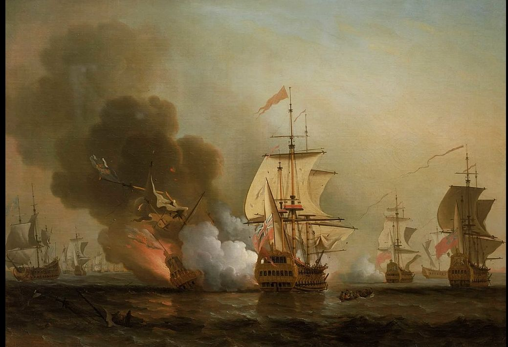
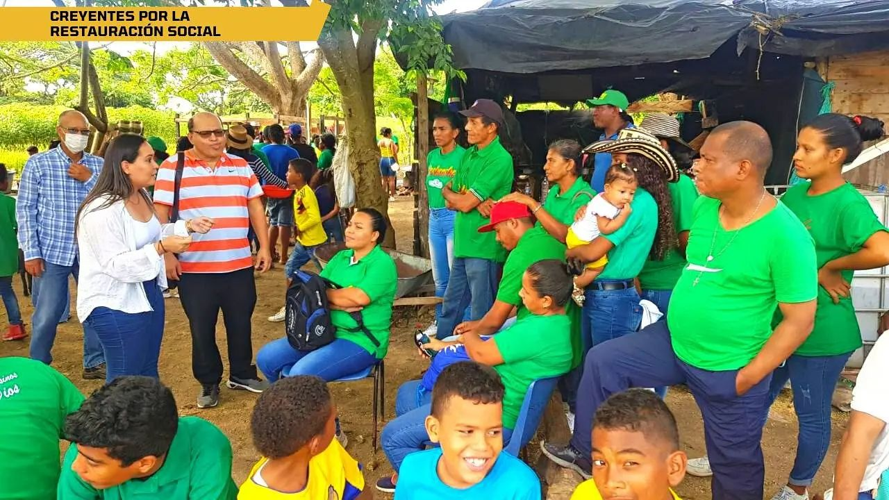

*Explosión del galeón San José. Ilustración del pintor Samuel Scott, especialista en pintura marina.*

El gobierno nacional del presidente Iván Duque, a través del Ministerio de Cultura, no vio otra salida que escuchar las voces de veedurías que le solicitaron la declaratoria de desierta de esa licitación que buscaba adjudicar el rescate del galeón hundido en 1708 por la armada inglesa.

## A salvo patrimonio cultural

En efecto, la declaratoria de desierta de la  licitación para rescatar El Galeón San José, mediante Resolución No 0113 del pasado viernes 4 de Marzo, elimina la posibilidad de entregar el patrimonio arqueológico y cultural a la entidad que aparecía como la única proponente del proceso licitatorio. Pero también abre un mar de oportunidades para que el galeón San José se traduzca en una reivindicación histórica y material para la región Caribe. Son aproximadamente $200 billones que traería el rescate, pero también el testimonio material de las riquezas arqueológicas que encierra ese navío para La humanidad.  

Se podría corregir las grandes falencias de esa alianza que se tenía prevista con un solo proponente, fuertemente cuestionado por diferentes veedurías, entre ellas por la Veeduría Popular por Cartagena y Bolívar que dirige el abogado **Héctor Pérez Fernández**.

## Linda Pinedo removió el galeón San José

*Linda Pinedo, candidata a la cámara por Colombia Justa Libre (No 106) removió la situación del galeón San José. Aquí aparece reunida con líderes campesinos.*

La licitación pretendía entregar el 45 por ciento del Tesoro del San José a la empresa Maritime Archeology Consultants Switzerland identificada con acta de registro No 301.628.065. El tesoro extraoficialmente está avaluado en $200 billones. Ante una serie de irregularidades, el abogado Héctor Pérez Fernández solicitó en el mes de agosto de 2020 la revocatoria directa del proceso de licitación. LEsta misma semana, la líder social Linda Pinedo Puello reiteró dicha solicitud. Finalmente el Ministerio de Cultura tomó la decisión de declarar dicha licitación.

## Linda Pinedo y su posición sobre el San José

/articulos/luciotorres/status/1500631290814545921?s=20&t=eNiUoKdvxIZLtG-99l3Vnw

La candidata a la cámara por Colombia Justa Libre de Bolívar removió el tema del galeón San José. Envió una carta al presidente de la república, Iván Duque Márquez, para que declarara desierta la licitación. Si bien esa situación se venía contemplando desde 2020 cuando los veedores presentaron sus objeciones a dicha licitación, finalmente esta semana que concluye fue decisiva. 

Ante esa resolución, la única empresa que se había presentado dentro del proceso, tiene el recurso de reposición que debe ser instaurado dentro de los diez días siguiente a la promulgación de la resolución No 113 del 4 de marzo 2022.

## La historia del galeón de San José

Es de señalar que en 1708, junto con el San Joaquín y otros navíos de la flota española, el San José zarpó de Cartagena de Indias hacia Portobelo. Era una flota de varios navíos repletos de oro y otros productos para Europa. El San José fue cargado con lingotes, monedas de oro y plata, además de otras mercancías. El valor estimado era de 11 millones de pesos en la época. Hoy puede llegar a valer $200 billones. La flota fue atacada por buques ingleses y se hundió con su cargamento en la **Batalla de Barú**, en el mar Caribe. La flotilla zarpó de Cartagena de Indias, a Portobelo, de allí a Cuba y luego a España.  

El 27 de noviembre de 2015 investigadores del Instituto Colombiano de Antropología e Historia (ICANH), personal de la [Armada Nacional de Colombia](https://luciotorres.local/wiki/Armada_Nacional_de_Colombia "Armada Nacional de Colombia") y de la [Dirección General Maritíma](/articulos/w/index.php?title=Direcci%C3%B3n_General_Marit%C3%ADma&action=edit&redlink=1 "Dirección General Maritíma (aún no redactado)") (DIMAR), en las costas cercanas a Cartagena de Indias, descubrieron los restos del galeón San José. El hallazgo fue anunciado por el presidente colombiano [Juan Manuel Santos](https://luciotorres.local/wiki/Juan_Manuel_Santos "Juan Manuel Santos").

De tal manera que el presidente Santos tomó la decisión de iniciar un proceso de rescate del tesoro colonial. Para ello propuso el inicio de un proceso de licitación para una APP. Los planes de Santos era crear un museo en Cartagena con los restos que se extraigan del yacimiento arqueológico

## La licitación del galeón San José

*Héctor Pérez Fernández director de la Veeduría Cartagena y Bolívar jugó un papel decisivo para la declaratoria de desierta de la licitación para rescatar el galeón San José.*

El proceso licitatorio **No MC APP 001 2018** se inició en el gobierno del presidente Juan Manuel Santos. Pero no avanzó hasta cuando llegó su homólogo Iván Duque Márquez. En ese período, vale la pena destacar el papel desarrollado por la Veeduría Popular por Cartagena y Bolívar que dirige el abogado **Héctor Pérez Fernández**.

Esa veeduría explicó las falencias del proceso licitatorio. Además, señaló que el único proponente se encuentra vetado por la lista Clinton. Entre otras cosas, denunció que la intención de entregar el 45% del tesoro hallado es un mal negocio para el Estado. Puesto que la avaluación al día de hoy de esos lingotes de oro podrían sobrepasar la suma de $200 billones.

## Un mar de posibilidades

La declaratoria de desierta de la licitación para el rescate del galeón San José traerá un mar de oportunidades para la Costa Caribe. Pero especialmente para Cartagena. ¿Por qué? El próximo gobierno debería replantear los objetivos de la licitación. De igual manera corregir los errores objetivos de la licitación anterior. 

Como ya se ha avanzado mucho en ese proceso, lo que se necesita una operación de rescate de los restos del galeón San José. Esta operación podría ser contratada directamente por el Estado colombiano con presupuesto nacional. De acuerdo con algunos expertos, es una operación que podría estar costando aproximadamente 80 millones de dólares.

De tal manera que el Estado colombiano podría recibir la suma aproximada de $200 billones de los lingotes de oro. En tanto que el resto del hallazgo, que son objetos arqueológicos invaluables, podrían ser objetos de estudios valiosos para la historia colonial de América. Además enriquecerán museos en Cartagena, Colombia y España.

## Ver el video de Linda Pinedo

[https://fb.watch/bB1uSJfVjD/](https://fb.watch/bB1uSJfVjD/)

### Te puede interesar

### [En Cartagena, ¿Policía, de la negligencia a la Gloria?](/articulos/en-cartagena-gloria-para-una-policia-de-capa-caida/ "En Cartagena, ¿Policía, de la negligencia a la Gloria?")