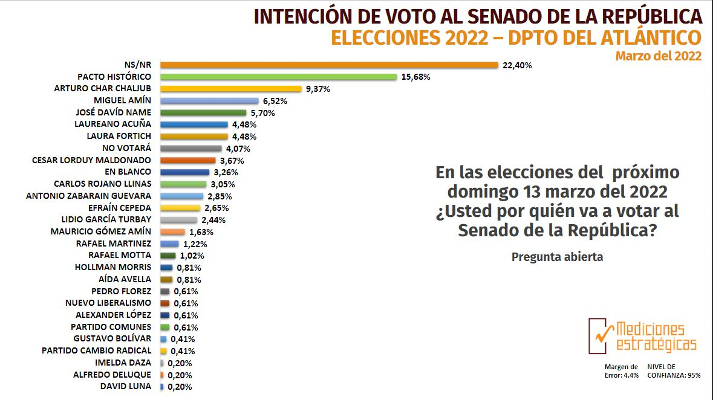
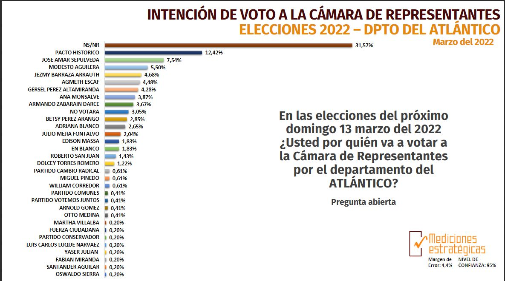
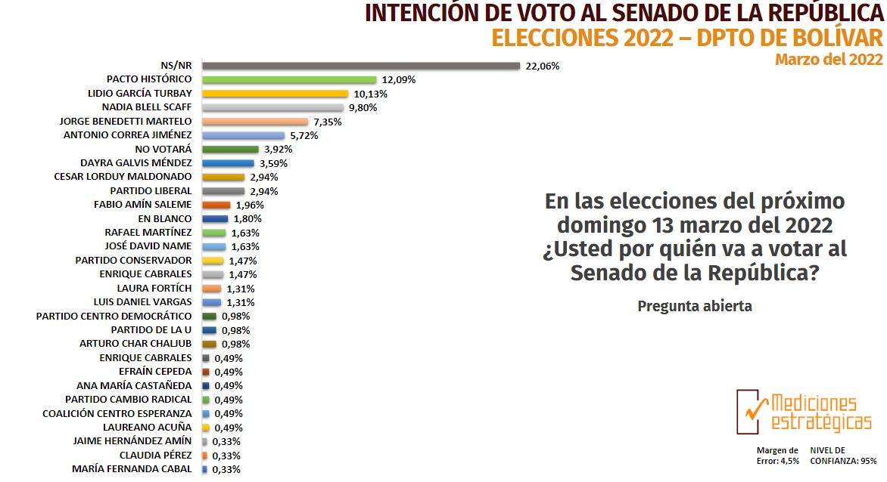
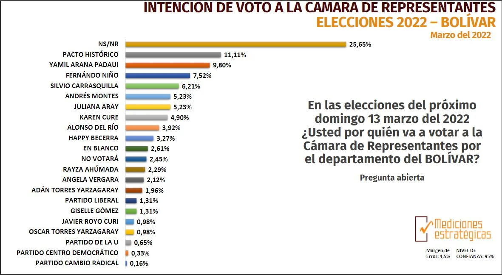

*José Alfredo Gnecco (Cesar), Arturo Char (Atlántico) y Lidio García (Bolívar), tendrían la mayor votación para senado en la Costa caribe. los mismos cacicazgos.*

A 5 días de las elecciones del 13 de marzo —en la región Caribe— el comportamiento electoral no tendrá mayor modificación de lo tradicional. Esto **indica que seguirán los mismos cacicazgos**.  Lo pronóstica una lectura de los últimos resultados emanados de la **Tercera Gran Encuesta del Caribe** realizada por **Mediciones Estratégicas**. En esta oportunidad la diferencia política es la significativa votación de la coalición centro izquierda **Pacto Histórico**. 

Por otro lado, **Gustavo Petro y Pacto Histórico**, de las tres coaliciones, serán los más votados en estas elecciones para las consultas presidenciales. Pero, la encuesta confirma una tendencia que aún se mantiene: **un alto porcentaje del electorado (41,59%) aún no se decide**. Esos electores se encuentra entre los que aún **no saben no responden** y los que no votarían **por ninguno**. Quiere decidir que un sector significativo del electorado solo se decidirá en esta última semana previa a las elecciones. 

## Los mismos cacicazgos

*Dayra Galvis (CR), Nadia Blel (Conservador) y Laura Fortich (Liberal). La que tiene la situación dura para su elección es Daira Galvis. Los mismos cacicazgos.*

El estudio, además de indagar sobre la consulta presidencial, pregunta sobre la intención de voto en cada departamento de la costa para cámara y senado. Por coalición, el Pacto Histórico gana en la mayor parte de los departamentos: Atlántico, Bolívar, Cesar, Sucre y San Andrés. Pero en realidad, el mayor porcentaje en toda la región lo tiene el **no sabe/no responde** y **por ninguno**.

El tamaño de la muestra regional  es de **3.198** encuestas telefónicas distribuidas en 120 municipios de los departamentos del Atlántico (491), Bolívar (612), Magdalena (512), Magdalena (573), Magdalena (573), La Guajira (247), Córdoba (434), Sucre (299) y San Andrés y Providencia (107). La fecha de recolección comprende el período del 1 al 5 de marzo. Su fecha de publicación es 8 de marzo de 2022. Su nivel de confiabilidad es del 95%.

El estudio fue dirigido por Jenny Juliet Jurado Vargas, directora de Investigaciones y estadísticas de la Empresa Mediciones Estratégicas SAS. El gerente es Oscar Brieva de esta firma de mercadeo.

## No al aborto

La mayoría de los consultados (**81.14%**) está en desacuerdo con la decisión de la Corte Constitucional de despenalizar la práctica del aborto antes de los 24 meses. La mayoría no votaría (**60,94%)** por un candidato presidencial que apoye la decisión de la Corte Constitucional de despenalizar el aborto.

¿Usted votaría por un candidato a la Presidencia de la República que respalde abiertamente la decisión de la Corte Constitucional de legalizar el aborto hasta las 24 semanas de gestación? Esta fue la pregunta de los encuestadores. Nos parece destacada la respuesta. Todo indica que los mismos consultados se contradicen así mismo al tener la preferencia por un candidato progresista que está de acuerdo con la despenalización del aborto. 

Por otro lado, llama la atención que la imagen negativa (61,19%) del presidente Iván Duque aumentó entre los costeños. Solo el 20% tiene una imagen positiva del primer mandatario de los colombianos.

## Vea

https://youtu.be/RP1EZvuSKbw

Este es el análisis que hicimos en el pasado informe.

## Atlántico

## Bolívar

## Vea toda la encuesta

[Para acceder a la encuesta vaya a este enlace: Tercera Gran Encuesta del Caribe](https://www.medicionesestrategicas.com/marzo-2022).