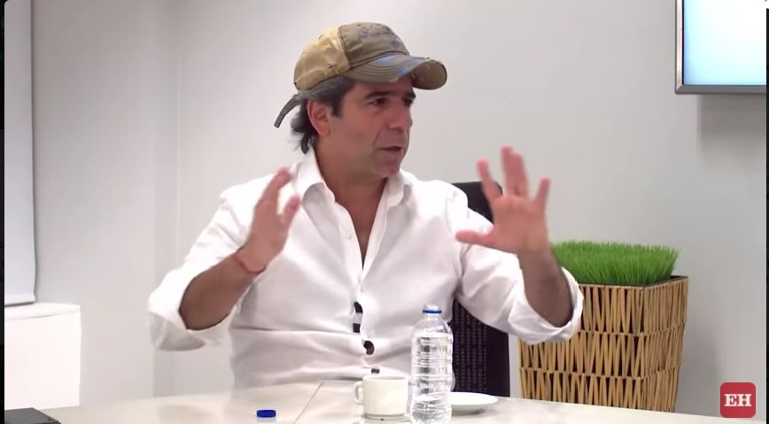
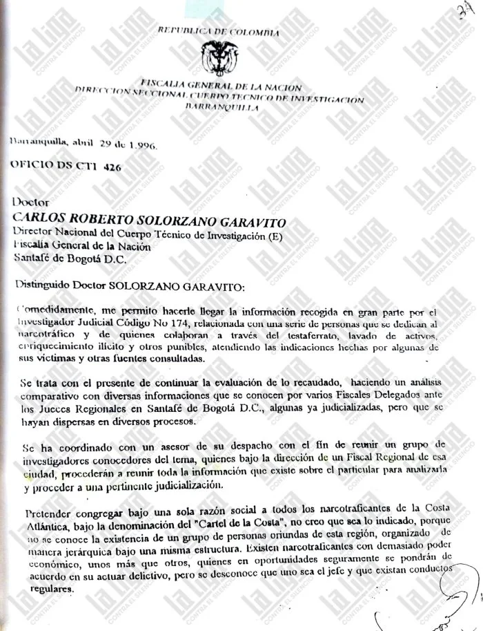

*Captura de pantalla del video de El Heraldo. Expediente No 114, debe responder su padre, Fuad y su tío Habib.*

El expediente No 114  del Cuerpo Técnico de Inteligencia—CTI relaciona a alias «el Caracol» —**_capo dei Capi_** del Cartel de la Costa— con la familia **Char** desde finales de los 80 hasta cuando fue capturado (1998) y extraditado a Estados Unidos (2000). **Alberto Orlandez Gamboa**, su nombre de pilas, sin duda, es el **eslabón perdido** que conecta el patrimonio de la familia Char con la economía del narcotráfico. 

La Liga Contra el Silencio acaba de publicar un primer informe sobre el expediente que vincularía a la familia Char de Barranquilla con el Cartel de la Costa que dirigía **«alias el Caracol»**, el narco más poderoso de los años 90. **Es la primera vez que se da a conocer un documento procesal que compromete a los Char en el narcotráfico y en otros ilícitos**. Este expediente estaba refundido. Mágicamente había desaparecido. 

Este análisis busca entender el expediente No 114, es el eslabón perdido. (Puedes ir al informe completo dando clic **[Liga Contra el Silencio)](/articulos/2022/02/28/un-expediente-vinculo-al-clan-char-con-el-narcotrafico/)**

## El análisis de Lucio: El eslabón perdido del narcotráfico

https://youtu.be/ftCUAXmfe98

Análisis del expediente No 114. El eslabón perdido,

## Expediente No 114, la prueba

*Primera página del informe del expediente No 114. El eslabón perdido,*

No obstante, el expediente **No 114** fue fundamental para apresar a «el Caracol» y a 22 miembros de su organización. Extrañamente ninguno de los Char fue tocado. Ni siquiera mencionado por los que ostentaban el poder del momento. Solo en el bajo mundo se hablaba de ese hecho. Ninguna de las autoridades (Fiscalía, jueces y Corte Suprema de Justicia) le dieron importancia. **Quedó refundido en las calendas griegas, muy a pesar de que compulsaron copias a esas entidades**. 

De esta manera, se podría desvirtuar la versión tradicional de que solamente los Char se habían beneficiado del lavado de activo. **Ahora existen claros indicios de que los orígenes de su fortuna tienen raíces ilícitas**: comercialización de medicamentos vencidos, producción y distribución de pastillas yumbo (metacualona), narcotráfico, lavado de activos, enriquecimiento ilícito, uso de información privilegiada para eludir la ley y aprovechar sus ventajas económicas. 

En efecto, el oficio **DS CTI 426** del 26 de abril de 1996 encabeza el expediente judicial que tiene 16 mil folios divididos en 78 cuadernillos judiciales, de acuerdo con la investigación periodística fue desempolvado gracias a la labor de la Liga Contra el Silencio. Lo novedoso de esta investigación es que dio con el eslabón perdido que relaciona a los Char con la bonanza marimbera y cocaínera. Específicamente los conecta con [**Alberto Orlandez Gamboa, alias «el Caracol»**](https://luciotorres.local/wiki/Alberto_Orl%C3%A1ndez_Gamboa), jefe del Cartel de la Costa.

## Expediente escondido

/articulos/episode/2PqMkF6TB3PLnoCXkGZAT4?si=82815eff8bda4cd0

Los periodistas que veníamos investigando el tema, sospechábamos de ese expediente. Pero, por arte de magia, se había desaparecido. El mismo **Alex Char** en entrevista con la directora de El Heraldo en el día de hoy, Erika Fontalvo, dijo:

> «Qué raro, un expediente que tenía 30 años escondido, ahora que me lanzo en esta campaña electoral lo vienen a publicar...»

¿Quien pudo desaparecer ese expediente? ¿Por qué no hubo respuesta de la Fiscalía o de la Corte Suprema de Justicia? Recordemos que en esa época el patriarca de los Char, Fuad, era senador de la República. En 1994 fue elegido senador, repitió en 1998 y 2002. En 1999 el presidente Ernesto Samper solicitó la extradición de Orlandez Gamboa. Esta medida se hizo efectiva en el año 2000 en el gobierno de Andrés Pastrana.

Es en ese período que el expediente No 114 se embolató. Los interesados pudieron esconderlo. Pero lo que no se entiende es por qué las máximas autoridades del poder ejecutivo y judicial silenciaron la conexidad entre Orlandez y Char. En ese período los Char habían obtenido un poder político que tenían incidencia en los gobiernos de los presidentes Gaviria, Samper y Pastrana.

## Expediente No 114, material probatorio

Otra cosa, se preguntan los entendidos, por qué razón los Char no usaron su poder para evitar la extradición de su socio Alberto Orlandez Gamboa. Serían las mismas razones por las cuales no se pudo evitar la extradición de otro posible socio, Faryala Hanna, quien fue procesado por narcotráfico en los Estados Unidos.

Los colegas de la **[Liga Contra el Silencio](/articulos/2022/02/28/un-expediente-vinculo-al-clan-char-con-el-narcotrafico/)** dieron con el expediente que ahora están publicando en varias entregas. Es un material, como se dijo, probatorio del vínculo de los Char con el narcotráfico y de su enriquecimiento ilícito. Si bien el expediente judicial no llegó a su término para que las autoridades de su época procesaran a los diferentes miembros de la familia Char Abdala, sí se constituye en un indicio de su relación con el narcotráfico. Existe suficiente material probatorio que demuestra el origen ilícito de la fortuna Char. Pero también de su relación con  agentes del narcotráfico, como alias «el Caracol». En concreto, el expediente demuestra que había suficiente material, no solo para procesar a Orlandez, sino también a varios miembros de la familia sirio—libanesa de los Char Abdala. ¿Qué pasó?

## Los Char ¿integrantes del cartel?

El informe cita apartes del oficio que el director del CTI seccional Barranquilla de ese entonces, **Álvaro Vivas Botero**, le envió al director nacional de la época, **Carlos Alberto Solorzano Garavito**. VIVAS BOTERO, posteriormente se convirtió en Fiscal Octavo Delegado ante el Tribunal del Distrito Unidad Nacional para la Justicia y la Paz.

> «En el renglón que lidera Habib Char Abdala (escrito Jabid), aparecen David Char Abdala (aparentemente se refiere a David Char Navas, político condenado por parapolítica, hijo de Habib y mencionado en otros papeles del expediente); Fuad Char Abdala y Simón Char Abdala y familia; también figuran los hermanos Galeano y Salomón Camacho, de Medellín; y Giovanni Caicedo, del Cartel de Cali».
> 
> Liga Contra el Silencio

Recordemos que, en el Caribe para ese período, el Cartel de la Costa no tenía las mismas estructuras de los carteles de Medellín o Cali. Funcionaba como una franquicia de esos dos carteles, al decir de los investigadores del CTI que llevaban el proceso. El primer jefe fue **José Manuel «el Mono» Abello** extraditado a Estados Unidos en 1989. Ante ese hecho, tomó el mando «el Caracol». 

## Prueba de la narcoeconomía

Los documentos, que reveló el informe de la referencia, se constituye en una prueba fehaciente de las hipótesis que venimos manejando de la [narcoeconomía barranquillera](/articulos/el-atentado-a-yuyo-daes-y-el-asesinato-de-losada-clave-de-la-narcoeconomia/). Específicamente el oficio No 426 del 26 de abril de 1996 que contiene 28 páginas.

> «El documento sostiene que los hermanos **Fuad Cha**r (padre de **Álex, Arturo y Antonio**), **Habib Char** (que en el expediente aparece escrito como Jabith, Jabid y Habith), **Farid Char** (escrito Farith), **Simón Char y David Char** (hijo de Habib) **formaban parte de un grupo que se dedicaba al narcotráfico, o colaboraban “a través del testaferrato, lavado de activos, enriquecimiento ilícito y otros punibles**».
> 
> Liga contra el Silencio

## Habib Char, «el hombre más poderoso»

Si bien el expediente fue levantado contra Orlandez Gamboa, se dejó claro que no era la cabeza de la organización mafiosa. Que no era el capo a quien sus subalternos le besaban el anillo sino que detrás de él estaba el verdadero **_capi dei capi_** del Cartel de la Costa. Por supuesto, el documento de marras no lo dice de esa forma. Pero dice que había personajes «más relevantes», «más discretas»”, «con cuello blanco». Y seguidamente señala a Habib Char, al considerarlo «el hombre más poderoso» de ese momento, puesto que «exportaba heroína» al lado de Galeano. 

Es de señalar que el Cartel de la Costa es un decir, porque en realidad no funcionaba como tal. Al parecer, Orlandez recibía financiación de los delincuentes de cuello blanco y _**frenteaba el corte**_, como se suele decir en el bajo mundo del narcotráfico. Esto lo corrobora un exoficial de la policía que participó en la lucha contra el narcotráfico que fue consultado por la Liga Contra el Silencio. 

> _«Si alguien quería sacar droga por la Costa, había que preguntarles a ellos (a Orlandez y sus socios) porque controlaban los puertos»_.
> 
> Expediente No 114

Si bien es cierto que la prosperidad económica de los Char despegó a finales de los 60 (67—68) con la diversificación de su economía. Este crecimiento es coincidente con el contenido del expediente que señala que en esa época  coincide con lo que dice el informe . Puesto que es el período donde los Char comenzaron con la producción de la metacualona o la popular Yumbo. Era una droga hinóptica de uso popular por la juventud de los años 60 y 70.

En este punto de le hace una pregunta al fiscal general **Francisco Barbosa**. ¿Puede, usted señor fiscal iniciar un proceso de extinción de dominio sobre el patrimonio de la familia Char que tiene evidentemente fuentes ilícitas? Se recibe notificación al correo electrónico **lucio@voxpopuli.com.co**

### Te puede interesar algunas publicaciones sobre los Char:

[Los Char, «Jorge 40» y la guerra que perdió Barranquilla (II)](/articulos/los-char-jorge-40-y-la-guerra-que-perdio-barranquilla/)

[¿Arturo Char tendría la misma suerte de Aída Merlano? (I)](/articulos/arturo-char-tendria-la-misma-suerte-de-aida-merlano-i/)

[El muerto al hoyo, los Char Yidi quieren quedarse con más de $80 mil millones, la herencia de Farid Char (IV)](/articulos/el-muerto-al-hoyo-los-char-yidi-quieren-quedarse-con-mas-de-80-mil-millones-la-herencia-de-farid-char-iv/)

[¿Fraude? Con 16 intentos, los Char Yidi lograron que demanda de sucesión de Farid cayera donde el juez Saade Marcos (III)](/articulos/fraude-con-16-intentos-los-char-yidi-lograron-que-demanda-de-sucesion-de-farid-cayera-donde-el-juez-saade-marcos-iii/)

[¿Caerá el imperio Char-Gerleín-«Yuyo» Daes con las confesiones de Aida Merlano? (I)](/articulos/caera-el-imperio-char-gerlein-yuyo-daes-con-las-confesiones-de-aida-merlano-i/)

[¿Por qué cremaron el cadáver de Farid Char como a un leproso? Réquiem… (II).](/articulos/por-que-cremaron-el-cadaver-de-farid-char-como-a-un-leproso-requiem-ii/)

[Aidaescándalo. ¿Qué pasará con el califato de Barranquilla (I)](/articulos/aidaescandalo-que-pasara-con-el-califato-de-barranquilla-i/)

[Costa Caribe: «Los Talibanes de la economía» en «cloacas fiscales» (II)](/articulos/costa-caribe-los-talibanes-de-la-economia-en-cloacas-fiscales-ii/)