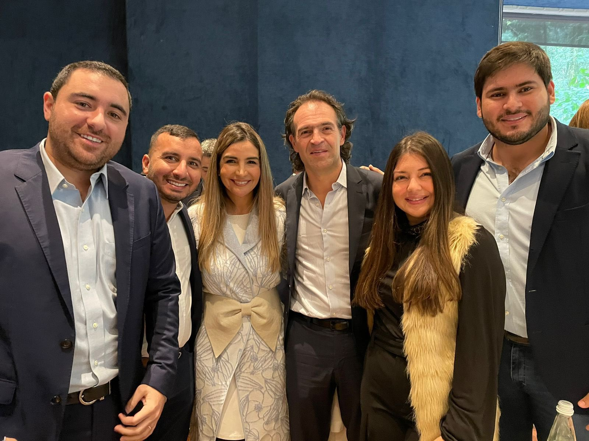
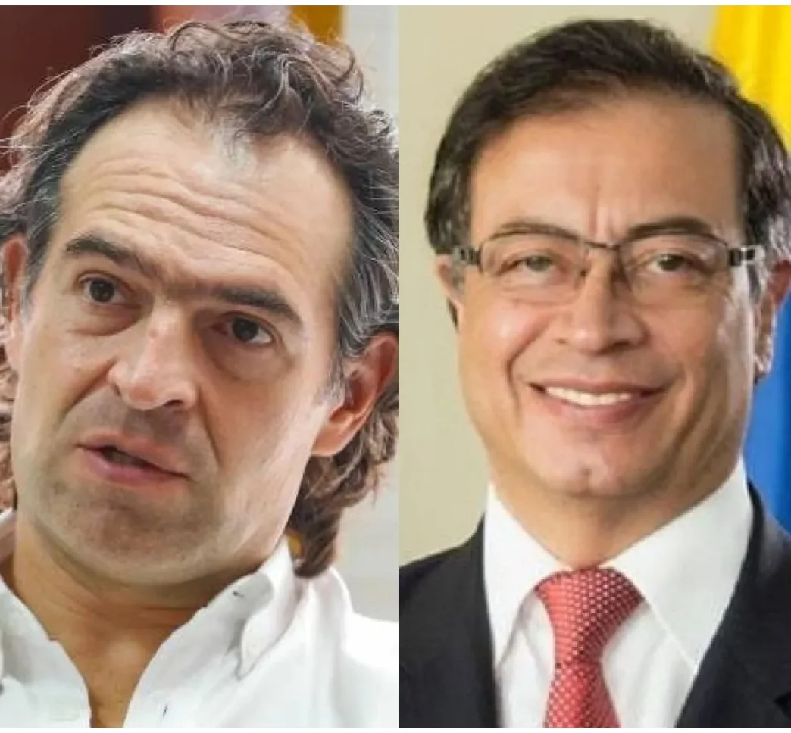

*Federico «Fico» Gutiérrez con la senadora que obtuvo la primera votación del partido Conservador, Nadia Blel, hermana del gobernador de Bolívar, Vicente Blel.*

Con el apoyo del conservatismo en pleno y la reunión de acuerdo programático con el expresidente liberal **César Gaviría**, en el día de hoy se dio un paso fundamental para las aspiraciones  de la candidatura presidencial de la pareja **Federico «Fico» Gutiérrez y Rodrigo Lara sánchez**.

Al tiempo que «Fico» Gutiérrez centra su discurso hacia la unidad del país, tiende puentes hacia sectores de la socialdemocracia y el liberalismo. La estrategia es concitar el apoyo de sectores de centro derecha y de la socialdemocracia colombiana. El discurso de «Fico» se hace más centrista. Esto es, gira hacia el centro. Más que buscar los votos de la Coalición de la Esperanza, le apunta a una gran franja de indecisos que esperan más claridad de los candidatos.

## El conservatismo con «Fico»

https://youtu.be/u76IqF5KRSs

El discurso de Fico se vuelve cada día más centrista.

Todas las fuerzas del partido conservador cerraron fila en torno a Fico Gutiérrez. En la reunión celebrada hoy con la dirección de ese partido, se concluyó respaldar la propuesta presidencial de Gutiérrez.

> «Estamos juntos, unidos para defender la democracia, las libertades, llevar desarrollo económico y social a las regiones del país. Vamos para adelante. Me alegra mucho decidimos sobre ejes programáticos. Apoyar a nuestros empresarios, desarrollo del campo y temas fundamentales para nuestro país».
> 
> Fico Gutiérrez

## Los Blel con «Fico»

*La bancada conservadora comandada por los Blel con «Fico».*

En el caso de la bancada conservadora de Bolívar, tuvo un momento para encontrarse con el candidato  Federico Gutiérrez. De hecho, en la fotografía aparecen la senadora conservadora **Nadia Blel** y los cuatro representantes a la cámara: **Yamilito Arana Padauí (reelegido con la primera votación), Juliana Aray, Andrés Montes y Fernando Niño**. Los dos primeros de la casa. Los otros dos pertenecen a la Casa Montes.

## Liberalismo, ¿«Fico» o Petro?

*El liberalismo ¿«Fico» o Petro?*

La campaña de Fico Gutiérrez espera el respaldo del partido Liberal y de toda su bancada como lo hizo el conservatismo. La reunión entre el candidato Fico Gutiérrez y el expresidente César Gaviria, del liberalismo, despertó gran expectativa en el país político. El partido liberal fue arrojado a un dilema, luego de que se truncó el diálogo político con el **Pacto Histórico** y de su líder el candidato a la presidencia **Gustavo Petro.**  

En la reunión con Gaviria, Fico le expresó la importancia de retomar los conceptos programáticos del partido liberal en su propuesta presidencial. Se cree que esta misma semana se podría conocer el pronunciamiento de la dirección del partido Liberal y de su bancada sobre un eventual respaldo a la candidatura de Fico Gutiérrez o, en su defecto, a Gustavo Petro. ¿Hacia dónde se inclinaría la balanza?

## Se restablecen los lazos con el liberalismo

Mientras tanto, el senador Roy Barreras se reunió nuevamente con el expresidente **Cesar Gaviria** con el fin de limar asperezas con Gustavo Petro, que se produjeron a raíz de unas declaraciones de **Francia Márquez**, fórmula vicepresidencial de Petro, quien lo trató de neoliberal.

/articulos/petrogustavo/status/1509281677729751040?s=20&t=oC-eEa-l3EUU1-dRCuXT1w

Debemos señalar que la fuerza del liberalismo es muy importante para alcanzar la presidencia. Primero porque es la segunda fuerza, después del Pacto Histórico. Tiene 15 senadores y 35 representantes a la cámara. Segundo, goza de un gran peso político en el país.

En suma, se estaría acercando el momento de definiciones de todos los partidos políticos con miras a la primera vuelta de estas elecciones presidenciales. Por esta razón, se podría pronosticar que en menos de una semana todas las colectividades que lograron gran participación en las pasadas elecciones parlamentaria, y que no tienen candidatos presidenciales, puedan decidirse. 

La situación más complicada la tiene el liberalismo, porque había abierto mesa de diálogo con los contrincantes más fuertes de esta campaña por la presidencia de Colombia. El papel de Gaviria es como la novia deseada por dos pretendientes que se debaten en duelo para merecer el amor de su amada. ¿Con quién se quedará César Gaviria? Amanecerá y veremos, dijo el ciego.

Te puede interesar:

[Francia- Petro ¿giro a la izquierda del Pacto Histórico?](/articulos/francia-petro-giro-a-la-izquierda-del-pacto-historico/)