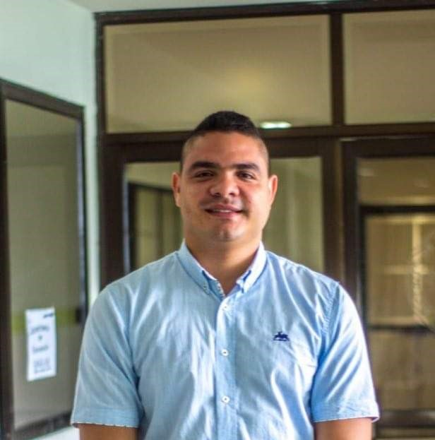
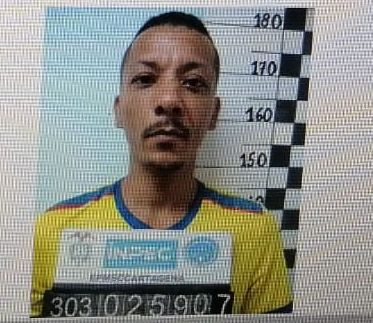

https://youtu.be/QUadct4TPag

Se descifra autoría intelectual de la treta criminal contra la presidenta del concejo de Cartagena, **Gloria Estrada Benavidses**.

Con material probatorio, se descifra la autoría intelectual de una **treta criminal contra la liberal Gloria Estrada, rival política del alcalde de Cartagena William Dau Chamat y la degradación de la política y la perversidad de sus autores**. En la noche del viernes de ese 14 de enero del 2022 sucedió un hecho que ha pasado desapercibido para las autoridades. Aquí presentamos al vendedor y comprador del «pangolito» compuesto con 60% de clorhidrato de cocaína. **Es la prueba reina que nos llevará a los autores intelectuales de este crimen que se planeó con alevosía**.

Ese hecho podría explicar la conexidad de los autores materiales con los intelectuales. Pero también explicaría la perversidad en la que ha caído el ejercicio de la política en Cartagena. Es una política del bochinche y la perversidad.

## ¿Celebración perversa?

*Pedro Aponte, Andy Reales y Oscar Marbello celebraron en la noche del 14 de enero. Los sospechosos de la autoría intelectual de la tetra criminal contra Gloria Estrada.*

**Mientras la presidenta del concejo de Cartagena Gloria Estrada y Martín Barreto** vivían su propio drama en el sitio de detención de la Fiscalía de Cartagena, **Andy Reales**, alcalde de la localidad, y los ediles **Pedro Aponte y Oscar Marbello,**  y otros políticos como **Mauro Martínez de la Puente**, libaban copas, se reían y charlaban en una suntuosa residencia de **Barcelona de Indias,** al norte de Cartagena. 

¿Qué celebraban? ¿De qué se reían? ¿Acaso de la detención de sus rivales políticos? Recordemos que Andy Reales y Pedro Aponte **tenían motivo para estar resentidos** con Gloria Estrada Benavides. La coalición liderada por ella, eligió como **contralor a Rafael Castillo Fortich**. ¿Qué hizo Castillo que le produjo tanto resentimiento a Reales y a Aponte? Ordenó la suspensión provisional del alcalde local Andy Reales debido a un proceso donde están comprometidos más de **$6 mil millones** en un supuesto contrato para la ejecución del alcantarillado de Tierra Baja. Al parecer, la alcaldía ordenó el pago de unos saldos del contrato que no ha sido ejecutado debidamente.

## Autoría intelectual de una **treta criminal**

*En la autoría intelectual de la treta criminal contra Gloria Estrada estaría el alcalde de la localidad No 2 de Cartagena. Fue quien tentó a algunos policías, según el testimonio de uno de ellos.*

Como lo hemos explicado, Andy Reales llegó a la alcaldía local gracias al apoyo de Pedro Aponte. Fue el edil que buscó el respaldo de sus colegas **Marcel Pareja y Oscar Marbello**. De esta manera, el alcalde William Dau Chamat decidió que el alcalde menor fuera Andy Reales de una terna que le entregó la Junta Administradora Local. Según el testimonio de un policía que ya aparece en el proceso de la Fiscalía, fue la persona que contactó a los agentes de policía con el fin de hacerle la maldad «a un man» que vive en el edificio Regatta del barrio Manga. Por supuesto, se refería a Martín Barreto.

No obstante, en esa reunión del 14 de enero de 2022, **Andy Reales, Pedro Aponte y Oscar Marbello** se había manifestado, que después de Gloria Estrada, **el turno iba contra el contralor distrital Rafael Castillo Fortich y su secretario general Gustavo Nuñez.**

Frente a esa situación, el 17 de enero el contralor distrital **convocó a una rueda de prensa** donde denunció una empresa criminal para atentar contra su vida. Al parecer, se trataba de la misma reunión orquestada por Pedro Aponte en su residencia de Barcelonas de Indias.

## Detrás de la autoría intelectual

¿Por qué tantas coincidencias donde aparecen el trío Andy Reales, Pedro Aponte y oscar Marbello? ¿Quién tentó al policía que organizó el operativo? Según el testimonio Andy Reales, alcalde de la localidad No 2. ¿Dónde supuestamente celebraron y el planearon el segundo golpe? En una residencia de la exclusiva urbanización de Barcelonas de Indias donde supuestamente reside Pedro Aponte. ¿Quiénes visitaron la cárcel de San Sebastián de ternera? **Andy Reales, Pedro Aponte, Oscar Marbello y el abogado Ramón Ayos**. Este último se valió de su relación íntima con la jueza de Ejecución de Penas **Haydeé Hernández Vargas** para preparar esa visita inesperada a la cárcel el pasado 10 de febrero. Haydeé Hernández es hermana de la edilesa de la localidad 3 Isaura Hernández Vargas, quien ahora es una de las protegidas de Pedro Aponte. Por el correo de las brujas se supo que la promoverá como candidata al concejo en las próximas elecciones.

/articulos/episode/5WxA17YqnFdns3I00TuF61?si=235321bd20c0495c

Escuche mientra maneja el podcast de Lucio torres. La autoría intelectual de la treta criminal.

Otro hecho curioso que vale la pena resaltar sucedió media hora antes de la captura de la presidenta del concejo. Al parecer, se vio pasar el Rubicón de Pedro Aponte y el vehículo de Marbello frente a la camioneta en cuyo interior hallaron el kilo de coca. Puede ver cómo detallamos este hecho en el video que va adjunto a esta artículo.

En la mañana de ese 14 de febrero, es posible, según un testigo, que Mauro Martínez de la Puente recibiera una llamada de Pedro Aponte. Supuestamente, Martínez de la Puente estaba mediando para limar asperezas entre Aponte y Barreto. 

## Otros sabían la trampa

Según fuentes que pidieron reserva, al parecer, la trama criminal contra la nueva presidenta del concejo distrital no solo la conocían sus perpetradores. Algunos del gobierno distrital lo sabían. Incluso, al parecer,  dos concejales, compañeros de Gloria Estrada. Los nombres los reservamos. Pero, todo indica que sabían lo que le sucedería a su compañera de colegiatura. Ellos también estaban molestos con la concejala, porque los «tumbó del caballo» en la Contraloría Distrital de Cartagena. Estaban muy acomodados con **Fredy Quintero**, quien había cumplido cerca de 5 años como encargado, y querían que continuara en el cargo. **Pero en un juego de poderes y de destreza política, Estrada hizo que el concejo eligiera a Rafael Castillo Fortich en contra de los deseos del alcalde William Dau.** El alcalde «antimalandrín» estaba aliado («de pipí cogido») con un sector «malandrín» del concejo liderado por **Carlos Barrios y Wilson Toncel**.

En el mismo día cuando fue capturada la presidenta del concejo de Cartagena supuestamente con un kilo de cocaína en la camioneta donde se trasladaba con Barreto, Avelino Villamizar y Mauro Vanegas, se produjeron varios hechos. Vale la pena analizar y concatenarlos con la reunión de Barcelonas de Indias y la visita que **Andy Reales, Pedro Aponte, Oscar Marbello y Ramón Ayos** le hicieron a un interno de la cárcel **San Sebastián de Ternera** el 10 de febrero. 

Asimismo, con estos hechos se demostraría que hubo autores intelectuales y un determinador que podría ser **«el hombre de atrás»**. Sobre este tema versará la cuarta entrega del informe periodístico.

Ciertamente, se podría confirmar la teoría de la treta criminal que venimos estudiando desde el primer informe sobre los hechos. Informe periodístico que se apartó de la versión oficial de un supuesto acto de decomiso de drogas, armas y dinero en efectivo.

## Autoría intelectual de la treta criminal contra Gloria

*La autoría intelectual de la tetra criminal contra Gloria Estrada se comienza a destapar.*

Como se dijo, son tres hechos concomitantes. Están íntimamente relacionados. Son reveladores de que la presidenta del concejo de Cartagena de Indias fue víctima de una treta criminal orquestada por rivales políticos de la ciudad. Treta que buscaba sacar del juego político a la presidenta del concejo de Cartagena. Una lideresa política del partido Liberal. 

La concejala Estrada es la única presidenta del concejo que se le ha parado firme a este alcalde que ha demostrado ser misógino y carece de límites morales para denigrar de su prójimo. Un alcalde que expresa ese odio hacia las mujeres que lo cuestionan. Recordemos a la lideresa comunitaria **Dina Coneo Angulo**, a varias de su propio gabinete y, en especial, a su primera dama, Cynthia Pérez Amador, quien después de tenerla de adorno para bañarse de una falsa popularidad con las mujeres afros de la ciudad, la zapateó sin ninguna consideración.  La única concejala que le hizo control político a la administración de William Dau Chamat sobre el Programa de Alimentación Escolar —PAE— se llama Gloria Estrada Benavides, duela a quien le duela.

El detonante para diseñar, crear y ejecutar esa treta criminal fue la suspensión del alcalde de la localidad No 2 de Cartagena de Indias, Andy Reales Arroyo, íntimo amigo de Pedro Aponte. Estos personajes, al parecer, fueron presas del odio y resentimiento que se pudieron aliar al alcalde William Dau para enfrentar a la presidenta del concejo.

## Alias «Piti-Piti», el jíbaro

*«Piti-Piti» (Oscar Alexander Pinedo Lopera)  le vendió la droga al policía. Esta reseña fue de la última vez que estuvo en la cárcel. Nos lleva a la autoría intelectual de la treta criminal.*

Una fuente de entero crédito le dijo a **VoxPopuli Digital** que alias **«Piti-Piti»** (Oscar Alexander Pinedo Lopera)  le vendió la droga a un policía. Su lugar de expendio es una **«**hoya**»** del barrio San Francisco. Y no era una droga para vender sino que fue hecha especialmente para **«hacerle la maldad»** a las víctimas. Era un «pangolito» que apenas debía marcar un grado de pureza de 60% de clorhidrato de cocaína.  La droga comercial utilizada para el microtráfico en Cartagena suele ser de un grado de pureza superior a 85 %, según lo manifestado por un expolicía a este periodista.

¿Quién la compró? La fuente dijo que el comprador del «pangolito» es un agente de policía cliente de alias «Piti-Piti». El policía es adicto y generalmente compra su droga en ese expendio de drogas de San Francisco. La sorpresa es que hilando la ruta de la droga nos topamos que el comprador de ese paquete fue uno de los tres agentes que participaron en la detención de Gloria Estrada Benavides.

## El comprador del «pangolito»

*En la parte superior izquierda aparece el agente Alexander Salas, destituido esta semana. En la parte superior derecha, aparece Esleiner López Valencia, sospechoso de haber comprado la droga a «Piti-Piti». Abajo Braulio Vanegas.*

Sin embargo, si reducimos el grado del ángulo de mira, podemos observar que el comprador del «pangolito» se encuentra entre dos agentes de policía. Y no fue **Alexander Salas Mercado**, quien supuestamente halló el kilo de cocaína y quien pudo tentar a los demás policías para acometer el acto criminal. No. 

El comprador está entre los agentes de policía **Esleiner López Valencia y Josman Orozco Benavides,** quienes participaron en el operativo**.** La fuente indicó que todo hace indicar que fue López el comprador. Para comprobar esta aseveración fui a entrevistar a los dos agentes, pero no los encontré. Los llamé, pero no me respondieron. 

## Alexander Salas Mercado

El agente que halló el supuesto kilo de cocaína fue **Alexander Salas Mercado**, quien fue destituido discrecionalmente por la Policía Metropolitana de Cartagena—Mecar, según el comandante BG. Nicolás Zapata en comunicado difundido esta semana.

Esa destitución se ha percibido por la opinión pública como una manera preventiva para evitar un escándalo mayor de la institución. Si la teoría del complot, que veníamos exponiendo con pruebas fehacientes no fuera cierta, hoy el agente **Salas Mercado** estuviese disfrutando de algunos días de licencia y de una medalla al mérito por haber participado en un operativo donde supuestamente cayó nada menos que la presidenta del concejo de Cartagena.

## La destitución

Empero, no fue así. Fue todo lo contrario. Destituyeron fulminantemente al agente Alexander Salas. La institución apeló al reglamento interno y al principio de discrecionalidad para salir de un agente, cuyo comportamiento pone en entredicho la honorabilidad de la Policía Nacional. Desde luego, la comandancia de la policía no podía alegar otra cosa que la discrecionalidad que tienen para salir de un agente presuntamente corrupto en el operativo donde fue detenida  Gloria Estrada. Y no lo podía hacer, ya que el agente Salas no estaba vinculado al proceso penal.

Luego de que La FM divulgara fragmento del testimonio de un agente de policía, testimonio que conocíamos con antelación, se pudo conocer las intenciones de Salas. **Pero, la prueba de que el acto de los tres agentes fue parte de un complot lo constituye la compra del «pangolito».** Los agentes López y Orozco deben ser llamados para que expliquen su papel en la compra de la droga. El agente que compró el «pangolito» podría acogerse al principio de oportunidad y delatar a los autores intelectuales del delito para que le rebajen la pena o lo manden a su domicilio.

A manera de conclusión de esta tercera entrega, podemos decir que la teoría del complot está soportada con suficiente material probatorio. Teoría que fuimos construyendo desde el mismo momento en que sucedieron los hechos. También se puede concluir que, al parecer, la autoría intelectual la podemos encontrar con **Andy Reales, Pedro Aponte y Oscar Marbello.** 

Finalmente nos lleva a plantear que los hechos analizados en esta entrega sugieren que la autoría intelectual del crimen podría encontrarse en ese trío que se vió afectado por la actuación de la presidenta del concejo. Esta autoría intelectual nos debe llevar **«al hombre de atrás».** Es un un juego de poderes donde el poderoso instrumentaliza los aparatos de poder del Distrito de Cartagena para mediar o determinar un crimen que lo lleve a eliminar a sus rivales. Este puede ser el caso que se esté dando con la llegada a la alcaldía de William Dau Chamat. Sobre esto estriba la cuarta entrega de esta historia.

### Te puede interesar:

## [El camino de un falso positivo. Caso Gloria Estrada (II)](/articulos/caso-gloria-estrada-el-camino-de-un-falso-positivo/)

/articulos/caso-gloria-estrada-sospechosa-conducta-de-una-juez-y-un-edil-i/