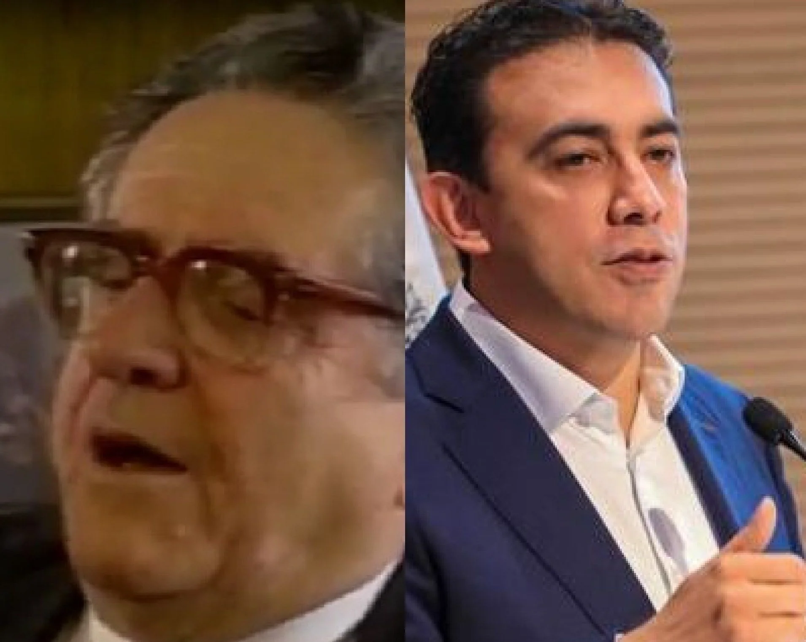
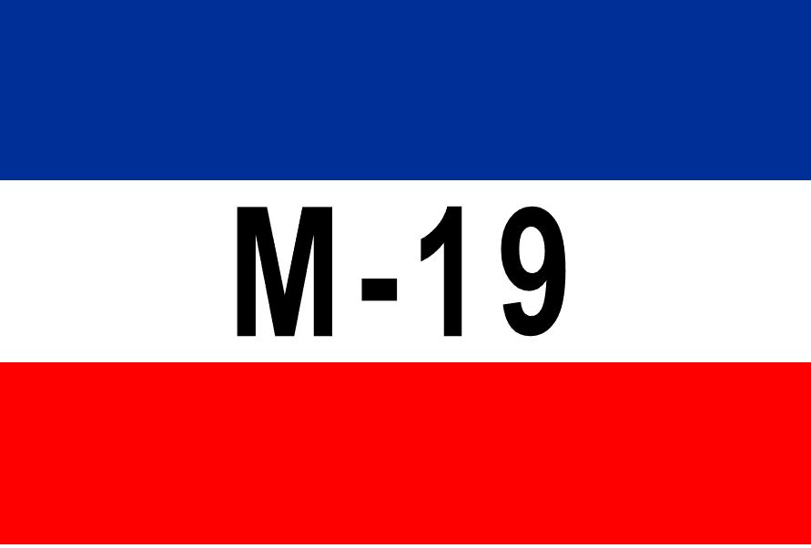

**En el preconteo está la clave del fraude electoral.** La transmisión de datos, es decir, **la información del resultado electoral**, por mucha tecnología que tenga, se constituye en una debilidad en la etapa humana de recolección. Es el ser humano quien maneja la tecnología. No lo contrario. En este sentido vale preguntarnos. ¿Qué va del **«Tigrillo» Noriega al «Gatico»  Vega**? ¿El fraude electoral? ¿Qué va de **Rojas Pinilla a Gustavo Petro**? Son dos preguntas históricas que debemos responder a la luz de lo que sucedió en las elecciones del 13 de marzo pasado. 

*¿Qué va del «Tigrillo» Noriega al «Gatico» Vega? ¿El fraude electoral?*

Por esta razón, como la tecnología en la información electoral no lo explica todo, porque es una espada de doble filo, ¿dónde debemos buscar las causas del problema?  Viajaremos al humano que empuña esa espada. 

## Puedes escuchar

/articulos/episode/3BiZL0FjvRFzxhxXJmcQDd?si=d5ca39f7f8524fb0

Te invito a escuchar este podcast. Puedes compartir con tus amigos para que tengan otro enfoque.

## Dos especímenes

En consecuencia, tenemos dos especímenes del ser humano colombiano que lo explica todo. En el pasado un hombre que fue colocado en el ministerio del Interior de Colombia para asegurar la continuidad oligárquica liberal—conservadora del Frente Nacional: **Carlos Augusto [«Tigrillo»](https://luciotorres.local/wiki/Carlos_Augusto_Noriega) Noriega**. 

## Vea este enfoque diferente sobre el fraude electoral

https://youtu.be/LSYwZcI9NpI

¿Fraude Electoral? Un enfoque diferente del análisis.

Hoy, otro hombre digno de su casa política liderada por un prohombre de la política contemporánea que fue condenados por la justicia penal colombiana, según el expediente [**AP3364—2015**](/articulos/file/d/1WuzrnVwqgB0jj7yZQEhj04g3TvrA1k5J/view). ¿De quién se trata? **Campo Elias Vega Goyeneche**, padre e impulsor de la carrera política de **Alexander Vega Rocha**, digno hijo de su padre. ¿Cuál fue el delito? ¡Adivinen! fraude electoral. (Si quieres explorar sobre este caso, te invito visitar [La casa de los Vega Rocha](/articulos/la-casa-del-registrador-alexander-vega-rocha/).

De tal manera que el «Tigrillo» Noriega y el «Gatico»  Vega lo negaron todo. **Sin desparpajo dijeron que no hubo fraude**. El primero —hace 52 años— consideró que el fraude estaba en la mente de los periodistas que transmitían los datos de las delegaciones departamentales de la Registraduría. Por eso censuró a la cadena Todelar, la más escuchada del momento, cuando a las 10 de la noche dió a conocer el 80% de los votos contados: Rojas **1’235.679 votos contra Pastrana 1’121.958**.  Es decir, **113 mil votos a favor de Rojas**. En tanto, Vega Rocha dijo que el fraude fue un invento de las redes sociales.

## Petro y el fraude electoral

/articulos/petrogustavo/status/1505996516451885064?s=20&t=sxxrRNxaXEss-PnovKLJEw

No obstante, el hecho de que el **Pacto Histórico haya recuperado 390 mil votos** (tres curules) es una bofetada doble a la historia electoral del país, donde el fraude es concomitante a la victoria de quienes detentan el poder. **Lo curioso, Gustavo Petro, quien fue militante del Movimiento 19 de Abril (M—19) fue el encargado de revertir el presunto fraude** que ya estaba cantado**.** 

## El «Tigrillo» Noriega

Para aquellos que desconocen lo que sucedió en la noche del 19 de abril de 1970, les narro esta historia de abreboca. La vez que conocí a [**Carlos Augusto «Tigrillo» Noriega**](https://luciotorres.local/wiki/Carlos_Augusto_Noriega) —el controvertido ministro del Interior del presidente **Carlos Lleras Restrepo**— yo era un _pelao_ que apenas cursaba el tercer semestre de comunicación social—periodismo en la Universidad Autónoma del Caribe. El «Tigrillo» estaba solo, sentado en una mesa del restaurante del hotel El Prado de Barranquilla en 1980. Es decir, hace 42 años. Absorbía con fuerza un pitillo de cartón amarillo revestido de cera de vela. Parecía que quería tragarse unos pedacitos de hielo que estaban en el fondo del vaso. Este personaje fue el encargado de aquellas elecciones donde las evidencias históricas indican que le robaron la presidencia al **general (r)** **Gustavo Rojas Pinilla**. Por esta razón surgió en 1970 el Movimiento 19 de Abril (M—19) como reacción al fraude electoral contra el general Rojas.

Esas elecciones la recuerdo tanto, porque acompañé a mi padre **Juan Torres Ortega** recorrer varios pueblos ribereños cercanos a Magangué. Había cumplido 10 años. Mi padre tenía el mejor y más grande astillero fluvial en La Peña, del otro lado del río Magdalena. Construyó el primer _**yonson**_ (canoa) de hierro con un motor fuera de borda de marca Johnson para transportar a los trabajadores y el material de trabajo.  Tenía un cupo de 50 pasajeros. No recuerdo cuántos viajes hizo mi padre, pero fueron muchos. ¿Por quién votaron? Por [Evaristo Sourdis](https://luciotorres.local/wiki/Evaristo_Sourdis), sabanalarguero, costeño, uno de los tres rivales de **Misael Pastrana**. Decía que la costa debía integrarse al desarrollo del país con una mayor participación del poder nacional. Mi padre era liberal, pero **El Espectador** y **El Tiempo** —que los leía todos los días— decían que los liberales debían votar por el conservador Pastrana. El otro disidente era Belisario Betancur.

## Del «Tigrillo» Noriega al «Gatico» Vega

*El M-19 surgió del fraude electoral al general Rojas Pinilla.*

En ese encuentro del hotel El Prado, esto fue lo que me dijo —10 años después— el «Tigrillo» Noriega: 

> «Ustedes los periodistas fueron los encargados de crear una realidad que nunca existió. Fraude no hubo. Por eso suspendí las transmisiones de las emisoras».
> 
> **Carlos Augusto «Tigrillo» Noriega**

Esto fue lo que dijo Alexander Vega en sus redes sociales:

> ”No existe ningún fraude en Colombia y no existe la posibilidad de hacerlo teniendo en cuenta que intervienen varios actores en el proceso electoral. (...) Esas son informaciones de las redes sociales.
> 
> Alexander Vega Rocha.

https://twitter.com/Registraduria/status/1504624416013041668?ref\_src=twsrc%5Etfw%7Ctwcamp%5Etweetembed%7Ctwterm%5E1504624416013041668%7Ctwgr%5E%7Ctwcon%5Es1\_c10&ref\_url=https%3A%2F%2Fwww.wradio.com.co%2F2022%2F03%2F18%2Fno-existe-ningun-fraude-ni-hay-posibilidad-de-hacerlo-registrador-alexander-vega%2F

## La realidad habla de fraude

La realidad habló por sí sola. El «Gatico» Vega se vió en la necesidad de reconocer las tres curules al Pacto Histórico que no le habían contado en los boletines oficiales de la Registraduría Nacional del Estado Civil. Posteriormente, cuando las pruebas fueron tan evidentes, propuso que la Registraduría realice un nuevo conteo de votos para senado.

Por primera vez en la historia la Comisión Nacional de Garantías Electorales (CNGE) convocará al Consejo Nacional Electoral (CNE) para que se apruebe un nuevo conteo de votos. 

En cuanto al chocorazo de 1970**, Oscar Alarcón**, el bisoño periodista costeño que en la madrugada del 20 de abril de 1970, a las 2 de la mañana, dictó por teléfono al periódico El Espectador los datos obtenidos por la misma Registraduría sobre los resultados electorales para escoger el presidente de los colombianos, dijo en 2010.

> «_Las elecciones del 19 de abril de 1970 fueron muy controvertidas, porque los candidatos Misael Pastrana Borrero y Gustavo Rojas Pinilla se pelearon nariz a nariz la última Presidencia del Frente Nacional. Un boletín de las dos de la madrugada (amanecer del día siguiente) sirvió de base para que este cronista (joven aún y quien se hallaba en la sede de la Registraduría) dictara la noticia para la primera edición de El Espectador, que apareció con el título a ocho columnas: **Rojas 1.117.902**, **Pastrana 1.096.140**»_.
> 
> Oscar Alarcón, El Espectador 29 de mayo 2010.

## El presunto fraude local

Lo denunciado por el Pacto Histórico fue similar a lo denunciado con la elección del alcalde de Cartagena, **William Dau Chamat.**  Por ejemplo, **podría ser un estudio de caso para demostrar el presunto fraude electoral** en el que incurre reiteradamente la Registraduría Nacional del Estado Civil. Las denuncias se basan en que el preconteo no compaginaba con los votos reales del 27 de octubre de 2019. También que la votación real de William Dau no llegaba a más de 60 mil votos. ¿De dónde le aparecieron los otros casi 60 mil? El voto de opinión en Cartagena, libre de maquinarias, tiene un techo de 150 mil. Los que promovimos el voto en blanco alcanzamos 62 mil votos. Si le sumamos los votos de los candidatos a la alcaldía diferente a William García, Yolanda Wong y Fernando Araújo, llega a más de 60 mil. Es decir que el voto de opinión alcanzó 122 mil votos. ¿De dónde salieron los votos de William Dau si la abstención mantuvo sus cifras históricas? Vale la pena una investigación periodística al respecto.

## El caso William Dau

En efecto, Dau derrotó a William García Tirado, quien en todo momento estaba lejos de sus contrincantes, incluido Dau. Pero García Tirado estaba tan confiado en su victoria que no colocó testigos electorales en todas sus mesas. Esta situación facilitaría que el fraude se consolidara, ya que careció de la información inmediata para impugnar las mesas donde se presentaba el hecho irregular.  La fuente humana pudo modificar la recolección de datos dirigidos a la delegación distrital de la Registraduría. Los coordinadores de mesa son los encargados de entregar dicha información. Esta es la parte más débil de la cadena informativa —como lo explica a VoxPopuli el abogado Rafael Hoyos— que finalmente llega a la Registraduría para entregar el preconteo. Esta información es la base para consolidar la información electoral recaudada que luego se verificará en los escrutinios.

Antes de que se inicie el proceso de escrutinio, los actores del fraude deben introducir las pruebas para que coincidan con el preconteo. En las elecciones de Dau Chamat, los jurados de mesa, especialmente los coordinadores cometieron muchos errores con el formulario E-14, el cual es un acta de los votos recibidos en cada mesa. El formulario E-24 es la sumatoria de todos los E-14. Es la información electoral que será escrutada. La debilidad de García Tirado fue que no tuvo testigos electorales en todas las mesas, razón por la cual su impugnación no prosperó en ese momento del escrutinio. En cambio, el Pacto Histórico logró impugnar la información de 29 mil mesas donde supuestamente no habían recibido votos. Esto arrojó como resultado que le aparecieran 390 mil votos.

## ¿Y la conciencia?

Para un presidente de palabra como lo fue **Carlos Lleras Restrepo**, colocar un ministro del Interior conservador era su responsabilidad. Esto obedecía al acuerdo político suscrito con el **Frente Nacional.** Por ende, un acuerdo estaba por encima de la **moralidad pública de mantener la justeza de las elecciones así sean sus resultados contrario a lo esperado**. Esto fue lo que dijo el «Tigrillo» Noriega sobre el fraude electoral del 19 de abril de 1970:

> **«Tengo la conciencia tranquila porque sé que hice lo que tenía que hacer**. Y estoy seguro de haberle prestado un gran servicio al país y a la democracia. Impedí que ciertas emisoras no se atuvieran a la verdad y conseguí que el país se tranquilizara con la lectura de boletines oficiales**»**.

El sistema usado en Cartagena fue el mismo que se utilizó contra el Pacto Histórico para **dejar de contar 390 mil votos en 29 mil mesas**. Votos que luego aparecieron, porque los testigos electorales se dieron cuenta de la **«falla humana» en la transmisión de los datos.** 

Tener **«la conciencia tranquila****»** por un valor superior justifica cualquier sacrificio**.** En 1970 se trataba de cumplir un acuerdo superior. ¿Cuánto nos costó a los colombianos ese **«**sacrificio político**»**? En Cartagena, por ejemplo, supuso la gran frustración de elegir a un inepto que fue incapaz de liderar un proceso de verdadera independencia. Todo se justificó porque usó la bandera de la anticorrupción. Un **«**diablo repartiendo ostias**»**.

## La historia

Resumiendo. El recién nombrado ministro del Interior, **Carlos Augusto «Tigrillo» Noriega,** fue encargado por el presidente **Carlos Lleras Restrepo** (abuelo de **Germán Vargas Lleras**) para conducir esas elecciones del 19 de abril de 1970. Rojas Pinilla iba ganando las elecciones, según la información de la misma Registraduría retransmitido por las emisoras, entre ellas la cadena Todelar. Esta era la más escuchada de aquellos años. Debido a las restricciones adoptadas por el «Tigrillo», la radio no pudo transmitir más y el gobierno utilizó la televisión para entregar sus boletines oficiales. Al día siguientes, es decir,el 20 de abril, ya Misael Pastrana le ganaba al general. Era el último gobernante del Frente Nacional que se había iniciado con Alberto Lleras Camargo (1958), luego de un pacto inter oligárquico. (Ver mi libro «[¿Adiós a la guerra? Cinco claves para la paz»)](/articulos/adiosalaguerra/?ref=py_c)

En aquella época frentenacionalista el régimen no tenía ninguna clase de control ni de contrapoder. El  fraude electoral se percibía como algo concomitante a las elecciones.  «¿Qué pasó esa noche del 19 de abril de 1970?» Es la misma pregunta que nos hacemos. El «Tigrillo» Noriega siempre tuvo una respuesta: _«Ustedes los periodistas fueron los encargados de crear una realidad que nunca existió. Fraude no hubo»._ 

## ¿**«Falla humana»** = fraude electoral?

En el preconteo se entrega una información que no tiene ningún valor legal, pero refleja la información real que se supone se mantiene en custodia para los escrutinios. Si los partidos y candidatos tienen la suficiente información electoral dada por sus testigos electorales, pueden controvertir el preconteo en los escrutinios. Así lo hizo el Pacto Histórico y salvó las tres curules del fraude, fraude que no alcanzó a consolidarse. **Si no hubiesen estado atento en la verificación de la votación, seguramente se hubiesen perdido en ese mar de fraude que suele asechar las elecciones en colombia.**

Algunos expertos señalaron (MOE) que la falla estuvo en la **«mala metodología de enseñanza para los jurados de votación», como si el problema fuera solo de conocimiento.**  Los coordinadores de mesa omitieron entregar la información del Pacto Histórico 1 de cada 4 mesa. **El abogado Rafael Hoyos**, **al respecto, manifiesta que el eslabón más débil de la cadena de transmisión de datos es la parte humana.** Y esto fue lo que falló en el caso no solo del Pacto Histórico sino también del Nuevo Liberalismo.  Así como una persona vende su voto, se puede prestar para hacer fraude. Es la conciencia de cada quien.

## Reclamo en tiempo real

La coalición liderada por **Gustavo Petro reclamó en tiempo real y logró rescatar esos votos en los mismos escrutinios.** Con esta reclamación, alcanzó a salvar de las garras del fraude 3 curules en el senado. De esta manera, elevó a 19 los escaños alcanzado, dentro del pronóstico electoral hecho por **Voxpopuli Digital** una semana antes de las elecciones.

Se debe recordar que la Registraduría cuenta con un nuevo software adquirido por **$27 mil millones a la firma [Indra](/articulos/es/noticia/indra-avanza-proceso-entrega-software-escrutinio-elecciones-2022-colombia-sera-propiedad)**. Según esa entidad, el proceso de información de datos **se puede auditar en tiempo real en cualquiera de sus etapas.** Tal parece que el equipo técnico del Pacto Histórico **tuvo la información electoral suficiente y a tiempo** para que su reclamación pudiese prosperar.    

## El nuevo software de escrutinios

El nuevo software adquirido por la Registraduría es «lo último en guaracha». La firma Indra propone dos elementos esenciales en la información electoral. **El primer elemento** es la integridad de la información. Esto «garantiza que la información almacenada no podrá ser alterada en ningún momento del proceso». **El segundo aspecto es la confidencialidad del dato, asegurando, con un avanzado sistema de autenticación** y autorización, el acceso restringido y autorizado a la información y resultados del proceso electoral.

> «El software de escrutinio que será operado exclusivamente por la organización electoral cumple los más altos estándares a nivel de funcionamiento y seguridad en términos de integridad, confidencialidad, disponibilidad, autenticidad y trazabilidad».
> 
> [Indra](/articulos/es/noticia/indra-avanza-proceso-entrega-software-escrutinio-elecciones-2022-colombia-sera-propiedad)

Es así que el vendedor del programa garantiza la disponibilidad del servicio para el funcionamiento y su disponibilidad de servicios y aplicaciones durante la realización del escrutinio electoral. Así mismo, está garantizada la autenticidad de la información que, mediante técnicas gestión del dato, asegura la veracidad de la información contenida en la base de datos.

## El histórico conjuro del fraude electoral

En estas elecciones, independientemente de lo obtenido por la izquierda colombiana como coalición que por primera vez obtiene **19 curules** en unas elecciones a senado y 25 a cámara, lo que se debe destacar es la capacidad de reacción frente a la consumación del fraude electoral. 

Por tanto, es histórico lo que sucedió para combatir el fraude electoral. En un país donde surgió el movimiento guerrillero M-19 por causa del **_chocorazo_** contra el  general (r) Gustavo Rojas Pinilla, lo hecho por el Pacto Histórico liderado por un ex M—19, es histórico de todo punto de vista. El 19 de abril de 1970 fueron las elecciones más agitadas que el Frente Nacional había enfrentado. Misael Pastrana, del partido conservador, solo tenía el respaldo de los liberales frentenacionalistas. Belisario Betancur y el sabanalarguero Evaristo Sourdis (conservadores) completaba el ramillete de candidatos, como se dijo. 

Te puede interesar:

# [Con la adhesión de Zuluaga a «Fico», el régimen busca salvador](/articulos/con-la-adhesion-de-zuluaga-a-fico-el-regimen-busca-salvador/)