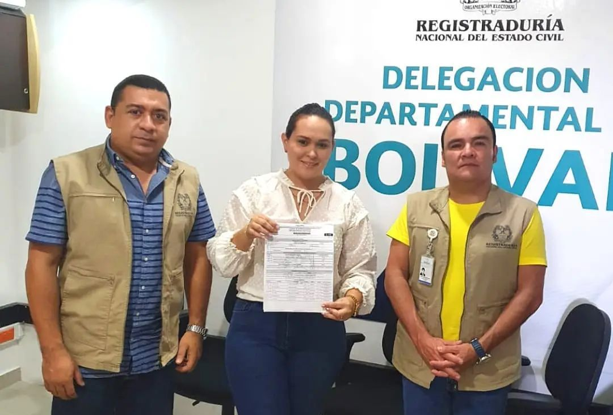

«No disponga del Galeón y su tesoro», le dicen a la vicepresidenta de Colombia, Marta Lucía Ramírez. Ese tesoro, avaluada en más de $200 billones, yace a 600 metros en el lecho marino frente a Cartagena de Indias. Desde la noche del **8 de junio de 1708** se encuentra el tesoro submarino más grande del mundo.  Ella había anunciado que buscarán una firma para rescatar el pecio del San José. Tiene en su panza destrozada un tesoro de 600 metros cúbicos.

Como se sabe, el gobierno del presidente Iván Duque declaró desierta la licitación mediante la cual se pretendía entregar el rescate a una firma inglesa con capital en los paraísos fiscales. **Maritime Archaeology Consultans (MAC)** fue la única proponente del proceso licitatorio declarado desierto. La decisión se tomó lue que se reconociera que  el tesoro arqueológico no se puede transar comercialmente.  

## «No disponga del Galeón y su tesoro»

*«No disponga del Galeón y su tesoro»*

En una carta dirigida al presidente Iván Duque Márquez, la líder social **Linda Pinedo y el veedor Héctor Pérez Fernández,**  le advirtieron al presidente, en el día de hoy, que  es preferible que dejen las cosas como quedaron después de la declaratoria de desierta de la licitación. La razón fundamental es el poco tiempo que tienen para iniciar un verdadero proceso que responda a las necesidades para la conservación de patrimonio cultural. Además, en menos de cuatro meses deben entregar el gobierno a su sucesor.

> Se requiere de unas mesas de trabajo con expertos científicos en extracción de tesoros y piezas históricas, y con todas las fuerzas vivas de nuestra ciudad y departamento. Al Interior del Galeón hay 200 Toneladas de Tesoro: Lingotes de oro, piedras preciosas,oro en polvo, piezas arqueológicas, etc…en un radio de más de 1.000 metros cuadrados. Dejen esa decisión en el próximo gobierno que entra el 7 de Agosto. Así se tendrá el tiempo disponible para no tomar decisiones apresuradas.

Además, le reiteraron su posición de que todo el galeón y su tesoro sean declarados patrimonio cultural e histórico, exclusivamente de Cartagena y Bolívar.

## El rescate del San José

El rescate de los restos del San José y su tesoro ha sido un proceso accidentado. Estuvo dirigida por la misma vicepresidenta y canciller Marta Lucía Ramírez.  La declaratoria de desierta de la licitación por parte del ministerio de Cultura es un paso importante para aclarar la situación. Esta decisión se fundamentó en que se certificó que más del 80% del tesoro contenido en el Galeón es considerado patrimonio arqueológico del país. Por tanto, no podía proceder el pago en especie.  

Si el 80% de los 600 metros cúbicos de tesoro tiene un valor cultural ¿que se hará con el 20% que no lo tiene? La vicepresidenta se encuentra empecinada en iniciar un nuevo proceso de licitación para adjudicar el rescate del pecio que se encuentra frente a Cartagena de Indias. Un tesoro que seguramente es tres veces más al que fue declarado oficialmente, según los expertos. 

El hundimiento del San José se produjo en el marco de la batalla de Barú. El galeón se enfrentó al buque insignia de la real armada británica, el _Expedition._ Eso fue en la noche del 8 de junio de 1708_._ El San José venía de cargar riquezas del Virreinato del Perú en la feria de Portobelo (Panamá).

#### Te puede interesar

### [Desierta la APP para rescatar galeón San José abre un mar de beneficios al Caribe](/articulos/desierta-la-app-para-rescatar-galeon-san-jose-abre-un-mar-de-beneficios-al-caribe/)