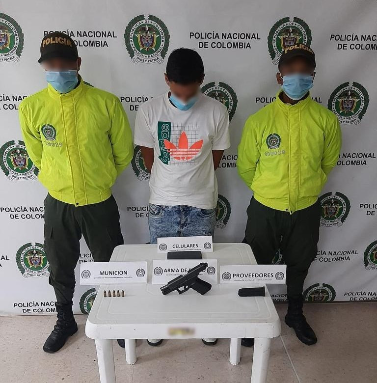
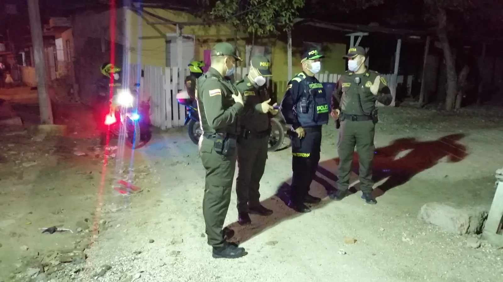

*Una pistola Glock de $16 millones como esta, le decomisaron a un presunto sicario de «Los Robledo».*

En el día de hoy la MECAR capturó a alias «Lainer», presuntamente pistolero de **«Los Robledo», con una pistola Glock 19 de $16 millones.** El arma es de calibre 9 mm que tiene **un adaptador especial para garantizar su alta letalidad.** Este grupo delincuencial es una estructura _outsourcing_  de los «Salsa Mexicanos» que está en confrontación con el **Clan del Golfo**. Una guerra que hoy produjo otra víctima por sicariato en la ciudad. 

Con los homicidios de hoy, la cifra de este año llega a 84, de los cuales han sido ejecutado 47 en la modalidad del sicariato.

El operativo de registro se realizó en la Boquilla, corregimiento de Cartagena de Indias, al norte de la ciudad, es una de las zonas donde están haciendo un mayor control grupos que le trabajan para el Cartel Jalisco Nueva Generación.

## Vea el reporte del B.G. Zapata

https://youtu.be/sgqNPdDulPg

El B.G. Nicolás Zapata, comandante de la MECAR hace un parte de victoria contra el sicariato en Cartagena.

## Matan a «William Perreo»

 William Salazar Torralvo, el presunto delincuente asesinado en la modalidad de sicariato, era conocido en el inframundo de la delincuencia con el alias de «William Perreo». En concordancia con la información de inteligencia de la policía, se dedicaba al microtráfico de estupefacientes y otras actividades criminales del Clan del Golfo. Este individuo tenía una «hoya» en el sector La Puntilla del barrio Olaya Herrera.

Así mismo, se informó también que el crimen contra «William Perreo» fue ordenado desde la clandestinidad por alias 'Paty Paty', el jefe regional de las disidencias  Clan del golfo.

## El presunto sicario capturado

*Alias «Lainer», de Maracaibo, el presunto sicario de la Glock de $17 millones.*

El comandante de la MECAR, **BG Nicolás Zapata,** dijo que la pistola Glock está avaluada en $16 millones. La tenía alias «Lainer», un ciudadano extranjero, 27 años, que operaba en la Boquilla. 

En total, en lo que va del año, hasta hoy martes, han ocurrido en Cartagena y sus corregimientos 84 homicidios: **35 en enero, 24 en febrero y 25 en marzo**.

## La glock de $17 millones

*BG Nicolás Zapata, comandante de la MECAR siempre en el sitio de los acontecimientos.*

La pistola Glock de $16 millones podría costar mucho más debido a la adaptación que se le introdujo con el fin de incrementar el grado de letalidad de sus disparos. Es un selector de cadencia de disparo adaptado para que produzca más daño, según señaló la misma policía. Decomisaron 1 proveedor y 5 cartuchos calibre 9mm. 

Los peritos de criminalística de la SIJIN realizan los estudios de balística correspondientes para verificar si la pistola Glock de $16 millones la han usado en los casos  de sicariatos ejecutados en este año. El decomiso de esa arma le sorprendió al propio comandante de la MECAR, BG Nicolás Zapata, porque no es fácil tener acceso a ella. No solo por el costo, sino también porque es de fabricación austriaca y ninguno de los países latinoamericanos es utilizadas para sus fuerzas armadas o policivas.  

> La Glock 19 es una Glock 17 de tamaño ligeramente reducido, llamada "Compact" por el fabricante. El cañón y la empuñadura de la Glock 19 los redujeron aproximadamente 12 mm con respecto a la Glock 17. Utiliza un cargador con una capacidad estándar de 15 cartuchos. No obstante es compatible con los cargadores de la Glock 17 y de la Glock 18, con capacidades para 10, 17, 19 o 33 proyectiles. Para preservar la fiabilidad operativa del sistema de retroceso corto, la masa de la corredera sigue siendo la misma que en la Glock 17 de la que deriva. Algunos de los componentes son intercambiables con el modelo original.
> 
> [Glock 19](https://luciotorres.local/wiki/Glock)

## La Boquilla, área de control

El pistolero, presunto sicario de **«Los Robledo»,** tiene como área de residencia la Boquilla. Le hicieron el seguimiento hasta cuando se produjo la captura. Fue puesto a orden de la Fiscalía en la tarde hoy,

El poseedor de la Glock de $16 millones, alias «Lainer», 27 años, natural de Maracaibo, estaría al servicio de **«Los Robledo».** Esta presunción se desprende de informaciones de inteligencia de la misma policía confirmada por el mismo comandante de la MECAR.

Te puede interesar:

[El camino de un falso positivo. Caso Gloria Estrada (II)](/articulos/caso-gloria-estrada-el-camino-de-un-falso-positivo/)

[Los «peces gordos» no bailan champeta: ¡Sábado sangriento!](/articulos/los-peces-gordos-no-bailan-champeta-sabado-sangriento/)