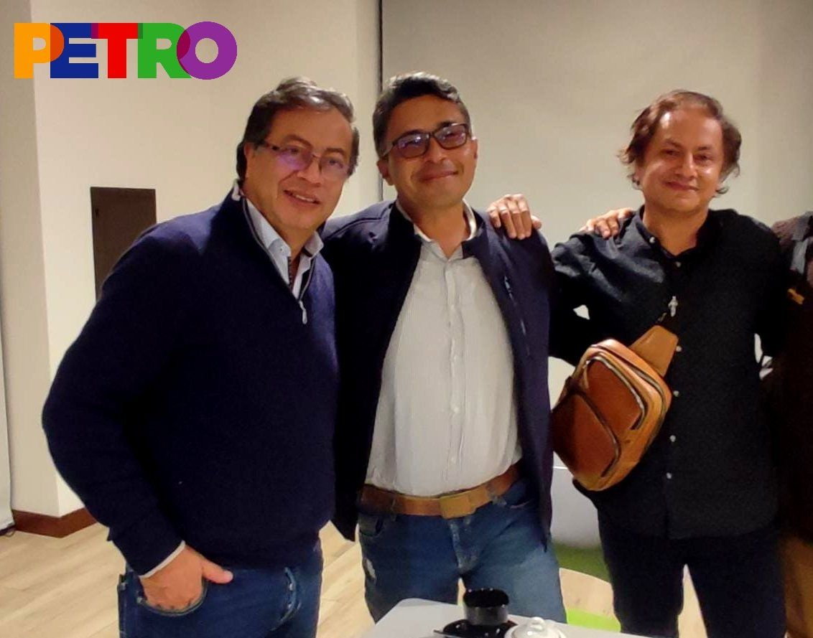
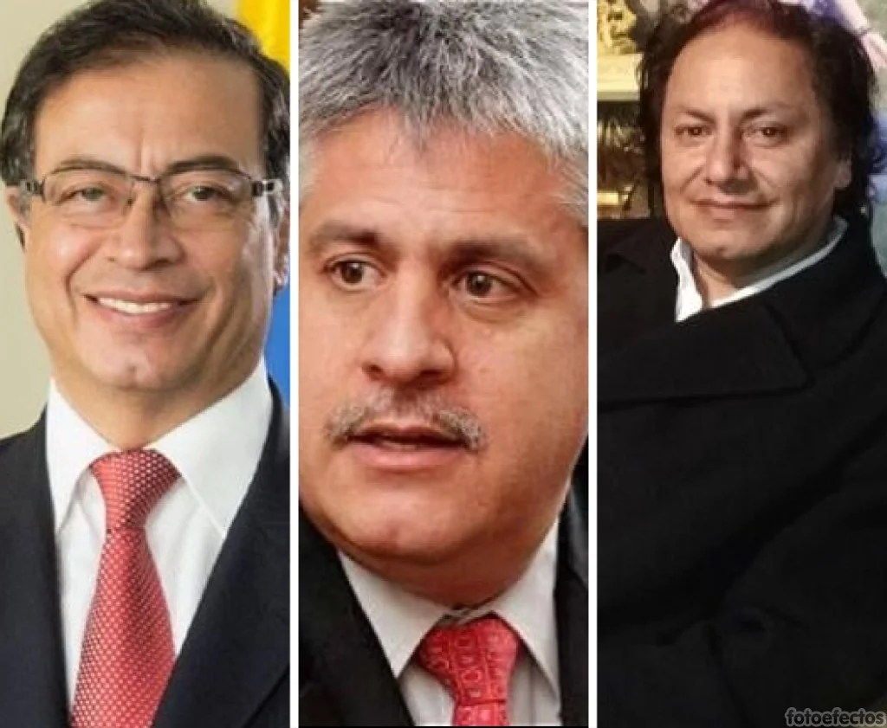
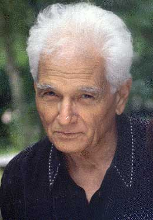

*El hermano del candidato Petro, Juan Fernando es un activista de la campaña del Pacto Histórico. El «perdón social» con los internos del pabellón Ere de La Picota tiene crucificado a Gustavo Petro.*

Se terminó la Semana Santa, pero un verdadero viacrucis sigue viviendo **Gustavo Petro Urrego, candidato presidencial del Pacto Histórico, por cuenta de su «perdón social»**  a los victimarios. Y es que en esta semana de pasión se conjugaron tres hechos que hicieron su cruz más pesada y dolorosa para llegar a la Presidencia de la República. ¿Lo podría llevar a la crucifixión en la segunda vuelta presidencial? A casi un mes de la primera vuelta, es un error que lo pagaría caro, ya que **los indecisos** lo podrían descartar como su opción.

Existen tres hechos, que al interrelacionarse, podría llevarnos a una conclusión sobre este pecado capital de la campaña del **Pacto Histórico**.  (I) Las declaraciones de Petro sobre el «**perdón social» no fueron atinadas.**  (II) La visita que su hermano **Juan Fernando Petro** le hizo a los protagonistas del Carrusel de la Contratación en la cárcel de La Picota **evidenció una negociación secreta con los internos.** (III) Y, para remate, lo que más suspicacia despierta, es el audio del criminal «**Marquitos» Figueroa** (socio de «**Kiko» Gómez)** invitando a votar por el representante de la izquierda colombiana. **La sola relación con esta delincuencia se preña asímisma de un entrampamiento** producto del afán de ganar la presidencia.

https://youtu.be/lAktIoLpiag

Petro crucificado por el perdón social. ¿Le costará la presidencia a Gustavo Petro?

## La filosofía ética

En efecto —para analizar lo que está sucediendo alrededor de la propuesta del «**perdón social»** y del auto entrampamiento en que cayó la campaña presidencial de Petro— **debemos partir de la imposibilidad de perdonar para un ser humano**. Es decir, de lo imperdonable, porque de lo posible se encarga el Estado colombiano a través del código penal o de la justicia transicional. Además, debemos sustraer el perdón del debate electoral como propuesta programática, ya que corremos el riesgo de romper los límites morales. **Este enfoque lo hacemos desde la filosofía aplicada como ética de la conducta.**

Desde el punto de vista del individuo, el perdón al agresor es un acto necesario para estar en paz con uno mismo. En última instancia, cuando uno perdona lo hace movido por un motivo de bienestar espiritual individual. Aquí entendemos el perdón no como la concepción abrahámica (que es un perdón condicionado: yo te perdono si a cambio me das algo) sino desde el punto de vista de la filosofía oriental, específicamente la budista. **Cuando perdoné públicamente al pastor Miguel Arrázola, quien me amenazó** públicamente **de muerte, no lo hice por él, lo hice por mí.** Nunca le pedí que se arrepintiera ni que se retractara.

## Escucha este análisis

/articulos/episode/2etuP6HQiXR4VSFCXssPhF?si=ba831cae06fe44f5

Puedes escuchar mientras espera o conduces.

## Una cagada, una doble moral

*Quizás el afán de ganar la presidencia llevó a los Petro al pabellón Ere de La Picota. ¡Error capital! La teoría del perdón social es transparente.*

Independientemente de si se está de acuerdo con el concepto de «**perdón social»**, lo que se observa es que la campaña del Pacto histórico se la puso de **_papayita_** a sus contrincantes políticos. ¡Fue un error estratégico! Le podría costar la presidencia a Petro. La siguiente declaración de  [Juan Fernando Petro en su entrevista con la revista Semana,](/articulos/nacion/articulo/confirmado-ivan-moreno-el-gordo-garcia-y-los-demas-presos-condenados-si-le-hablaron-al-hermano-de-gustavo-petro-de-rebaja-de-penas-y-perdon-social/202228/) sintetiza la verdadera justificación de la visita que la campaña presidencial de Gustavo Petro le hizo a los reclusos del pabellón Ere de La Picota. Son reclusos condenados por diferentes delitos que va desde concierto para delinquir, corrupción hasta parapolítica.  Así lo resumió el hermano y uno de los líderes de la campaña:

> «Si Gustavo Petro llega a ser presidente se tendrá que hablar sobre la mesa del debate público, de cara ante la sociedad, de reformas, **de reformas a la justicia**, de independizar la justicia de la política, **de reformas transicionales**, de la JEP, de hasta dónde van a ser sus alcances, de si sus logros han sido claros, si no, si hay que transformarla. **Hay que hacer una reingeniería total en todos los aspectos de la sociedad y todos sabemos que sí hay que hacer**. Pero, ya será el fuero personal de Gustavo Petro, de sus ministros, de sus asesores, que tengan la capacidad y la sabiduría para reconstruir un país y para darle un norte de dignidad».

No obstante hay que aclarar algo. La cagada no es la propuesta en sí sino la forma y el medio cómo se hizo. **La falta de transparencia y congruencia de Gustavo Petro y del Pacto Histórico para exponerla y defenderla públicamente.** Si el candidato presidencial habla de «**perdón social»** ¿por qué eliminó de la lista de Bolívar a Sandra Villadiego? Bajo el poder que le confirió el centralismo cachaco, Petro reemplazó la lista a la cámara de Bolívar, bajo el pretexto de que era la esposa de **Miguel Rangel,** quien pagó la pena por haber asistido a la cumbre de Pueblito Mejía convocada por el comandante del Bloque Bolívar de las AUC.

## Del **«perdón social»** al perdón moral

La propuesta del «**perdón social»**, incluida con visita carcelaria a los victimarios, es una evidente cagada que a Petro se le imposibilita aclarar. Tal vez este error monumental es el más protuberante de la campaña _**Petro Presidente**_. Sus estrategas quisieron ser audaces visitando a los ladrones de «**cuello blanco»** que desfilan por el denominado pabellón Ere de La Picota. Al mismo tiempo, justificaron dicha visita con el concepto del filósofo [**Jacques Derrida**](/articulos/derrida/textos/siglo_perdon.htm) sobre el «**perdón moral».** ¿Acaso no es una actuación de doble moral?

Al filósofo galo lo conozco desde 1999 cuando estudiaba el fenómeno de la alienación, los acuerdos de paz y la propuesta del perdón. Su perspectiva de la **deconstrucción** nos permite reconstruir lo construido. El libro [**¿Adiós a la guerra? Cinco claves para la paz**](/articulos/e/1P27YjG3W) lo escribí ese año y lo publiqué en 2016. El concepto petrista del perdón no fue expuesto con claridad, tomando en cuenta que la concepción filosófica  de Derrida habla de un perdón de lo imposible. Fue una torpeza que lo presentaran para tapar una reunión sostenida por **Juan Fernando Petro**  con varios de los condenados del pabellón Ere de La Picota. Como se dijo, este error garrafal podría tener consecuencias negativas para que Gustavo Petro sea presidente. **El fin no puede justificar los medios**.

## Ladrones de «cuello blanco**»**

La audacia de la campaña presidencial de Gustavo Petro no tiene comparación con aquel golpe de opinión que le hizo ganar la presidencia al **conservador Andrés Pastrana Arango** frente a su rival el liberal **Horacio Serpa.** La propuesta de un proceso de paz con las Farc, que incluyó una visita del asesor de campaña **Víctor G. Ricardo** a la guarida de su máximo jefe, **Tirofijo (Manuel Marulanda Vélez),** cambió el curso de la campaña presidencial a favor del candidato conservador.

Lo que se esperaba como un golpe de opinión, puso a Gustavo Petro en un plan defensivo. Por mucho que aclaraba su posición sobre el «**perdón social»**, se enredaba cada vez más. Al respecto, debemos saber que todo perdón implementado desde el Estado para buscar la **«reconciliación nacional»** implica un plan de _**justicia alternativa**_. Mientras en el caso de Pastrana, **Victor G. Ricardo** fue la persona que se tomó la fotografía con **_Tirofijo_**, quien lucía el reloj de campaña de Pastrana, en el caso de Petro, fue su hermano a quien le tomaron la foto con **Iván Moreno**, el cerebro del _**Carrusel de la Contratación**_. ¡Qué papayazo!

Si bien el delito de **_Tirofijo_** era político, por el contrario, el delito de los **hermanos Moreno Rojas** era común. ¡Corrupción! Y como delito común, no se le puede dar un tratamiento político. Ellos crearon un sistema de corrupción del cual pelecharon casi todas las corrientes de la izquierda colombiana durante los cuatro años de la alcaldía de Bogotá. ¡La paradoja! solo **Gustavo Petro y éste periodista denunciamos el Carrusel de la Corrupción al interior de la Dirección Nacional del Polo Democrático**.

## La imposibilidad del «**perdón social»**

A los estrategas de la   campaña de Petro **se les olvidó un pequeño detalle**. Para que la justicia sea **restaurativa**, como lo explicó Petro en su bien preparada aclaración, se necesita resolver el problema jurídico de los victimarios y de sus víctimas. Para esto, es menester introducir una reforma a la justicia. Puesto que el perdón queda instrumentalizado al servicio de un proyecto político que debe tener consecuencias en el derecho penal y, en particular, en el derecho carcelario, deja de ser un perdón moral. Al tratar de normatizar una situación dada para buscar la tan anhelada reconciliación, el perdón se hace imposible desde el punto de vista moral.

En ese sentido, el perdón se hace un imposible jurídico, pero también social, cuando trata de perdonar lo imperdonable. Por ejemplo, los delitos de **lesa humanidad** como masacres, genocidios,  desplazamientos forzados y secuestros. **Son delitos imprescriptibles.** O sea que no tienen límites en el tiempo para ser castigados.

## El límite del perdón

Ahora bien. El perdón de esos delitos tiene que ser pedido por el sujeto incriminado y concedido por el Estado que impone una pena determinada. Pena que debe estar de acorde con los límites que demarca el derecho internacional de los derechos humanos, especialmente, el **Estatuto de Roma** de la **Corte Penal Internacional.**  El estatuto creó las bases para la persecución **penal** supranacional del genocidio, de los crímenes contra la humanidad, los crímenes de guerra y de las agresiones, teniendo en cuenta el hecho de **que** estos crímenes atentan contra la paz, la seguridad, el bienestar colectivo. 

Pero para que el sujeto sea perdonado, entonces, debe ser un **perdón condicionado** a la reparación y a la garantía de no repetición. Esto hace parte de la arquitectura constitucional y legal de Colombia y del derecho internacional de los derechos humanos. Y si el perdón es condicionado a la reparación de las víctimas y a la garantía de no repetición, **será un perdón imposible.**

## Lo imperdonable del «**perdón social»**

*Jacques Derrida: El Siglo y el Perdón.*

En eso tiene razón Derrida, al señalar que el perdón es un imposible, lo cual va en contravía de lo que Petro expuso en su discurso. Veamos lo que el filósofo francés dijo en su debate con Jankélévitch

> «[Cada vez que el perdón está al servicio de una finalidad](/articulos/derrida/textos/siglo_perdon.htm), aunque ésta sea noble y espiritual entonces el “perdón” no es puro, ni lo es su concepto. El perdón no es, no debería ser, ni normal, ni normativo, ni normalizante. Debería permanecer excepcional y extraordinario, sometido a la prueba de lo imposible: **como si interrumpiese el curso ordinario de la temporalidad histórica»**.
> 
> Jacques Derrida, El Siglo y el Perdón. Entrevista de Michel Wieviorka

Al candidato de izquierda nunca se le pasaría por la mente la gran marea negativa que despertó su famosa propuesta de «**perdón social»**. Una iniciativa diseñada para perdonar a los victimarios y no para restaurar el daño a las víctimas. La sola visita de su hermano Juan Fernando Petro a **Iván Moreno despierta muchos sentimientos encontrados.** Es una visita impertinente en un momento clave de la campaña presidencial. Todo indicaría que su propuesta de «**perdón social»** va **encaminada a perdonar a los victimarios** sin tomar en cuenta a las víctimas, las mismas que sufrieron el daño jurídico y moral.  O, por el contrario, a buscar los votos de los delincuentes de «cuello blanco**», que es peor.**

## El «**perdón social»** y la sociedad

*Guillermo hoyos Vásquez.*

En consecuencia, son las víctimas y la sociedad las que deben agenciar un «**perdón social»**. O sea, un perdón moral, como lo señala el filósofo colombiano  **Guillermo Hoyos Vásquez (**[desteologizar el perdón)](/articulos/archivo/documento/CMS-12327159) a propósito del debate introducido por Jacque Derridá sobre el **proceso de paz de Sudáfrica.** Momento en que debatió con Jankélévitch el concepto de **imprescriptibilidad de ciertos delitos contra la humanidad**. Al respecto, Hoyos Vásquez dijo:

> **«El tema de la reconciliación es tan complejo que es necesario que de él se ocupe por un lado la filosofía moral y por otro, la filosofía política y del derecho.** No bastan leyes generosas que estimulen el proceso, este es un proceso social y personal que compromete personas y requiere la participación de la sociedad civil**»**.

Si bien Gustavo Petro salió dando explicaciones sobre el «**perdón social»** y el concepto de j**usticia restaurativa**, sus palabras no fueron convincentes. No solo porque fueron leídas desde el telepronter sino porque no les salieron del corazón. Esas palabras fueron leídas como si fueran una retractación a su concepto de «**perdón social»**. La versión petrista es contraria a lo que realmente expresa el filósofo francés Derrida en sus seminarios sobre el perdón recopilados en su texto [**El siglo y el perdón**](/articulos/derrida/textos/siglo_perdon.htm).

## **La propuesta del «**perdón social»****

**Primero**. Es un hecho la existencia de su propuesta de perdón social relacionada con una justicia restaurativa. Esto implicaría una reforma a la justicia o una suspensión transitoria de la justicia ordinaria, aunque Petro lo niegue. **Segundo.** Está claro que es un hecho la visita de su campaña a La Picota con propósitos electorales. **Tres.** Que uno de los visitantes es su hermano **Juan Fernando Petro**, quien se entrevistó con **Iván Moreno Rojas,** uno de los cerebros del **Carrusel de la Contratación** de Bogotá donde se robaron más de $2 billones. **Cuatro.** Está claro que la grabación de «Marquitos» Figueroa es real. Además, existe un **documento apócrifo de contenido político** que circula en el pabellón Ere de La Picota sobre una propuesta de rebaja de pena y mejoramiento de las condiciones de reclusión de los internos.

Esos cuatro hechos son contundentes que desvirtúan los planteamientos de Petro sobre su «**perdón social»**. Sin duda, es una propuesta audaz, pero torpemente expuesta por la campaña presidencial del candidato del Pacto Histórico. O, probablemente, no la expusieron con transparencia  y con diálogo social de las organizaciones de víctimas. Es una propuesta que viene de arriba, Por tanto, impuesta. **¡Un imposible categórico!**

## El perdón moral como «**perdón social»**

De manera que el perdón moral, que es el concepto de Derrida, es un **imposible.** Se hace posible cuando la sociedad es capaz de perdonar lo imperdonable. ¿Podemos perdonar los falsos positivos? ¿Los secuestros? ¿Las masacres y desplazamientos forzados? ¿Podemos perdonar a los corruptos y negociar con ellos las penas? ¿Podemos perdonar a los sádicos sanguinarios?

Ahora, para ponerlo en unos términos más cercanos: ¿podemos perdonar a los jefes del paramilitarismo y de las bandas criminales? De acuerdo con la ley de **Abraham** —que sigue el judaísmo, el cristianismo y el islamismo— el **perdón moral** es posible en la medida que haya un cordero para expiar el pecado. El cristianismo construyó su propio cordero que fue **Jesucristo**. La muerte del Cristo significó limpiar nuestros pecados y ganar el perdón de Dios. Ahora pregunto, ¿son las 8,3 millones de víctimas los corderos que limpiarán los pecados de los victimarios en Colombia? ¿Y qué podemos decir de las víctimas de la corrupción?

Podemos perdonar. Para ello, necesitamos la **reparación efectiva de las víctimas**, la garantía de la no repetición y, sobre todo, **una justicia restaurativa que edifique a las víctimas**. Pero también al victimario para que no continúe en su lógica depredadora contra la humanidad. Por eso, los victimarios de toda pelambre (paramilitares, guerrilla, corruptos) no pueden seguir gobernando este país que realmente necesita un **perdón moral.** Sin embargo, no como una medida del Estado para la normalización de la situación. Necesitamos un perdón moral que salga de las entrañas de la ciudadanía y no de la lucidez del líder o del Estado iluminado. Recordemos, **el perdón es un acto de liberación individual para salir de la trampa del odio, la ira y de la violencia en la que nos somete «nuestros enemigos».**

**Te puede interesar:**

### [La esperanza de la resurrección en Semana Santa](/articulos/la-esperanza-de-la-resurreccion-en-semana-santa/)