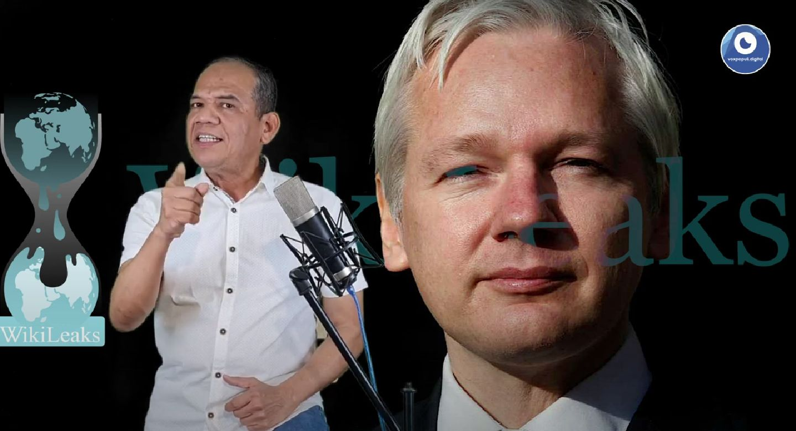

*Cuando Julian Assange se encontraba en la embajada de Ecuador.*

La última decisión de un juez británico de autorizar la extradición de Julian Assange a los Estados Unidos es un atentado a la libertad de expresión. El falso cargo de violar la ley contra espionaje, pone de manifiesto la **falta de libertad de expresión para los periodistas de investigación**. Es un mensaje claro de los regímenes dictatoriales contra los que se atreven a divulgar los secretos que encierran posibles **crímenes de guerra y crímenes de Estado**. Así lo señalan las organizaciones para la defensa de los derechos humanos.

Sin embargo, surge una esperanza para Assange. El Tribunal Superior aprobó que la medida de extradición puede ser apelada ante el Tribunal de Magistrados de Westminster. Ahora la decisión la debe asumir la **ministra de Interior del Reino Unido, Priti Patel.**

https://youtu.be/3BBHhKLYSJE

El creador de wikileaks, Julian Assange, viene siendo martirizado por el gendarme del mundo, Estados Unidos.

## Caso Julian Assange, mal precedente

La decisión de este miércoles de un juez británico de autorizar la extradición de Assange, refleja la fragilidad de la actividad de los **periodistas de investigación del mundo.** Ahora no solo corren el riesgo de ser asesinados, sino también de ser perseguidos por los gendarmes del mundo. Al respecto, **Amnistía Internacional (AI)**, señaló: 

> «La confirmación por la ministra del Interior de Reino Unido de la solicitud de extraditar a Julian Assange violaría la prohibición de la tortura y sentaría un alarmante precedente para editores y periodistas de todo el mundo. (...) Publicar información de interés público es una piedra angular de la libertad de prensa. La extradición de Julian Assange para que enfrente acusaciones de espionaje por publicar información clasificada **sentaría un precedente peligroso y pondría en riesgo a los profesionales del periodismo de todo el mundo**».
> 
> **Agnès Callamard**, secretaria general de [Amnistía Internacional](/articulos/en-que-estamos/noticias/noticia/articulo/reino-unido-confirmar-la-extradicion-de-assange-pone-a-este-en-gran-peligro-y-seria-una-grave-amenaza-para-la-libertad-de-prensa/)

## Los crímenes de los poderosos

*La autorización de un juez británico de la extradición de Julian Assange lo pone con un pie en los Estados Unidos.*

De otra parte, los regímenes autocráticos del mundo les incomoda seriamente el periodismo de investigación independiente. **Les temen a los periodistas que están libres de las grandes editoriales o medios de comunicación corporativos, porque no los pueden controlar.** Quieren mantener sus acciones contra la humanidad en secreto para garantizar la impunidad social. Bajo esta perspectiva, se enfoca la situación que soporta el fundador de [Wikileaks](https://warlogs.wikileaks.org/), Julian Assange. **El australiano está siendo martirizado con todo tipo de acusaciones por atreverse a divulgar los secretos del «policía del mundo y de sus aliados»**.

## Escucha el análisis

/articulos/episode/0sPIuJcLmLkC0Oo9RDGBp0?si=5080c245e2ea41fc

Recordemos que gracias a Wikileaks nos enteramos de los crímenes de guerra y crímenes de Estado cometidos por los Estados Unidos en diferentes eventos como la guerra de Irak. Puso en evidencia el uso sistemático de torturas. Denunció los **109.000 muertos** en Irak entre 2003 y 2009 -el **63% de ellos, civiles**\-, y ayudas de Irán a las milicias iraquíes. También sacó a la luz pública la negativa del Pentágono de investigar las denuncias por los numerosos casos de torturas cometidas por soldados norteamericanos y sus aliados en esos eventos de violencia.

De manera que, cualquiera que sea el régimen autocrático, —izquierda o derecha, este u oeste— con estas acciones como la de encarcelar y perseguir a Assange, lo que pretenden es silenciar a los periodistas. Hacen del derecho fundamental de expresión una pelota de caucho que la estiran y la patean según sus intenciones bajas.

## Difundir la verdad

En suma, si extraditan a Julian Assange a Estados Unidos, según **AI,** lo someterán a un juicio injusto. Si lo hayan responsable, se enfrentaría a 175 años de cárcel. Es decir, **sería cárcel perpetua. Pero también un mensaje de terror para los periodistas de investigación por difundir la verdad de los poderosos.** 

**Te puede interesar:**

/articulos/el-perdon-social-una-cagada-que-le-podria-costar-la-presidencia-a-petro/