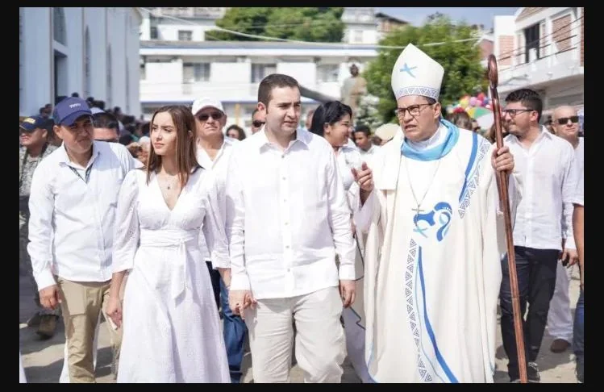

*La esperanza de la resurrección en Semana Santa. Cristo resucitó en mí. Cortesía.*

Desde el punto de vista filosófico e histórico la esperanza de la resurrección de Cristo despierta mucho interés en el mundo cristiano. Pero, sobretodo, crea un estado espiritual para la reflexión de que _polvo somos y en polvo nos convertiremos_, **pero con la esperanza de resucitar**. En este sentido, se conmemora la Semana Santa como la pasión, la muerte y **la resurrección de Jesucristo.**

Refleja el sufrimiento del pueblo colombiano. La pasión de una guerra interminable. Los centenares de miles de muertos y de desaparecidos. Pero también los fieles deben tener la esperanza de que algún día renaceremos de estas cenizas. **Es la esperanza de la resurrección**. ¿Quién puede abrir la puerta de este tesoro inconmensurable? Jesús nos dio una llave maestra: el amor de sí mismo y amor al prójimo. No es un acto religioso. Tampoco es un acto de fe. **Es creer que en cada uno de nosotros vive el Jesús Resucitado**. Si tú lo crees, se te abrirán las puertas de la vida todos los días. Pero es un acto práctico. Cotidiano. No es liturgia.

https://youtu.be/Ah4kdVYNwDI

La esperanza de la resurrección. En Semana Santa una reflexión para cambiar.

## Mi historia

Cuando estaba **_pelao_** —les cuento esta historia significativa— la Semana Santa significaba comer pebre (guiso) de icotea (galápago), salpicón de bagre salado, ponche desmechado, conejo y cuantas clases de pescado había. Lo que más disfrutábamos eran los dulces de papaya, mamón, guandul, frijoles y un largo etc. Cumplíamos con ir a la procesión de Semana Santa y quemar una vela por la vida.

De la misma manera, los días Jueves y Viernes Santos teníamos limitaciones. No podíamos comer carne de res sino pescado. Tampoco ir a nadar a la playa, el río o la ciénaga. Si pasábamos la Semana Santa en Magangué, el Viernes Santo era un día especial. Una vez nos escapamos y fuimos a caminar por gran parte de la ciénaga de Versalles que estaba seca. Se formó un torbellino o remolino que levantó todas las hojas marchitas que tapizaban el suelo y un pedazo de tela blanca que llegó hasta el cielo. Todos los pelaos huimos despavoridos. ¡Creíamos que era un espanto!

## El Viernes Santos que viví

*El gobernador Vicente Blel y su esposa Natalia Eljach en una procesión de Magangué.*

Un Viernes Santo ví ese remolino de hojas y madera secas color marrón. Era un torbellino que se llevaba casi todo lo que encontraba a su paso. Trozos de trapos, zapatos viejos y toda clase de objetos naturales y artificiales que volaban a lo más alto del cielo. Cuando leí Cien Años de Soledad supuse que [**Gabriel García Márquez**](https://www.cervantes.es/bibliotecas_documentacion_espanol/creadores/garcia_marquez_gabriel.htm) debió inspirarse en uno de estos remolinos para narrar la escena de la ascensión de [Remedios, la bella, al cielo](https://webcache.googleusercontent.com/search?q=cache:Jn1atXiGZpsJ:/articulos/isimu/article/download/10669/10813/25564+&cd=19&hl=es-419&ct=clnk&gl=co). Cuando regresé a casa agitado y asustado, mi abuela Ana Luisa, quien guardaba muy bien los preceptos cristianos, me dijo:

> «Edison Lucio, eso te pasa porque eres un niño que no haces caso. ¡Eres desobediente!».

Efectivamente, yo era un niño rebelde. ¡Desobediente! Rompía los esquemas y las órdenes prohibitivas. Semana Santa era una semana de recogimiento, reflexión, arrepentimiento y de contricción. Por esta razón, ir a nadar un Viernes Santo al río, a la ciénaga o al mar no era una buena idea. ¡Y eso lo hice! Era una profanación. En Barranquilla en estos días santos escuchábamos en la radio comercial concierto de música clásica y religiosa todo el día. Nos deleitábamos con **Vivaldi,** **Mozart**, **Wagner**, **Schuber**, **Debussy**, **Verdi**, **Ravel.** Escuchábamos programas de radio con especialistas en música clásica y gregoriana. Había transmisiones de concierto por radio y TV.

## La esperanza de la resurrección

La palabra de Jesús hace énfasis en la resurrección. La esperanza de que todo cambiará. **El amor a sí mismo y el amor a nuestro prójimo es la ley que debe prevalecer sobre todas las demás leyes.** En este caso la esperanza no es una espera pasiva. Es una búsqueda incesante del ser humano bueno en su interior. No es un viaje a la Meca o a Jerusalén. Es un viaje al interior de cada ser. 

Sin embargo, a finales de la década del 70 las cosas cambiaron en la percepción de la Semana Mayor. El país se fue haciendo más urbano. En 1974 entró en vigencia la Ley 20 que reformó el Concordato de 1887. Fue entonces cuando la radio y la TV se liberaron del vínculo de la iglesia católica y eliminaron de su programación radial los especiales de Semana Santa. En Barranquilla, por ejemplo, fue un sacrilegio cuando **Radio Olimpica** programó música comercial Jueves y Viernes Santos.

Quizás eso suena muy coloquial. Pero tiene un profundo significado porque la **«pecera cultural»** colombiana comenzó a ser dirigida, ya no por el vínculo **Estado-Iglesia Católica**, sino el sistema comercial de la radio colombiana. Ésta, a su vez, se fue transformando en una radio comercial determinada por los grandes monopolios económicos del país. 

## Los nuevos programadores de la mente

Por esa razón, la nueva radio y TV quedó libre del monopolio de la iglesia católica. Pero pasamos del monopolio de la relación **iglesia Católica—Estado** al monopolio radial dominado por el monopolio económico. Caracol pasó al grupo Michelsen y RCN al grupo Ardila Lulle. El Estado Nación dejó de ser cohesionado por la iglesia Católica. 

En Barranquilla los Char Hermanos rompieron los cánones religiosos de la radio barranquillera con una programación profana de Radio Olímpica el Jueves y Viernes Santos.

> «¡Gózate la Semana Santa con Olímpica!»

Ahora existen cinco o diez programadores de la **«pecera cultural»** como lo caracteriza el filósofo [Michel Foucault](/articulos/post/182198762404/el-pez-nunca-descubre-que-vive-en-el-agua-de). Son los dueños del país que ordenan qué tipo de música escuchar, qué religión practicar, qué dios adorar, qué tipo de educación recibir, qué clase de diversión practicar, qué comer y cómo hacer el sexo. **¡El dios dinero!** La libertad religiosa se convirtió en un próspero modelo de negocios. Surgieron centenares **Miguel Arrázola** que solo les interesa la **«lana de sus ovejas»**. Se olvidó el mensaje central de esta Semana Santa: el Cristo resucitado. Ellos prefieren el cristo crucificado, el cristo muerto. Pero desconocen que Dios vive en cada uno de nosotros. ¡Vive en ti! ¡Vive en mí!

Te puede interesar

### [Primera Semana Santa de «Pacho» Ricaurte en la cárcel](/articulos/primera-semana-santa-de-pacho-ricaurte-en-la-carcel/)

[¡Milagro en HUC! Se salvó Olga Acosta del Colvid-19](/articulos/milagro-en-huc-se-salvo-olga-acosta-del-colvid-19/)