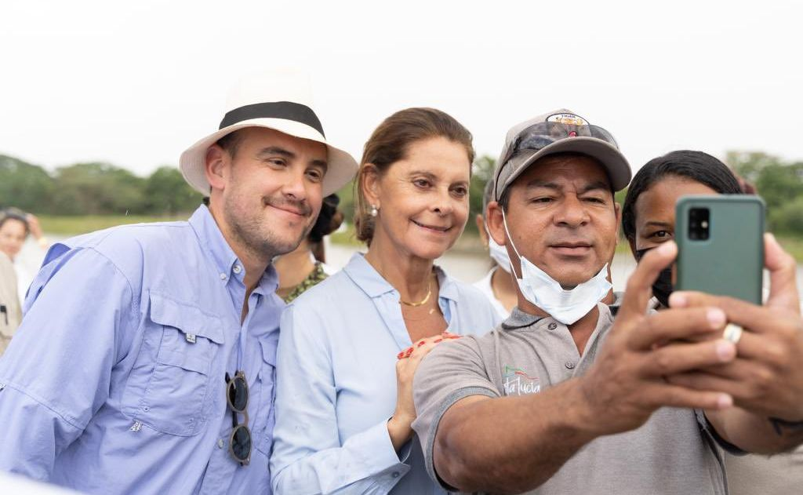
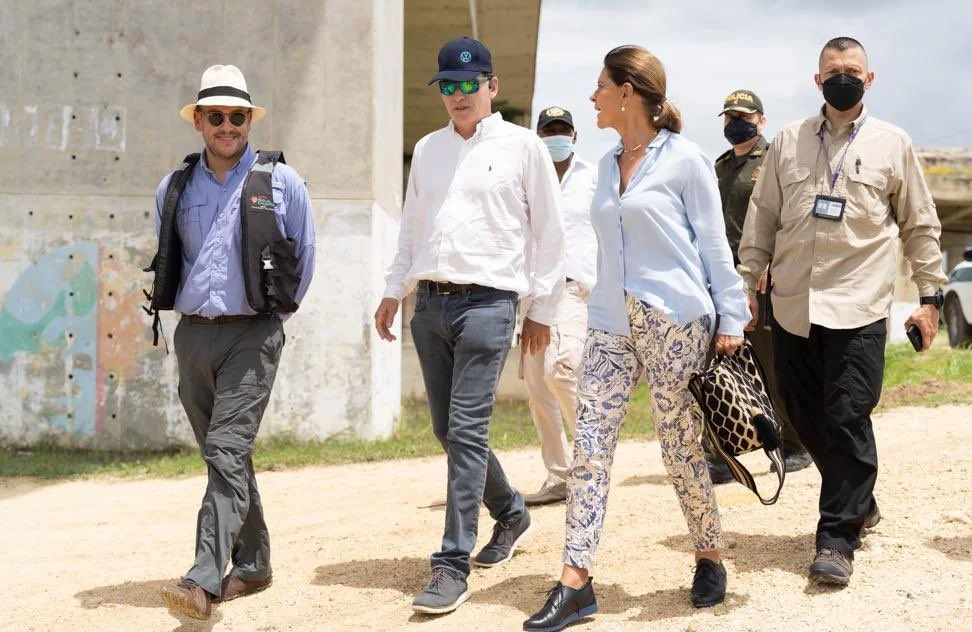
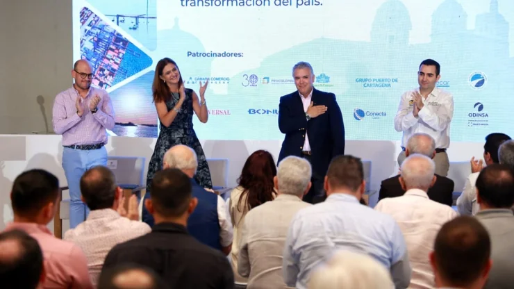
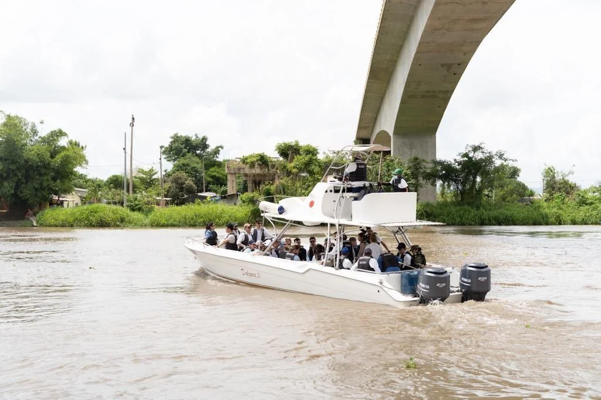

*¿Sueño o pesadilla? Proyecto Canal del Dique. En el centro, Marta Lucía Ramírez, vicepresidenta de la República. El presidente de la ANI, Manuel Felipe Gutiérrez.*

**¿Sueño o pesadilla?** Es la pregunta que nos queda por responder después de escuchar al **presidente Iván Duque Márquez** y a los demás contertulios del Foro sobre el megaproyecto **«Restauración de los Ecosistemas Degradados del Canal del Dique»**. El evento se realizó el 22 de abril en Cartagena de Indias. Asistieron diferentes sectores de la sociedad cartagenera, menos los representantes de la comunidad que será impactada del proyecto.

No obstante —en la clausura del foro hecha por el primer mandatario— se dejó algo claro: **La propuesta discursiva del gobierno va en contravía de la realidad de sus macroproyectos**. Estos nacen, se conciben y se ejecutan pensando en la acumulación desmedida de riqueza de los más poderosos en detrimento de los más débiles. Generalmente estos macroproyectos producen desequilibrios ambientales y sociales. Acrecientan la brecha económica y pauperiza a los más débiles. Son modelos depredadores y despojadores de la propiedad ancestral. Por ejemplo, este proyecto del Canal del Dique es duramente cuestionado por diferentes comunidades negras y organizaciones defensoras del medio ambiente.

Veamos la posverdad de boca de los voceros gubernamentales Presidente de la República, **Iván Duque Márquez**, **Vicepresidenta Marta Lucía Ramírez,** la ministra del Transporte **Ángela María Orozco**, gobernador de Bolívar **Vicente Blel Escaff** y el presidente de la ANI, **Manuel Felipe Gutiérrez.** No se trata de frenar el desarrollo. S**e trata de que el desarrollo incluya a los más pobres y a la naturaleza.**

## El foro de la posverdad **¿Sueño o pesadilla?**

https://youtu.be/17mGH-2LTzw

¿Sueño o pesadilla de la posverdad? El Caribe colombiano debe levantarse para defender sus recursos naturales y la seguridad alimentaria de la población.

En esta _**época de posverdad**_, hay que considerar que tal y cual como se concibió y se socializó la megaobra, es un sueño para los grandes inversionistas internacionales y nacionales. Pero corre el riesgo de ser una pesadilla para los 150 mil habitantes de la zona de influencia que desconocen su esencia. pero impactará a 497.984 habitantes de toda la zona. La cifra demográfica fue actualizada por el DANE. Esta percepción está sustentada por la experiencia de estas comunidades que han sido arrinconadas por proyectos económicos como las grandes camaroneras.

De tal manera, el presidente nacional destacó que se invertirán **$7,14 billones** en proyectos de infraestructura para la región Caribe con la **APP Canal del Dique**, el nuevo **aeropuerto de Bayunca-Cartagena y la Ruta Caribe 2**.

## ¿Sueño o pesadilla de la posverdad?

*Felices vendiendo nuestros recursos naturales del Canal del Dique. ¿Sueño o pesadilla?*

En este sentido el presidente de la república puso el debate en el marco de la posverdad: 

> **«Veo discursos populistas y de _posverdad_ que dicen que se acaben las concesiones y sistemas de peajes.** Buscan aplausos para hacer creer que las obras se hacen solas. La gran capacidad del avance de las obras se debe al haber desarrollado un modelo de APP y concesiones, que es el más aplaudido de América Latina. Los populistas quieren ver al país en el atraso**»**.

¿Es la **Alianza Público Privada (APP)** el único mecanismo para el desarrollo social de un país? La respuesta fáctica es no. Pero en la posverdad la respuesta es totalmente contraria a la realidad. La explotación de los recursos naturales, del suelo, las aguas, del aire está supeditada a un modelo económico donde prima la alta rentabilidad de los inversionistas. Este modelo se convirtió en una verdad dogmática durante los 20 años del régimen actual. Según esta concepción, la APP garantiza el desarrollo económico y social de una nación y el sistema de peajes permite su financiación. 

## Modelo desarrollista

*Iván Duque Márquez, la ministra del Transporte Ángela María Orozco, gobernador de Bolívar Vicente Blel Escaff y el presidente de la ANI, Manuel Felipe Gutiérrez, felices y alegres por un sueño para inversionistas extranjeros y una pesadilla de hambre para los 150 mil pobladores del Canal del Dique. Clausura del foro Canal del Dique un sueño posible realizado en Cartagena el 22 de abril. ¿Sueño o pesadilla?*

Que todo lo privado garantiza la transparencia de la inversión económica es un principio de la posverdad. Pero la realidad es completamente contraria a este criterio que solo se encuentra en la emoción y en el sentido ideológico del exponente para crear una **opinión pública favorable**. Las obras faraónicas despiertan interés emocional de la sociedad. Pero solo tienen una finalidad: **acrecentar las arcas de los privadas a expensas del perjuicio de los derechos colectivos.** 

## Escucha el análisis

/articulos/episode/0WZ9asiYMYhUS6vh37HhwP?si=23eee37329004336

Además, la administración de los ingresos de los peajes por los concesionarios, no solo es una descarada privatización de los recursos, sino también una suplantación de la acción estatal en la administración de la cosa pública. Realizar una concesión de **50 años o 100 años**, como fue el caso del **Canal de Panamá**, es entregar nuestros recursos para el usufructo privado.  

Efectivamente, eso es lo que podría suceder con el megaproyecto **«Restauración de los Ecosistemas Degradados del Canal del Dique».** Se está vendiendo un proyecto que profundizará la pobreza de más de 150 mil personas de la subregión. Por ejemplo, tierras de agua dulce recibirán agua salada. ¿Qué se tiene previsto para resolver este inminente problema? ¿Muros de protección  para las inundaciones? ¿Qué pasará con la economía campesina cuando el campesino no tenga tierra para cultivar sus productos de pancoger? ¿Qué será de la pesca artesanal? ¿Importaremos productos comestibles de Asia? ¿El sistema de esclusas afectará la movilidad de los pobladores?

## Los macroproyectos

En los años 50 se produjo una reactivación económica gracias a la inversión estatal en la infraestructura del país. El presidente Rojas Pinilla completó el ferrocarril del Atlántico y construyó la mayor parte de las carreteras troncales del país. De igual manera, inició la construcción en 1955, del Aeropuerto Internacional El Dorado de Bogotá​ y 18 aeropuertos más. Recordemos que la albarrada de Magangué —un muro de contención de 3 kilómetros del Río Magdalena— lo construyó el gobierno de Rojas Pinilla.

La construcción de esas obras produjo una reactivación económica en el país. Aumentó el empleo y hubo una mayor participación económica de la población. ¿Qué modelo usó Rojas Pinillas? Inversión directa de los recursos del Estado en la construcción de la infraestructura. Esto quiere decir, que si hay voluntad política desde el poder del Estado, la inversión pública traerá bienestar al conjunto de la sociedad y no a un grupo de inversionistas.

Pero el presidente de los colombianos, fiel exponente del interés privado sobre el interés público, considera que una posición contraria es populista. Hizo un llamado para promover los macroproyectos que —según él— solo los pueden ejecutar los inversionistas privados.  

> “Hay que hacerle promoción internacional a la iniciativa privada del nuevo aeropuerto de Bayunca. Nosotros le estamos dejando a la Costa Caribe el avance de la Ruta del Sol, fortaleciendo la conexión Antioquia-Bolívar. La vía La Prosperidad y Cruz del Viso es otro gran avance”.

## ¿Se puede modificar el proyecto?

*Los posibles inversionistas hicieron un recorrido por el Canal del Dique acompañados de Marta Lucía Ramírez.*

Finalmente vale preguntarnos, ¿Se puede modificar el proyecto **«Restauración de los Ecosistemas Degradados del Canal del Dique»?** Marta Lucía Ramírez, la vicepresenta de la República y encargada de coordinar la adjudicación de la obra, cree que no.

> «Estos diseños están hechos hace más de 10 años y **cambiarlos significaría posponer este canal por otros diez años** y el tiempo no da espera. Es decir, ni habría puertos, ni acueductos»

En realidad el problema no es de tiempo sino de intereses. Si pensamos en el interés colectivo el proyecto podría posponerse un año más. Es imprescindible realizar algunas modificaciones sustantivas del pliego de condiciones. El proyecto debe propender por la seguridad alimentaria no solo de los 150 mil pobladores de la subregión sino de los 19 municipios que la obra impactará. Son 497.984 habitantes de toda la zona. También es necesario asegurar la productividad, la empleabilidad y la sostenibilidad de la economía campesina del Canal del Dique. 

Si acaban con el medio de existencia ¿qué será de la vida de esos pobladores afros, de sus campos y de su riqueza natural? Los foristas, encabezados por el presidente de la república, no respondieron esa pregunta. Sus ojos brillaban de avaricia. **¿El próximo gobierno pospondrá este proyecto tomando estas consideraciones?**