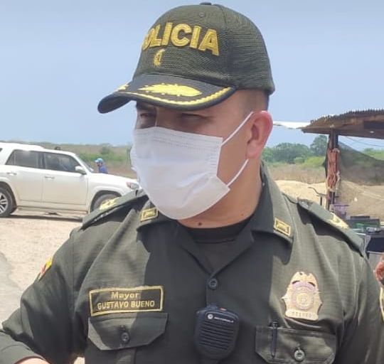

*¡Alerta Urgente!*

Una alerta urgente lanzó el veedor social, Erick Urueta Benavides, debido al presunto perfilamiento que le está haciendo el  comandante del Cuarto _Distrito_ de la _Policía_ Metropolitana de Cartagena, **Gustavo Adolfo Bueno Aguilar**. Entre veedor y policía se han presentado enfrentamientos. El más sonado es el que se presenta en predios de la familia Girado en Playa Blanca Barú que disputan con el empresario Gabriel Echavarría Obregón. 

*Mayor Gustavo Bueno Aguilar*

Para Urueta el mayor Bueno se puso al servicio del empresario de Gabriel Echavarría en perjuicio de los intereses Girado. Recordó que el oficial también apareció en los hechos de complot ejecutado por la policía contra la presidenta del concejo de Cartagena, **Gloria Estrada Benavides**. 

https://youtu.be/6LtTzDIr8Js

## Alerta urgente

¿Puede un alto oficial perfilar a un veedor social extralegalmente? Por supuesto que no. De allí la importancia de la alerta urgente difundida por el veedor y las denuncias que presentó ante la Fiscalía General, la Procuraduría y la Defensoría del pueblo. El mayor Bueno todavía no se ha pronunciado sobre esta denuncia.

/articulos/adilmarquez1/status/1527055848807309313?s=20&t=LpV\_sjN2wTvtqvsLd9HKYg

Sin embargo, entre el oficial y el veedor se han presentado algunos enfrentamientos con ocasión de la misión de los dos. Por ejemplo, hace dos meses se registró un operativo en Playa Blanca Barú, jurisdicción del corregimiento de Santa Ana. Urueta Benavides está coadyuvando en la defensa de los intereses de la familia nativa que hace posesión de un lote que reclama de su propiedad. En tanto, el mayor Bueno dirigió un operativo contra los nativos con el fin de desalojarlos. 

# [La celeridad de la justicia favorece a Gabriel Echavarría](/articulos/la-celeridad-de-la-justicia-para-favorecer-a-gabriel-echavarria/)