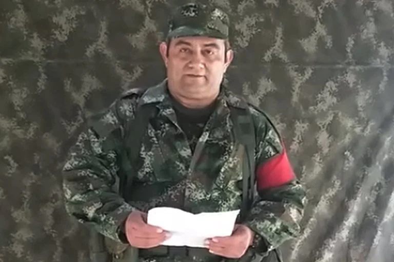
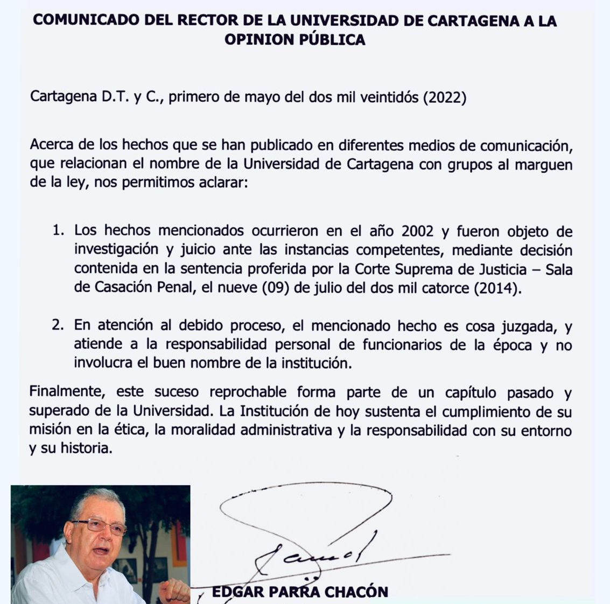

(imagen no disponible)
*Sergio Hernández (rector de la UdeC 2002) y Rodrigo Noguera Calderón, rector de la Sergio Arboleda. Denuncias de alias «Otoniel».*

Las denuncias de alias «Otoniel» ante la JEP, que ahora las trasladaron a la Fiscalía, debería llevar a la **Universidad Sergio Arboleda y a la Universidad de Cartagena** a pedir **perdón moral** a la sociedad por los daños ocasionados. Un perdón a la manera como lo interpreta el filósofo **Jacque Derrida**. Mientras la primera negó todo, la segunda aceptó el hecho que ya es **cosa juzgada**. Y se trata de contratos interadministrativos suscritos por el rector de 2002, **Sergio Hernández Gamarra,** con el gobernador de Casanare, **William Pérez Espinel** para favorecer a los **escuadrones de la muerte** y del narcotráfico.

https://youtu.be/Dk2MmZsuL-M

Vea el análisis sobre el caso de las universidades denunciadas por Otoniel antes la JEP.

Aunque la «Sergio» negó y rechazó la información a través de un comunicado de prensa reproducido por los principales medios periodísticos del país el pasado 2 de mayo, faltaría establecer los contratos firmados por la gobernación de Casanare con esa entidad universitaria. En este caso, el testimonio del jefe criminal señalaría pruebas fehacientes que conduzcan a desvelar la conducta criminal de los funcionarios que llevarían a la **_Sergio Arboleda_** a ser instrumento de financiación de grupos criminales.

## El perdón moral

*Rodrigo Noguera Calderón desmintió a alias «Otoniel».*

Si la «Sergio» está en mora de reconocer las denuncias de alias **«Otoniel»,** significa que sus directivos jamás aceptarán la responsabilidad social y moral de los hechos que se le imputan. A no ser que una autoridad judicial determine lo contrario.

Contrario a la Universidad Sergio Arboleda, la Universidad de Cartagena reconoció los hechos, pero indicó que es cosa juzgada, ya que fue condenado el rector de ese entonces, **Sergio Hernández Gamarra.**

De tal manera que Sergio Hernández —durante su período rectoral— tuvo diferentes problemas con la contratación suscrita a través de los convenios interadministrativos. Usó la universidad para ejecutar contratos sin el lleno de los requisitos legales. Lo peor, tal como está documentado, **muchos de esos contratos pertenecían a grupos armados criminales o personas vinculadas a la parapolítica**. Fue un período oscuro. Incluso, la universidad contrató personal que era cuota de diferentes organizaciones criminales. 

/articulos/episode/6y9ztWeSBJt62JrfdaOH4K?si=ab719569e17941b7

## La universidad capturada 

*Víctor Hugo Hernández, exrector de la Universidad de Córdoba (izq.) y Javier Cáceres Leal, expresidente del congreso, denunciaron por injuria y calumnia al periodista Lucio Torres. Pero los dos fueron condenados a 35 años y 9 años de cárcel, respectivamente, por los mismos hechos que el periodista investigó.*

A finales de los 90 y comienzos del 2000, muchas universidades de la Costa Caribe **fueron capturadas por el paramilitarismo a sangre y fuego.** Un hecho grave, algunos profesores y directivos se prestaron para ese horrendo crimen.

Citemos el caso del **ex rector** **Víctor Hugo Hernández Pérez.** En el 2006, Hernández me denunció por injuria y calumnia. ¿Por qué? Porque presenté varios informes en **Vox Populi Radio Vigía de Todelar**. Fue el resultado de una investigación periodística bien estructurada. Tenía un material probatorio. El informe hablaba de su relación con el capo paramilitar **Salvatore Mancuso**. Y lo más importante, el asesinato del profesor **Hugo Iguarán.** Él había instrumentalizado la universidad de Córdoba a favor de los escuadrones de la muerte. Toda esa documentación probatoria el periodista se la entregó a la Fiscalía. Con estos informes periodísticos cuestionamos el nombramiento como director del CREAD de la Universidad de Cartagena a **Víctor Hugo Hernández,** quien debió retirarse.

En esa época enfrenté dos procesos supuestamente por **injuria y calumnia**. El de [**Javier Cáceres Leal**,](https://luciotorres.local/corte/wp-content/uploads/relatorias/pe/b1abr2012/28436\(11-04-12\).doc) (déle clic para que lea el fallo condenatorio) todopoderoso presidente del congreso, y el de **Víctor Hugo Hernández** (documento no disponible). (Déle clic para que lea el fallo condenatorio). La persecución contra este periodista, se les devolvió a los dos. Terminaron condenados a **9 años el primero**, y a **35 años el segundo**. Y este periodista, como siempre, terminó libre de cualquier responsabilidad penal o moral. No me enorgullezco para nada de esto. Porque, aunque uno gane un proceso judicial del cual es inocente, también termina perdiendo con la misma condena de sus contrincantes. La mejor pelea, decía mi abuelita Ana Luisa, es la que no se hace.

## Un olor fétido

Ese período de **Sergio Hernández** dejó profundas heridas en el _Alma Mater_. Heridas profundas que están sanas en la superficie. Pero, evidentemente, todavía de la vieja herida bota pus  —ese líquido amarillento, maloliente y fétido— cuando alguien las remueve, como sucedió con alias **«Otoniel»**, jefe máximo del Clan del Golfo. **¡Es el momento de rescatar la imagen de la Universidad de Cartagena!** Y ahora la responsabilidad es del nuevo rector de librar una campaña corporativa que empiece pidiendo perdón por todo el daño ocasionado a la humanidad y al saber. 

## La parapolítica

No obstante, los hechos hablan por sí solo. Sergio Hernández debe responder, pero también sus cómplices. ¿Dónde están?

Es el caso de la exparlamentaria condenada por la parapolítica **Zuleima Jattín. Aunque e**lla [fue absuelta por duda, en sala de casación de la Corte Suprema de Justicia](/articulos/nizkor/colombia/doc/jattin2.html) por un contrato problemático entre el congreso y la Universidad de Cartagena de Hernández Gamarra, se debe clarificar esos lazos políticos problemáticos. Es saldar cuenta con la historia.

En este caso se comprobó un detrimento patrimonial contra el congreso. Pero, exoneraron a la parlamentaria de responsabilidad penal, y al mismo Hernández, quien aseveró que el pago del contrato interadministrativo sí ingresó a la universidad. El ente acusador señalaba lo contrario, es decir, que ese dinero nunca ingresó.

## El contrato de alias **«Otoniel»**

En cuanto al contrato señalado por alias **«Otoniel»,** se recordará que **William Pérez**, gobernador de Casanare, y **Sergio Hernández Gamarra**, rector de la Universidad de Cartagena, firmaron los **contratos interadministrativo No 230 y 867 de 2002** con el fin de que ésta administrara **58 proyectos** que se iban a ejecutar en los diferentes municipios de ese departamento.

Asimismo, debemos señalar que Hernández Gamarra fue acusado por la Fiscalía en 2007. Los delitos que le imputaron fueron peculado por apropiación en favor de terceros, celebración de contratos sin el lleno de requisitos legales, interés indebido en la celebración de contratos y falsedad en documentos públicos.

El mencionado contrato señalaba que la **Universidad de Cartagena** debía contratar a los ejecutores de los **58 proyectos** de construcción de vías, hospitales, estadios, y tendidos de redes eléctricas, entre otros. Pero en realidad, Hernández Gamarra, según argumentó la Fiscalía en su momento, no tuvo en cuenta las exigencias de la Ley 80 de 1994. De igual manera, la investigación comprobó que hubo sobrecostos que ascendieron a **834’666.042** de pesos de aquel momento.

## La condena

El 21 de julio de 2010 el juzgado Segundo Penal del Circuito de Yopal absolvió al rector Hernández de los delitos que le imputó la Fiscalía. Pero el ente acusador apeló dicha sentencia que pasó al estudio del juez superior.

De manera que el [Tribunal Superior del Distrito de Yopal en sentencia proferida el 25 de marzo de 2011](/articulos/colombia/noticias/a-15-anos-condenado-ex-rector-de-la-universidad-de-cartagena/) sentenció a Sergio Hernández Gamarra a la pena privativa de 15 años, un mes y 15 días de prisión. Para ello revocó la decisión de primera instancia dictada por el Juzgado Segundo Penal del Circuito de Yopal que lo había absuelto de su responsabilidad penal.

No conforme con esa sentencia, Sergio Hernández recurrió a la casación. Sin embargo, en la Corte Suprema de Justicia fue derrotado. La sentencia se mantuvo, haciendo varias modificaciones. Una de ellas era que el exrector de la Universidad de Cartagena debía pagar a la gobernación de Casanare la suma de **$836 millones** a manera de indemnización por los sobrecostos hallados en la ejecución de la obra.

## Lo nuevo de alias «Otoniel»

*Dairo Úsuga, alias «Otoniel» en la JEP. Fue el capo de capos del Clan del Golfo*

Si bien el proceso que mencionó el jefe del Clan del Golfo pasó a cosa juzgada, como lo señala acertadamente el comunicado firmado por el rector actual de la Universidad de Cartagena, **Edgar Parra Chacón,** abre un capítulo especial. Se trata de **establecer la verdad de lo sucedido** como garantía de no repetición, pero ahora en la justicia transicional. Y en este caso deben responder ante el tribunal JEP los condenados por la justicia ordinaria.

Es decir, que Sergio Hernández Gamarra, si bien no hizo parte de las estructuras delincuenciales del Clan del Golfo — Autodefensas Gaitanista de Colombia— s**í participó como un tercero civil en el entramado delincuencial para la financiación de grupos armados ilegales.** Esta financiación se constituye en un hecho cierto para concertarse. Este concierto delincuencial le permitió a esta organización criminal financiarse con el fin de ejecutar delitos de lesa humanidad. Tales como desplazamientos forzado, secuestros, masacres y torturas contra la población civil. 

Cabe señalar que un **tercero civil** es una persona que, sin formar parte de una organización o grupo armado, participó directa o indirectamente en delitos del conflicto armado. Son actos que contribuyeron a crear o financiar grupos armados ilegales.

En consecuencia, Hernández Gamarra deberá comparecer ante la JEP antes de que la Fiscalía inicie un proceso contra él por los delitos de concierto para delinquir y financiación de grupos armados ilegales.

## La UdeC aclara a alias «Otoniel»

Sin duda, es caso juzgado. Pero la imagen de la universidad quedó manchada. Solo queda el arrepentimiento y la voluntad de resarcir a las víctimas de los delitos de lesa humanidad. Son delitos que se les atribuye a las organizaciones criminales que se financiaron con esos contratos ficticios. Contratos que desangraron al Estado y, al mismo tiempo, estimularon una guerra que sacrificó a vidas inocentes que cayeron bajos su bombas y balas.  

Si la «Sergio» quiere tapar las evidencias y los testimonios de alias **«Otoniel» ante la JEP,** por el contrario, la Universidad de Cartagena **debe abrir un período de reconocimiento, conciliación y perdón moral. La Universidad Sergio Arboleda no lo va a hacer.** Hará honor al pensamiento esclavista alineado con la violencia de la Colombia fragmentada por el dolor del siglo XIX.