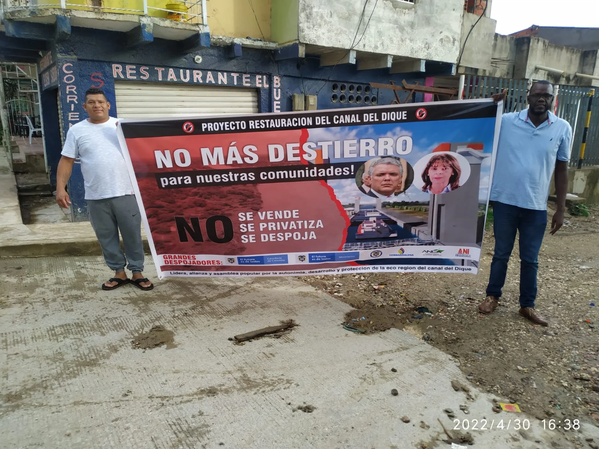

*Adil Meléndez y los diferentes líderes que organizaron la Asamblea Popular de Organizaciones Afros del Canal del Dique. Votarán por Petro*

Votarán por Petro. La Asamblea Popular Afro constituida por organizaciones y procesos sociales de la Ecorregión del Canal del Dique, Montes de María, y Golfo de Morrosquillo tomaron la decisión de votar a la presidencia por el candidato del **Pacto Histórico, Gustavo Petro**.

Desde hace 22 meses esas organizaciones vienen liderando la defensa de los derechos fundamentales de las comunidades Afrodescendientes, Negras, Palenqueras, indígenas y campesinas y promueven la protección de los activos ecosistémicos del Canal del Dique. También vienen desarrollando la escucha entre las comunidades y las instituciones del Estado. En asamblea realizada este 28 de noviembre ratificaron que votarán este 29 de mayo por Gustavo Petro y Francia Márquez. Según la asamblea, esa fórmula a la presidencia y vicepresidencia representa la defensa de la vida, de la naturaleza, la paz y reconciliación total.

## Aclaran desinformación

De igual manera, lamentaron que las juntas de los consejos comunitarios que se han visto envueltos en actos de corrupción en los procesos de consulta previa al proyecto Ruta 5G «Restauración del Canal del Dique» estén promoviendo votar por **Federico Gutiérrez.** Pero lo están haciendo a partir de la desinformación a la comunidad en el sentido de que si Fico es presidente, el proyecto saldrá adelante, y les pagarán las compensaciones. Pero si gana Petro el proyecto fracasará.

*Fredy Martínez y Adil Meléndez, dos de los líderes de las comunidades del Canal del Dique. Votarán por Petro*

Consideraron que esa desinformación viene provocando confusión entre las mismas comunidades con fines de manipular la opinión y la decisión electoral.