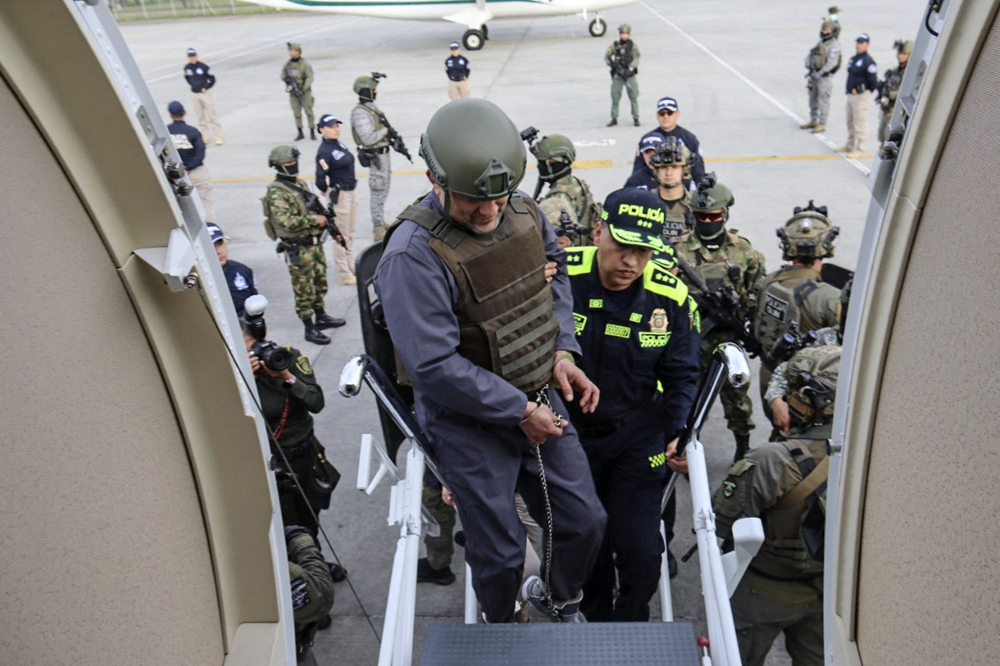

*La extradición de «Otoniel». Cuando era reseñado antes de partir a una cárcel de Nueva York. Cortesía.*

La extradición de «Otoniel» puso a prueba la fragilidad de un régimen que padece de déficit de gobernabilidad. **El paro armado del Clan del Golfo demostró que la Seguridad Democrática del régimen es tan frágil** como los acuerdos tácitos establecidos con las organizaciones criminales para mantener una paz ficticia. Pero, en realidad, mantienen un dominio territorial. 

La población de los Montes de María quedó enclaustrada por el paro armado. Nos retrotrae a los años 90 cuando las carreteras eran tomadas por las organizaciones armadas. Es decir, **la crisis que vivimos no solo es la crisis de la política de Seguridad Democrática sino también del régimen neobonapartista,** inaugurado hace 20 años por Álvaro Uribe y que hoy tiene en el gobierno a Iván Duque.

De igual manera, la extradición del capo también demostró que el presidente Iván Duque, ante la disyuntiva de la presión norteamericana, optó por compartir su trofeo de guerra, y entregarle a alias «Otoniel» en **bandeja de plata a Joe Biden**. Recordemos que en los Estados Unidos los acuerdos son realizados por la Fiscalía, como ente acusador.

## «Otoniel» ya está en EE.UU:

https://youtu.be/0b53k6ySk5Y

A diferencia de la extradición (2008) de los 14 jefes de las autodefensas y del narcotráfico por parte de **Álvaro Uribe Vélez,** la extradición de alias «Otoniel» no podría calificarse como el precio que Duque está pagando al gobierno de los Estados Unidos para garantizar su impunidad **como sí fue el caso del creador de la Seguridad Democrática.** 

## Escuche el análisis

/articulos/episode/4fA6efMNRKPAFoeiW6nTe9?si=8f1d4c93470143db

## Duque mató dos pájaros con la misma bala

De hecho, el presidente colombiano pretende ahora matar dos pájaros con la misma bala. **Mata la presión** que el gobierno gringo viene ejerciendo para que dé resultados en la guerra contra las drogas. Además, también mata toda posibilidad de justicia y resarcimiento que exigen las familias de las víctimas del conflicto.

**Primero**, asegura la aprobación y calificación positiva del imperio de su mandato. Así, puede ganarse la indulgencia de los norteamericanos por su mediocre gestión en la lucha contra el narcotráfico. Los indicadores de resultados en esta materia son deficitarios.

**Segundo**, al mismo tiempo, se garantiza a sí mismo impunidad. En este año han sido asesinados 50 líderes sociales, gran parte con la autoría del Clan El Golfo. Su gobierno —con altos indicadores de corrupción y complaciente con el crimen organizado— se caracteriza por una **sistemática violación de los derechos humanos**. Lo único eficiente que puede mostrar en el ocaso de su gobierno es haber cumplido con la promesa de sabotear el acuerdo político con las FARC y las víctimas del conflicto.

## La verdad voló con la extradición de «Otoniel»

*Momento en que Úsuga David (alias «Otoniel»,) subía al avión que lo llevaría a Estados Unidos,Cortesía AFP.*

Casi toda la verdad del conflicto armado colombiano y del narcotráfico se fue con las extradiciones de los jefes de las autodefensas y ahora con los capos de los clanes armados. Cuando ellos comienzan a hablar ante los tribunales de justicia alternativa, el régimen se la ingenia para silenciarlos. **Cuando la parapolítica hervía**, Uribe sacó un as debajo de la manga y le entregó los capos a la justicia estadounidense.

Recordemos que «Otoniel» le dijo a Justicia Especial de Paz —JEP— que él se entregó al gobierno. Y, además, no tuvo reparos para presentarse ante los organismos de derechos humanos y la justicia alternativa. Quería colaborar con la justicia transicional. **Su intención era hablar sobre la verdad de los crímenes de guerra**. Probablemente había llegado un acuerdo para no ser extraditado y legalizar su situación con el Estado colombiano. Si esta tesis no es cierta ¿por qué se produjo el paro armado del Clan El Golfo como respuesta a su extradición?

En efecto, desde el mismo día que «Otoniel» fue extraditado a Estados Unidos por el presidente Duque, las diferentes estructuras del Clan iniciaron un paro de 4 días en diferentes partes de Colombia. En la Costa Caribe, por ejemplo, el paro armado es una realidad en 12 municipios de Bolívar que tienen una tradición en el conflicto armado. De igual manera en Sucre, Magdalena y Córdoba. En antioquia, se han afectado 30 municipios. 

## La guerra nunca se fue

Lo anterior demuestra también que la guerra interna nunca se acabó. La FARC salió del juego de la guerra como organización dominante. Pero entraron otros actores, incluso, más crueles y degradantes. Es la degradación de la guerra, tal como lo señalamos en nuestro libro [¿Adiós a la guerra? Cinco claves para la paz](/articulos/adiosalaguerra/).

Colombia es un país donde la violencia juega un papel dinamizador, incluso, de la economía. Desde las economías de enclave de principio del siglo XX hasta la economía del narcotráfico del siglo XXI tienen como catalizador a la violencia. Por esta razón, ninguno de los régimenes que ha dominado el país a lo largo de nuestra historia contemporánea, están comprometidos con la paz.

https://twitter.com/JEP\_Colombia/status/1522301331230310404?ref\_src=twsrc%5Etfw%7Ctwcamp%5Etweetembed%7Ctwterm%5E1522301331230310404%7Ctwgr%5E%7Ctwcon%5Es1\_c10&ref\_url=https%3A%2F%2Fwww.semana.com%2Fnacion%2Farticulo%2Fparo-armado-jep-revela-que-35-municipios-sufrieron-acciones-violentas-por-parte-del-clan-del-golfo%2F202221%2F

## Extradición de «Otoniel»: un botín de guerra

**Extraditar a Dairo Úsuga, alias «Otoniel», se constituyó en un botín de guerra para Duque**. Pero también para el gobierno de **Joe Biden**, quien busca reconocimiento en un círculo de poder de la extrema derecha dominante. Se trata de demostrar que la guerra contra las mafias del narcotráfico la están ganando. Así, pues, los empresarios norteamericanos vinculados a la industria de la guerra, pueden seguir amasando un multimillonario presupuesto destinado a combatir el narcotráfico. 

De manera que para los gobernantes norteamericano, como para los empresarios que viven de la guerra contra las drogas, la extradición funciona como un mecanismo de dominio propagandístico. Es una campaña para el dominio ideológico de la opinión pública norteamericana. 

Cuando extraditan a un personaje como alias «Otoniel», nos hace recordar cuando las fuerzas conquistadoras del emperador regresaban a Roma con el botín de guerra, Los jefes de los ejércitos derrotados eran parte de ese botín transformados en esclavos.

## Una guerra perdida

No obstante,  esa guerra se ha perdido, según varios estudios internacionales. Por ejemplo, puede citarse el de la [Rights Human Fundation.](/wp-content/uploads/2019/05/WoD_Online-version-FINAL.pdf) En Estados Unidos, cuando el corrupto y adicto al alcohol **Richard Nixon lanzó en 1971** este plan denominado **guerra contra las drogas**, 1 norteamericano moría de **sobredosis** por cada 100 mil habitantes. Hoy mueren 6. Esta guerra ha producido mucho más muertes por las acciones de las organizaciones criminales asociadas al negocio. Es un fracaso total en salud y seguridad ciudadana. 

Aunque el narcotráfico produce ingentes recursos financieros a los grandes empresarios asociados al negocio, los gobiernos del imperio han invertido, en medio siglo de guerra contra las drogas, una suma que va de **300 trillones a 640 mil millones de dólares**, según datos de esos estudios.

En tanto que Colombia gastó, entre 1999 y 2009 la suma de **8 mil millones de dólares**, según lo reconoció un alto funcionario del presidente Juan Manuel Santos. Este dinero se destinó para armas, acciones de la guerra y material para erradicación y aspersión de cultivos. Pero los resultados también expresan un fracaso total. Creció no solo el narcotráfico sino el consumo interno.

Vale la pena preguntarnos ¿por qué razón si la opinión pública norteamericana —que se precia bien informada— apoya la guerra contra las drogas. La explicación: la propaganda y la ideología. Las extradiciones de los capos sirven para la propaganda y la recompensa financiera de los mismos círculos de poder norteamericanos.

## Extradición e impunidad

El instrumento de la extradición solo ha servido para garantizar impunidad de la violación de derechos humanos de los gobiernos, principalmente de los tres presidentes del **régimen neobonapartista**: Uribe, Santos y Duque. De la misma manera, le garantizó a Estados Unidos obtener el dinero acumulado por los capos del narcotráfico que se encuentran en el exterior. Los capos nacionales van a Estados Unidos y legalizan su patrimonio con la justicia norteamericana pagando con parte de esa misma riqueza que le produjo el narcotráfico y la acción delincuencial.

# Te puede interesar

# [Denuncias de alias «Otoniel» ¿las universidades podrán pedir perdón?](/articulos/denuncias-de-alias-otoniel-las-universidades-podran-pedir-perdon/)