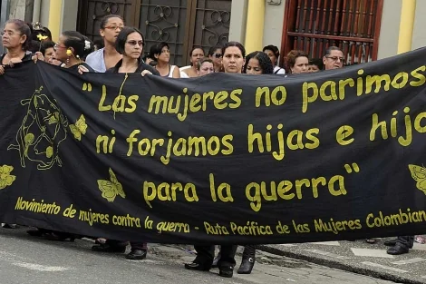

*Las madres paren los hijos para la guerra. El mundo está dirigidos, en su mayoría,por psicópatas. Las Mujeres Resisten foto tomada en cali. Cortesía.*

Aunque suene provocador, **las madres paren hijos e hijas para la guerra y la corrupción.** Pero también para toda clase de violencias. El odio, el resentimiento, la agresión y la falta de perdón moral, crea hermanos que se matan entre sí por lo mínimo. Las madres reproducen la cosmovisión dominante y son instrumentalizadas para perpetuar el dominio ancestral con sus hijos e hijas. Por tanto, **el Día de las Madres se convierte en la segunda fecha más violenta de Colombia.**

Aunque las feministas me acribillen, hay que admitir que las madres reproducen la sociedad patriarcal dominante, la visión ancestral. Son lazos culturales, atávicos, que permean nuestro ADN. Pero las madres son las únicas que pueden parar esto. 

## Madres que paren hijos para la guerra

Si decimos que las madres son las principales responsables de que sus hijos e hijas sean las más violentas ¿les estamos achacando toda la responsabilidad de la violencia de la humanidad? No. Los neurocientíficos — entre ellos [**James  Fallon**](/articulos/xlsemanal/a-fondo/putin-psicopata-diagnostico-james-fallon-neurocientifico.html)— dicen que cuando el bebé nace su cerebro no es una tabula rasa, como lo creyó [**J.J. Rousseau**](/articulos/kgs/XJ7wqx). Por el contrario, nace con un mapa genético que unas veces lo predispone, por ejemplo, a la violencia y al crimen. 

Pero esta predisposición solo se dispara cuando se producen hechos detonantes, como el abuso, el maltrato, el acoso. El período de edad infantil que se debe tener mucho cuidado con nuestros hijos es el comprendido entre los 5 y 10 años. Si es abusado en ese período, podría nacer el futuro violador, el «Otoniel», el Pablo Escobar, el violador del Charquito, el «Jorge 40» o el general de 5 soles que acusan de ser determinadores de centenares de **«falsos positivos».**

> «Todos nacemos con un conjunto de alelos heredados de tu madre y de tu padre que se combinan en ti de manera aleatoria y hacen que acabes con genes asociados a determinados comportamientos. Tres cuartos de la población heredan genes no asociados con agresividad extrema, baja empatía emocional, violencia **〈**(...) Pero un 1/4 de la población**〉**nace con esa genética criminal, de la cual solo el siete por ciento desarrolla un trastorno de personalidad relacionado con la depredación entre miembros de nuestra especie. Y estos son responsables de la mayoría de los crímenes que se cometen. **La mitad de las personas que están en prisión, de hecho, son psicópatas. Y no tienen remedio, por cierto»**.
> 
> [James Fallon.](/articulos/xlsemanal/a-fondo/putin-psicopata-diagnostico-james-fallon-neurocientifico.html?x-vocento-user-type=registrado&x-vocento-hide-content=no&x-vocento-access-type=ALLOW_ACCESS/)

## Hijos psicópatas

Al decir de Fallon, los problemas en la infancia, al carecer de una madre que lo ayude a formar y que lo proteja de la agresión de su entorno familiar y social, se podría originar el sádico y el psicópata que puede estar entre nosotros y no lo sabemos. Puede ser el gobernante de tu país o de tu ciudad, y lo toleras, porque así fue o es tu padre. ¿Te suena familiar **"tu papá te quiere"**?

> ... los traumas infantiles tempranos. Este es el disparador común que parece haber determinado su conversión en psicópatas. Y luego los típicos: son mentirosos patológicos, manipuladores, emocionalmente superficiales; gozan de buena memoria, carisma, dominio del miedo y la ansiedad (algo fundamental para el psicópata); son sádicos, hipersexuales
> 
> James fallon

## Una nueva generación de madres

Hace 60 años, mientras nuestra madre hacía su trabajo doméstico y nos cuidaba, estaba prendida a la radio escuchando las radionovelas, los programas dirigidos a las mujeres y a los que sufrían del amor romántico. Por supuesto, nosotros éramos los principales radioescuchas. A la edad escolar, teníamos clase en las dos jornadas, mañana y tarde. Los sábados eran para hacer las tareas. Los domingos íbamos a la «misa de gallo». Siempre, antes de dormir o al levantarnos, debíamos rezar el padre nuestro.  ¿Quién nos obliga? Nuestras mamás.

Sin embargo, hace 30 años, las madres ataban a su hijo a la silla con el pañal y les ponían un programa infantil de TV. Ya era una jornada escolar, y mamá comenzó a emplearse. Por tanto, ya no pasaba el día con nosotros sino con sus patronos. Desde esa época, la mayoría de las madres le dejaron ese papel de cuidado a las muchachas del servicio que, a su vez, su hijos los dejaban solos o con sus abuelas. En las noches, no los ponía a rezar sino a ver un programa de TV hasta que se quedaba dormido.

## La «liberación femenina»

Con **Mayo Francés** o el **Festival Woodstock** vino la **«liberación femenina»**. Hombres y mujeres podíamos tomar y fumar a la par. La marihuana y el hachís fueron los condimentos de la vida moderna. Esto hizo de los hijos e hijas seres solitarios, depresivos, trastornados, crisis de identidad, ensimismados, aturdidos, diluidos y poco fluidos. Si le sumamos los traumas familiares y sociales, como la guerra y la violencia social, la nueva generación de niños y niñas queda marcada doblemente, 

Así se hizo la **vida líquida** (documento no disponible)**,** a la manera de **Zygmunt Bauman**. Este fenómeno se expresa de una forma, según la clase social donde se encuentra esa madre. Por ejemplo, vas a cualquier barrio del suroccidente de Cartagena de Indias, y la mayoría está haciendo esto: jugando seven eleven, juegos de mesa. Apuestan hasta la plata de la comida de sus hijos. Por la noche, tienen una pelea segura con sus maridos. Y viene la violencia intrafamiliar.

> «La sociedad «moderna líquida» es aquella en que las condiciones de actuación de sus miembros cambian antes de que las formas de actuar se consoliden en unos hábitos y en una rutinas determinadas. La liquidez de la vida y la de la sociedad se alimentan y se refuerzan mutuamente. La vida líquida, como la sociedad moderna líquida, no puede mantener su forma ni su rumbo durante mucho tiempo».

En estas sociedades latinoamericanas, las familias se dispersan, se atomizan, se vuelven caóticas. Pero las violencias —fíjate que está en plural— convierten esos espacios en un infierno. Las estadísticas de violencia de Medicina Legal así lo corrobora.

## «Las madres líquidas»

En tanto las madres que se van a trabajar más de 8 horas diarias, le dejan sus hijos a cuidados de la abuela, las tías o tíos, a riesgos que se lo «mariquén» o lo vuelvan un adicto o un delincuente si tienen predisposición genética. Es el medio social donde se encuentran insertas las familias. Así se forman «las madres líquidas».

De hecho, las madres de la clase media quieren educar a sus hijos no con un libro sino con un teléfono inteligente. Dicen, así las puedo controlar más. ¡Falso! Los riesgos de que su hijo sea un futuro psicópata se multiplican con el acoso cibernético.

Ahora bien, la causa de esta violencia no es la «liberación femenina». No. Por el contrario, es la subyugación de las madres a la misma opresión en que están sometidos los padres. Es decir, están bajo la dictadura de un machismo a la inversa. Entonces, se produce una situación que es un caos en el hogar que se refleja en la familia y la sociedad.

En una sociedad como la nuestra, donde los niveles de violencia son abrumadores y que vivimos una guerra eterna de siglos de duración, se produce el fenómeno de la alienación. La violencia enajena al ser humano capaz de llevarlo a cometer crímenes contra la humanidad. Y esto lo vemos como algo normal. **Esta tesis la descubrí en 1999 cuando me desprendí de la visión ideologizante de que había violencia reaccionaria y violencia revolucionaria,** guerra del diablo y guerra santa, guerra mala y guerra buena. **La violencia es una sola**. La guerra es una sola. El crimen es uno solo. (Insisto y no es autobombo, esta tesis la desarrollamos en el libro **¿Adiós a la Guerra? Cinco claves para la paz**).

## Un violencia inserta en el ADN colombiano

*Las madres paren hijos para la guerra. cortesía.*

Al estudiar a los neurocientíficos de hoy, se puede citar un fenómeno conocido como la **epigenética**. Estas son las marcas químicas en el ADN. Todos los seres humanos tenemos el mismo ADN. Incluso, compartimos con el mono el 99.9 de la genética. Pero la diferencia son los puntos químicos producidos por miles de años de evolución. 

Sin embargo, con la epigenética el ser humano se adapta al entorno de una a otra generación. Y esto es lo que ha pasado con la violencia en la humanidad y, particularmente, en Colombia. Son 200 años de guerra —con breves intervalos de paz— que estas generaciones de colombianos hemos vivido. Esta situación, formó una humanidad colombiana con niveles de tolerancia más altos que otras culturas, incluso, latinoamericanas. En este punto, **la violencia se ha insertado en nuestro ADN con puntos que lo modifican por una «pecera cultural» violenta.**

> «La adaptación (del ser humano) puede tardar miles de años en genética, pero la epigenética es más rápida: en una generación o dos se puede completar. Por medio de la epigenética también confirmamos otras teorías evolutivas, como que todos los humanos venimos del Cuerno de África**»**.
> 
> **Manel Esteller**, director del Programa de Epigenética y Biología del Cáncer del Instituto de Investigación Biomédica de Bellvitge y profesor de la Universidad de Barcelona.

En ese sentido, no es gratuito que nuestros líderes políticos y militares (izquierda o derecha) cada día sean más violentos. Y no tienen que usar los fusiles  para demostrar esa violencia. Solo observen detenidamente la forma de sus discursos, su personalidad, su mesianismo y su perfil psicológico. Esto explica la degradación del conflicto armado colombiano. O sea, que el próximo presidente de Colombia —sea «Fico**»** o Petro— no traerá la paz anhelada.

## El Día de las Madres

Las ciudades más violentas en un Día de la Madre, en su orden, son Bogotá, Cali, Medellín,  Barranquilla, pereira, Cúcuta y Cartagena. En consecuencia, en una fecha como esta, la violencia doméstica se multiplica. 

Según Medicina Legal, los homicidios, las riñas y los delitos que afectan la vida y la sexualidad de mujeres, niños, niñas y adolescentes aumentan durante esta fecha. El dato a destacar, es la segunda con más muertes en el año.

Ahora bien. Veamos las cifras en época de pandemia. Medicina Legal reveló que durante el **2021** se practicaron **231.802 valoraciones médico legales** en todo el país**.** La cifra se incrementó en **31.823** **casos más que en 2020.**  De esa cifra, **se valoraron 135.587** personas por lesiones personales y **el principal motivo fue por riñas y la violencia intrafamiliar.** De igual manera, **aumentó en un 21%** el número de casos por violencia sexual. Durante 2020 se registraron **17.761 casos**. **Bogotá registró el 35% del total de los casos**, convirtiéndose en la ciudad con el mayor número de reportes con lesiones personales.

## La violencia doméstica antes del Covid-19

En ese sentido, analicemos comparativamente un segmento del tiempo del comportamiento de esas cifras antes de pandemia Covid-19. Según cifras del [**Instituto de Medicina Legal oficiales**](/articulos/web/guest/noticias/-/asset_publisher/vLcVEedo8qgD/content/dia-de-la-madre-una-oportunidad-para-disfrutar-en-paz-y-alegria?_com_liferay_asset_publisher_web_portlet_AssetPublisherPortlet_INSTANCE_vLcVEedo8qgD_redirect=https%3A%2F%2Fmedicinalegal.gov.co%2Fweb%2Fguest%2Fnoticias%3Fp_p_id%3Dcom_liferay_asset_publisher_web_portlet_AssetPublisherPortlet_INSTANCE_vLcVEedo8qgD%26p_p_lifecycle%3D0%26p_p_state%3Dnormal%26p_p_mode%3Dview%26_com_liferay_asset_publisher_web_portlet_AssetPublisherPortlet_INSTANCE_vLcVEedo8qgD_cur%3D4%26_com_liferay_asset_publisher_web_portlet_AssetPublisherPortlet_INSTANCE_vLcVEedo8qgD_delta%3D7%26p_r_p_resetCur%3Dfalse%26_com_liferay_asset_publisher_web_portlet_AssetPublisherPortlet_INSTANCE_vLcVEedo8qgD_assetEntryId%3D371811), el fin de semana, (viernes, sábado y domingo) del Día de la Madre de 2016, se registraron **114 homicidios**, 1.290 riñas, **460 de violencia de pareja**, 215 casos de violencia intrafamiliar y **174 casos de violencia sexual**.

En 2017, la situación se agravé. Veamos: **121 homicidios**, 1.159 casos de violencia interpersonal, 518 de violencia de pareja, 212 de violencia intrafamiliar y **186 casos de violencia sexual**. En 2018 la tendencia alcista de las cifras se mantuvo. En la jornada hubo **126 muertes violentas**, 1.214 riñas, 428 denuncias de violencia de pareja, 206 de violencia intrafamiliar y 132 casos de violencia sexual.

De manera que —en un fin de semana del Día de la Madre— Medicina Legal asegura que, entre el 2009 y el 2018, 1.493 fueron asesinadas en Colombia durante el fin de semana de la celebración del Día de la Madre (contando viernes, sábado y domingo). El 91% de los muertos fueron hombres y el 9%, mujeres. Además, las ciudades donde más se registraron los homicidios fueron **Bogotá (184), Cali (167), Medellín (123), Barranquilla (37), Pereira (28), Cúcuta (28) y Cartagena (24).**

# [Funcionarias del Distrito, en la misma cama con sus enemigos (I): ¡Arinda se espelucó!](./)

# [En la misma cama con su enemigo (III). Marjorie, víctima de «stealthing» (sigilo), revictimizada por la justicia.](./)

# [«La justicia me desampara», trabajadora de Olímpica](/articulos/la-justicia-me-desampara-trabajadora-de-olimpica/)

# [Nuevas hipótesis de la muerte de Vicky en «Casa Alario» (I)](/articulos/surgen-nuevas-hipotesis-del-crimen-en-casa-alario-i/)

**#MamáNosNecesita**