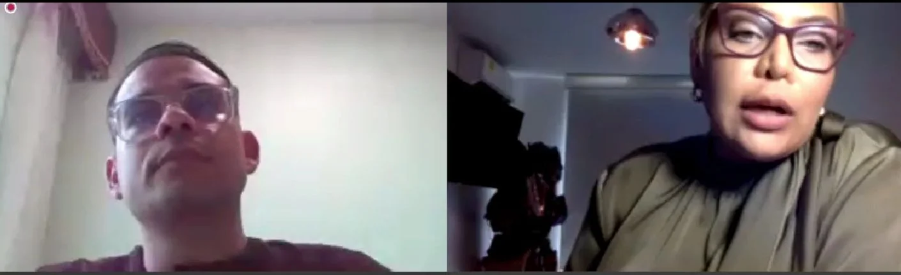
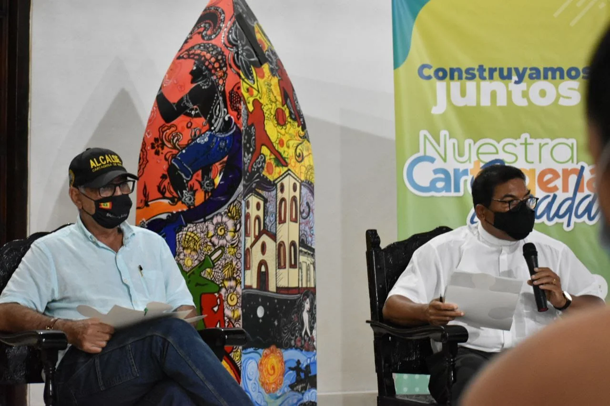

*Señor Juez Guido Guevara Herrera, 11 Penal Municipal de Cartagena decidió reservar la audiencia pública.*

Señor Juez 11 Penal Municipal **Guido Guevara Herrera**: ¿Por qué vulneró el derecho a la información del periodismo? ¿Por qué expulsó de la audiencia pública **Caso Gloria Estrada** a **VoxPopuli Digital** que, desde los inicios de este caso, lo está cubriendo? ¿Acaso se extralimitó en su poder autonómico? ¿Por qué no manifestó y sustentó en la audiencia su calidad de reserva?

Sin duda, usted no le propuso medida alternativa al periodista para cubrir la audiencia por medio de la cual se estudia la solicitud de revocatoria de la medida de aseguramiento de la presidenta del concejo de Cartagena, **Gloria Estrada Benavides** y de sus acompañantes. De plano, vetó al periodista en la audiencia pública. En consecuencia, **incurrió en una violación de sus derechos a la libertad de información, de expresión y de prensa**.

/articulos/episode/3Ma5u4LaaYbUpywFDPlSFg?si=730051056cef497f

Señor Juez: ¿Por qué quiere silenciar a la prensa?

Su señoría, dado al principio de publicidad, según la Corte Constitucional, «**los medios de comunicación y la comunidad en general podrán acceder a las audiencias públicas»**. Salvo algunas excepciones que deben estar sujetas al principio de necesidad. Además, el juez debe demostrarlo, según lo dispuesto en el artículo 28 de la Ley 1712 de 2014. 

Excelentísimo juez, ¿cuál de las partes del proceso solicitó la reserva de la audiencia? Hasta donde supimos, no hubo nadie de los intervinientes de la vista pública que haya pedido la reserva de la misma. Por esta razón, **es necesario el pronunciamiento de la Procuraduría, la Defensoría del Pueblo y del mismo Consejo de la Judicatura**. La audiencia se reanudará este miércoles 18 de mayo 2022.

## La audiencia

*Señor Juez Guido Guevara (izq.) y Angélica María Berríos Navarro, abogada de Avelino Villamizar.*

Los días 12 y 16 se realizó la audiencia presidida por el Juzgado 11 Penal Municipal con Función de Control de Garantías a cargo de **Guido Guevara Herrera.** El objetivo de la vista pública era escuchar la solicitud de revocatoria de la medida de aseguramiento de los defensores, que encabeza Enrique del Río. Los tres implicados en el presunto hecho de tráfico de estupefacientes y porte ilegal de armas: **Gloria Estrada, Martín Barreto y Avelino Villamizar**. 

Dicha medida de aseguramiento la tomó el juez de garantía del 14 de enero, **Rubén Galarza.** No tuvo ningún miramiento para mandar a la cárcel a dos de los implicados e imponer medida de aseguramiento en detención domiciliaria a Gloria Estrada. 

> «**El relato fue muy sencillo del operativo del 14 de enero.** El fiscal fue muy preciso en la relación que hace de los imputados con los delitos de tráfico, fabricación o porte de estupefacientes, **debido a la actitud sospechosa que tuvieron en el momento de la detención**».

De manera, que en aquel entonces en el informe periodístico advertirnos 5 irregularidades en el operativo que ni la Fiscalía, la Procuraduría y el juez de garantía ¡no vieron! 〈Vea:[¿Chivo expiatorio o Narcocomplot contra Gloria Estrada? (II) **(16 de enero)**](/articulos/chivo-expiatorio-o-narcocomplot-contra-gloria-estrada-ii/)〉. Pero ni la Fiscalía, la Procuraduría y mucho menos el juez vieron alguna irregularidad. Si estos funcionarios hubiesen tenido una pizca de profesionalismo —para no decir humanismo— de seguro que no hubiesen cometido esa cadena de errores. ¿O acaso también estaban confabulados para este falso positivo? ¿Por qué la procuradora **Diana María Giraldo Ciro**, quien no tuvo vista para ver tan sola una de las 5 irregularidades que notó el periodista, apeló la medida de casa por cárcel concedida a Estrada, Barreto y Villamizar?

## Señor Juez ¿pretende silenciar a la prensa?

Señor Juez, usted sabe que las decisiones de los jueces son para acatarlas. Pero, al mismo tiempo, son controvertibles. Pero hay algo más. Algunas veces los jueces toman decisiones que son de hecho y no de derecho. Por ejemplo, **determinación de silenciar a VoxPopuli Digital** puede ser calificada de arbitraria. **Una vía de hecho**. ¿Pretende silenciar a la prensa?

Con un profesor de derecho constitucional, exmagistrado de la Corte Constitucional, doctor en derecho, **Alexei Julio Estrada**, aprendí en sus clases magistrales la importancia de la argumentación jurídica. Podéis tener las pruebas que saltan a la vista, pero si hay una ceguedad jurídica o interesada, la verdad jurídica nunca la podéis ver. Eso fue precisamente lo que le sucedió a los funcionarios judiciales que atendieron el caso del 14 de enero. ¿Fue descuido o premeditación?

## El derecho comparado

Para ilustrarnos un poco del derecho que tenemos los periodistas de publicitar una audiencia pública, vayamos al derecho comparado. Las cortes de derechos humanos y de derecho comparado sostienen:

> «Las limitaciones al principio de publicidad de las actuaciones penales deben analizarse a partir de los siguientes juicios, a saber: (i) legalidad, (ii) razonabilidad, (iii) necesidad y (iv) proporcionalidad».

Ahora bien. Veamos lo que dice la jurisprudencia de la  Corte Constitucional (**CC [SU141-20](/articulos/sentencias/2020/SU141-20.rtf)**) respeto a la adopción de medidas de reserva. Exige que los **jueces penales de control de garantías** deben considerar los siguientes criterios: .

> «(i) La medida restrictiva del principio de publicidad deberá estar fundada en una causal legal de reserva; (ii) Deberá perseguir un objetivo constitucionalmente imperioso; (iii) El juez deberá tener en cuenta, a su vez, el grado de afectación a las libertades de expresión, información y prensa, y, en particular, al derecho fundamental a obtener información sobre asuntos de interés público; (iv) El juez deberá analizar la existencia de medidas alternativas que permitan conjurar el “riesgo de afectación cierto y actual” (v) La solicitud de medidas restrictivas de la publicidad solo podrá ser presentada por las partes e intervinientes en el proceso penal».

## Juicios paralelos

*William Dau es un experto en el engaño y la manipulación. Señor Juez, este si hizo un juicio paralelo contra Gloria Estrada, víctima de un complot narcopolítico. Aquí lo vemos al lado del padre Rafael Castillo Torres hablando de Nuestra Cartagena Soñada ¿La del bochinche y la perversidad de los vencejos?*

Es cierto que algunas veces los medios de comunicación realizan juicios paralelos. Un ejemplo de ello fue este mismo caso. El pasado 14 de enero y sucesivo, los medios de comunicación jugaron un papel de juzgamiento contra la presidenta del concejo **Gloria Estrada**. El mismo alcalde **William Dau Chamat** realizó un juicio donde condenó a Gloria Estrada y demás procesados a quienes calificó de traquetos y  traficantes. 

Eso se llama «juicios paralelos». Para que no le quepa la menor duda —con todo respeto— agrego lo que dice la Corte Constitucional:

> «Aquel conjunto de informaciones y noticias, acompañadas de juicios de valor más o menos explícitos, difundidas durante un determinado periodo de tiempo en los medios de comunicación sobre un caso (…) Y cuya característica principal es que ‘se realiza una valoración social de las acciones sometidas a la investigación judicial, lo **que podría influir en la voluntad y opinión de los jueces**».

¿Acaso no fue un **juicio paralelo** lo que William Dau hizo desde su Facebook contra su archienemiga política **Gloria Estrada**, quien le ha hecho control político sobre el Programa de Alimentación Escolar (PAE), tercera edad y otras políticas sociales? El día que le dieron casa por cárcel a **Martín Barreto**, compañero sentimental de Gloria Estrada, el alcalde Dau salió chapeto y presuntamente drogado a oponerse a dicha decisión. ¿Juicio paralelo? ¿El juez restringió la audiencia de imposición de medida de aseguramiento? NO. Casi todos los medios de comunicación daban como responsables de los delitos a los procesados. ¿Quién alzó la voz para señalar la injusticia que se cometía?

## La petición

Mi querido juez, es tiempo de rectificar. De cierto, de cierto, con claridad se le dice que se la embarró. ¿De buena fé? Si, pudo ser. ¿Hay carencia de dolo? Si, pudo ser. ¿Hay ignorancia constitucional? Si, pudo ser. ¿Falta de formación profesional? Si, pudo ser.

Venerable juez penal y de garantías (que no es lo mismo), **Guido Guevara Herrera** , para ejercer el periodismo en el marco de las audiencias públicas, a los profesionales de la información no se les puede restringir el derecho a la libertad de expresión y de prensa. Existen excepciones que deben ser argumentadas y no solamente manifestadas. Con todo respeto le solicito encarecidamente que rectifique su decisión de limitar la participación de **VoxPopuli Digital** y del periodismo, en general.

/articulos/libertad-inmediata-pidio-defensa-de-gloria-estrada-todo-fue-un-complot/