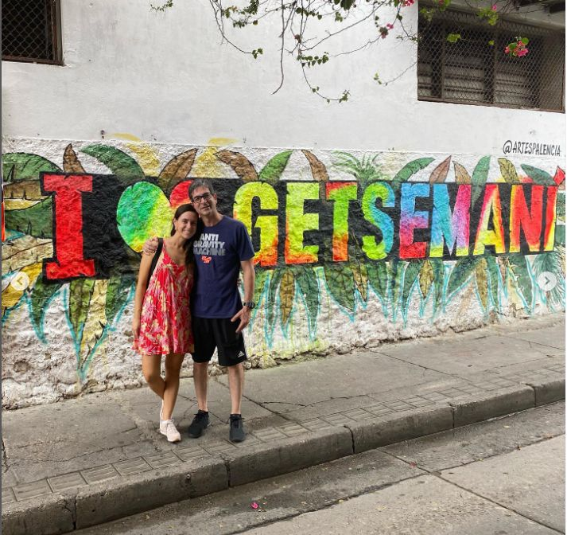
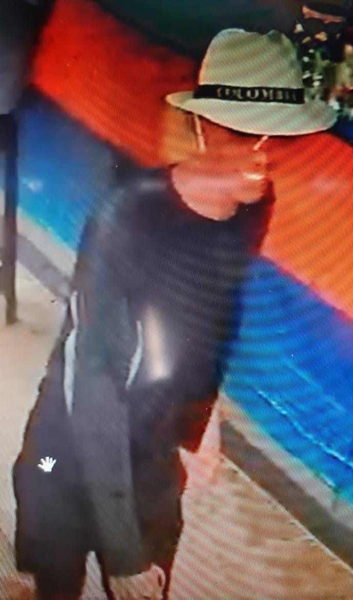

*En el centro, Marcelo Pecci con su esposa la periodista Claudia Aguilera. Cuatro días antes del sicariato en Decamerón. Cortesía Instagram.*

Cartagena de Indias lo tiene todo. Tiene playas de diferentes variedades. Islas exóticas donde puedes cumplir tus fantasías, incluso, las eróticas. Una ciudad antigua para encontrarte con la historia y con el amor de tu vida. Aquí está el ensueño que te puede dar la Riviera Maya. Pero cada día se está pareciendo a Acapulco. **Sicariato en Decamerón** —**donde murió el fiscal antimafia de Paraguay Marcelo Pecci— es el último capítulo de esta guerra transnacional contra el narcotráfico.**

En efecto, Cartagena se parece cada día más a Acapulco, la ciudad mexicana que saltó del paraíso al abismo del narcotráfico. Hoy puedes encontrar la muerte en un hotel 5 estrellas o en una chiva turística, como le sucedió el 7 de mayo al narco **Belisario Fidel Molina Brito. Todo indica que el sicariato en Decameron fue pagado por la mafia paraguaya a la mafia colombiana.** ¿Qué oficina de cobro lo hizo?

## Aguaita este video: El asesinato de Marcelo Pecci

https://youtu.be/5SfciguF2i8

Este es el video sobre la muerte de Marcelo Pecci. Sicariato en Decameron.

Sin embargo, existen otros interrogantes que hacernos. ¿Por qué el fiscal Pecci se vino a pasar la luna de miel en Colombia, madre de la mafia del narcotráfico de américa latina? ¿Por qué paseaba en Cartagena como Pedro por su casa sin ninguna protección? ¿Por qué la embajadora del Paraguay desconocía que estaba en Cartagena? ¿Acaso desconocían que Cartagena es escenario de una guerra entre el Clan El Golfo y el Cartel Jalisco Nueva Generación que usa estructuras colombianas por encargo? 

¿Las autoridades paraguayas no fueron advertidas de que esas estructuras ejecutan cualquier cobro y homicidio pagado por la mafia del narcotráfico y del lavado de activos de cualquier parte de América como Argentina, Uruguay, Paraguay, Brasil y Venezuela? Sencillo, con el asesinato del fiscal Marcelo Pecci estamos frente a un crimen transnacional de la mafia.

## Un asesinato transnacional

*Aquí en la Calle de la Sierpe, en el arrabal de Getsemaní, cuatro días antes del sicariato en Decamerón.*

Sin duda, una llamada de la mafia paraguaya a la mafia colombiana pudo activar la operación que terminó con el asesinato del director de la Unidad contra el Crimen Organizado. Como, en efecto, sucedió. Los sicarios pudieron tener el acompañamiento de algunos nativos que "trabajan" con bandas criminales u oficinas de cobro que operan en la ciudad. Es ciertamente conocido que ciertos nativos fueron reclutados ya en su calidad de motoristas, transportistas, bodegueros o sicarios en el tráfico de estupefacientes.

/articulos/episode/45IRov5pabACX5imqkHDeX?si=12428f0a18464f18

El asesinato del fiscal Marcelo Pecci fue un crimen trasnacional

Todo indica que el crimen fue ordenado desde Paraguay. Los autores intelectuales conocían los últimos pasos dados por la pareja de recién casados. El Fiscal libraba una dura batalla contra el lavado de activos procedentes del narcotráfico.

Efectivamente, los sicarios conocían a la perfección la manera cómo penetrar en las playas del hotel Decamerón Barú, donde no hay acceso para vendedores ambulantes ni personas particulares. Allí solo llegan turistas alojados y el personal de servicio y seguridad.

## Imágenes de un sicario

*Esta es una de las primeras imágenes de los sicarios que cometieron el sicariato en el Decamerón.*

Por esa razón, es clave la revisión de las cámaras de seguridad del hotel. Seguramente esta revisión producirá resultados positivos para identificar a los perpetradores de este asesinato de alto impacto. Al respecto, el director nacional de la policía, **general Jorge Luis Vargas**, **anunció que ya se tiene pistas de los autores del crimen**. Para ello comenzaron a difundir un volante con la imagen de unos de los sicarios vestido de turista. Tiene un sombrero de paja blanco con una cinta negra. Luce gafas para sol. Un buzo negro mangas largas de playa y sandalias de playa.  

Como se dijo, los sicarios alquilaron unas motos acuáticas que luego del homicidio dejaron abandonadas. Debieron tener una lancha rápida que los evacuaran hasta tomar un medio terrestre. Es muy probable que varios de los que participaron en el crimen se encuentren escondidos en algún lugar de la isla de Barú.

Por otra parte, el general Jorge Luis Vargas, dijo:

> "Hemos hablado con autoridades de Estados Unidos para que también se integren al equipo investigativo y llevar a los responsables ante la justicia. **Ya tenemos informaciones que están siendo recolectadas en los actos urgentes, que son de carácter reservado**, todas las capacidades de la policía y la Fiscalía están puestas en el esclarecimiento de este lamentable homicidio”.

## **Sicariato en Decamerón**, una mirada a Cartagena

La muerte del fiscal paraguayo podría servir para que el **presidente Iván Duque**, el gobierno central, la Fiscalía, la Policía Nacional y la Procuraduría le pongan atención a Cartagena de Indias. Prácticamente estamos en poder de la mafia del narcotráfico.

Como se sabe, **el general Vargas y el fiscal Francisco Barbosa**, manifestaron que pusieron funcionarios e investigadores para esclarecer este crimen transnacional. En la investigación también participan agentes de la DEA. De la misma manera se podría solicitar al presidente, a la Fiscalía y a la Policía Nacional para que se conforme un comité especial que permita dar con los determinadores de la guerra que vienen desatando las bandas criminales en la ciudad.

Finalmente, vale la pena preguntarnos si Cartagena de Indias, Patrimonio de la Humanidad, se convertirá en una Acapulco que está en poder de las mafias del narcotráfico. Estás las condiciones políticas y materiales para que ello se produzca, salvo que las autoridades nacionales asuman el liderazgo para combatir el crimen organizado. Un crimen que ha desbordado por completo la incapacidad de un gobernante local (William Dau). **Es un alcalde —sin lugar a equívocos— que brilla por su mediocridad.  ¡SOS Cartagena!**

[La extradición de «Otoniel» y el paro armado ¿qué significado tienen?](/articulos/la-extradicion-de-otoniel-y-el-paro-armado-que-significado-tiene/)