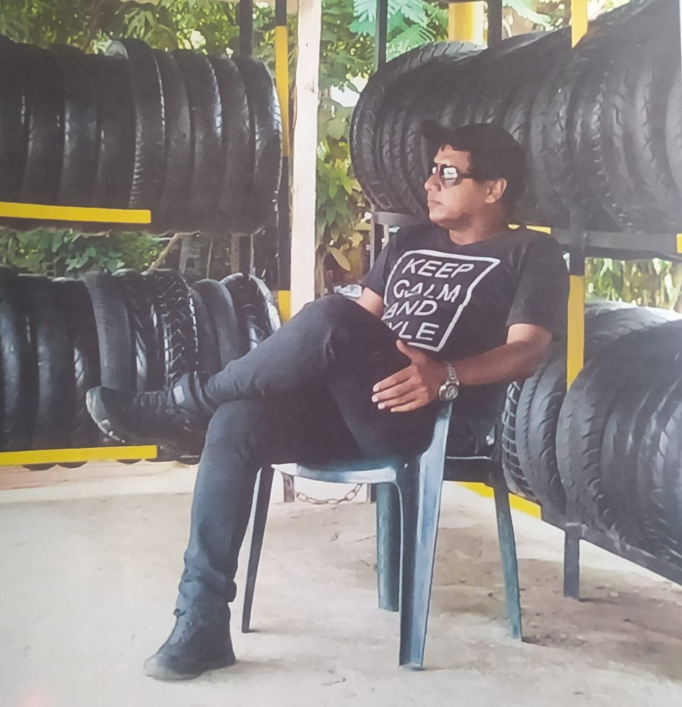

El empresario y comerciante **Álvaro Barrios Díaz** no es alias "el abogado". Precisamente luego de que la policía le solicitara antecedentes, se presentó en la Sijin el 25 de agosto del 2021 acompañado de varios de sus hermanos. Pero se encontró que tenía una orden de captura sindicado de ser del **Clan del Golfo.** Familiares y personas particulares que lo conocen, manifestaron a **VoxPopuli Digital** que es víctima de un **falso positivo** de la Policía y de la Fiscalía.

*Alias "el Abogado", ¿un falso positivo? Álvaro Barrios Díaz es reconocido como un comerciante que ha luchado contra la extorsión. Así lo presentó la Policía en el mes de septiembre de 2021.*

Es un complot, argumentan. Según los familiares, **existe material probatorio demostrado en el proceso que hay falsos testigos** que llevaron a las autoridades a un error judicial en perjuicio de sus derechos fundamentales y de su propia familia. Su captura no se produjo en ningún operativo.

Se debe recordar que el 25 de agosto de 2021, Barrios Díaz se presentó en la sede de la SIJIN para averiguar sobre una anotación aparecida en el sistema de esa entidad. Siguió el precepto según el cual **_el que nada debe, nada teme_**. Entró con dos de sus hermanos. Pero la policía lo detuvo debido a una orden judicial tramitada por la **Fiscalía** seccional.

## **El comienzo: “el Abogado”**

*Álvaro Barrios Díaz en uno de sus negocios en Cartagena. Lejos de ser el alias "el Abogado".*

Sin embargo, lo curioso es que la Policía y la Fiscalía mantuvieron en silencio dicha detención. A la semana siguiente, la Policía lo presentó a los medios de comunicación a través de una foto con el alias de “el Abogado”. Estaba en medio de dos policías con chalecos antibala. Lucía camiseta azul oscuro y jean azul rey.

En esas circunstancias, comenzó el drama, no solo para el empresario, sino también para toda su familia. La situación se le complicó debido a que la Policía lo presentó como integrante del Clan del Golfo. Este mismo medio, cuando el 5 de marzo de 2022 reseñaba la guerra de los **_Salsas Mexicanos_** contra facciones del Clan, retomó la información de la policía y de la Fiscalía. Esta situación llevó a la familia Barrios a una estado de riesgos y de zozobra. Hecho que nos obliga aclarar su situación, ya que en Colombia nadie es culpable hasta cuando se le demuestre lo contrario.

## **Un emprendedor nato**

Existen muchas evidencias que apuntan a señalar que Barrios Díaz es un destacado emprendedor, empresario reconocido y un comerciante de éxito. Los que lo conocen, por ejemplo, señalan que es muy distinguido en el ámbito del comercio y de la seguridad de los comerciantes víctimas de la extorsión y de la inseguridad.

Creó una red de almacenes, lavaderos y montallantas en diferentes partes del Caribe, especialmente en Cartagena. Con esta actividad generó empleo y dinamizó la economía local, ya que emplea personas de estrato 1 y 2. Especialmente, jóvenes en riesgos con el fin de resocializarlos. Por ejemplo, impulsó un proyecto de resocialización con las pandillas de los barrios Boston y Líbano. Es el caso de “Los panelas” que fueron objetos de esta campaña con el acompañamiento de la Policía Nacional-CAI La Esperanza.

En materia comercial, se le conoce como un habilidoso negociante dentro de los parámetros legales y aceptados del comercio.  De acuerdo con la conversación sostenida con uno de sus familiares, Barrios Díaz ha acumulado sus ganancias en forma legal. Nunca ha comprometido su patrimonio con actividades ilícitas. Tal vez por esta razón -manifiestan su familiares- algunos que se sintieron afectados por la rectitud de sus actividades, **le tendieron una trampa con mentiras que la Fiscalía ha utilizado para perseguirlo.**

## **Lucha contra la extorsión**

De igual manera, se le conoce en el ámbito de la seguridad. En la actividad comercial se dio cuenta que del 2012 al 2013 los comerciantes de la periferia de Cartagena eran víctimas de la extorsión. Cualquier negocio en los barrios de la ciudad debían pagar la famosa **“vacuna”** a grupos armados que muchas veces delinquen desde las cárceles.

Precisamente, algunas evidencias indican que en 2013 **Álvaro Barrios Díaz** tuvo un serio percance con el comandante del GAULA y el jefe de inteligencia de la época.  Al indagar sobre este hecho, nos encontramos con evidencias (videos y testimonios) donde, el hoy sindicado y detenido, había apoyado al GAULA sobre un caso de extorsión en flagrancia. Fue una detención ciudadana de un presunto delincuente. Lo capturaron luego de recibir el dinero producto de la extorsión. La molestia de Barrios Díaz se derivó de la falta de diligencia y de efectividad del Gaula y del cuadrante de la Policía Nacional para detener al capturado. La idea era que la captura no se declarara ilegal, ya que los comerciantes estaban cansados de tanta extorsión.

En ese sentido, su experiencia en el servicio social, lo recuerdan como el activista que estaba pendiente -no solo de su seguridad- sino también de los comerciantes, en general. Promovió el auto cuidado y la seguridad comunitaria.

## Barrios Díaz no es "el abogado"

¿Por qué esta obsesión de Barrios Díaz por la seguridad? No es una obsesión sino una necesidad para la defensa de los comerciantes, tal como él mismo se lo manifestaba. Barrios sufrió en carne propia el flagelo de la extorsión y la falta de seguridad ciudadana. Dado a la frustración con la justicia local, esto lo llevó en 2013 a presentar una solicitud al presidente de la república, **Juan Manuel Santos**, donde le pedía garantías a la vida de los comerciantes. Puso como ejemplo, la extorsión sufrida a manos de los grupos armados.

El 6 de julio 2017 nuevamente presentó una denuncia pública ante el presidente de la república **Juan Manuel Santos Calderón.** En ella manifestó que era objeto de persecución por parte de la SIJIN, Gaula y de algunos cuadrantes de la Policía Nacional. Todo esto a pesar de haber colaborado en combatir el delito de extorsión con el apoyo de comerciantes afectados. Solicitó garantías para el ejercicio del comercio libre en Cartagena.

Posteriormente el 20 de abril de 2018 le reiteró al presidente que interviniera en el caso de Cartagena. También lo hizo en noviembre de 2021 ante el presidente Iván Duque. Asimismo, dirigió la denuncia ante Francisco Barbosa, fiscal general.

De hecho, algunos comerciantes estiman que Barrios Díaz no tiene nada que ver con el crimen organizado ni mucho menos es jefe del Clan del Golfo, como falsamente se le ha sindicado. Su historia se ha caracterizado por solicitarle a las autoridades locales y nacionales garantías para el ejercicio de su actividad comercial legal.