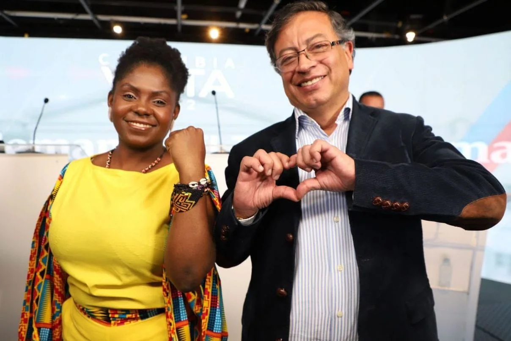

*Presidencia de izquierda. La fórmula presidencial Gustavo Petro y Francia Márquez.*

El economista **Gustavo Petro Urrego**, 62 años, **recibió el 63% del voto Caribe**. Será la primera presidencia de izquierda. Obtuvo el **50,47%** para un total de 11.277.905 votos frente al **47,28%** (10.565.106 votos). Con esta votación Petro se convirtió en el primer mandatario del siglo XX nacido en la Costa Caribe. En tanto, **Francia Márquez** es la primera vicepresidenta negra del país. Fue una derrota de las maquinarias.

En su tercer intento de lograr la primera magistratura ¡por fin! Lo logró en esta oportunidad con una votación que superó los pronósticos de algunas encuestas que señalaba un **voto-finish**. Quiere decir que en la última semana la campaña de su contrario **Rodolfo Hernández** defeccionó. Finalmente cedió. Le dio paso a la aplanadora petrista. La diferencia fue de 3 puntos. Pero suficiente para tener una ventaja superior a los 700 mil votos.

## ¿Un cambio?

No será el cambio que las mayorías nacionales esperan. Pero esperamos un gobierno de transición democrática para superar el **régimen neobonapartista dominante**. Por ejemplo, que le dé cumplimiento a los acuerdos de paz, que mejore las relaciones exteriores con los países vecinos y lidere un proceso regional de confianza internacional.

Podremos tener una mejoría en los derechos económicos y sociales. En salud y pensión habrá modificaciones, pero no sustantivas. Se mejorará en materia de corrupción, pero la estructura que la produce se mantendrá. Crecerá el gasto estatal. Muchas de las promesas de Petro solo son posibles por la vía presupuesto oficial.

En materia de derechos humanos tendremos mejoría. Pero los grupos armados tendrán una mayor actividad. Aquí jugará un papel importante la propuesta del nuevo presidente de reducir la mafia del narcotráfico.

El nuevo preside de los colombianos debe depurar los organismos de control. La Contraloría, Procuraduría, Defensoría del Pueblo y la Fiscalía deben ser reformadas junto con la Policía.

## ¡Presidencia de izquierda!

https://youtu.be/9pjxSpjkXOA

## Pacto Histórico, ¿presidencia de izquierda?

La ventaja estratégica de Gustavo Petro se debió a que estaba respaldado por una coalición política de una vasta experiencia electoral. Una parte del sistema político dominante lo acompañaba en esta dura tarea hacia la presidencia de la República. No es gratuito que su jefe de debate, **Fernando Prada**, es un alfil del santismo-samperismo. O que **Armando Benedetti, Roy Barreras** representen a sectores de la oligarquía tradicional.

Gustavo Petro realmente representa una coalición de diferentes colores políticos que van desde la **derecha samperista-santista** hasta la extrema izquierda de los desmovilizados de las antiguas FARC. No es una coalición de izquierda en el sentido estricto. Representa el anhelo, el sueño de millones de colombianos que esperan un verdadero cambio en estos **200 años de vida republicana**.

Las expectativas del triunfo de Petro son enormes, especialmente en los sectores sindicales y populares del país acostumbrado a perder. Grandes sectores sociales marginados del poder estarán a la expectativa de lo que pueda hacer en los primeros 100 días de mandato del Pacto Histórico.

## Primera vicepresidenta negra

La victoria del Pacto Histórico también significa la primera vicepresidenta negra que tiene Colombia. Francia Márquez será la esperanza de una población marginada por el desarrollo centralista. No es gratuito que las dos costas que tiene el territorio nacional apoyaran mayoritariamente a Gustavo Petro.

La población negra colombiana y, en especial de la Costa Caribe y del Chocó, le entregaron el respaldo a Petro, quien tiene como fórmula vicepresidencial a una activista social del Cauca. Esta victoria también es percibida como una esperanza para una población históricamente desplazada del poder central.

Empieza nuevos tiempos para Colombia. Es un halo de esperanza después de tantas frustraciones en estos casi dos siglos de vida republicana. Pero la victoria se debe tomar también con reserva, ya que las grandes reformas sociales y políticas esperadas no se van a ejecutar en estos 4 años de gobierno de Petro. Es un triunfo que los colombianos debemos celebrar, pero sobre todo, respaldar a un presidente que hizo todo por llegar al cargo donde hoy se encuentra.