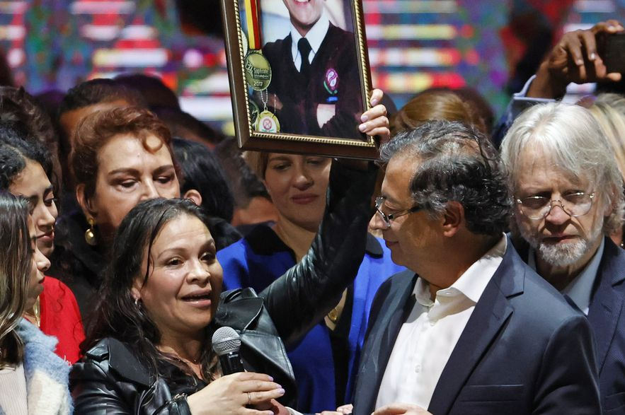

https://youtu.be/hU-2MMNjQ5A

¿Y ahora qué? ¿Cuáles son las señales de Petro? Con la victoria de Gustavo Petro vendrán —sin duda— transformaciones dentro del mapa del poder político. No tanto como desearíamos. No tanto como muchos estamos esperando. Pero, podría llegar el **fin del régimen neobonapartista**. Si el Pacto Histórico realiza un **gobierno de transición** para un nuevo régimen gubernamental, le daremos un adiós al régimen dominante que combinó todas las formas de lucha. Pero no será el fin del uribismo.

Por el contrario, si el Pacto Histórico fracasa en lograr el cambio que prometió y la opinión pública lo percibe así, no solo el país sufrirá el golpe sino que también se acabará el **"mito Petro"**. Lo que el movimiento popular debe asegurar es que la nación no regrese al viejo régimen y a la polarización **uribismo o petrismo**. Es más, el país debe salir de esa trampa política de un falso dilema: izquierda y derecha.

Sin equivocarse, **las primeras señales de Petro** indican que en política internacional habrá un cambio de rumbo. Se romperá un período político sellado por una enemistad con nuestros vecinos. En política interna, la institucionalidad comenzará a recobrar su propia dinámica sin la interferencia descarada del jefe de Estado. Los sectores oligárquicos democráticos —liderados por el samperismo y el santismo— recobrarán su lugar en el poder político central sin las alianzas incómodas con los actores emergentes dominantes que caracterizaron a este período político. Actores emergentes ligados a la economía del narcotráfico, de la guerra y la corrupción.

## Las primeras señales de Petro

/articulos/episode/48qS6gdka57Sz5GydxiVAh?si=5e95195ac9844f26

El hablar con **Joe Biden** y recibir el apoyo de éste, por un lado, y, por el otro, recibir la felicitación de **Vladimir Putín y Nicolás Maduro**, son buenas señales de Petro para una relativa independencia en política exterior. La llamada al gobierno venezolano para que se reactiven las fronteras es también una señal de que algo cambiará en la relación colombo-venezolana dinamitada por intereses dictados desde Washington.

Esas señales quedaron evidenciadas en su discurso de victoria del 19 de junio. Pero también quedó traslúcida la tensión que marcará el gobierno de Petro: la amenaza de someter a los otros poderes públicos. **Es la misma tentación que tienen gobernantes de corte autoritario que, como Uribe, impuso su impronta totalitaria**.

Una de las señales que más se espera es la configuración de su gabinete ministerial. De hecho, el poder empresarial está a la expectativa del nuevo equipo económico, empezando por el ministro de Hacienda. Esta sería la señal que podría tranquilizar o intranquilizar a los gremios económicos. Al respecto, el presidente electo dejó una señal ante los medios de comunicación. Hay un abanico de economistas que perfilará su propuesta económica.

Todo hace indicar que el próximo ministro de Hacienda sea de una **línea neo cepalina** que busca estimular, proteger e impulsar la industrialización nacional mediante medidas proteccionistas. Quien mejor se encaja en esta concepción son economistas como **José Antonio Ocampo, Alejandro Gaviria**, entre otros mencionados por Petro. Pertenecen a la escuela de economía de la Universidad de Los Andes.

## ¿Fin del régimen?

*En la tarima del triunfo. Las señales de Petro.*

El gobierno de Petro no abriría un período político nuevo. Pero sí marcaría las condiciones para que un próximo gobierno desarrolle una nueva arquitectura política y social de Colombia. La propuesta de gobierno de Petro es ambiciosa para su capacidad política. Abarca mucho, pero no podría cumplir con todas las promesas electorales. Será un gobierno social—democrático semejante a la gestión de la **Bogotá Humana**. Se parecerá al segundo mandato de Juan Manuel Santos o al gobierno de Ernesto Samper. Santos encontró en Chávez un nuevo mejor amigo. En agosto de 2010 restableció las relaciones diplomáticas con Venezuela. Lo mismo que hoy Petro está haciendo con Maduro. Y se espera el abrazo con Uribe.

El llamar al **Acuerdo Nacional al expresidente Álvaro Uribe** nos hace pensar que Petro quiere neutralizar el poder destructor del Uribismo. La correspondencia de ese llamado implicaría que le respeten algunas de sus "conquistas" en el poder institucional. Así se garantiza la existencia del uribismo.

/articulos/petrogustavo/status/1540316552830111746?s=20&t=0DOV7eN\_yRu0oYN4TQ2tRw

## Petro y el acuerdo en lo fundamental

El presidente Petro busca un consenso parlamentario, político y social. El primero y segundo lo puede lograr sin problemas. Pero el tercero es el más difícil. En este sentido debe aterrizar su programa de gobierno para que sea financiable, ejecutable y produzca el salto cualitativo que todos esperamos. Este plan de desarrollo lo debe ajustar a la realidad fiscal del país. O, al contrario, ajustar la realidad fiscal a sus aspiraciones programáticas. Esto implicaría estructurar una reforma tributaria que no caiga en los desaciertos de aquella que intentó imponer el presidente Duque. Pero, fue derrotada por el movimiento social colombiano en 2021.

Sin embargo, Petro debe construir un **consenso legislativo** para que sus principales iniciativas sean procesadas y aprobadas. Esto implicaría también diseñar una **política de gobernabilidad** con los diferentes sectores de poder del país. Las principales decisiones políticas y económicas que debe asumir el presidente Petro inevitablemente producirán afectaciones de los intereses dominantes. Esta gobernabilidad la debe construir por arriba y por abajo. Si no lo hace, tarde o temprano uno de los bloques se le irá encima.

## ¿Cambio de rumbo?

¿El programa de gobierno de Gustavo Petro es realizable dentro de las estructuras políticas y económicas dominantes? Es posible que la mayor parte de sus propuestas no se puedan realizar si no hace sensibles concesiones a los actores estratégicos del poder tradicional.

Por ejemplo, para la aprobación de su plan de desarrollo debe contar con las mayorías del congreso. El Pacto Histórico totaliza un 20% del senado. Se sumarían las bancadas de la coalición Centro Esperanza, el Partido Liberal y la U, antiguo partido del próximo presidente del congreso Roy Barreras.

Para construir una mayoría legislativa, Petro apelará a otros mecanismos ya conocidos por el p_aís político._ Por ejemplo, la _mermelada_ presupuestaria, o los **cupos indicativos**, que es lo mismo. Si no lo hace, debe enfrentarse a las mayorías y correr el riesgo de no poder sacar adelante sus importantes iniciativas.

## Frágil gobernabilidad

El presidente Petro busca en estos momentos resolver un problema evidente: la falta de gobernabilidad. El hecho de que no haya obtenido una mayoría amplia sobre su contendor **Rodolfo Hernández**, refleja una potencial fragilidad de su gobernabilidad. Esta fragilidad la puede suplir con su propuesta de Acuerdo Nacional, incluyendo a todas las fuerzas que respondan a su llamado político.

Como en Colombia tenemos un régimen presidencialista, Petro tiene las posibilidades de sacar adelante sus iniciativas **arrodillando al congreso a través de la mermelada**. Todo indica que utilizará los mismos mecanismos usados por los anteriores presidentes durante el **período neobonapartista**. Es muy probable que Roy Barreras termine siendo el presidente del congreso el próximo 20 de julio. Su misión será crear esa mayoría legislativa endulzando a sus antiguos compañeros. ¿Lo podrá lograr? Incluso, parlamentarios de Cambio Radical y algunos conservadores se sumarán en esas nuevas mayorías parlamentarias.

Pero ¡atención! el grave peligro de construir una gobernabilidad mediante la mermelada es que la puede corromper, ya que el mandatario queda secuestrado al sistema dominante. Entonces sería una gobernabilidad precaria que necesitaría de la organización ciudadana y del movimiento social para sostenerse en el poder. En el caso de Uribe Vélez la gobernabilidad la alcanzó mediante el concepto de estado comunitario y estado de opinión. Pero debió someter al congreso usando la mermelada.

## Las señales de Petro: ¿El cambio?

En el campo de la teoría, el poder es la “habilidad o la capacidad de hacer que sucedan cosas” (Bertrand Rusell). Es decir, dar resultados. ¿Qué resultados quiere el presidente Petro si está utilizando los mismos métodos que los gobernantes anteriores han usado? ¿No podría quedar atrapado en los medios que está usando para ejercer el poder?

Dentro de nuestra historia política, nos encontramos con el gobierno de **Alfonso López Michelsen** (1974-1978), de quien se esperaba las grandes reformas represadas por el Frente Nacional. Recordemos que esta forma de poder fue el resultado de un acuerdo nacional entre la oligarquía liberal y conservadora. Pero no sucedió lo que el pueblo liberal y progresista de la época esperaba. La concentración del poder político en una oligarquía liberal con el apoyo del conservatismo y de fuerzas de derecha ligadas a la economía emergente, se mantuvieron. La inflación y los precios de los servicios públicos aumentaron. El salario real de los trabajadores disminuyó. Vino el caos social y el Paro Cívico en 1977.

Lo que se espera es que el Pacto Histórico y el Acuerdo Nacional haga de Colombia un país democrático y, al mismo tiempo, mejore la calidad de vida de las mayorías. Satisfaga las reclamaciones del Paro Nacional de 2021. Pero la legitimación del poder conseguida artificialmente produce efectos contrarios a lo esperado por el mandatario de turno.

La tarea fundamental del presidente Petro es **liderar la terminación del régimen neobonapartis**ta con un **programa de transición** que prepare las condiciones para ulteriores gobiernos transformadores. ¿Cuántos gobiernos se necesitan para la transición hacia una Colombia en paz, democrática y próspera? No se sabe con precisión. Pero de lo que se está seguro es que los procesos sufren cambios cualitativos y cuantitativos en períodos cortos o largos, dependiendo la legitimidad del poder. Si este poder es legítimo, esos cambios a niveles superiores se hacen irreversibles. ¿Con el Acuerdo Nacional el presidente Petro alcanzará la legitimidad de su poder?