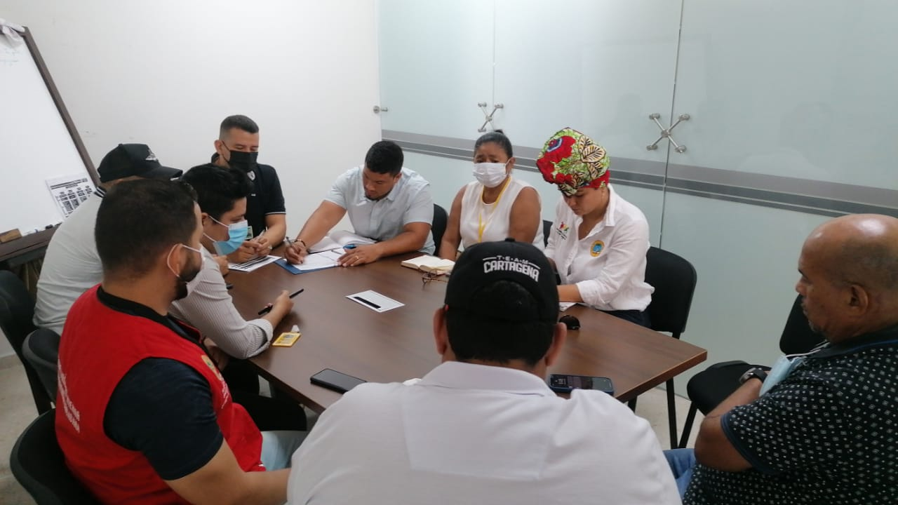

*El periodismo amenazado. Los periodistas carlos Figueroa y Germán Terán en reunión con la Secretaria del Interior, Paola Pianeta y otros funcionarios del Distrito de Cartagena el pasado 10 de junio 2022.*

¿Por qué el periodismo en Cartagena está amenazado? **Germán Terán y Carlos Figueroa** se suman a los periodistas amenazados. Quien suscribe este escrito, por ejemplo, está siendo amenazado por fuerzas que se amparan en el anonimato. Es una situación que se viene agravando debido al contexto de inseguridad que vive la ciudad.  

Además, la situación de seguridad de los periodistas se complica **debido al tratamiento que el alcalde William Dau Chamat le viene dando a la prensa local.** Es frecuente la forma violenta y perversa de cómo el burgomaestre se refiere a los periodistas que no le acolitan su conducta poco decorosa. Incluso, insulta a los periodistas que no se dejan contaminar por su comportamiento manipulador.

## ASÍ AMENAZARON A LOS PERIODISTAS. ¡MÍRALO!

https://youtu.be/MvcDNvaof6c

Los periodistas amenazados. El periodismo amenazado.

## Conducta del alcalde agrava amenazas

El hecho de que el alcalde agreda a los periodistas es un agravante. Tratar de periodistas de estómago, periodistas malandrines es una pretensión de mordaza con la libertad de expresión. Esta reiterada conducta hostil se convierte en una sistemática persecución contra el periodismo libre e independiente.

En ese sentido, la manera cómo el alcalde trata a los periodistas —que no son de su círculo de poder— agrava las condiciones del ejercicio del periodismo. VoxPopuli digital es víctima de la persecución del alcalde. Sabemos que las amenazas interfieren el libre ejercicio de esta profesión. Es un atentado contra la integridad de los periodistas. Por tanto, contra la democracia, la libertad de expresión y el derecho de ejercer una profesión libre. 

## ¡Escucha las amenazas!

/articulos/episode/5wm48MajwdVvVz23NRpnHq?si=83e2b4cce02f4ba0

Puedes escuchar el análisis

Algunas organizaciones para la defensa de la libertad de prensa del país, como es el caso de la **FLIP**, se han manifestado de diferentes formas por el incremento de las amenazas contra el gremio. Entre enero y mayo de 2022 esa organización tiene registrado 97 amenazas contra periodistas y medios de comunicación. Esto hechos se incrementaron durante el paro armado del Clan del Golfo, especialmente en los departamentos donde opera esta organización criminal.

## Amenazas contra Figueroa y Terán

https://twitter.com/FLIP\_org/status/1530704976762310658?s=20&t=0Bh8CLPOIRPXbu3oUG8PDQ

El periodista Carlos Figueroa, director de **Ideas Política**s es una de las víctimas de estas amenazas. Lo que le preocupa es la falta de diligencia del Estado para articular los mecanismo de protección del periodista amenazado. Las investigaciones en la Fiscalía poco avanzan, lo cual desanima a las mismas víctimas.

El martes 7 de junio, cuando estaba al aire en su noticiero La Verdad y Punto, Germán Terán recibió la amenaza de un presunto individuo que dijo ser segundo al mando del Clan el Golfo. Fue una llamada intimidatoria.

Ante esa situación, la Secretaría del Interior del Distrito activó la ruta de protección y se reunió con los comunicadores sociales para escuchar y tomar las medidas de autoprotección.

## Tatiana Tatis

*Tatiana Tatis, comunicadora social-periodista antes de la pandemia había sido amenazada.*

De igual manera, también la periodista Tatiana Tatis había sido amenazada por un desconocido. Ella dijo a la prensa local, en su momento, que un individuo la citó:

> “Me entregó datos de mi vida y me dijo que era sicario pero que no quería hacerme daño porque ya estaba cambiando. Luego insistió en que publicara en mis redes que él me había robado para que las personas que lo habían mandado no le hicieran daño”.

## El periodismo amenazado

https://youtu.be/HrY3KQLgzR0

Si el alcalde es el principal enemigo de la prensa ¿qué se espera de las bandas criminales? Periodismo Amenazado.

Tener un periodismo amenazado es tener a un país de rodillas. El periodismo debe ser una manifestación libre de toda atadura. Las amenazas de muerte buscan silenciar a los periodistas y a la prensa en general.

Por esa razón, el Estado debe garantizar a los periodistas el libre ejercicio de su profesión. En este aspecto se le debe reconocer el derecho fundamental a la seguridad personal de todos los periodistas del país. Es una protección con rango constitucional y se deriva del deber elemental, en cabeza de las autoridades, **de proteger la vida, la integridad y la tranquilidad de las personas.** Tal como lo señala la propia Corte Constitucional en su jurisprudencia sobre las amenazas de muerte.