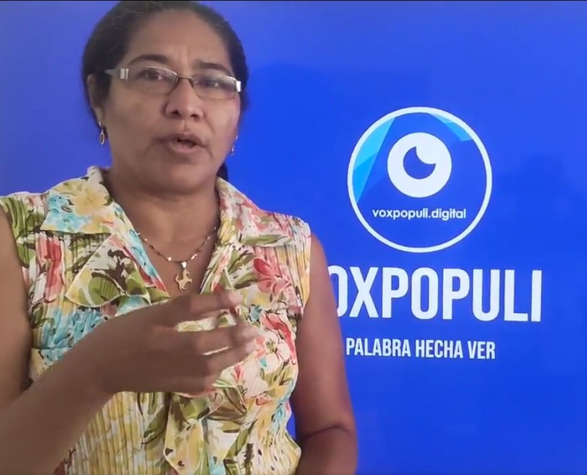

*Admiten Acción Popular contra Transcaribe por alta accidentalidad presentada por Claudia Patricia Rada cabarcas.*

**El Juzgado Administrativo Oral No 07 de Cartagena** admite acción popular para la defensa de los derechos colectivos que presuntamente está violando Transcaribe. Existe un alto grado de accidentalidad en su servicio. La iniciativa fue presentada por la ciudadana **Claudia Rada González**.

Por tanto, la acción constitucional contra TRANSCARIBE S.A. realice las obras necesarias para evitar la alta accidentalidad. Esta situación afecta los derechos colectivos de la ciudadanía. Este hecho que se viene presentando con frecuencia en Cartagena y que tiene relación con sus buses articulados.

## Las pretensiones de la demanda

/articulos/luciotorres/status/1549403312201539589?s=20&t=\_zyAZITr0wdLsTmfdD5Rng

En ese sentido, la acción tiene las siguiente pretensiones:

*   Se expida o venda las tarjetas necesarias para el ingreso a las estaciones.
*   Para alcanzar esta meta, debe mejorar el servicio de recarga de la tarjetas digitales aumentando los puntos o servicios de recargas.
*   Que se le pague los incentivos establecidos de esta Acción Popular vía jurisprudencia del Consejo de Estado.
*   Que se dicte sentencia favorable y que se condene al pago de la costa y la agencia en derecho de acuerdo al código general del proceso.

## La acción popular contra Transcaribe

Por esa razón, con el objetivo de que la comunidad se entere de la providencia del juez Moreno publicamos esta providencia. El enlace de la admisión de la Acción Popular para que cualquier ciudadano la pueda leer. (**Admisión de Acción Popular contra Transcaribe**):

[ADMITE-ACCION-POPULAR-2022](/wp-content/uploads/2022/07/ADMITE-ACCION-POPULAR-2022.pdf)[Descarga](/wp-content/uploads/2022/07/ADMITE-ACCION-POPULAR-2022.pdf)

## Alta accidentalidad de Transcaribe

**El juez Alfredo Moreno Díaz** en la parte resolutiva dijo:

> PRIMERO. –ADMITIR la demanda presentada por (Claudia Patricia Rada cabarcas), actuando en nombre propio, contra el SIMT TRANSCARIBE S.A en ejercicio del medio de control de protección de los derechos e intereses colectivos, por lo motivos expuestos en la parte considerativa de esta providencia.

> QUINTO. - Infórmese a los miembros de la comunidad a través de un medio masivo de comunicación, o de cualquier otro medio eficaz, de la existencia de esta acción popular, habida cuenta de los eventuales beneficiarios. Esta obligación se encuentra a cargo del accionante y es indispensable para el impulso de este proceso. Lo anterior, sin perjuicio que se utilice la  
> página web de la Rama Judicial