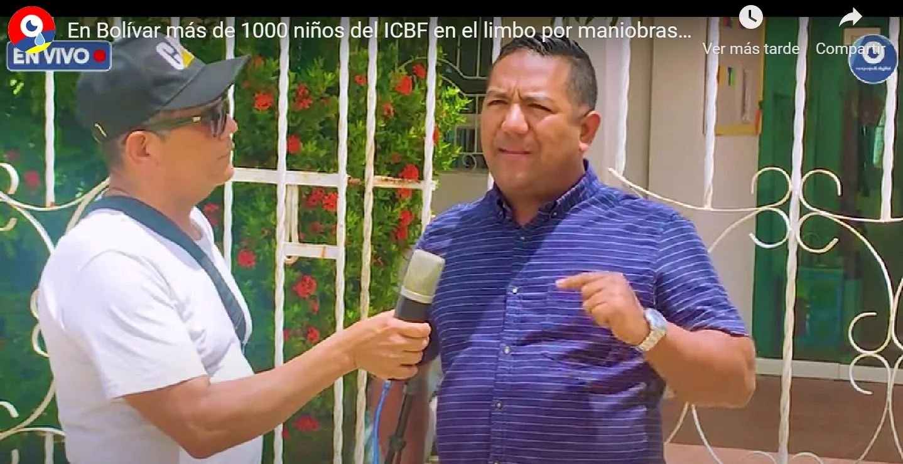

*¿BETTO, el legado de Abudinen para rifarse el dinero de los niños más pobres de Colombia?*

¿**Es el Betto el legado de Abudinen para rifarse $8,3 billones anuales? Es la lotería más grande** de Colombia para despedazar el presupuesto de la niñez y la adolescencia. En el Instituto Colombiano de Bienestar Familiar-ICBF están corriendo para cerrar la contratación general antes de que entre el nuevo gobierno de **Gustavo Petro**. Esta correndilla se percibe más en las regionales del Caribe, especialmente Atlántico y Bolívar. Es la percepción de la peor corrupción de esa institución.

En efecto, **Cambio Radical fue dueño y señor del ICBF** en Atlántico, Bolívar, Magdalena, La Guajira, entre otros. El senador **Arturo Char**, en Atlántico, se lo entregó a **Karen Abudinen**. La hoy exsenadora **Daira Galvis Méndez** se lo transfirió a la difunta **María del Socorro Bustamante**. Ésta, a su vez, hizo nombrar a Jorge Redondo Suárez, quien fuera diputado. Ahora está a la sombra del alcalde de El Carmen de Bolívar, **Carlos Torres Cohen**. **"Kiko" Gómez, de Cambio Radical**, (condenado a 40 años de cárcel) fue dueño de la regional de La Guajira. Los testimonios que tengo así lo ratifican.

https://youtu.be/nxknfhzIK5w

El presidente de Corpolucha, abogado Jair Caro, está realizando una investigación sobre la contratación del ICBF Regional Bolívar. Le haremos un acompañamiento a esa investigación de Corpolucha. ¿Es el BETTO el legado de Abudinen?

## El legado de Abudinen

Se puede decir, que los que están tras bambalina, ahora raspan el caldero del Bienestar. El presupuesto lo despedazan a dentelladas. Es un modelo de contratación perverso. Es contrata directa que solo funciona para el ICBF. Karen Abudinen lo perfeccionó con el BETTO para darle visos de transparencia. 〈Ver: **[¿El Betto, el nuevo Baloto de la corrupción en el ICBF? (I)](/articulos/el-betto-pone-en-peligro-el-sistema-de-proteccion-infantil-del-icbf/)**〉

Tanto que lo trasplantó al ministerio de Tecnología de la Información y las Comunicaciones. Lo inauguró con la adjudicación de $ 1,07 billones con los contratos de Centros Poblados. Uno se lo entregaron a Claro, y el otro a la Unión Temporal Centros Poblados. Los dos contratos tuvieron el mismo corte. El segundo se cayó porque hubo un incumplimiento flagrante, después de haber recibido $70 mil millones, los cuales, hasta ahora, están perdidos.

Como periodistas hemos ventilado estos problemas de corrupción. Pero el entramado está dado para arreglar las investigaciones en la Fiscalía, la Procuraduría y la Contraloría. Por ejemplo, sobre la presunta corrupción en la época de **Jorge Redondo**, la Procuraduría fue incapaz de fallar contra él frente a hechos que pusimos en evidencia pública. En una de esas denuncias, la Procuraduría —según informe de [**El Universal de 2017**](/articulos/politica/procuraduria-absuelve-diputado-jorge-redondo-248165-JWEU358100#!)— concluyó:

> "Las presuntas irregularidades que habrían ocurrido en ese contrato, fueron denunciadas por el periodista y veedor **Edison Lucio Torres, y no solo salpicaron a Redondo sino al concejal Luis Cassiani** quien dirigió la cooperativa. Ambos servidores hacen parte del partido **Cambio Radical**.

## Lina tras el legado de Abudinen

La actual directora general, Lina María Arbeláez, sigue el legado de corrupción dejado por Karen Abudinen en su paso por la institución. Es verdad esta aseveración. Los papelitos y las cifras de Bienestar no mienten. Desde 2009, se fue creando uno de los nidos de corrupción más grande de la institucionalidad colombiana. Desde que el gobierno nacional obligatoriamente debía inyectar de recursos al ICBF, los políticos se comenzaron a interesar por la institución. (Ver: **[En peligro $2.124 millones del ICBF por el “Cartel de la Experiencia»](http://En peligro $2.124 millones del ICBF por el “Cartel de la Experiencia»)**)

Durante el período **2014 al 2022** (cuatro años de Santos y cuatro de Duque) saquearon al Bienestar. Volvieron añicos un presupuesto total de aproximadamente **$56 billones**. Seguramente la mitad de este dinero debió parar en las arcas de políticos y empresarios corruptos. Este robo es doblemente perverso, porque es dinero de la niñez y de la adolescencia más pobre del país. En este período el presupuesto anual del Bienestar saltó de $4,5 billones a $8,3 billones anuales. (**[Plan Indicativo Institucional 2019-2022](/articulos/system/files/plan_indicativo_institucional_-2019-2022.pdf))**.

https://fb.watch/epr4JlRjTt/

## Uribe, el cerebro

¿Por qué fue posible todo este saqueo de los niños más pobres del país? Gracias al acto legislativo No 1 de 2007 que el congreso de la República le aprobó al presidente de entonces, **Álvaro Uribe Vélez**. ¿Qué pretendió? Detener el proceso de descentralización de los recursos y, al mismo tiempo, darle la mermelada a los congresistas que le aprobaron sus proyectos regresivos.

> _“El situado fiscal aumentará anualmente hasta llegar a un porcentaje de los ingresos corrientes de la Nación que permita atender adecuadamente los servicios para los cuales está destinado”_ 

En ese sentido, la **Ley 60 de 1993** estableció que el porcentaje de las **transferencias fueran del 23%** de los ingresos corrientes de la Nación en 1994. A partir de **1997 aumentaran al 24,5%** y que su distribución se diera de acuerdo a la población atendida y por atender. Alcaldes y gobernadores entre 98 y 20001 recibieron un chorro de plata. Pero Pastrana y Uribe les cortaron ese chorro revirtiendo el mandato constitucional de la descentralización del sistema de participación de la tributación nacional.

## El legado de Uribe

De esa manera los territorios comenzaron a disminuir sus ingresos en vez de aumentarse. Así se menguaron las arcas regionales cuando la constitución de 1991 había determinado todo lo contrario. O sea, el dinero que Uribe aprobó para el ICBF simplemente vino a ser un dulce para los parlamentarios corruptos. Usaron un entramado de fundaciones que reemplazaron a las liquidadas asociaciones de padres de familia que funcionaron antes de la mentada reforma.

Con esa reforma constitucional del 2007, Uribe logró tres cosas que hoy estamos pagando con creces en los territorios.

**Uno**. Detuvo el proceso de descentralización de los recursos que debían incrementarse hasta el 24,5%. **Dos.** Como por ley debían incrementar los recursos para infancia y adolescencia, pusieron al ICBF a manejar esos recursos. Esto le permitió irrigar de dinero al entonces empobrecido Bienestar. **Tres.** Pero esto no lo hizo el gobierno por amor a los niños. Por el contrario, lo hicieron por amor al dinero. ¿Por qué? El ejecutivo para darle la mermelada a los congresistas que le votaron el acto legislativa y la consecuente ley, el ICBF se lo entregó a Cambio Radical, el Partido Conservador y Centro Democrático con el fin de repartir la mermelada a sus parlamentarios.

## Próxima entrega: Caso Bolívar y Sucre

*¿El legado de Abudinen? Jair Caro, de Corpolucha, es el abogado que está tras las presuntas irregularidades en el ICBF regional Bolívar.*

Vamos a hacer un estudio de caso. Miraremos la contratación de Bolívar. Buscaremos identificar los políticos que están tras bambalina. Se ampliarán las denuncias con nuevas evidencias ante la Fiscalía, la Procuraduría, la Contraloría y buscaremos el acompañamiento de la Defensoría del Pueblo.

Corpolucha, dirigida por el abogado Jair Caro, también se encuentra investigando estos presuntos casos de corrupción de la Regional Bolívar. Caro manifiesta que sus denuncias ante la Fiscalía las ampliará con nuevos materiales probatorios contundentes.

En Sucre y Cesar, igualmente miraremos cómo ha sido la contratación este año y señalaremos los presuntos actos de corrupción.