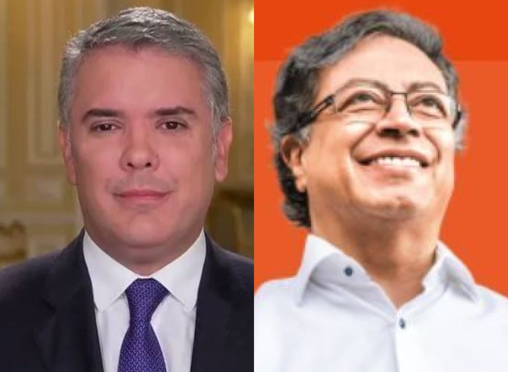

*Entre Iván Duque y Gustavo Petro está la corrección del proceso de licitación que se le piensa adjudicar a firma española.*

Pese a las solicitudes de las comunidades para que detengan el proceso de licitación de la megaobra **_Restauración de los sistemas degradados Canal del Dique_** por falta de conocimiento, en el día de hoy el gobierno nacional recibió una sola oferta en el proceso de licitación que se debe adjudicar el próximo 4 de agosto. Se trata de la firma española **Sacyr** que pretende adjudicarse la Alianza Público Privada-APP Restauración de Ecosistemas Degradados del Canal de Dique. Esta firma tiene antecedente de oferta de baja temeraria.

**¿Qué es una oferta de baja temeraria?** Es una propuesta económica, cuya probabilidad de materialización es remota o dudosa al momento de darle cumplimiento adecuado al objeto del contrato, según manifiesta [Sammy Free](/articulos/baja-temeraria-que-es-y-cuando-aplica/). En este sentido sería una propuesta impracticable.

## La concesión se adjudicará a firma española

La gran falencia de este proceso de licitación es la falta de escucha y violación del derecho fundamental a la participación por parte del gobierno nacional. Se espera que esta falencia estructural sea corregida por el gobierno entrante de Gustavo Petro. Pero, algunas fuentes creen que el nuevo presidente tiene gran simpatía con las empresas españolas que tienen el respaldo, por supuesto, del gobierno socialista de Sánchez.

Es de recordar que el **grupo español Prisa**, uno de los monopolios de medios de información en Colombia, respaldó abiertamente la candidatura presidencial del Pacto Histórico. De manera que por esta vía se hace improbable que los grandes errores del proceso licitatorio del Canal del Dique lo puedan corregir. ¿Cuáles son esos errores?

Lo primero es que no hubo una suficiente socialización del proyecto. De las 35 consultas previas que constitucional y legalmente debieron hacer, solo consultaron a 16 comunidades. Una indígena y 15 poblaciones afros. Varios de esos procesos están viciados por corrupción que están siendo investigadas por la Fiscalía.

De las consultas hechas, casi todas fueron cuestionadas por corrupción. En algunos casos se presentaron amenazas de muerte procedente del Clan del Golfo. Como es el caso de la consulta de Bocacerrada, cuyo proceso fue seguido de cerca por VoxPopuli Digital. A raíz de esa situación, varios miembros de la Alianza por la Defensa y Desarrollo del Canal del Dique fueron objetos de amenazas de muerte. Uno de los miembros del consejo comunitario de **Bocacerrada** fue objeto de un **frustrado atentado**. (Ver: [Frustrado atentado contra líder social del Canal del Dique](https://www.comisiondelaverdad.co/hay-futuro-si-hay-verdad)).

## Senador Cepeda se pronuncia

No obstante, algunos parlamentarios habían cuestionado la dinámica de cómo Duque viene gestionando la licitación prevista para el 4 de agosto, faltando 4 días antes de la posesión de Gustavo Petro para posesionarse en la presidencia de la República.

Al respecto, el senador del pacto Histórico, **Iván Cepeda**, le dijo a las comunidades del Canal del Dique, en reunión sostenidas antes de las elecciones presidenciales que en un eventual gobierno de Gustavo Petro se debe resolver el tema ambiental y de la participación de las comunidades. Como desde el 8 de agosto tendremos presidente del Pacto Histórico, vale la pena recordar las palabras del senador Cepeda.

/articulos/adilmarquez1/status/1546977044394819586?s=20&t=loGpPEAYazwGrpLaKIP3Yg

En tanto que el gobierno de Iván Duque Márquez se empeñó en sacar este proceso pese a los diferentes cuestionamientos que más de 50 organizaciones de las comunidades del Canal del Dique le presentaron a lo largo de estos dos años. Este es un proyecto que hace parte del programa Concesiones del Bicentenario o proyectos de 5G.

## La firma española, "la pechichona" de Duque

En efecto, la única firma que ofertó es de origen español. Se trata de la **Sacyr Concesiones Colombia SAS**. En esta oportunidad se presentó por sí sola y no se unió a ningún consorcio. Hasta el día de hoy había plazo para presentar oferta con el ánimo de adjudicarse la obra.

El [Banco de la República](/articulos/analytics/saw.dll?Go&Path=%2Fshared%2FSeries%20Estad%C3%ADsticas_T%2F1.%20Inversi%C3%B3n%20directa%2F1.1%20Historico%2F1.1.3%20Inversion%20extranjera%20directa%20en%20Colombia%20-%20Actividad%20economica_Anual&lang=es&Options=rdf&Action=Prompt) señaló que en 2021 la inversión extranjera directa europea fue de 4.876 millones de dólares (4.630 millones de euros). De esa cantidad, 1.442 millones de dólares (1.370 millones de euros) correspondieron a España. En Colombia operan más de 700 empresas españolas de todos los sectores.

De acuerdo con Invertia, Sacyr tiene una gran experiencia durante el gobierno de Iván Duque, cuyo gobierno ha sido benévolo con la firma ibérica:

> De la presencia española en Colombia, cabe resaltar a **Sacyr**, que [tiene cuatro autopistas bajo gestión](/articulos/invertia/empresas/20200702/sacyr-pone-servicio-tramo-autopistas-colombia-millones/502200315_0.html). En total, más de 520 kilómetros que ahora mismo están en diferentes fases de desarrollo. **Activos que suman inversiones por valor de 2.300 millones de euros**. La cartera de producción es de unos 4.200 millones. Más allá de las carreteras, a resaltar el Puente Pumarejo. Tiene 2.173 metros de longitud y un tablero de 38,1 metros (el más ancho de Latinoamérica).
> 
> [Invertia-El Español](http://Invertia)

## La firma española y el Canal de Panamá

La Sacyr viene de ejecutar una controvertida obra en el **Canal de Panamá**. Se trata de la construcción de varias esclusas por donde pasan grandes barcos denominados _**post panamax**_. El **Grupo Unidos por el Canal (GUPC),** donde se encontraba la firma española con una participación del 41,5%, en 2009 se ganó la licitación con una propuesta de de **US 3.200 millones**. La firma estadounidense **Bechtel** acusó al consorcio de presentar una propuesta de **baja temeraria**. Esto es, por debajo de los costos reales. A pesar de estos cuestionamientos la Autoridad del Canal de Panamá (ACP), se lo adjudicó.

Sin embargo, 5 años después, amenazó con paralizar las obras si la (ACP) no le reconocía un **sobrecosto de US 1.850 millones**. Es decir, que la firma norteamericana tenía razón al señalar que el valor presentado por el consorcio de españoles italianos y holandeses estaba por debajo de valores referenciales.

Ante esa situación, la ACP le debió reconocer a Sacyr y sus socios los sobrecostos en una reclamación con tribunales de conciliación. La obra terminó costando la suma de **5.581 millones de dólares**.

## ¿Petro pedirá aplazar licitación?

Así como el presidente electo se pronunció sobre la venta sospechosa de un inmenso lote urbano en Bogotá, de la misma las comunidades afros le están pidiendo que solicite a la Procuraduría para que solicite la suspensión de este proceso licitatorio del Canal del Dique que tiene un costo de **$3.1 billones,** un gran impacto ambiental y social sobre la fauna, la flora y poblaciones afros víctimas del conflicto armado y del desplazamiento del desarrollo económico excluyente.

El petitorio fue presentado al presidente electo por intermedio de la Vicepresidenta de la República Francia Marquez. (Ver: [**Piden suspender licitación del megaproyecto Canal del Dique**](/articulos/piden-suspension-licitacion-del-megaproyecto-canal-del-dique/)).

Igualmente **[la Alianza y Asamblea Popular por la Autonomía, Defensa, Protección y Desarrollo Del Canal Del Dique](/articulos/onu-escucho-a-las-comunidades-sobre-el-macroproyecto-del-canal-del-dique/)** (Alianza Canal del Dique), solicitó una reunión con la bancada del Pacto Histórico para sustentar las razones por las cuales se pide esta suspensión inmediata de la licitación. Esta solicitud se hizo por intermedio de la representante de Bolívar **Dorina Hernández.**

## La obra **canal del Dique**

Según la ANI, el proyecto tiene una longitud total de 115,5 km, que abarcan la hidrovía, entre el municipio de Calamar y la bahía de Cartagena. La ejecución de las obras incluye, entre otros, un sistema de esclusas y compuertas para evitar la entrada no controlada de grandes cantidades de sedimentos y caudal al sistema. Dos sistemas de esclusas estarán en Calamar y Puerto Badel. Y también compuertas en Calamar.

De esta manera se hará un control de posibles inundaciones a lo largo del canal, permitiendo mantener un control activo sobre el mismo. La ejecución de estas obras, como su respectivo mantenimiento, se hará a través de una concesión que tendrá un plazo de 15 años.

La población impactada con este proyecto será de 1.5 millones de habitantes, en las poblaciones de ocho municipios del Atlántico (Campo de La Cruz, Candelaria, Luruaco, Manatí, Repelón, Sabanalarga, Santa Lucia y Suan); diez municipios de Bolívar (Arjona, Arroyohondo, Calamar, Cartagena de Indias, Mahates, María La Baja, San Cristóbal, San Estanislao, Soplaviento y Turbana); y un municipio de Sucre (San Onofre).

/articulos/atentado-criminal-contra-lider-social-del-canal-del-dique/