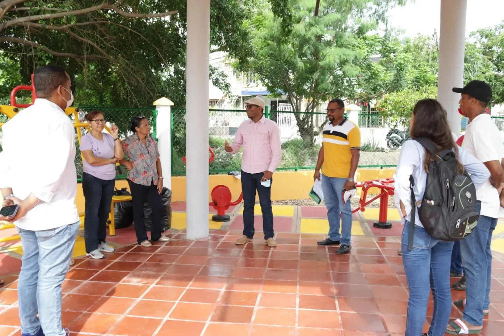

¡Un kilómetro de ventaja! Coneo le lleva a Dau. Al escuchar las críticas del alcalde **William Dau** contra la gestión del alcalde de la localidad Industrial y de la Bahía No 3, **Aroldo Coneo**, nos dimos a la tarea de investigar y a analizar el hecho. ¡Oh sorpresa! Nos encontramos que en calidad de ejecución, **el alcalde menor le lleva al alcalde mayor William Dau Chamat un kilómetro de vías nuevas de ventaja, 12 parques, 41 mejoramiento de viviendas**, entre otras obras públicas.

https://youtu.be/4tROd2eFW1E

Como los indicadores de gestión de William Dau son tan pobres como su vocabulario, quiere ganar indulgencia hablando mal de sus subalternos. No señala indicadores sino que presume que todos los alcaldes locales son malandrines. Pareciera una chismosa de pretil que no entiende de gestión pública sino de colocar en la picota pública el buen nombre de las personas.

## Plata para gastar

*Las capacitaciones de Coneo están amarrados a proyectos sociales. Aquí visitando el estudio de grabación para las nuevas revelaciones del canto y la música popular. ¡Un kilómetro de ventaja!*

En la administración pública el dinero es para gastarlo, no para tenerlos en los bancos. Hay que gastarlo con una alta rentabilidad social. Y aquí Coneo también le lleva a Dau: ¡Un kilómetro de ventaja!

Al respecto, a Dau se le aprobó un presupuesto de **dos billones 47 mil millones** de pesos en 2021. Al alcalde local Coneo le asignaron **$13.700 millones.** Es decir, que al alcalde menor solo se le dio el equivalente al 0,6% aproximadamente. En asignación presupuestal Dau le lleva a Coneo no ¡un kilómetro de ventaja! sino **$2,03 billones de ventaja**. Vayamos al análisis comparativo.

## Vías nuevas: ¡Un kilómetro de ventaja!

Pero, esa artillería del chisme se combate con indicadores de resultados o con obras. En este período del 2021-2022 Coneo está ejecutando un kilómetro de vías nuevas. Son 10 calles que están en proceso de ejecución con un avance del 50%.

En tanto la alcaldía de Dau presentó el plan de reparcheo de la avenida Santander como la magna obra de su administración. Cuando iniciaron el reparcheo hicieron visitas de medios, El Universal le sacó 4 notas en primera página en menos de una semana de propaganda y los periodistas de la alcaldía se activaron. **Pero hasta ahora no ha construido un metro de vía nueva**. ¿Cómo le parece? La Secretaría de Infraestructura solo sirve para gastarse el presupuesto en órdenes de prestación de servicios. Las famosas OPS.

De tal manera que el alcalde William Dau, debe quedarse con el rabo entre las piernas, porque no aguanta un análisis comparativo de gestión pública. Puro _blablabla_ y nada de gestión productiva. Ni una sola vía ha construido. En esta área gana Coneo con ¡Un kilómetro de ventaja!

## En recreación Coneo 12 parques, Dau y Londoño 0

*El equipo de Coneo entregando uno de los parques. El Socorro plan 500B, el parque #ElEsfuerzo*

En materia de recreación y parque, la situación es desfavorable para William Dau. Aroldo Coneo está por entregar en la vigencia 2021-2022 **doce (12) parques nuevos**. Siete urbanos y 5 rurales. Por ejemplo, en la vereda de El Recreo de Pasacaballos se construyó un parque que impactará positivamente a esa población olvidada de la administración distrital. Dau no sabe dónde se encuentra esa vereda, mucho menos tendrá interés de hacer alguna obra.

La directora del IDER, **Viviana Londoño Moreno**, lo único que exige es dinero para gastarlo en OPS. En ese período ejecutaron la suma **$22.335 millones**. **No construyó un solo parque nuevo o una cancha nueva.** El mayor rubro se lo gastaron en OPS, burocracia y capacitación. En menor medida en reparación de parques y canchas. Ahora el concejo, dentro de la incorporación presupuestal solicitada por Dau, un buen bocado tendrá el IDER para gastarlo en capacitación y OPS. ¿Cómo le parece?

## Coneo 41 mejoramientos, Dau y Castro 0

En materia de vivienda, la cosa está grave. Coneo le ha hecho mejoramiento a 41 viviendas con dotación de una batería de baños. Beneficiarios población de estrato 1. Es un resultado para mostrar frente a la lánguida gestión de William Dau.

Conviviendo no ha ejecutado un solo proyecto nuevo de vivienda. Tampoco para mejoramiento de vivienda. No han hecho una sola vivienda nueva de su iniciativa. Los programas lo heredaron de la administración anterior y no han sido capaces de ejecutar. Por esta razón, la **Contraloría Distrital abrió un juicio fiscal contra el alcalde William Dau y el gerente de Corvivienda Néstor Castro por la Ciudadela de la Paz**, proyecto heredado de la gestión de Erika Barrios y William García. Ese proceso ahora se lo llevó Pipe Córdoba para Bogotá.

Lo que se dice es tan cierto que en la rendición de cuenta de Castro ante el concejo en marzo del presente año, el concejal **Carlos Barrios** lo trató de mentiroso utilizando un giro lingüístico elegante:

> **“El papel y la foto aguanta todo**. He realizado seguimiento a los **contratos de mejoramiento de vivienda y en la realidad no hay una sola vivienda nueva y hoy la gestión de Corvivienda** ha dejado una deuda social al Distrito de Cartagena”.

Néstor Casto solo hable de gestión, planificación y que van a ejecutar. No tienen una sola vivienda nueva que mostrar. Solo sirven para gastarse el presupuesto. En 20221 se fumaron **$29.737.** **414.213** en OPS y burocracia. Una mediocre gestión pública.

## En transparencia:

En esta materia solo les invito a ver y escuchar la [Primera Feria de la Transparencia](https://www.facebook.com/profile.php?id=100069170110683) de la alcaldía menor No 3 de Cartagena. Seguro que será menos aburridor que las rendiciones de cuenta mentirosas de william Dau Chamat.

## Conclusión

En gestión pública el alcalde menor Industrial de la Bahía, **Aroldo Coneo,** tiene mejores resultados que su alcalde mayor **William Dau Chamat**. Este es el peor alcalde que ha pasado por la Plaza de la Aduana, al decir de los dirigentes comunales de la ciudad. El año pasado se fumó el **presupuesto** de **dos billones 47 mil millones** de pesos. Al alcalde local le asignaron **$13.700 millones.** ¿Cómo la ves?

Esto nos da a conocer la verdadera capacidad que debe tener una administrador público en lo poco como en lo mucho. **Aroldo Coneo** sin tanto _blablabla_ y sin acusar de corrupto a los demás, está hablando con hechos. Aplica los principios de la administración pública guiados por resultados. Resultados que se miden, se pesan y se sienten. **¿Dónde están los resultados de William Dau?** Aquí no se trata de defender a un funcionario público, sino de analizar comparativamente su gestión. Los cartageneros deben abrir los ojos para que ningún candidato _puyaojos_ los engañen en las próximas elecciones.