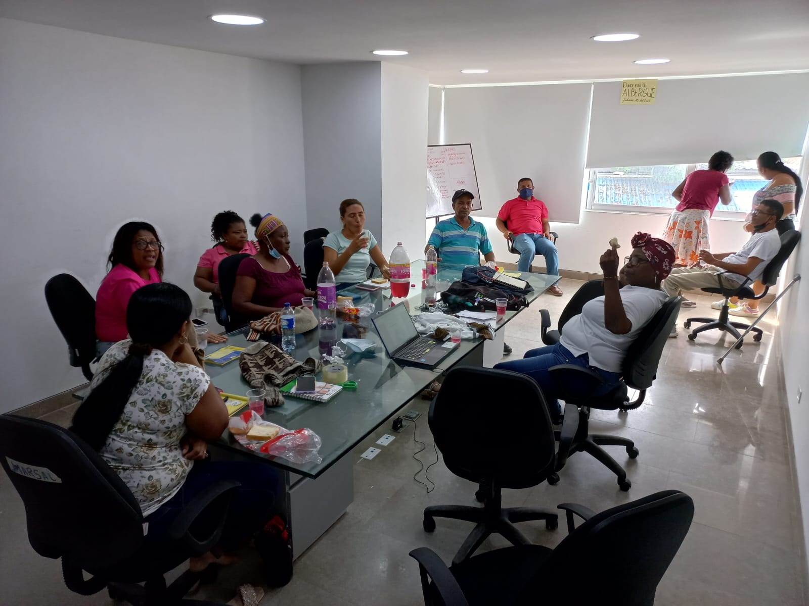
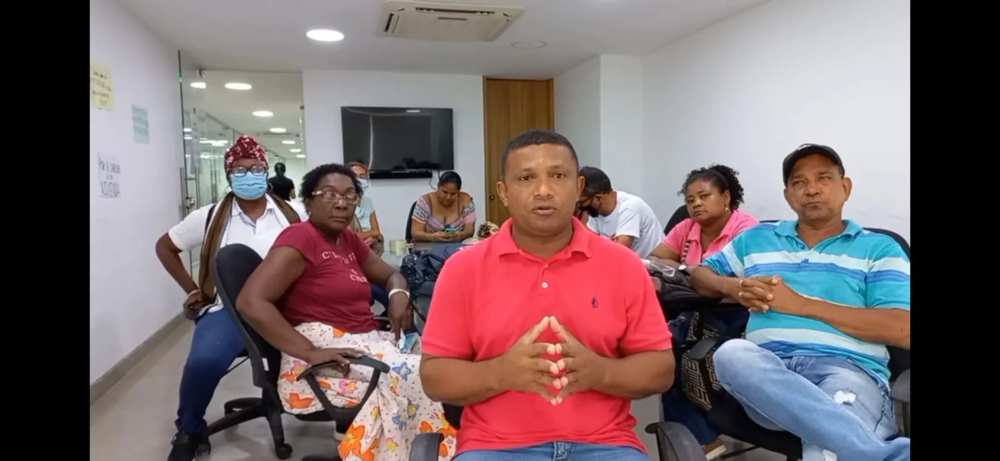

*Víctimas de Cartagena se tomaron la sede de la Secretaría del Interior del Distrito. Se mantendrán hasta que el alcalde William Dau los atienda.*

En el presupuesto de 2022 se incluyó un rubro de **$107 mil millones** para aplicar la política de víctimas de Cartagena. Pero el dinero ahora no aparece. Por esta razón, la **Mesa Distrital de Víctimas** se tomó desde esta mañana pacíficamente la sede de la Secretaría del Interior y de Convivencia hasta cuando se presente el alcalde y firme un compromiso de cumplimiento.

Las víctimas del conflicto armado colombiano, si bien no han sido atendidas a nivel nacional, mucho menos en el orden local. Son 140 mil hombres y mujeres que han carecido de atención de la alcaldía de William Dau Chamat. La nueva secretaria del Interior, Ana María González, está ajena de las necesidades de las víctimas como el mismo alcalde.

De igual manera, la Mesa Distrital hizo un llamado para que se hagan presente en la Secretaría del Interior la Defensoría del Pueblo, la Procuraduría Regional y la Personería Distrital, las cuales son garantes de los derechos humanos y del cumplimiento con los derechos de las víctimas del conflicto.

https://youtu.be/U1jWORKebmc

Las víctimas de Cartagena preguntan al alcalde ¿que ha hecho con los $107 mil millones del presupuesto para las víctimas?

## La peor administración para las víctimas de Cartagena

De acuerdo a los líderes de víctimas, esta es la peor administración en materia de cumplimiento de la política pública. Existe una incapacidad de ejecutoria que la hace la alcaldía más inútil para conseguir resultados de aplicación de la política de víctimas.

En este año que se esperaba las ejecutorias de la administración, las frustraciones invaden a la dirigencia de este sector. En el 2020 y 2021 justificaron esa falta de inversión por razones de la pandemia. Pero ahora no hay ninguna justificación. Manuel Toscano, uno de los miembros de la Mesa Distrital, declaró que es lamentable que habiendo el concejo aprobado unas incorporaciones a William Dau no haya incluido a las víctimas. Si en la vigencia del año pasado no invirtieron absolutamente nada para las víctimas, debieron hacerlo este año.

Pero hasta ahora no existe ninguna voluntad política para atender las peticiones que son de ley. Así lo señala, por ejemplo, la ley 1448 de 2011, su decreto reglamentario y también la declaratoria de estado de cosas inconstitucional emanado de la Corte Constitucional.

## Toma pacífica

*Representantes de víctimas de Cartagena en la toma pacífica.*

> "Esta es una manifestación pacífica en las instalaciones de la Secretaría del Interior, nos encontramos exigiendo a la administración de William Dau el cumplimiento a la política de víctimas de asistencia en atención social, participación, vivienda, salud y educación. Este gobierno nos ha marginado. No hemos visto voluntad política de atender a las víctimas como tales. Por estas razones estamos haciendo este plantón pacífico".
> 
> Manuel toscano, Mesa de Victima del Distrito de Cartagena

Según las víctimas, el alcalde Dau nunca se ha reunido con sus representantes para que explique qué se se hicieron **$107 mil millones** que incluyeron en el plan de inversiones de este año y no se observa nada al respecto. También no se explica que recientemente le aprobaron una incorporación de $239 mil millones y no aparecen por allí las víctimas del conflicto.

En la toma están los representantes de cada sector de víctimas. Manuel Toscano del Subcomité de Asistencia, Virgilio Padilla Quintero del CTJT, María Claudia Serrano del Comité Ejecutivo, Lucía Cárdenas del Comité Ejecutivo, Mario Vega Subcomités de Discapacidad, Estebana Roa Subcomités de Protección. De igual manera, María Valiente por Adulto Mayor, Ingrid Martínez Subcomité de Educación, Sonia Rodríguez de Subcomités de Memoria Histórica, Joan Alfaro por Jóvenes y María Monroy Coordinadora de la Mesa de Víctimas del Distrito de Cartagena

Los líderes de las víctimas de Cartagena manifestaron que permanecerán allí hasta cuando se presente el alcalde y los funcionarios que tienen que ver con la inversión para este sector. Se trata de firmar un acuerdo de ejecución de la política pública para este año y 2023.