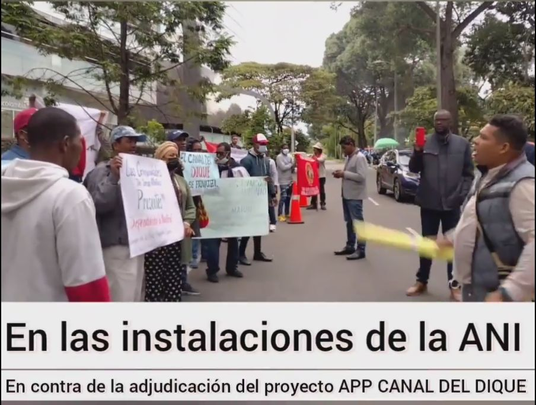
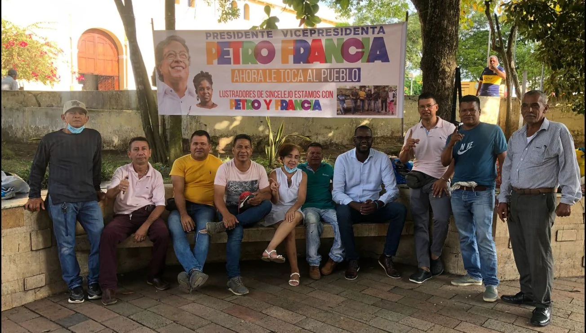
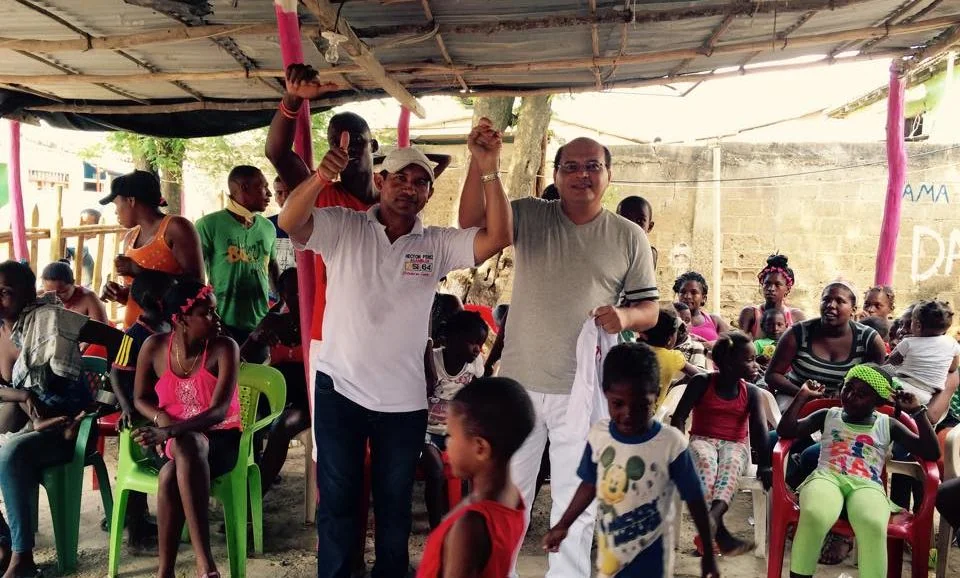

*Petro definirá el futuro del Canal del Dique, pero con la participación directa delas comunidades. Alianza Canal del Dique.*

Hoy, quedó oficialmente suspendido el proceso licitatorio del Canal del Dique. Entonces, Petro definirá el futuro de uno de los ecosistemas más importantes que tenemos en el Caribe colombiano. Fue una ardua lucha de dos años. Una lucha originada desde las profundidades olvidadas de esta subregión forjada por el sudor de indígenas y negros esclavizados desde la época colonial.

[**La Alianza y Asamblea Popular por la Autonomía, Defensa, Protección y Desarrollo Del Canal Del Dique**](/articulos/onu-escucho-a-las-comunidades-sobre-el-macroproyecto-del-canal-del-dique/), más conocida como **Alianza Canal del Dique**, realizó cerca de 200 reuniones comunitarias presenciales y virtuales. Diez recorridos aguas arriba y aguas abajo. Acciones judiciales y seguimiento a 16 consultas previas. Veedurías ciudadanas. Encuentros y desencuentros. Finalmente, hoy la ANI se vio en la necesidad de dejarle el proceso de licitación al gobierno entrante. Petro definirá el futuro del Canal del Dique.

## Un proyecto viciado

En efecto, el proyecto **"Restauración de los Ecosistemas Degradados Canal del Dique"** no creó puentes reales de diálogo efectivo con las comunidades. Por el contrario, cooptó a los dirigentes de las comunidades afros y construyó falsas consultas previas. No hubo la suficiente socialización del megaproyecto, cuyo costo sobrepasa los **$3.3 billones**. De esta manera vició la esencia de esa iniciativa que debe traer desarrollo sostenible para la zona. (Ver: [Cómo compran las consultas previas de ANI a los afros](/articulos/como-compran-las-consultas-previas-de-ani-a-los-afros/)).

La lucha de las comunidades del Canal del Dique no tiene el propósito de detener el desarrollo de la región o del país. No. Lo que busca es que sea un desarrollo sostenible en concordancia con los **Objetivos de Desarrollo Sostenible (ODS) de la ONU**. Y Colombia suscribió este convenio. Se trata de evitar otro gran desastre ambiental y social. Nuestro país está plagado de ejemplos. Urrá, Isla de Salamanca, Hidroituango, etc. (Ver: [¿ANI viola el derecho de la consulta previa? (II)](/articulos/ani-viola-el-derecho-de-la-consulta-previa-ii/)).

Por esa razón la Comisión de Empalme del gobierno de Petro le pidió al presidente de Duque que detuviera el proceso licitatorio. Fue una alerta temprana debido a las irregularidades que encontró en ese evento. ([#Empalme: Petro pide a Duque detener adjudicación Canal del Dique](/articulos/empalme-petro-pide-a-duque-detener-adjudicacion-canal-del-dique/)).

## Petro definirá el futuro por fallas del proyecto

Por tanto, hubo seis razones fundamentales que determinaron la decisión de la **Alianza Canal del Dique** para oponerse al proyecto.

1.  No hubo socialización real del proyecto.
2.  No consultó a todas las comunidades afro e indígenas de la zona afectada.
3.  Las consultas previas realizadas fueron acomodadas, fraudulentas (hay investigaciones que cursan en la Fiscalía) y pocos efectivas.
4.  No se crearon puentes dialógicos con la comunidad organizada.
5.  El diseño del proyecto careció de una propuesta social y ambiental que satisficiera las aspiraciones y exigencias de las comunidades afectadas.
6.  El proyecto, que es económico disfrazado de ambiental, **carece de licencia ambiental** cuando se va a producir una gran afectación al ecosistema general de la zona. (Ver; [Por corrupción, en Rocha, denuncian a exdirectivos de consejos comunitarios](/articulos/por-corrupcion-en-rocha-denuncian-a-exdirectivos-de-consejos-comunitarios/)).

## Con la Alianza Canal del Dique, Petro definirá el futuro

https://youtu.be/Ulj6GFM1C9Q

En el fragor de esa lucha comunitaria y social, surgió la **Alianza Canal del Dique**. Es una alianza entre organizaciones de defensa de derechos humanos y veedurías con más de 50 organizaciones de base asentadas en todo el territorio que afectará el megaproyecto. **Anet,** **VoxPopuli Corporación**, Viso Mutop, Corpolucha, consejos comunitarios, organizaciones de agricultores y pescadores, entre otras organizaciones, componen esta alianza. Petro definirá el futuro gracias a la lucha de las comunidades y de organizaciones que defendieron los derechos colectivos de la nación.

Las últimas jornadas de esta lucha fueron decisivas. En la Segunda Cumbre de la bancada del Pacto Histórico realizada en Santa Marta (28 y 29 de julio) se hizo una excelente socialización de la visión que se construyó alrededor del proyecto. Se contó con el apoyo de 45 parlamentarios a la declaración para que el gobierno detuviera la licitación del Canal del Dique. (Leer: [“¡Paremos la licitación espress del Canal del Dique!”](/articulos/paremos-la-licitacion-espress-del-canal-del-dique/))

Debemos citar la jornada de toma del Canal del Dique que se hizo este lunes 1 de agosto. Mediante acción directa, las comunidades de pescadores y campesinos rechazaron la **adjudicación del Canal del Dique** a la única oferente de la licitación que se tiene prevista para el próximo jueves 4 de agosto. Esta acción se hizo con las **“marchas de las canoas”** y la toma directa de los puentes de Gambote, Calamar y Soplaviento. (Leer: **[Exitosa acción contra adjudicación del Canal del Dique](/articulos/exitosa-accion-contra-adjudicacion-del-canal-del-dique/)**)

## Plantón frente a la ANI

Puedes ver el plantón realizado a la entrada de la ANI bajo la coordinación de la Alianza para la Defensa del Canal del Dique.

[https://fb.watch/eI2FFWOfb6/](https://fb.watch/eI2FFWOfb6/)

## Falta mucho

Si bien Petro definirá el futuro, no lo podrá hacer solo sin la voluntad de las comunidades. La ministra del Medio Ambiente y Desarrollo Sostenible, Susana Muhamad, la ministra de Agricultura, Cecilia López Montaño, los parlamentarios del Pacto Histórico deben crear puentes dialógicos con estas comunidades. Se trata de que sean parte del equipo que diseñe su propio desarrollo sostenible y no simplemente objeto de los expertos del Estado.

Sin embargo, todavía falta mucho. Apenas se va a poner a prueba al nuevo gobierno. Petro definirá el futuro, pero no por sí solo. Sin las comunidades no podrá haber futuro cierto para el país. Fredys Martinez, pescador y agricultor del Canal del Dique, al conocer el aplazamiento de la adjudicación de la licitación, expresó su satisfacción desde Bogotá.

/articulos/luciotorres/status/1555285437937328130?s=20&t=Ps5znhVt8Mm\_7GXSg2N8Ng

## El papel de Meléndez

*Los líderes del Canal del Dique le apostaron al Cambio. Ahora esperamos que el gobierno de Petro le apueste a la comunidad para que sea parte del desarrollo sostenible. Petro definirá el futuro.*

Adil Meléndez Márquez, de la Agencia Nacional Étnica-ANET, es uno de los abogados que desde el comienzo viene acompañando a las comunidades del Canal del Dique en la defensa de sus derechos colectivos. Es promotor de la **medida cautelar adoptada por la JEP** para evitar que el fondo del Canal se drague sin que previamente se haga el protocolo para hallar los restos humanos depositados por los criminales de la autodefensas y demás grupos armados. Y es que en este brazo del río Magdalena yacen muchos cuerpos humanos desaparecidos por la guerra paramilitar.

Se mostró muy satisfecho por el aplazamiento de la adjudicación de la licitación No **VJ-VE-APP-IPB-006-2021** de la Agencia Nacional de Infraestructura-ANI. Este hecho fue anunciado por su presidente ejecutivo, Manuel Felipe Gutiérrez Torres, en la mañana de hoy en la WRadio. La decisión la tomó luego de recibir el informe de la Contraloría General, los informes de veedurías y de la petición realizada por la bancada del Pacto Histórico y la Comisión de Empalme. Todas las advertencias recibidas últimamente, confirma lo justo de las peticiones que hicimos a lo largo de estos dos años.

## Las veedurías

*Héctor Pérez fue uno de los veedores que acompañó este proceso con sus acciones constitucionales y acompañamiento a la comunidad.*

Por su parte, el veedor social, **Héctor Pérez Fernández**, quien también coadyuvó a las acciones constitucionales de la Alianza para la Defensa del Canal del Dique, el día anterior pidió a la ANI que le solicitara a la Comisión Nacional de los Mercados y la Competencia de España (CNMC) copia de los expedientes de las investigaciones que se le sigue a SACYR la única proponente en el proceso licitatorio. De igual manera se estudiara el informe de la Contraloría General sobre la experiencia que se tiene con esa firma española en Colombia y el proceso de responsabilidad fiscal por $23 mil millones.

> Se solicita que la Agencia Nacional de Infraestructura pida a la Comisión Nacional de los Mercados y la Competencia (CNMC) de España copia de todos los expedientes, expedientes de investigaciones y las resoluciones de sanción contra la empresa SACYR, y en qué estado se encuentra la solicitud de prohibición de contratación con la administración remitida por la CNMC a la Junta Consultiva de Contratación Pública en España y a la Comisión Europea.
> 
> Solicitud a la ANI de Héctor Pérez.

## El informe de la Contraloría

En Colombia, la Contraloría General de República (CGR) viene realizando un proceso de responsabilidad fiscal por $23.308 millones contra la empresa SACYR. Esto, como consecuencia de la ejecución y sobre costos del contrato de obra No. 285 del 27 de diciembre de 2013 con el Fondo de Adaptación en la construcción del puente Hisgaura en Santander. Aunque un Tribunal de Arbitramento había dicho que la responsabilidad de los retrasos y del sobrecosto fue por causa del mal diseño del Fondo de Adaptación.

Pero, además, la Contraloría General hizo un resumen de todas las irregularidades encontradas en los contratos ejecutados o que se están ejecutando por parte de SACYR. Así se señala en el boletín de prensa No. 091 del 13 de julio de 2022 de esa entidad.

## El Open de Ingenieros

En el marco del Open Internacional de Ingeniería organizada por la Sociedad Santandereana de Ingenieros que se realiza en la ciudad de Bucaramanga, en el panel técnico denominado **“Realidad técnica y prospectiva de la navegación por el río Magdalena”** se evidenció las deficiencias de la licitación de la ANI para restaurar los ecosistemas del Canal del Dique,

> “Las obras proyectadas, al contrario de optimizarla, dificulta la navegación por el canal, tanto para los pescadores artesanales de la zona como para los navieros profesionales, además, genera demasiadas dudas sobre su eficacia para prevenir la eventuales inundaciones periódicas de la zona. La forma de operar exclusas, compuertas, diques, válvulas y demás mecanismos propuestos no está definida en el proyecto, lo que significa un grave riesgo para el ecosistema que se pretende proteger.