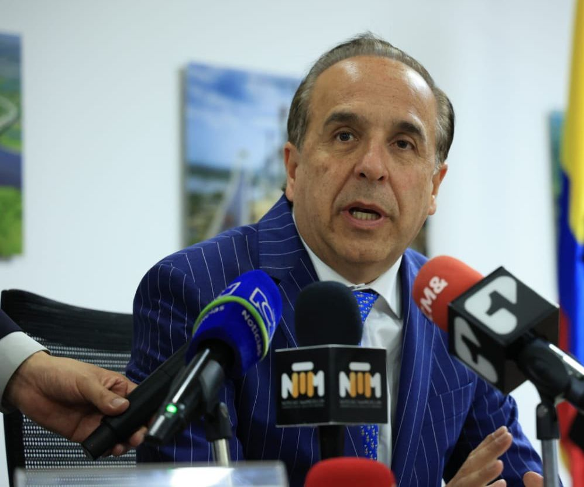

*El ministro de Transporte Guillermo Reyes anunciando el aplazamiento de la licitación Canal del Dique para el 12 de septiembre.*

El ministro de Transporte, Guillermo Reyes, dijo hoy que la licitación de la megaobra "Restauración de los Ecosistemas Degradados Canal del Dique" se aplaza hasta el 12 de septiembre. En una rueda de prensa realizada en el ministerio, estuvo acompañado del presidente encargado de la ANI, **Carlos García**, quien manifestó haber recibido requerimientos de la Contraloría General dela República, Justicia Especial de Paz (JEP) y de las mismas comunidades.

En tanto la **Alianza Canal del Dique** le exigió al presidente Gustavo Petro que se **declare nulo todo el proceso**, ya que está duramente cuestionado por las irregularidades cometidas y la falta de socialización con las comunidades. (Lea: [Megaproyecto Canal del Dique: El rechazo popular y la renuncia de Cardona](/articulos/megaproyecto-canal-del-dique-el-rechazo-popular-y-la-renuncia-de-cardona/)).

Al respecto, el ministro respondió que durante este mes que dura el aplazamiento se escucharán a las comunidades del Canal del Dique. Convocarán a una audiencia en el municipio de Santa Lucía Atlántico en una fecha que está por definirse.

https://youtu.be/-k-CG9pldus

## Piden declarar nula licitación Canal del Dique

La suspensión de ese proceso es con el fin de escuchar a las comunidades del canal del Dique, a los entes de control, a los gobernantes de los entes territoriales y al proponente con el fin de adoptar la mejor medida, dijo el ministro Reyes. (Lea: [El presidente Petro definirá el futuro del Canal del Dique](/articulos/el-presidente-petro-definira-el-futuro-del-canal-del-dique/)).

Sin embargo, la Alianza Canal del Dique pide que **se declare nulo el proceso**, ya que está viciado desde su origen. La causa fundamental de esa nulidad es la violación del derecho fundamental a la consulta previa a varias comunidades afros que no fueron convocadas por los líderes del proyecto.

Se trata de definir en ese plazo la naturaleza de las irregularidades denunciadas por los representantes de las comunidades. Además, de tomar una decisión definitiva si se anula el proceso o si se adjudica el próximo 12 de septiembre.

https://twitter.com/MinTransporteCo/status/1557805762780532737?s=20&t=XpQEu57VypKbgXt1ZqiIUw