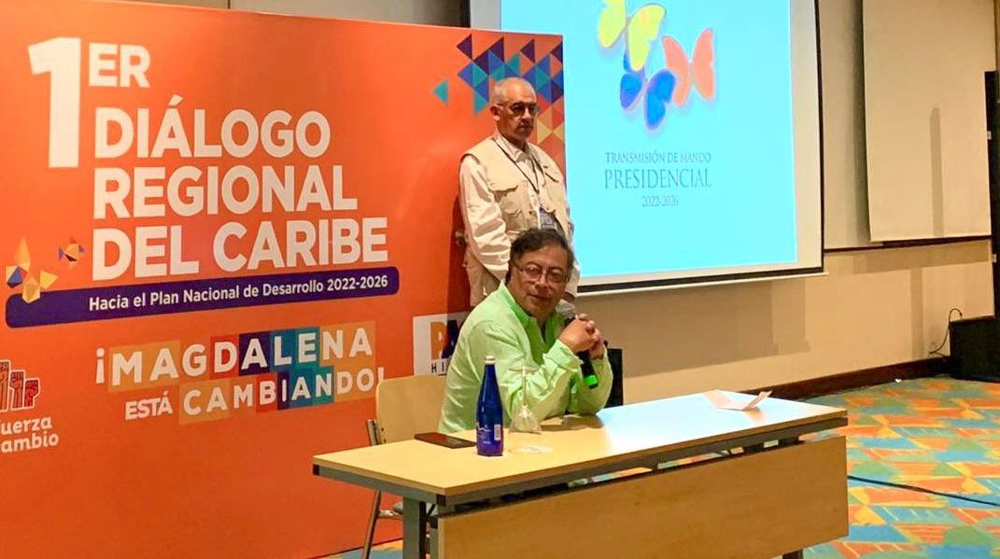

*El presidente Gustavo Petro con su bancada del Pacto Histórico. uno de los temas centrales asumidos por los parlamentarios de la Comisión Quinta fue la Reforma Agraria.*

Reforma Agraria y seguridad alimentaria, control a las CAR y desarrollo del medio ambiente serán las principales apuestas de Petro y de la bancada del Pacto Histórico (PH) desde la Comisión Quinta. La senadora de esta coalición de gobierno, **Isabel Cristina Zuleta**, quien participó en la Segunda Cumbre de esta bancada en Santa Marta, dijo a **VoxPopuli Digital** que ayudarán al nuevo gobierno en esas tareas.

En la reunión de los parlamentarios del Pacto Histórico de la Comisión Quinta con los ministros designados por el **presidente Gustavo Petro, Susana Muhamad y Cecilia López Montaño**, le hicieron una apuesta a la **Reforma Agraria.** Este fue uno de los ejes temáticos asumidos en el encuentro. Dado al papel destacado asumido por Zuleta, la invitó a un breve pero edificante diálogo con **VoxPopuli Digital**.

De la misma manera, vale la pena detenerse por un momento sobre la propuesta que más resistencia pueda provocar: la Reforma Agraria de Petro.

## La Reforma Agraria y la historia

En la segunda mitad del siglo XIX, los gobiernos liberales pregonaron una Reforma Agraria de tierras que expropiaron al clero con el pretexto de dársela a los campesinos sin tierra. La realidad fue otra. Del millón y medio de hectáreas baldías redistribuidas, al campesino pobre sin tierra, **solo le entregaron el 0,05%**. Fue una falacia. Es el discurso ambivalente que nuestras clases dominantes comenzaron a construir en los albores de la República. (Te sugiero consultar el capítulo [_Repetitividad, continuidad y discontinuidad_ de mi libro](https://fb.watch/eFxL1Ejo5F/) **[¿Adiós a la guerra? Entre el discurso ambivalente y la violencia alienante.](https://fb.watch/eFxL1Ejo5F/)**)

En el siglo XX se produjeron dos frustradas reformas agrarias, fuentes de los grandes conflictos políticos y armados del país. La de **Alfonso López Pumarejo** con su Ley 200 de 1936 que terminó con la parálisis de su **Revolución en Marcha**. La Reforma Agraria de **Carlos Lleras Restrepo** (1968) murió con el Pacto de Chicoral. El principio de esas reformas era el carácter social de la propiedad. Pero los terratenientes y grandes ganaderos, constituidos en un actor estratégico de poder, se opusieron.

A finales de los 70s, recuerdo, los líderes estudiantiles nos volcamos a los campos en un acompañamiento a nuestros campesinos que reclamaban la **"tierra p´al que la trabaja"**. Fue una reforma de facto en las sabanas de Córdoba, Sucre y Bolívar, gracias a las tomas directas de fincas improductivas. Pero, a finales de los 80s, el paramilitarismo inició una contrarreforma a sangre y fuego. De esto fuí un testigo de excepción, ya como reportero de guerra.

En consecuencia, se impuso la **contrarreforma agraria** que predomina hasta hoy. Cada hectárea arrebatada a los campesinos entre 1986 a 2006 fue un acto sangriento. ¿Se podría resolver este problema histórico?

## La Reforma Agraria de Petro

¿Qué quiere el presidente Petro? Tiene como propuesta central una Reforma Agraria por la vía impositiva. Esto es, elevar el impuesto predial a las tierras improductivas. Desde el punto de vista teórico esto podría llevar al gran propietario a una de estas tres salidas: (1) Producir riqueza. (2) Pagar impuestos elevados por sus tierras improductivas. (3) Vender sus tierras ociosas al Estado. Petro espera que se produzca la tercera opción. Así podría construir un banco de tierras disponibles para los campesinos que la quieran hacer producir.

No obstante, la historia nos demuestra que el alza de los gravámenes a la gran propiedad automáticamente no la va a reducir o desaparecer. Desde otra perspectiva, para propiciar una reforma agraria exitosa, gradual y sostenible, debemos entender la dinámica de la economía rural y del ser humano. En este caso desde el Estado se debe estimular la productividad de la economía campesina bajo tres elementos estratégicos: (1) Formación de nuevas mentalidades como emprendedores rurales. (2) Ciencia, Innovación y Tecnología. (3) Titulación de tierras, crédito y estímulo a la productividad.

Ahora bien. Si se trata de reconocer a uno de los sectores marginados y arrinconados de la sociedad colombiana, que es el campesinado, se le debe dar la oportunidad de formarse como empresario. Esa sería la mejor apuesta de Petro. En este sentido, según **María Cristina Zuleta**, la bancada le apostará apoyar al campesinado. Por esta razón, respaldarán al gobierno para sacar adelante **el cambio en la propiedad de la tierra** y en el agro del país. Este fue el acuerdo de los ministros como de los representantes y senadores del Pacto Histórico.

> "Estamos en una apuesta en el reconocimiento de los derechos del campesinado colombiano. Sabemos que los campesinos, tanto de aquí del Caribe como de todo el país, han sido segregados, excluidos y discriminados. No han tenido la atención debida. Nos proponemos, con el apoyo del gobierno, **una reforma que por fin le dé voz al campesinado colombiano"**.

## Las CAR, al tablero

*Isabel Cristina Zuleta, la dinámica senadora del Pacto Histórico. Anunció que la Reforma Agraria será una de las grandes apuestas del Cambio que comienza el 7 de agosto.*

Con la creación del ministerio del Medioambiente y las corporaciones regionales ambientales se pensó que podían desarrollar una tarea fundamental para la preservación de los recursos naturales. Pero, para Zuleta, éstas se han dedicado solo a expedir licencias ambientales sin tomar en cuenta su tarea misional.

> "Ustedes (en el Caribe) tienen grandes corporaciones ambientales como la CRA, Cardique y Cormagdalena. Pero, no se han dedicado a su misión. La misionalidad de una Corporación es hacer regulación y control. No es una expendedora de licencias ambientales para dar taquillas de aprovechamiento forestales que destruyen nuestros bosques, dar concesiones de agua o permiso de vertimientos. Las CAR están para regular los usos de los bienes de la naturaleza".
> 
> I.C. ZULETA.

Hay un proceso de corrupción enorme en las CAR, denunció Zuleta. Por ende, realizarán un estricto control político a esas entidades.

## La bancada Caribe

En la cumbre de Santa Marta, los parlamentarios del Pacto Histórico no solo se reunieron con los ministros designados por el presidente Petro sino que también atendieron a representantes de organizaciones sociales. Próximamente el PH convocará a un encuentro de la bancada del Caribe colombiano. Estarán convocados todos los partidos políticos, sin distinción alguna, con el fin de adelantar un acuerdo para el control político de las Corporaciones Autónomas Regionales (CAR) y definir otros derroteros para la región.

> "Vamos a reforzar esas bancadas para nuestra misionalidad de hacerle control a las CAR. Estas se han entregado a algunos grupos de poder. Ellos saben que nosotros lo sabemos y que no nos vamos a quedar callados. Vamos a hablar de lo que está pasando. Nosotros hacemos investigaciones juiciosas y rigurosas para citar a debates de control".

De igual manera, el presidente Petro debe aprovechar la oportunidad para ir pagando la deuda histórica que se tiene con la región Caribe. Pese a su aporte al PIB, presenta 4 de los departamentos más pobres del país.

Los temas de Reforma Agraria, Seguridad Alimentaria y Medioambiente son esenciales para nuestra región. Pero si no se resuelve el problema de la concentración de los grupos de poder, quedaremos igual o peor, como en México, Guatemala, Chile, que pese a tener reformas agrarias, hoy padecen el mismo problema de los colombianos.