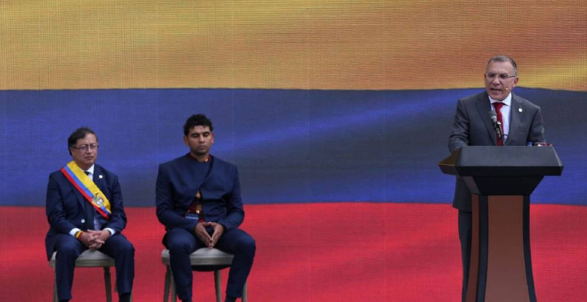

*¿Entre el discurso popular y el gabinete neoliberal? ¿Pragmatismo político? María José Pizarro le pone la banda presidencial en honor a Carlos Pizarro, el cartagenero que fue líder del M-19.*

¿El cambio comenzó? ¿El presidente Petro navegará hacia puerto seguro entre el discurso popular y su gabinete neoliberal, y sin representación de las regiones? La plaza de Bolívar llena en la tarde del pasado domingo 7 de agosto. La multicultural audiencia con gran ilusión esperó el anuncio del cambio. Un discurso popular que resumió la propuesta de gobierno en un decálogo. Un discurso construido en casi 30 años de lucha política parlamentaria y 15 años de lucha armada simbolizada por el robo de la espada de Bolívar.

/articulos/episode/78KDAitWmE33pk4NcjPYKG?si=9196b7308f274fc2

Sin embargo, el discurso progresista de centro-izquierda del presidente Petro se podría agotar en un gabinete de corte neoliberal que no está a la altura de la promesa de cambio. Un gabinete ministerial tradicional, cuya composición material es regresiva para la **región Nor-Continental del Caribe**. Más bien, refleja la ansiedad de construir una **frágil gobernabilidad** pegada con _**ñipi-ñipi**_ o uvita de playa para que no tumben al presidente. (Lea: [Reforma agraria, CAR y medioambiente, las apuestas de Petro](/articulos/reforma-agraria-car-y-medioambiente-las-apuestas-de-petro/)).

## ¿Entre el discurso popular y el gabinete neoliberal?

https://youtu.be/Euv1DpoloiE

¿Entre el discurso popular y el gabinete neoliberal?

El discurso del presidente Petro se contrapone a la anatomía de su gabinete dominado por ministros que han estado al servicio de la política de corte neoliberal que prima en los organismos internacionales. Su ministro de hacienda, José Antonio Ocampo viene de una extensa experiencia en ese campo con un corte cepalista.

Todo indica que **existe una ausencia de pegamento programático para la construcción de una gobernabilidad estable del nuevo gobierno**. En cambio, lo que se observa es una política pragmática a lo Maquiavelo: **el fin justifica los medios**. Esta es una política, que si bien da resultados inmediatos, a mediano y largo plazo producen daños a las estructuras democráticas y a las aspiraciones justas de las mayorías reales de la sociedad.

## Mermelada por gobernabilidad

*Roy Barreras, presidente del senado, artífice de la gobernabilidad parlamentaria, realiza su intervención mientras el presidente Petro y el presidente de la cámara de Representantes, David Racero, escuchan reflexivamente.*

Por tanto, si no se se actúa como corresponde a las exigencias actuales, cuando se obtenga la tal gobernabilidad, será frágil, inestable y volátil. Podrá sacar los proyectos adelante, pero en ellos estará implícita el germen de su propia destrucción. Así le sucedió a Pastrana, Samper, Juan Manuel Santos e Iván Duque. Es una gobernabilidad parlamentaria conquistada mediante la distribución burocrática y la mermelada.

De hecho, es la misma dosis de la cual ha vivido el congreso de la República en los últimos 30 años. Es una voracidad que se incrementa cada vez que recibe mermelada. Ni siquiera **Álvaro Uribe** se salvó de esta situación. En el último período se vio enredado en estas desnaturalizantes transacciones con el congreso. Y eso que tenía una alta gobernabilidad expresada en las urnas y en el apoyo de las mayoría de la sociedad. Petro lo debe saber: Pero pretende sacar adelante sus proyectos utilizando los mismos mecanismos que han caracterizado la relación ejecutivo-congreso.

## Centralismo de nuevo cuño

En efecto, contrario al primer gabinete de **Álvaro Uribe**, exponente de la extrema derecha colombiana, quien nombró a cuatro (4) costeños en su equipo, Petro pasará a la historia por haber desconocido a la **Costa Caribe. La región está ausente**. Es un real mensaje poco integrador para el país nacional compuesto por regiones marginadas. **El primer mensaje de la acción de gobierno expresa un centralismo de nuevo cuño**.

Aunque la región estuvo presente en la duplicación de la votación para la segunda vuelta presidencial, fue ninguneado en el gabinete. De los **2,7 millones votos** que Gustavo Petro incrementó para la segunda vuelta, la región le puso 700 mil adicionales. Una tercera parte de esos votos. La diferencia que le sacó a **Rodolfo Hernández**. Es decir, todos nuestros departamentos incrementaron la votación de la primera a la segunda vuelta. **Saltó de 1’885.792 votos a 2’582.811**. ¿La **región Nor-Continental del Caribe** se merecía ese tratamiento en el gabinete inicial del presidente del cambio?

**¿Acaso la Costa Caribe es una mera cantera de votos para el Pacto Histórico y la izquierda colombiana?** Algunos responderán que como el presidente es nacido en Ciénaga de Oro, supliría la ausencia de la región en su gabinete. Si alguien respondería de esta forma, desconocería que el ejercicio del poder en un sistema como el colombiano, depende fundamentalmente del que tenga el bolígrafo. **¿Cómo la región puede escribir su historia de autonomía si este gobierno le niega el bolígrafo?** El discurso de Petro **"de que juntos podemos escribir la historia"** se queda en una retórica característica de los partidos tradicionales. ¿O, acaso, él escribirá la historia en nombre de las regiones y del pueblo que salió a votar por su propuesta el pasado 19 de junio?

## El Caribe NorContinental y su poca representatividad

Son muchas inquietudes las que se generan desde la inconformidad regional. Se pregunta el Caribe NorContinental: ¿Los dirigentes nacionales del Pacto Histórico fueron consecuentes al estructurar las listas a la cámara de los departamentos de la Costa Caribe? ¿Por qué solo la presidenta del MAIS **Martha Peralta** (La Guajira) y **Pedro Flórez** (Barranquilla) del Caribe (puestos 6 y 9 en la lista, respectivamente) se encontraba en los primeros 20 de la lista a senado? La expresidenta del MAIS llegó por un compromiso con ese movimiento. En tanto, Flórez porque estaba respaldado por **Armando Benedetti** y un grupo de empresarios liderados por Euclides Torres. O de lo contrario, la Costa Caribe no hubiese tenido un solo senador en el **Pacto Histórico**.

Por esa razón, la lánguida representatividad de los costeños en el gabinete ministerial reflejó la exigua participación que tuvieron en la bancada del Pacto Histórico. Solo dos representantes a la Cámara (**Agmeth Escaff y Dorina Hernández**). En Barranquilla como en Cartagena fue traumática la conformación de las listas a la cámara. Finalmente, Bogotá las impuso. Así impidió la formación de nuevos liderazgos y, por supuesto, que se duplicara el número de curules a la cámara.

Si bien es cierto que en el discurso de posesión de Petro la palabra cambio y futuro fue reiterativa, ello no se armonizó con la participación de las regiones en la composición ministerial. Esto es muy importante, porque el ejercicio del poder lo hacen las personas. Los costeños están ausentes. **Cecilia López**, ministra de agricultura, nacida en Barranquilla, tiene toda una vida en Bogotá. Son 60 años sin recibir la brisa marina.

En ese sentido, surgen algunos interrogantes que nos ponen a pensar y a reflexionar sobre la promesa de cambio de un discurso esperanzador. Discurso que se diluyó con el tipo de gabinete que desarrollará el cambio.

## ¿Dicotomía del discurso con el gabinete neoliberal?

¿Puede un equipo tradicional, formado con cálculo político milimétrico, ejecutar una agenda de cambio diferente a su experiencia política? ¿Por qué la composición política del gabinete de Petro es muy distinta a los anuncios de transformación de su discurso de posesión?¿Es una estrategia de acuerdo político para que el presidente del cambio pueda gobernar? Pero las preguntas más desafiantes son las más comprometedoras. ¿Puede el viejo congreso, dominado por los mismos partidos, ser vehículo del cambio? ¿Puede un gabinete ministerial, compuesto por la mayoría de ese congreso, ejecutar los anuncios del cambio?

## Un decálogo que puede ser letra muerta sin representación

El discurso de Petro fue muy esperanzador, de transformación y de vida. Resume su periplo por el mundo de la política parlamentaria y armada. Este es el decálogo que resume su propuesta de gobierno que puede naufragar con un equipo ministerial que no representa al **"País Nacional sino al País Político"**. Primó el pragmatismo político.

¿Pueden conciliarse el discurso esperanzador y de cambio con un equipo neoliberal de corte social? La historia política indica que es como el agua y el aceite. Nada puede funcionar si los intereses son determinados por un equipo que siempre le ha servido a las tesis neoliberales.

Se espera que el analista esté equivocado. Que Gustavo Petro logre materializar su propuesta de gobierno con el gabinete que estructuró libremente. Él tiene el bolígrafo. Podrá escribir la historia sobre un papel en blanco que el **Caribe NorContinental** le pasó. No invitó a ninguno a escribirlo desde el poder central. El desafío es construir la historia desde nuestra realidad y desde nuestros territorios irredentos e insurgentes. Es el camino que le queda a la sociedad caribeña que cree en este proyecto de gobierno.

## El decálogo esperanzador de Petro

1.  «**Trabajaré** **para conseguir la paz verdadera y definitiva. Como nadie, como nunca.** **Vamos a cumplir el Acuerdo de Paz y a seguir las recomendaciones del informe de la Comisión de la Verdad».**
2.  «**Cuidaré** de nuestros abuelos y abuelas, de nuestros niños y niñas, de las personas con discapacidad, de las personas a las que la historia o la sociedad ha marginado». 
3.  «**Gobernaré** con y para las mujeres de Colombia. Hoy, aquí, empieza un gobierno paritario y con **un Ministerio de Igualdad».** 
4.  «**Dialogaré** con todos y todas, sin excepciones ni exclusiones». 
5.  «**Escucharé** a los colombianas y colombianos como he venido haciendo en todos estos años». 
6.  «**Defenderé** a los colombianos y colombianas de las violencias y trabajaré para que las familias se sientan seguras y tranquilas. Lo haremos con una estrategia integral de seguridad».
7.  «**Lucharé** contra la corrupción con mano firme y sin miramientos. Un Gobierno de «cero tolerancia». 
8.  «**Protegeré nuestro suelo y subsuelo, nuestros mares y ríos.** Nuestro aire y cielo. Nuestros paisajes nos definen y nos llenan de orgullo». 
9.  «**Desarrollaré la industria nacional, la economía popular** y el campo colombiano. Sin distinciones ni preferencias». 
10.  «**Cumpliré** haré cumplir nuestra Constitución. **La que dice en su artículo 1**: “Colombia es un Estado social de derecho, organizado en forma de República unitaria, descentralizada, con autonomía de sus entidades territoriales, democrática, participativa y pluralista, fundada en el respeto de la dignidad humana, en el trabajo y la solidaridad de las personas que la integran y en la prevalencia del interés general».