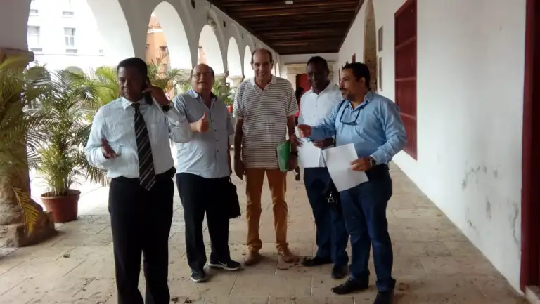
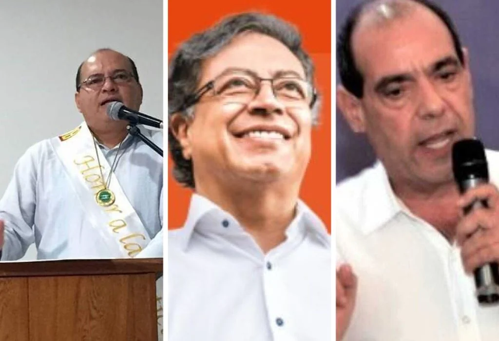
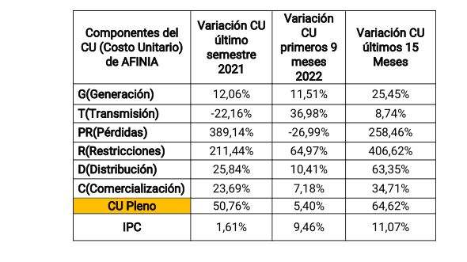

*William Murra Babun y Héctor Pérez Fernández le presentaron al presidente Petro la propuesta para reducir las tarifas de AFINIA y AIRE-E. Existen muchas razones para creer que la reducción de tarifas es una falacia.*

En la región Caribe existen muchas razones para creer que la reducción de tarifas es una falacia. Quiere decir, que si hace un año pagaba $180 mil y ahora pago $317 por los mismos Kwh consumidos, por mucho que nos rebajen, seguiremos pagando las tarifas más caras del pais. ¿Por qué? Afinia y AIR-E violaron la ley con la metodología para adoptar las tarifas ruinosas que tienen.

El gobierno nacional les permitió legislar en su propia nombre para **incrementar las tarifas en un 64,62%** e incorporar en su estructuración las **pérdidas no técnicas**. La **denuncia la presentaron hoy** ante el presidente de la república, Gustavo Petro, los veedores **William Murra Babun y Héctor Pérez Fernández**. Sin que los veedores lo hayan dicho, **se puede colegir que es una falacia la reducción de tarifas de Afinia y Air-E** anunciadas para noviembre.

Por esa razón, explican los veedores, tiene como resultado que las tarifas que pagan los usuarios de la Costa Caribe (64,62%) se haya incrementado en el último año por encima de la media nacional que llegó a 24%. Esto quiere decir, que si rebajan las tarifas en un 8%, por ejemplo, no cambian las cosas para los usuarios del Caribe. El problema es más profundo: la estructuración de las tarifas. (Leer: **[Afinia, la misma historia que Electricaribe](/articulos/afinia-la-misma-historia-de-electricaribe-preparan-protesta-en-bolivar/)**).

Lo anterior también nos lleva a creer que los anuncios del **gerente general de la EPM, Jorge Andrés Carillo,** de reducir las tarifas en AFINIA no deja de ser un anuncio falaz. Es más, la forma cómo cobran las tarifas es un asalto ruinoso a las arcas de los costeños.

## Afinia y Air-E, libertad para fijar tarifas

Para demostrar la tesis de que una posible reducción de tarifas es una falacia, se debe partir de la forma de estructurarla. Recordemos que el cálculo de las tarifas de energía depende de seis componentes. Ellos son: generación, transmisión, distribución, comercialización, pérdidas y restricciones. Si bien es cierto que para el país **la generación representa el mayor porcentaje (35 %) del valor de la factura que pagan los hogares, en la Costa Caribe es diferente.**

> «Sin embargo, el tema más sentido cuál es la **pérdida de energía no técnicas** (...) no ha sido considerado en esta etapa de rebajas de tarifas por lo que nosotros **estamos muy escépticos** de que las medidas que entrarán a notarse en el mes de noviembre próximo, como lo anunció la señora ministra, mitigarán las angustias de los usuarios de la Costa Atlántica».
> 
> Veedores William Mirra y Héctor Pérez.

Ello explica que para que haya reducción en las tarifas, necesariamente deben revertirse todas las medidas ilegales adoptadas por el gobierno anterior de Iván Duque. Una de las acciones fundamentales que debe propiciar la ministra de Minas y Energía es crear una **Meza Técnica** con los dolientes de este problema energético que soportamos desde la crisis de Corelca. Esto implica escuchar a los movimientos sociales que vienen reclamando contra la política centralista y discriminatoria de fijar las tarifas para los usuarios del Caribe.

No se trata de bajar la tarifas sino de definir una política de estructuración de las tarifas tomando en cuenta la ley 142 de 1994. De esta manera, terminamos con la burla de los comercializadores de energía a la ley y al deseo de los costeños de disfrutar de derechos a un excelente servicio público y a unas tarifas justas. No es posible seguir pagando tarifas ruinosas que le quitan el bocado de comida a las familias más pobres de la región caribe. (Lea: Fraude en la concesión del alumbrado público de Cartagena (II)).

## Razones para no creer en la CREG

*William Murra y Héctor Pérez aparecen con los otros veedores y abogados Nausicrate Pérez, Alcides Arrieta y Erick Urueta en 2020. La reducción de tarifas es una falacia.*

Son varias las razones para ser escépticos frente al anuncio del gobierno de rebajar las tarifas para la Costa Caribe. Nos lleva a pensar que la reducción de tarifas es una falacia. De acuerdo a los veedores, una de ellas es la **desconfianza en la CREG**.

> Nosotros no confiamos en que esos comisionados de la CREG que se atrevieron a dictar normas regulatorias que violan flagrantemente la ley 142 de 1994 o Ley de Servicios Públicos Domiciliarios, como por ejemplo, tengan ética y profesionalismo para guiar por el sendero correcto a su gobierno en esta etapa que supuestamente debe llevar a una tarifa justa al usuario afectado.

La segunda razón, en efecto, es la actuación de la CREG a favor de las empresas de servicios públicos. La entidad reguladora permitió trasladar a los usuarios honestos y cumplidos de las empresas AIR-E y AFINIA los costos ineficientes producto de las pérdidas no técnicas que debe absorber el operador. Esto se constituye, por sí mismo, en un acto violatorio de lo ordenado en el artículo 87.1 de la ley 142 de 1994. Para corroborar lo dicho, se cita el caso que la CREG, al expedir las resoluciones 010 y 012 de 2020, 024, 025, 078 y 079 de 2021, permitió que vía tarifas y durante un plazo de 5 años los operadores AIR-E y AFINIA pudiesen legislar en su propio nombre. De esta manera combinaron en una sola canasta las Pérdidas Técnicas y las Pérdidas No Técnicas.

La ley no permite trasladar a la tarifa del usuario la ineficiencia administrativa y operativa que casualmente son las Pérdidas No Técnicas. Pero como ese término desaparece con estas resoluciones absurdas, es muy fácil incluirlas indirectamente en la composición tarifaria final y peor aún por espacio mínimo de 5 años. De hecho, esto determina que la reducción de tarifas es una falacia si no se modifica esa estructura ilegal.

## ¿Por qué la reducción de tarifas es una falacia?

*Los veedores William Murra y Héctor Pérez le entregaron hoy al presidente Petro una propuesta para resolver el problema de las tarifas eléctricas en la Costa Caribe.*

Se dijo que uno de los hechos que determinan que las tarifas de Afinia y Aire-E sean más altas que de las demás empresas de servicios públicos de energía del país, es el hecho de incorporar las pérdidas no técnicas en el cálculo de las tarifas. Por mucho que se rebajen, siempre los costeños terminaremos de pagar las tarifas más caras. Lo peor, esto determina también un mal servicio. Al incorporar las pérdidas no técnicas, se le facilita a esas empresas evadir en la inversión en el mejoramiento continuo de su infraestructura.

> "Otro artículo de la Ley 142/94 que consideramos se está violando es el 94 que prohíbe recuperar pérdidas patrimoniales vía tarifas. Ya conocemos que ambos operadores pagaron por el patrimonio de ELECTRICARIBE 4 veces menos de su valor real".

En consecuencia, los operadores están incluyendo en las tarifas de los usuarios los costos de la ineficiencia. Además, la CREG también les autorizó cobrar vía factura, no tarifas, una energía que denominan **retrospectiva, o sea, retroactiva.** Contrario a ello, el patrimonio económico de AIR-E y AFINIA nunca estuvo en peligro. Por tanto, el cobro de esas pérdidas retroactivas es una ganancia adicional y ocasional para los operadores, lo cual es ilegal.

## Burla a la ley

El gobierno modificó las normas regulatorias expedidas entre los años 2020 y 2021. Esto permitió trasladar a los usuarios la ineficiencia administrativa y operativa de los operadores de AFINIA y EIR-E. La primera afectó a los usuarios de Bolívar, Sucre, Córdoba, Cesar y 11 municipios del Magdalena. En tanto, que la segunda lo hizo con los usuarios del Atlántico, Magdalena y La Guajira. Se entiende que esta situación es contraria al programa de gobierno Cambio para la Vida.

La ministra de Minas y Energía, Irene Vélez Torres, en reuniones sostenidas con los agentes del Mercado de Energía, los comisionados de la CREG y los representantes de los gremios del sector eléctrico llegaron a un acuerdo para i) buscar un indexador diferentes al IPP e IPC en razón a la ola inflacionaria mundial que están afectando esos dos índices básicos de la economía, ii) posibles acuerdos entre los generadores y comercializadores del país aunque tengan contratos suscritos y iii) recomponer las fórmulas tarifarias.

Pero eso sería buscar el ahogado río arriba. ¿Por qué? Los veedores señalan, por el contrario, que las altas tarifas que se experimente en la Costa Caribe tienen causas muy diferentes a la ola inflacionaria que se experimenta en el país. Es decir, que se debe a la burla cómo se estructuran las tarifas en la región.

## La energía más cara y un pésimo servicio

Si se parte de los 15 ciclos de facturación comprendidos entre el 12/06/2021 y el 12/09/2022 nos vamos a encontrar con varias sorpresas. Veamos el caso AFINIA, tomando en cuenta el estudio de los dos veedores. Uno de ellos, es el ingeniero eléctrico **William Murra Babún**, quien conoce en profundidad este tema, por lo que la ministra debe escuchar con atención. Los comportamientos de los promedios arrojados en ese período de 15 meses es el siguiente:

*Aquí hay que agregar que el IPP fue de 32,22%. Esto indicaría que la reducción de tarifas es una falacia. Esta tabla se construyó con base en la información de AFINIA y las agencias oficiales.*

En ese período el Índice de precio al Productor-IPP se fijó en 32.22%, los otros componentes no respetaron ese índice indexador. Así se observa en el cuadro anterior. Se evidencia que los componentes Pérdidas-PR, Restricciones-R y Distribución sufrieron una variación por encima de toda explicación racional.

A manera de ejemplo, citemos el ciclo **junio-julio 2021** para establecer una análisis comparativo del costo de Pérdidas. En el país se había establecido en **45 $/Kwh**. Pero AFINIA lo ubicó en **183.92 $/Kwh** equivalente al **25.64%** del CU final. En marzo – abril 2022 lo fijó en **239.05 $/Kwh**. Ante un inminente estallido social, en agosto-septiembre 2022 lo ubicó en **151.45 $/Kwh** para una equivalencia del CU final del **17.59%**.

## Síntesis

**La reducción de las tarifas anunciada por la ministra de Minas y Energías, Irene Vélez Torres, es una falacia.** Probablemente el nuevo gobierno desconoce esta dinámica y por eso cree que la reducción de las tarifas de energía eléctrica para la Costa Caribe sería una realidad. Pero los hechos evidencian que no será así.

La intervención de la CREG deberá servir para corregir este error. Pero también para sustituir algunos miembros que participaron de esta burla contra millones de usuarios de la Costa Caribe. El escepticismo está más que sustentado para creer que con las actuales estructuras se puedan tener tarifas justas para los usuarios del Caribe.

## Esta es la propuesta de la Veeduría al presidente

(documento no disponible)