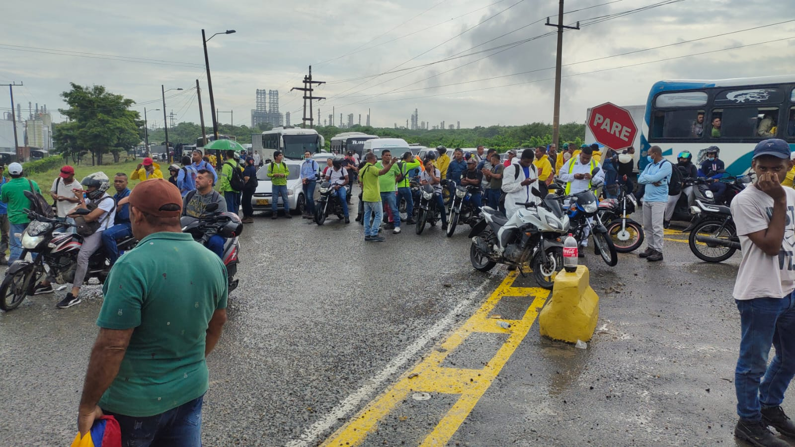
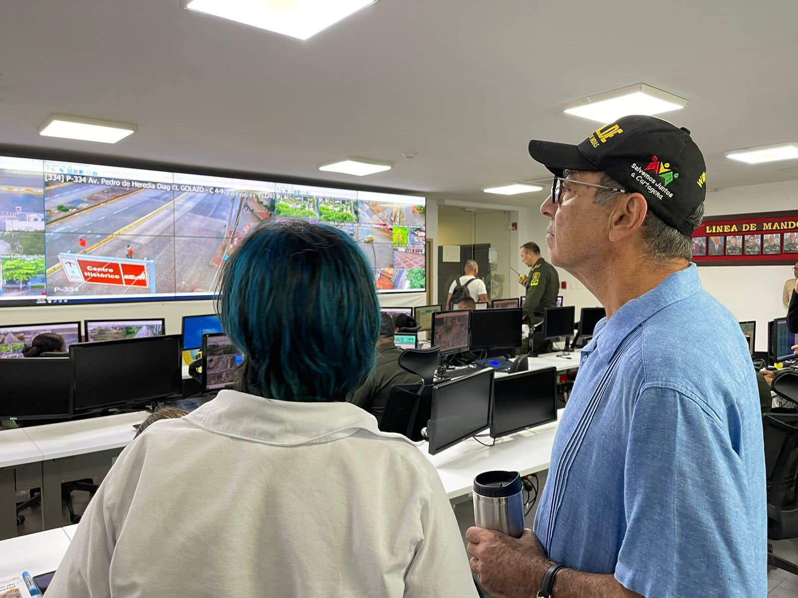

*Vía a Mamonal, la zona industrial. #SOSCartagena*

Cartagena amaneció hoy, como de costumbre, caótica. El Paro Cívico Distrital contra la negligencia del alcalde se cumplió sin heridos y, mucho menos, sin muertos. Fue pacífico. Ni siquiera hubo sicariato. Contraria a la conducta del alcalde, pendenciera, violenta y falta de respeto a la ciudadanía con expresiones injuriosas y descalificadoras. El mandatario desde la madrugada del 22 de septiembre ordenó la toma de los puntos anunciados de la protesta para intimidar a los manifestantes y sus organizadores. Al final, la **Comisión Quinta** del senado atendió el #SOSCartagena.

En efecto, esa célula legislativa sesionará en Cartagena para que el gobierno nacional y los organismos de control intervengan en la crisis social y de seguridad que vive la ciudad.

¿Por qué razón los parlamentarios tradicionales y del Pacto Histórico de Bolívar no promovieron ese debate? Algunas voces dicen que por intereses individuales. La verdad es que el pasado contralor, Pipe Córdoba, según algunas fuentes, pudo pecar de tráfico de influencia junto a un senador de Cambio Radical que le hizo la vuelta a William Dau **para levantar la suspensión provisional que pesaba sobre él**. Tenemos en reserva el nombre, porque estamos verificando la información.

## Vea #SOSCartagena

https://youtu.be/zjJaYQWgDzY

Sin embargo, para el alcalde **William Dau Chamat** y sus epígonos de la CUT y otros sindicalistas, que ahora pasaron a ser patronales, **el Paro Cívico Distrital fue un fracaso**. Más allá de esta disparidad, los hechos hablan por sí solos. **La ciudad estaba paralizada desde las 5:50 de la mañana hasta las 12:30 del mediodía.** Por la tarde, se había levantado el cese de actividades. Se regresó a la rutina de siempre: caos vehicular, crisis social, crisis ambiental, crisis de seguridad ciudadana, Pero también a las mismas payasadas del alcalde junto con sus calumnias y perversidades.

## La ciudad de la calumnia

*Aquí el alcalde William Dau y Ana María González, los dos están cortados con la misma tijera. Solo sirven para propagar el chisme desde la alcaldía. Cortesía.*

El mejor escenario de un alcalde mitómano es Cartagena. Entre los líderes sociales se corrió la bola de que la protesta es financiada por Dumek Turbay y otros políticos de la ciudad. No había ninguna evidencia de que ello era así. Y, aunque lo fuera, no invalidaba los urgentes propósitos de la protesta social. Aquí la calumnia vuela a velocidad supersónica. Es una herencia que dejaron los españoles en la época de la colonia. No en vano, el poeta insigne **Luis Carlos López** la **"llamó ciudad de vencejos"**.

La consabida arma de **William Dau Chamat** es la calumnia y la deshonra. Y le ha dado resultado. Es un individuo tóxico. Todo lo que toca lo destruye y lo quema. Su materia prima es el chisme. Los que le hablan al oído son iguales. Por esa conducta, los jueces lo han encontrado responsable de calumnia y deshonra en más de 20 procesos.

## Dau es un individuo peligroso

Cuando este periodista lo confrontó el 2 de febrero de 2021 en el inicio de un proceso de revocatoria, no tuvo argumento cuando **le pregunté si consumía bazuco revuelto con marihuana y tabaco**. Si era adicto a una droga. Si sufría de alguna enfermedad mental. Solo atinó a amenazar al periodista. Días después, el 19 de febrero, **una patrulla de policía al mando del teniente Herazo desarmó a mi escolta y me detuvieron ilegalmente.**

O sea, Dau es un individuo peligroso. Presentó una tutela contra este periodista, pero le fallaron en contra. ¿Cuál fue el argumento del tribunal? El periodista se basó en hechos concretos y no en calificativos sin argumentos. Contrario a como suele hacer el mismo alcalde. Lo más degradante de todo esto es la conducta de la justicia. Pese a las evidencias de corrupción del alcalde, lo mantiene en el cargo. Otro estaría en la cárcel. ¿Por qué la Procuraduría le cayó con todo a **Campo Elías Terán y a Manolo Duque**?

El alcalde William Dau conoce perfectamente el modus operandi de los corruptos y sabe cómo chantajearlos. Se ha mantenido en el poder, porque él mismo utiliza los métodos de los corruptos para comprar complicidad. Por ejemplo, cuando inició su gobierno nombró como jefe de comunicaciones del Distrito al otrora periodista de Semana, **Tadeo Martínez**, quien se encontraba trabajando en el despacho del procurador **Fernando Carrillo**. Así como Carrillo, logró neutralizar a otros altos funcionarios de la Fiscalía, la Contraloría, y de la misma justicia. No en vano la jefe de la Oficina de Jurídica, **Myrna Martínez Mayorga**, viene del Tribunal de Bolívar y del Atlántico. ¿Como la ves?

## Un éxito para un #SOSCartagena

Para los organizadores, el Paro Distrital fue un éxito, porque se cumplieron los objetivos. Que no se dieron las confrontaciones violentas con la fuerza pública y que no llegó masivamente la gente a protestar, es verdad. Pero el paro se cumplió en la mañana. Por ejemplo, Transcaribe solo hizo el 50% de los viajes diarios, lo cual coincide con el hecho de que la actividad social fue hasta el mediodía. Las universidades no dieron clases como también las instituciones educativas. Las principales vías de la ciudad quedaron paralizadas. (Lea [¡Hoy, todos al Paro Distrital!](/articulos/hoy-todos-al-paro-distrital/)).

Al respecto, Héctor Pérez Fernandez y Erick Urueta confirmaron lo dicho. Y esa fue la conclusión a la que llegaron los coordinadores en una reunión de evaluación realizada en el día de hoy. A propósito de la declaración del alcalde según la cual los sindicatos de la CUT no apoyaron el paro, uno de los coordinadores del Parto dijo:

> _"La CUT recibe órdenes del alcalde William Daut. Es la única central que respalda al alcalde en todo lo que dice. Lo que pasa es que el alcalde desconoce que en el país existen más centrales de trabajadores. Además de la CUT, la CTC, la CGT, la Confederación de Trabajadores Públicos. Él cree que la CUT es la única central del país. ¡No, señor! Incluso con nosotros hay sindicatos de la CUT. El presidente de la CUT, tal vez fue el único que atendió la orden de Dau de no paralizar. Esto no es político, como el alcalde dice. Aquí estamos veedores, líderes sociales, comunales y ciudadanos comunes"_.

## Comisión Quinta del senado

https://twitter.com/YennyRozoZam/status/1573357060804472832?s=20&t=sCJ\_BOY0PJGquMGwv3WdiA

La senadora **Yenny Rozo** es la única parlamentaria que realmente se ha ocupado de Cartagena. Y eso que es cachaca, de Cundinamarca. Los parlamentarios de la ciudad y de Bolívar o no se atreven a denunciar a Dau o esperan agazapados para que otros hagan el trabajo que ellos deben hacer. La representante Dorina Hernández estuvo en el centro histórico haciendo presencia. Pero hasta ahora no ha reunido a su bancada para hacer algo por #SOSCartagena. La misma bancada que se alió al alcalde en las elecciones parlamentarias de marzo.

En ese sentido, Rozo viajará a Cartagena con el fin de coordinar con las fuerzas vivas de la ciudad la preparación de la audiencia pública de la Comisión Quinta del senado de la República. Aquí están citados los funcionarios del alto gobierno para conocer en profundidad lo que está sucediendo con Cartagena. Igualmente se invitará al alcalde de Cartagena, William Dau Chamat.

## Audiencia Defensorial para atender #SOSCartagena

/articulos/luciotorres/status/1573414431798996992?s=20&t=sCJ\_BOY0PJGquMGwv3WdiA

Igualmente se realizará una **Audiencia Defensorial** con el apoyo de la Defensoría del Pueblo, de acuerdo a la información entregada por el defensor de Bolívar, **José Hilario Bossio**.

En esa audiencia se espera la llegada del Defensor del Pueblo y de los funcionarios que serán invitados especialmente a una Mesa Técnica con el fin de organizar los temas y peticiones de la ciudadanía en torno a la grave crisis que vive #SOSCartagena

Independientemente de lo que el alcalde comente, el Paro Distrital fue un éxito. Pero también señala que la alcaldía ha caído en un profundo deterioro moral y político. El alcalde no ha sido digno del cargo que ocupa. Una audiencia de la Comisión Quinta, una Audiencia Defensorial y un despertar de la ciudadanía indica que el presidente Gustavo Petro debe asumir un papel más activo con #SOSCartagena. Por supuesto, se debe respetar el principio de complementariedad y la autonomía territorial.