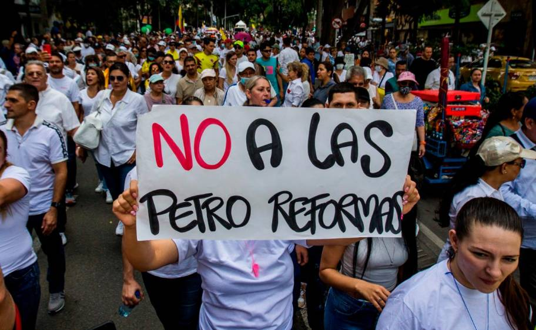
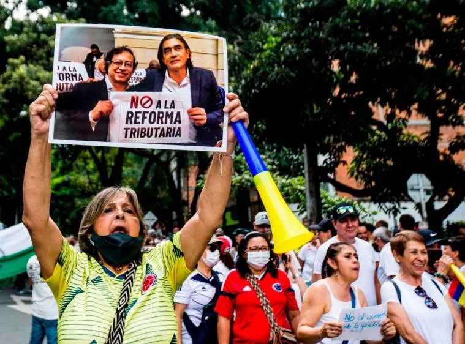
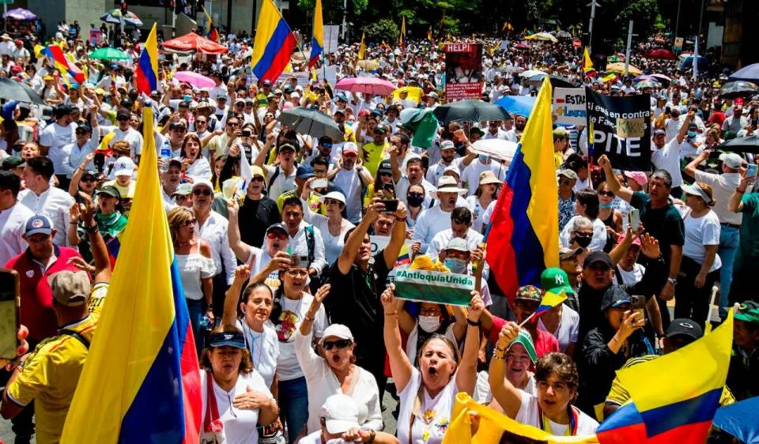

*La derecha se moviliza contra las petroreformas. Cortesía ElColombiano.*

Por primera vez en la historia, la **derecha se moviliz**a contra un presidente de Colombia. Ahora experimenta el hecho de no controlar monolíticamente el gobierno. Aunque las marchas de este 26 de septiembre fueron tímidas, podría ser la cuota inicial de un movimiento que se acrecentaría paulatinamente. Esto solo sucederá si el presidente Gustavo Petro no cumple con lo prometido en su propuesta de **Cambio para la Vida**.

Se debe aclarar que el gobierno del Pacto Histórico es compartido con amplios sectores de la derecha colombiana. Por ejemplo, el partido de la U, el Conservador y el Liberal. Petro ejerce un **gobierno compartido con la derecha**. Sin embargo, el sector más recalcitrante profundizará sus acciones con el fin de empujar el desgaste del gobierno nacional.

Las marchas más significativas fueron las de Medellín, Bogotá, Cali y Bucaramanga. En la región Caribe se realizaron tímidas marchas y concentraciones sociales. Así sucedió en Cartagena, Barranquilla, Valledupar, Montería y Sincelejo.

## Gobierno dice que hubo tranquilidad

Mientras tanto, **el ministro del Interior Alfonso Prada**, al casi finalizar la tarde, se pronunció oficialmente al señalar que la protesta es un derecho constitucional que se debe garantizar:

> Tanto la ⁦[@PoliciaColombia](https://twitter.com/PoliciaColombia?ref_src=twsrc%5Etfw%7Ctwcamp%5Etweetembed%7Ctwterm%5E1574502192471588871%7Ctwgr%5E58b09a9b9352c76da4e3150147046bdf7b6f42b4%7Ctwcon%5Es1_&ref_url=https%3A%2F%2Fvoxpopuli.digital%2Fwp-admin%2Fpost.php%3Fpost%3D19440action%3Dedit)⁩ como el Gobierno del señor Presidente ⁦[@petrogustavo](https://twitter.com/petrogustavo?ref_src=twsrc%5Etfw%7Ctwcamp%5Etweetembed%7Ctwterm%5E1574502192471588871%7Ctwgr%5E58b09a9b9352c76da4e3150147046bdf7b6f42b4%7Ctwcon%5Es1_&ref_url=https%3A%2F%2Fvoxpopuli.digital%2Fwp-admin%2Fpost.php%3Fpost%3D19440action%3Dedit)⁩ y todo su gabinete, tenemos claro que la protesta social es un derecho constitucional que debemos garantizar y que a los ciudadanos que marchan los debemos proteger y escuchar.

/articulos/alfonsoprada/status/1574502192471588871?s=20&t=b58VFoBSHd31Mq8T5a\_fVw

El tuit del ministro del Interior de Petro.

## Marchas inéditas

Hasta ahora las calles habían sido escenario de la izquierda y de las organizaciones sociales marginadas del país. Escenarios de luchas contra políticas gubernamentales. El último caso significativo fue el Paro Nacional del 28 de abril contra la Reforma Tributaria de **Iván Duque**. En la primera semana de protesta, Duque se vio obligado a retroceder y archivar su reforma.

Nunca antes los sectores de la derecha habían desarrollado **marchas antigubernamentales**. Esta es la primera vez que lo hacen contra un gobierno. Ni siquiera en el gobierno del general Rojas Pinilla en 1954. Los estudiantes fueron los protagonistas de esas marchas y las víctimas de la represión del gobierno de facto. Represión que se inició con la muerte del estudiante **Uriel Gutiérrez** el 8 de junio de 1954, luego de realizar una movilización para conmemorar la muerte del estudiante **Gonzalo Bravo Pérez** ocurrida en 1929. Al día siguiente se levantaron contra el régimen que los recibió a balas. Murieron en esa tragedia varios estudiantes.

Se puede considerar que estas movilizaciones podrían ser el inicio de un proceso social y político que busca ablandar al gobierno del presidente Petro. Son golpecitos en el inicio del primer asalto de una pelea que debería durar 4 años. Si bien, al principio podrían ser marchas tímidas, estas se podrían fortalecer con el tiempo siempre y cuando el presidente Petro no responda a las grandes expectativas que despertó en las masas sociales del país.

## La derecha se moviliza en Medellín

*Así fue la marcha en Medellín. Cortesía ElColombiano.*

Se debe destacar que las marchas en Medellín, según reportes de diferentes fuentes noticiosas, fueron las más contundentes y masivas. Existen dos razones para que esto fuera así. La primera, existe un malestar contra el gobierno del alcalde **Daniel Quintero** que se combinó con el malestar contra Gustavo Petro de la derecha paisa. La segunda, Medellín y Antioquia reúne un acumulado de la derecha de Colombia, la cual se expresó en las pasadas campañas electorales.

Desde las 10 de la mañana las principales calles de Medellín hasta la Alpujarra fueron tomadas por los manifestantes en una forma pacífica, según informa El Colombiano. Pero se presentó una situación que afecta el derecho a informar y a la libertad de prensa. Es el caso de que algunos manifestantes empujaron y echaron **al camarógrafo Carlos Tamayo** y el periodista **Marco Madrigal** fueron estrujados**, amenazados y obligados a abandonar** la marcha cuando ejercían el derecho al trabajo.

## La derecha se moviliza contra las Petro-reformas ¿el comienzo?

https://twitter.com/MiguelUribeT/status/1574436956037152770?s=20&t=b58VFoBSHd31Mq8T5a\_fVw

Solo han pasado 50 días desde que el presidente Gustavo Petro juramentó como presidente de la república. Es muy poco tiempo para sopesar a un gobierno. Pero, la derecha no va a esperar tiempo para manifestar su inconformismo con un gobierno que no le representa monolíticamente. Acostumbrada a tener presidente, y controlar el congreso, ahora se limita a compartir el gobierno con el presidente Petro.

Si bien Gustavo Petro es el presidente, tiene un gobierno compartido. Más de la mitad de su gabinete hace parte de la derecha colombiana. Incluso, el partido conservador se declaró partido de gobierno, luego de acompañar por más de 22 años el ala más conservadora y de derecha que es el Centro Democrático.