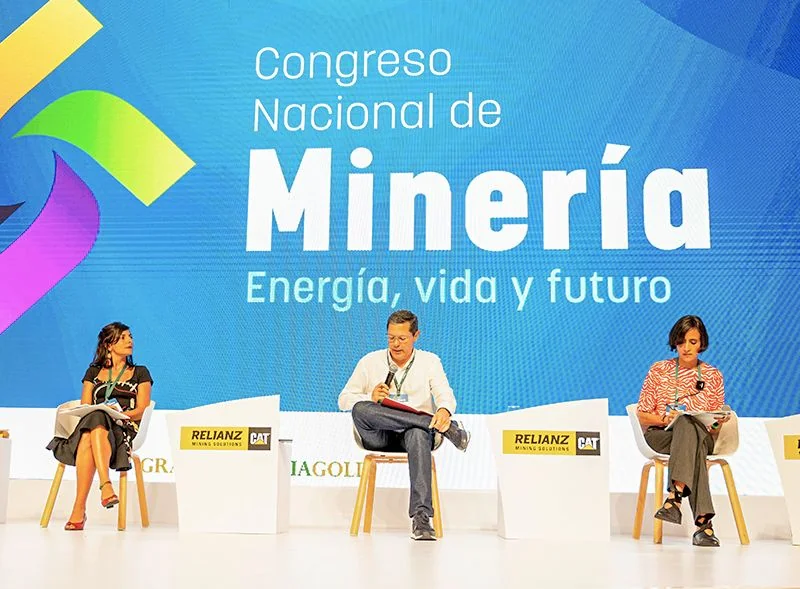
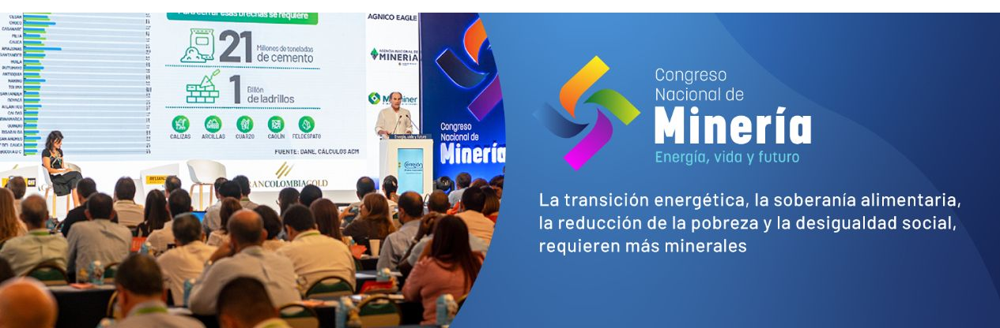

*En este panel la ministra de Minas y Energía, Irene Vélez, habló como activista y poco como ministra sobre decrecimiento económico. A la derecha, la ministra del Medio Ambiente, Susana Muhamad. Modera Juan Roberto Vargas. Cortesía.*

Una cosa es la teoría y otra cosa es la práctica. No es lo mismo exponer la teoría del decrecimiento económico en Cartagena de Murcia que en Cartagena de Indias. Una cosa es la teoría del decrecimiento para los países desarrollados y otra cosa es la teoría de la superación de la pobreza en las naciones llamadas del Tercer Mundo en donde se encuentra inscrito nuestro país.

La ministra de Minas, **Irene Vélez Torres**, este jueves 1 de septiembre en una improvisada rueda de prensa, quedó atrapada en ese intersticio entre la teoría y la práctica, y entre la contradicción y la tolerancia. Creía la ministra Vélez Torres que estaba entre sus estudiantes de filosofía y no frente a los participantes y periodistas que cubrían el Congreso Nacional de Minería, Energía, Vida y Futuro.

## Para entender a la ministra Vélez

/articulos/luciotorres/status/1565747054743375879?s=20&t=QKSMnWkn\_r6VNMYWjyJy0A

Pero hay algo más que puso a prueba a la ministra de Minas y Energías. Fue su capacidad de tolerancia frente a una prensa que quería saber más sobre su aparente contradicción conceptual. En su declaración ante el Congreso de Minas, Vélez dijo que **"esperaba de los otros países un decrecimiento de sus modelos económicos"**.

/articulos/jarizabaletaf/status/1565439088454426625?s=20&t=OTR2eqIvqcoGsMHXJrRzDQ

Cortesía Razon.com

Cómo entender el pensamiento de la ministra en un evento donde su presidente Juan Camilo Nariño había dicho:

> "Vale la pena mencionar que el sector realiza aportes de **184.000 millones de pesos en inversión social**, lo que significa más de cinco veces la inversión obligatoria del sector. De esos recursos, el 40% es destinado a educación, salud, emprendimiento e infraestructura vial, **los cuales son concertados con las comunidades que van a ser beneficiadas**".
> 
> Juan Camilo Nariño.

## El decrecimiento de Minminas

*Se requiere más minerales para construir 1,5 millones de viviendas para los más pobres. El decrecimiento económico no es la solución. ¿Cuál es la salida?*

Las ministras del presidente Gustavo Petro que fueron invitadas en el Congreso de Minas y Energías fueron Susana Muhamad (Minambiente) e Irene Vélez Torres (Minminas) para disertar sobre transición en el cambio climático, soberanía alimentaria y reducción de la pobreza. Se debió convertir en un buen escenario para presentar con claridad cuatro de las estrategias que tiene el nuevo gobierno: cambio climático, seguridad alimentaria, energías limpias y economía sostenible.

Expresar el concepto del decrecimiento económico en medio de un congreso que espera del gobierno de Petro la sostenibilidad y crecimiento de la economía, podría sonar a un contrasentido. ¿Cómo puede lograrse la soberanía alimentaria, por ejemplo, sin crecimiento económico? Se entiende que esto está dado por indicadores para medir el PIB, la inflación, la tasa de empleo, la productividad, etc. ¿Cómo se come eso en un modelo económico donde el crecimiento es el síntoma de progreso? Para que avance la economía debe consumir más energía. ¿Cómo suplimos eso en un país empobrecido como el colombiano?

Sin embargo, la **"teoría del decrecimiento económico"** la vienen sosteniendo algunos **economistas ecologistas** y hasta filósofas que, como la propia Irene Vélez, consideran que la humanidad está consumiendo los recursos naturales como si tuviera casi dos planetas (1,7). Si todos los países del mundo crecieran al ritmo de los más desarrollados, no se podría cumplir las metas globales en materia de temperatura global. A simple vista es una verdad contundente. ¿Cómo llevarla a la práctica? ¿Qué país asumió ese modelo?

## Los acuerdos globales del Cambio Climático

Recordemos que en 2018 el Grupo Intergubernamental de Expertos sobre el Cambio Climático de la ONU (IPCC) publicó un informe especial que describe bajar el consumo de energías fósiles para evitar un calentamiento global por encima de 1,5°C sobre niveles preindustriales. El informe concluyó que las emisiones globales deben reducirse a la mitad antes del año 2030 y llegar al cero neto antes de mediados del siglo.

> "_Este problema se debe fundamentalmente al hecho de que el crecimiento económico previsto impulsa la demanda de energía a un ritmo mayor que el del despliegue de la capacidad de generar energías limpias (Raftery et al., 2017). Esto ya ha supuesto un problema en el siglo xxi. A día de hoy, el mundo genera anualmente 8.000 millones más de megavatios/hora de energía limpia que en el año 2000, lo que es un aumento importante. Sin embargo, durante este mismo periodo, la demanda de energía aumentó en 48.000 millones de megavatios/hora"_.
> 
> El DECRECIMIENTO: La teoría de la abundancia radical (documento no disponible).

En síntesis, esta teoría señala que el ritmo habitual de crecimiento económico llevará a rebasar el límite de dióxido de carbono a mediano plazo. Pero esto no supondrá un problema si eliminamos el dióxido de carbono (CO2) de la atmósfera a lo largo de este siglo. Y aquí reside el problema.

## El decrecimiento de Minminas

Como se dijo, no es lo mismo exponer la teoría del decrecimiento económico en Cartagena de Murcia que en Cartagena de Indias. En Europa están preocupados por el C02, y nosotros estamos preocupados por la comida del día. En una ciudad donde el 60% sólo consume dos de las tres comidas diarias, donde la pobreza llega a más del 40%, hablar del decrecimiento económico necesita una explicación mesurada.

La ministra Vélez Torres debe saber que para poner en práctica la teoría del decrecimiento económico se debe empezar por un modelo económico radicalmente contrario al que existe en Colombia. Esta teoría exigirá que las políticas se centren en **redistribuir la renta actual, acortar la semana laboral, e instaurar una garantía de trabajo y un salario digno** a la vez que se amplía el acceso a los bienes públicos. ¿Es eso lo que está implementando Gustavo Petro con la Reforma Tributaria, la Reforma Agraria? ¿Vendrá la Reforma del Congreso? ¿La Reforma Política? ¿La Reforma Económica?

No obstante, según esta teoría el proponer la existencia de la abundancia, el decrecimiento proporciona una vía política hacía una economía ecológica adaptada al Antropoceno. Es decir, es un modelo que en la teoría se adapta al cambio climático. Un modelo que reduce la rápida acumulación de gases de efecto de invernadero como los daños irreversibles ocasionados por el consumo excesivo de recursos naturales. Pero una cosa es la teoría y otra la práctica. Una cosa fue el **socialismo** expuesto por Marx, Engels, Owen, y otra el **socialismo real** de Lenin, Stalin, Mao, Castro, Ortega y Chávez. Consiguió todo lo contrario a lo pregonado por la teoría. Podría ser una nueva falacia del cambio climático.