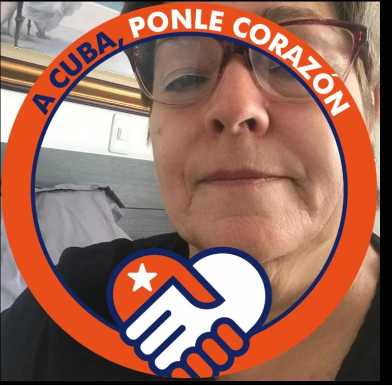

Acaba de ser designada una comunista delegataria presidencial: **Gloria Inés Ramírez**. Tendrá cinco días de gloria. Sin duda, este hecho es histórico. Y es un desafío a la oposición de extrema derecha del país y de la izquierda tradicional.

**La ministra del Trabajo y Seguridad Social es una consumada militante del partido Comunista.** A partir de las 8 de la mañana de hoy, tiene funciones presidenciales mientras dure la ausencia del presidente Gustavo Petro.

La caldense, nacida en Filadelfia, es una veterana dirigente comunista. En el 2008 fue miembro del buró político del Partido Comunista Colombiano-PCC. Además, como senadora comunista, se caracterizó por su papel de sindicalista en la época en que el partido comunista ejercía una hegemonía en la izquierda colombiana.

## Una intervención histórica prepara Petro

Como a pedido de boca del presidente colombiano, la temática de la Asamblea fue denominada “**Un momento decisivo: soluciones transformadoras para desafíos interconectados**”.

/articulos/luciotorres/status/1571465110861844480?s=20&t=x121XTBN0knEFMt32sDrTA

Conociendo el lugar común del discurso del presidente Gustavo Petro durante su primer mes de gobierno, **se podría colegir que la intervención en la ONU versará sobre dos temas imprescindibles**. El primero se refiere a la **Paz Total** y a la necesidad del apoyo de las naciones del mundo, especialmente de la república bolivariana de Venezuela. El segundo tema podría versar sobre la **adaptación al cambio climático y a la soberanía alimentaria**.

Como se sabe, el mandatario de los colombianos viajará en la mañana de hoy a Nueva York con el fin de participar en la 77° Asamblea General de la ONU. La intervención del presidente Petro está prevista para el martes en la mañana ante el plenario y será el quinto en hablar. La Asamblea es presidida por **Csaba Korösi**, de Hungría. Petro hablará después de **Jair Bolsonaro** (Brasil), **Joe Biden** (Estados Unidos), **Gabriel Boric** (Chile) y de **Abdalá II bin Al Hussein**, rey de Jordania.

Además, la delegación colombiana estará compuesta por la embajadora de Colombia en la ONU, **Leonor Zalabata**; la Jefe de Gabinete, **Laura Sarabia**; los ministros de Ambiente, **Susana Muhamad**, y de Educación, **Alejandro Gaviria**. De igual manera, con el presidente Petro estarán el ministro de Relaciones Exteriores Álvaro Leyva Durán y la Viceministra de Asuntos Multilaterales, la colombo-uruguaya, Laura Gil, otros altos funcionarios.

## Gloria Inés Ramírez, una comunista delegataria presidencial

*Una comunista delegataria presidencial*

El hecho de que Gloria Inés Ramírez sea una comunista delegataria presidencial, se constituye en sí mismo, un verdadero desafío a los líderes de la extrema derecha colombiana. En consecuencia, es un acto que provocará más de una declaración de los sectores extremos del país. La extrema izquierda se llenará de júbilo. La extrema derecha se indignará. Pero esto le gusta a Petro, desafiar, debatir, confrontar y construir opinión pública a contrapelo.

Por primera vez una comunista será comandante en jefe de las Fuerzas Armadas Colombiana. Es un hecho trascendental, toda vez que nuestra tradición militar está guiada por la doctrina de Seguridad Nacional. Esta concepción inspiró al sector más retardatario de los militares colombianos unirse a fuerzas políticas de extrema derecha ideologizando el deber militar. Entonces, la obediencia militar respondía a la ideología del mandatario y no a la constitución y a la ley. Esto provocó, por ejemplo, el genocidio de la Unión Patriótica, de la cual es sobreviviente Gloria Inés Ramírez.

## Un mensaje a la izquierda

https://twitter.com/RoyBarreras/status/1571345115402178560?s=20&t=hqo2BuNbmxsNsIQHEKxc8g

Gustavo Petro es un político consumado. Es pragmático. Pero, en la mayoría de sus decisiones, tiene una razón ideológica más que política. Se entiende que la ideología determina las decisiones de los políticos profesionales.

Pero esta apreciación queda en duda en los parlamentarios y políticos profesionales colombianos. Las fronteras ideológicas de los partidos políticos son difusas. El Pacto Histórico es un ejemplo elocuente de esta apreciación analítica. Un politólogo académico no entendería que una coalición de izquierda estuviese liderada por Roy Barreras, exadherente uribista y santista. Es un político profesional, cuya ideología es muy voluble y elástica. Tiene una gran capacidad para cambiar su cuadrante de creencias. ¿Se entiende?

Se explicará con plastilina la decisión de designar a una comunista como delegataria presidencial. Algunos pensarán que es un desafío para la extrema derecha. Otros considerarán que es una cortina de humo del presidente para poner a discutir a la mandarria de derecha y distraerla de lo central.

## Petro junto a Maduro

No obstante, se podría estimar que la verdadera intención de Gustavo Petro es enviarle un mensaje de confianza a Nicolás Maduro para conseguir su apoyo al proceso de paz colombiano. Sin ese apoyo, sería imposible de conseguir resultados en su Paz Total. Pero también, es un mensaje para el sector más tradicional de la izquierda colombiana ligada al tema de la paz y de la guerra.

El presidente Petro podría decirle al jefe del régimen venezolano en el preludio de la 77° Asamblea General de la ONU:

> "Oye, te tengo a una chavista y comunista delegataria presidencial. Vamos navegando hacia el mismo objetivo".

Aunque ello no podría suceder exactamente como se expresa, sí será un mensaje explícito para el régimen chavista. Esto complementaría las decisiones tomadas por el presidente Petro en este primer mes de gobierno con relación al país de los patriotas. Recordemos que a partir del 26 de septiembre se reabrirán los 2.200 kilómetros de fronteras de los dos países. También fue nombrado como embajador de Venezuela Armando Benedetti, alter ego de Petro en campaña. Benedetti dijo sentirse feliz cuando el empresario barranquillero Alex Saab fue capturado en Cabo Verde. Una de las socias políticas de Saab es Piedad Córdoba. ¿Qué hay en el canto de la cabuya?

## Una comunista delegataria presidencial para la derecha

La designación de Gloria Inés Ramírez también se podría interpretar como un baldado de agua fría para la derecha caliente del país. En sí, este movimiento de ajedrez de Petro se podría resumir en un dicho que tenemos en el Caribe. **"Al que no quiere sopa se le dan dos tazas"**. Si la derecha se inquieta, ¿Petro se apresurará a dar un mayor giro a la izquierda? No.

El presidente Gustavo Petro busca amargarle la vida a la derecha con el fin de conseguir el consenso de la izquierda tradicional y sindicalista. Con este movimiento captura a la dirigencia popular para evitar movimientos sociales y sindicales que lo pongan en aprieto. Tal como le sucedió al presidente Duque en el Paro Nacional. Si no le va bien en la Reforma Tributaria, la Reforma Agraria y en sus objetivos sociales, seguramente espera contar con los sectores más radicales de la izquierda colombiana.

Mientras tanto, el jefe natural del Centro Democrático, **Álvaro Uribe Vélez**, podrían lanzar sus agudas críticas políticas al gobierno naciente de Gustavo Petro.

## ¿Y Francia Márquez?

**¿Por qué Gustavo Petro no designó con funciones presidenciales a Francia Márquez?** Es una mujer afro que propugna por la inclusión. ¿No tiene porte de estadista? ¿Carece de la preparación? ¿Qué pensará el senador **Alexander López** y el Polo Democrático? Quien debe estar muy alegre es el senador **Iván Cepeda**, ya que su padre, **Manuel Cepeda Vargas**, con quien pude conversar varias veces en Barranquilla, fue un dirigente comunista cuando Inés Ramírez era una militante rasa de ese partido. Cepeda Vargas -contrario a Ramírez- no sobrevivió al genocidio contra la Unión Patriótica. (Leer: [Francia- Petro ¿giro a la izquierda del Pacto Histórico?](/articulos/francia-petro-giro-a-la-izquierda-del-pacto-historico/)).

Sin embargo, algunos podrían pensar que Petro no designó a su vicepresidenta Francia Márquez debido a las tensiones políticas del Polo con el mandatario. Tensiones matizadas por la omisión de Petro de nombrar en su equipo social a los allegados de Márquez. Pero, en realidad, Petro lo hizo movido por lo señalado en este artículo.

Gloria Ramírez se vestirá de fiesta. Tendrá cinco días de gloria. Es un homenaje a los familiares de 1.163 integrantes de la Unión Patriótica asesinados y 123 desaparecidos. ¿Qué pensará Uribe y Enrique Goméz y la Cabal?