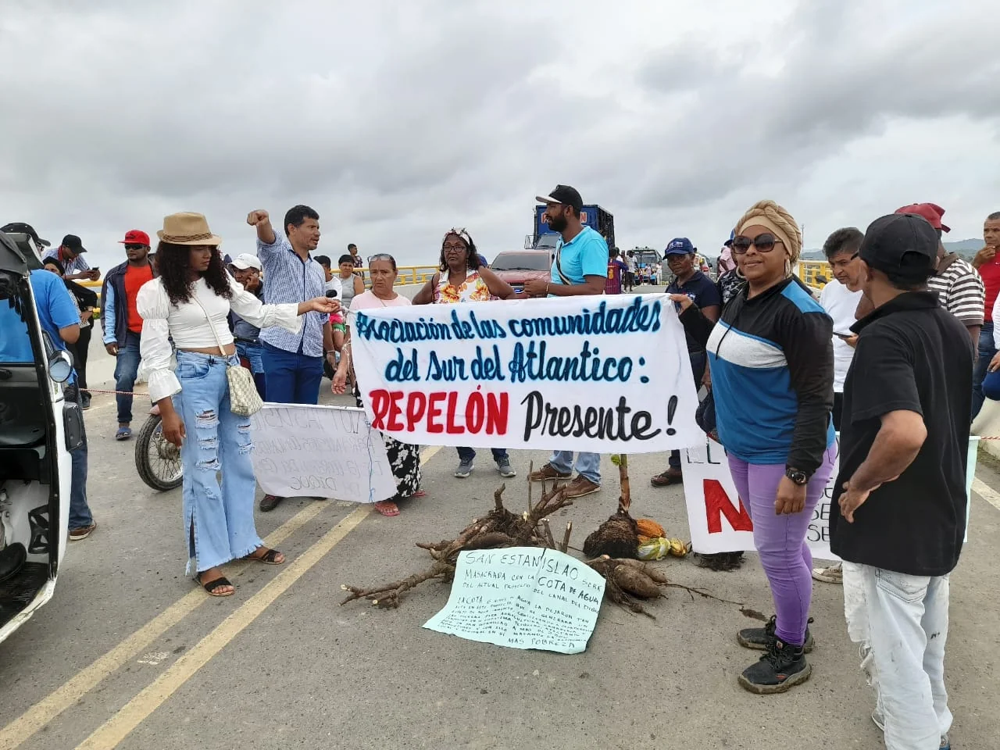

https://youtu.be/zmIajhHg5Rs

La gente fue atraída por el magnetismo del presidente Petro, pero en el escenario político la situación fue otra cosa.

¿A qué se debe la indecisión del gobierno de Petro en torno al Canal del Dique? Mucho tilín tilín del gobierno nacional con el caso del macroproyecto Canal del Dique que busca Restaurar los Ecosistemas Degradados Canal del Dique. Y eso no está bien. Las comunidades organizadas y la Alianza para la Defensa y Desarrollo Canal del Dique realizaron acciones directas para que el Macroproyecto dialogara. Se logró el aplazamiento de la licitación para el 12 de agosto con el fin de que el nuevo gobierno definiera su suerte. **Pero un mes después sigue con la misma indecisión**.

*Tilín tilín*

La Comisión Accidental Bicameral del congreso escuchó a la comunidad el pasado 28 de agosto después de una accidentada instalación donde las comunidades exigieron participación. Como el ejecutivo viene dando mucha vuelta con relación a esta iniciativa, se espera una respuesta más contundente de la población que afectará la megaobra.

## Indecisión del gobierno de Petro

En la audiencia del 28 de agosto del 2022 la Comisión Accidental Bicameral escuchó 48 intervenciones, luego de que había dispuesto solo 8 intervenciones. A la semana siguiente, sus coordinadores le enviaron al presidente Petro un oficio con las conclusiones del evento a fin de que tomara la decisión antes del 12 de septiembre, fecha límite para ello.

Sin embargo, el 8 de septiembre en Santa Lucía se repitió lo mismo que el 28 de agosto. Se esperaba una decisión el día que el presidente visitara a Santa Lucía. Pero llegó sin decisión y la comunidad salió molesta y decepcionada. Peor, tampoco encontró una respuesta respecto a la urgencia de la ola invernal que, según el IDEAM, se recibirá este año un 50% más de lluvia que en 2010 cuando hubo las últimas inundaciones.

Ahora esperaremos hasta el 30 de septiembre, fecha en la cual se espera que el gobierno nacional adopte una posición sobre el macroproyecto Canal del Dique. El presidente Petro parece que no ha entendido que para corregir los errores del diseño del proyecto, se debe modificar el pliego de condiciones de la licitación. Esto implicará revocar el proceso licitatorio. Este es el punto fundamental, y tal vez por el cual están dando tanta vuelta para tomar una decisión. Esto es, hacen socializaciones exprés sin ninguna sustancia. Mucho tilín-tilín.