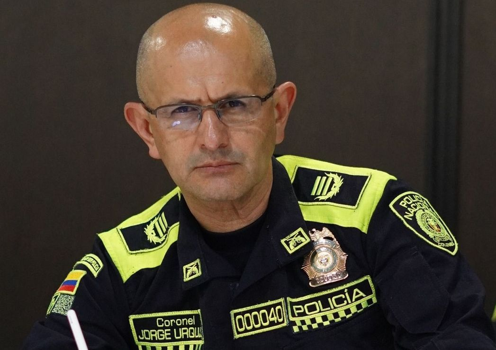

*¿Capos y fiscales en la fiesta de cumpleaños? Aquí Jonathan Ospino Illera había cumplido 22 años. Un año más tarde pereció en su fiesta de cumpleaños 23, luego de asesinar a sangre fría al escolta de Vega Daza.*

¿Capos y fiscales en la fiesta de cumpleaños? Entre los invitados a la fiesta de cumpleaños del hoy occiso, **Jonattan José Ospino Illera**, al parecer, había capos de la mafia, fiscales y funcionarios públicos. En el Mediterrané (finca ubicada en Salgar propiedad de **Mauricio Gerlein Echeverría**) estarían varios funcionarios públicos, incluso de la Fiscalía, que ahora quieren pasar desapercibidos. Al mismo tiempo, se destaca la presencia de algunos **«peces gordos» del tráfico de droga** y empresarios emergentes vinculados al comercio de la droga de Barranquilla, Santa Marta y de La Guajira que, al parecer, realizaban paralelamente una cumbre para llegar a un **acuerdo de no agresión**.

Las primeras versiones de esta balacera indican que el **«florero de Llorente»** fue la incomodidad que significó para el cumplimentado Jonathan Ospino un supuesto acoso sexual hacia una de las invitadas. Pero, hasta ahora, esta versión no ha sido confirmada por ninguna de las autoridades. Esta versión quiere enmascarar, posiblemente, la verdadera realidad de esta trágica fiesta de cumpleaños.

## Viste la historia en este documental

https://youtu.be/ceINFO40xto

La ira carcome a uno de los pistolero de la trágica amanecida del 24 de octubre. Se le conoce en el bajo mundo como ****«**Deivi Parrilla**». Tiene una subametralladora y una pistola 9 milímetro en la pretina y varios proveedores en el bolsillo.

La primera pregunta del análisis: ¿Por qué razón había en la fiesta de cumpleaños reconocidos **«peces gordos»** de tres bandas que han tenido rivalidades históricas? Allí estaban los **Vega Daza, los Escorcia y los Ospino**. Según informaciones de inteligencia, estas familias en el pasado han tenido fuertes choques. Además, **Roberto Vega Daza** es sobreviviente de un atentado sicarial en 2018 que se produjo cerca al centro comercial Buenavista de Barranquilla. En esa ocasión murió el sicario de nacionalidad venezolana que no alcanzó a consumar el asesinato. De la familia Daza son varias las víctimas por enfrentamientos similares ocurridas en diferentes momentos. Roberto Vega Daza es sobrino de **los hermanos Daza Mejía**.

Ese atentado, de acuerdo con el comandante de la **Policía Metropolitana de Barranquilla-MEBAR** de la época, general **Mariano Botero Coy**, fue causado por la incautación de un arsenal en Puerto Colombia. Estaba compuesto por ocho armas de fuego, entre las cuales había una subametralladora y abundante munición. El arsenal lo encontraron, coincidencialmente, en una caleta dentro de la **casa-finca La Mariana** en jurisdicción de Puerto Colombia**.**

## Indicios sospechosos

*Coronel Jorge Urquijo, dio explicaciones baladíes. ¿Capos y fiscales en la fiesta de cumpleaños?*

Volvamos a la pregunta inicial. ¿Capos y fiscales en la fiesta de cumpleaños? Existen varios indicios que indican que la fiesta de cumpleaños fue la mascarada para una cumbre de capos del narcotráfico que controlan el mercado de Barranquilla. Y se indica que las autoridades lo sabían. El primer indicio que los investigadores se podría topar es con la **conducta sospechosa de la misma Policía**. Es el caso de la detención y la liberación inmediata de **Roberto Vega Daza y de su hijo** al momento de salir de la fiesta de cumpleaños en la camioneta **Toyota Lexus color blanca blindada**, la cual recibió 42 impactos de bala. No solo fueron dos sino cuatro los detenidos. Esta información fue entregada por fuentes policivas a El Heraldo.

El segundo indicio que se puede citar son las mismas declaraciones del comandante de la MEBAR **coronel Jorge Urquijo** a los medios de comunicación. El oficial dijo que los detenidos fueron puestos en libertad en el transcurso del día cuando **«los abogados de ellos se presentaron y demostraron que las armas tenían salvoconductos»**. Que por razones de la **«detención administrativa**», tuvieron que dejarlo en libertad.

¿Puede la policía dejar libre a dos sospechosos que salen armados y escoltados de un tiroteo? ¿Le hicieron las pruebas técnicas a sus armamentos para verificar si habían participado en la refriega? ¿Pueden dejar libres a los capturados en flagrancia y que, además tienen anotaciones judiciales? ¿Acaso la detención administrativa no se puede prolongar hasta 24 horas? ¿Por qué la policía los retuvo menos de 6 horas? ¿Qué pasó allí?

## La detención excepcional de un capo

Al respecto de una detención excepcional, como es este caso donde hubo un tiroteo y dos muertos, la policía debió atenerse a la aplicación del **artículo 62 del Código Nacional de Policía**. De acuerdo con la Corte Suprema de Justicia:

> **«**Excepcionalmente en materia penal, la policía puede disponer **hasta de 24 horas** para establecer la plena identificación del aprehendido y comprobar la existencia de otras solicitudes de captura. Cuando ello ocurra, dará inmediatamente aviso a la autoridad que solicitó la captura.»
> 
> Corte Suprema de Justicia.

La Corte explicó que la fiscalía, en un tiempo máximo de 24 horas, contadas a partir del instante de la aprehensión que ejecutó la Policía Nacional, puede acudir ante un juez con función de control de garantías y solicitar la prórroga o la expedición de una nueva orden de captura.

> **«**Esto con la finalidad de legalizar la privación de la libertad de la persona que inicialmente fue retenida de manera preventiva con las finalidades previstas en la citada norma y respecto de la cual persisten motivos suficientes para disponer su detención».

## ¿Cumbre de capos y fiscales en la fiesta de cumpleaños?

Si los **Shotas** y los **Espartanos**, las dos bandas más sanguinarias de Buenaventura pudieron llegar a un acuerdo de no agresión ¿por qué las bandas de Barranquilla no podrían llegar a un pacto similar? Esas bandas asociadas al narcotráfico lo hicieron en el marco de un partido de fútbol celebrado en una cancha de ese municipio portuario del Valle del Cauca. ¿No podría suceder lo mismo en una **fiesta de cumpleaños de un joven** que está, supuestamente, asociado a uno de los capos y mostró su capacidad criminal al asesinar a **sangre fría** al guardaespalda del **«Kike» V**ega?

/articulos/lalenguamepica/status/1585681432340480001?s=20&t=jtdU5YV9ZZzLeg4EmY8YJw

Por supuesto, la lista de invitados de la fiesta de cumpleaños incluyó, de contera, a una horda de guardaespaldas armados. Incluso, tenían armas de asalto que ni siquiera la policía utiliza. Por ejemplo, **alias **«**Deivi Parrilla**» portaba un **subfusil Colt 9mm SMG**, el cual es accionado por retroceso que dispara a cerrojo cerrado, según el catálogo de su fabricante. El portador de esta arma es del equipo de seguridad de uno de los capos que hacía parte de la distinguida lista de invitados en la fiesta de cumpleaños de **Jonathan Ospino**.

## ¿Capos y fiscales?

En Barranquilla como en Cartagena y Santa Marta, las diferentes organizaciones asociadas al narcotráfico se encuentran en una dura disputa por el control del mercado de la droga. Existen tres grandes negocios en el bajo mundo de estas tres capitales portuarias. La **exportación a gran escala de la cocaína** utilizando muelles de las sociedades portuarias. **El microtráfico** que se ha extendido en la zona urbana y mueve tanta plata como la misma exportación. Y en tercer lugar, **la extorsión**.

Alrededor de este negocio giran las bandas armadas que brindan seguridad a los inversores de esta economía del bajo mundo. Es decir, las mafias armadas son utilizadas por las mafias económicas para asegurar el transporte y exportación de la droga que va al mercado norteamericano y Europeo. Existen otros empresarios que buscan monopolizar el comercio al menudeo. Para lograr su cometido, instrumentalizan estructuras armadas que se ponen a su servicio. Estas estructuras están afiliadas a una u otra organización delincuencial.

## Algo salió mal

Un poco antes de la 7:00 de la mañana del lunes 24 de octubre 2022, cuando el licor, la droga y la música había desinhibido a la mayoría de los asistentes, el protagonista de esta película real -a lo Francis Ford Coppola-, aparentemente tuvo un incidente con el equipo de seguridad del capo guajiro **Roberto Vega Daza**.

Ospino —quien cumplió 23 años de nacido— por alguna razón que no ha sido establecida oficialmente, disparó contra los hermanos  **Lázaro y Sebastián Enrique Escorcia**. Uno de estos fue internado en la Clínica Porto Azul con heridas de disparo. Ante esta situación, **Rubén Ricardo Galea** —uno de los guardaespaldas de Vega Daza— respondió y disparó en la humanidad de Jonathan Ospino, quien quedó gravemente herido. Posteriormente, los guardaespaldas de los Ospino Illera arremetieron contra los Vargas Daza, cuya camioneta quedó perforada por 42 impactos.

Sin embargo, es muy probable que esa cumbre que intentó unir a los capos aprovechando una fiesta de cumpleaños del sobrino de uno de ellos, se viera afectada por una mala administración de un incidente fortuito. Estos tipos de encuentros sociales son aprovechados para distribuirse el mercado sin enfrentamientos de las estructuras armadas de la mafia. Pero algo salió mal. Ante esta situación, es muy probable que se recrudezcan los enfrentamientos mafiosos.

## Se recrudecerá la guerra

Las autoridades deben prepararse para las retaliaciones de los bandos que salieron afectados en esta fiesta de cumpleaños. Muy probablemente, en los próximos días se presenten hechos asociados a esta fiesta de cumpleaños. Es una forma de retaliación de cualquier asesinato significativo para una de las mafias.

Sea la hipótesis que sea, lo cierto es que la sociedad barranquillera ha caído a niveles muy bajo de degradación. Como cuando operaba el **Clan de los Mellizos** en la década de los 90 donde jóvenes de estrato 6 se volcaron a la vida de lujo, droga y bebida. Incluso, el esposo de la hoy gobernadora es un producto de ese fenómeno de la narcoeconomía y pertenece a esa generación que vivieron momentos de esplendor con el narcotráfico. **Esta es otra historia que les contaré con pelos y señales**.