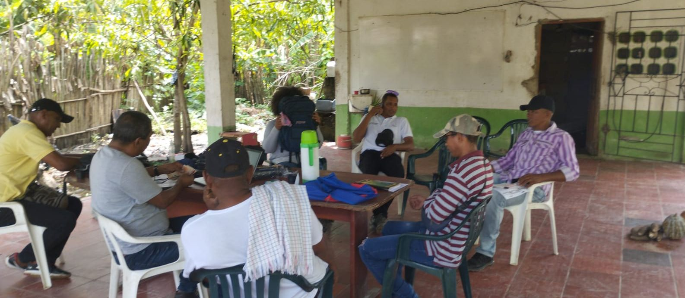

*Aquí el cheque ya se había firmado y la seño había "dejado el pelero". ¿Cómo se firmó el cheque en blanco?*

¿Cómo se firmó el "Cheque en blanco" del Canal del Dique? Fue una maniobra cocinada desde las altas esferas del gobierno nacional. A través del Ministerio de Transporte, la Agencia Nacional de Infraestructura-ANI y Sacyr (beneficiarios del cheque), crearon el 4 de octubre un verdadero teatro titulado **"Acuerdos de Voluntades"**. Este acuerdo no habla de lo esencial: **el licenciamiento social y ambiental que es un proceso previo al pliego de condiciones y, por tanto, **a la adjudicación**.**

El único propósito de esa parodia era **destrabar la licitación** de la APP Canal del Dique que afectará negativamente la soberanía alimentaria y, por ende, el hábitat de 680 mil humanos (Dane) que viven en todo el ecosistema regional.

Con el fin de que el **"Acuerdo de Voluntades"** no tuviese ninguna sospecha de maniobra, personas cercanas a los protagonistas de las firmas venían siendo "ablandadas" a través de lisonjas y promesas. Este proceso previo a la firma lo hicieron de una manera individual, según los testimonios allegados por este periodista. La venida de **Andrés Idárraga**, el secretario de Transparencia de Presidencia, era simplemente parte de la comedia. Esto está documentado.

## La APP es inviable sin un plan ambiental y social

Se destaca en este artículo que lo fundamental para las comunidades del Canal del Dique no se consignó en el **"acuerdo de Voluntades"**. Ni tampoco en el escrito de desistimiento firmado por la seño Enit Escorcia Ortiz. (Lea y vea: [Comunidades Canal del Dique firmaron “cheque en blanco” (I)](/articulos/comunidades-canal-del-dique-firmaron-cheque-en-blanco-i/)). **¿Cuál es lo fundamental**? Sin agarrarnos por las ramas secas que nos proponen estos documentos, debemos decir sin tapujo, que son dos procesos inexistentes en el proyecto. El licenciamiento social y ambiental. **Son procesos previos a la licitación**. Así lo señaló la ministra de Medio Ambiente, **Susana Muhamad González**, en una rueda de prensa donde este periodista le preguntó sobre las consultas previas, la socialización y la licencia ambiental. **Esto no es negociable**. (Ver: [**Plan de Manejo Ambiental a Canal del Dique**](/articulos/plan-de-manejo-ambiental-a-canal-del-dique/)). No se puede negociar la integridad del territorio. Es inconstitucional e ilegal.

En aquel momento, Muhamad dijo **que el proceso licitatorio no podía continuar si no se resuelve esos dos inconvenientes.** Es decir, que se debe modificar el pliego de condiciones, los estudios previos y el diseño del macroproyecto. Estos elementos son previos a la adjudicación de la APP.

## Cómo se firmó sin Plan de Manejo Ambiental

Con esas dos objeciones planteadas por la ministra del Medio Ambiente, Susana Muhamad, como la falta del **Plan de Manejo Ambiental** y sin consultas previas, el macroproyecto podría retrasarse seis meses. A lo sumo, un año. Tampoco los recursos no se perderían y mucho menos se los llevarían para otra región. Eso no es cierto, según manifestó un jurista reconocido a VoxPopuli Digital. Lo que sí es cierto, dijo un experto ambientalista, se podrían corregir dos errores estructurales de la iniciativa que hacen nulo el proceso licitatorio. Aprovechando un espacio del Congreso Nacional de la ANDI que se celebró en Cartagena de Indias, la ministra se refirió en esos términos al macroproyecto Canal del Dique en el mes de agosto.

Por esa razón, el actual proceso debe ser abortado. Y razón le asiste a la solicitud de revocatoria directa hecha por el veedor y abogado **Héctor Pérez Fernández**. Solicitud que Vox Populi Digital le hará seguimiento.

En otro artículo publicado por este medio nos preguntábamos si la ministra de Medio Ambiente, Susana Muhamad, y el ministro de Transporte, Guillermo Reyes, pertenecieran a dos gobiernos diferentes. Pareciera que Reyes fuera la continuidad del gobierno de Duque. Mientras el presidente Petro y su ministra de Medio Ambiente hablan de soberanía alimentaria, respeto del medio ambiente y diálogo social, el de Transporte considera redundante más reuniones con las comunidades. ¿Contradicción gubernamental? (Vea: [MinTransporte y MinAmbiente, ¿posiciones opuestas?](/articulos/mintransporte-y-minambiente-posiciones-opuestas/)).

## Reacción negativa al "cheque en blanco"

*Aspecto de la reunión de la Asociación de Campesinos y Pequeños Ganaderos de Mahates Bolívar que trató el tema. ¿Cómo se firmó ese "cheque en blanco".*

Por ejemplo, respecto al caso de la conducta de **Danit Escorcia Ortíz**, representante legal del consejo comunitario Los Olivos, quien firmó el desistimiento de la tutela, existen muchas reacciones contrarias. Algunos líderes de Hato Viejo y de otras zonas del Canal del Dique expresaron su inconformismo frente a la firma de ese "cheque en blanco". Otro profesor de ese corregimiento, cuyo nombre omito a pedido de él, le manifestó al periodista que tal firma no fue socializada ni consultada con la comunidad.

Líderes y voceros de otras comunidades, una vez conocieron la primera entrega de este informe del "Cheque en blanco", se sintieron indignados. **Víctor Martelo Gómez**, representante legal de Asociación de Campesinos y Pequeños Ganaderos de Mahates Bolívar, dijo:

> _"Es importante destacar que **Danit Escorcia de Hato Viejo**, no representa a las comunidades del Canal del Dique. En Hato Viejo no cayó muy bien ese desistimiento, porque no convocó a una asamblea para tomar esa decisión. Así lo han manifestado diferentes miembros de ese consejo comunitario. Nosotros como red estamos defendiendo la soberanía alimentaria de nuestros territorio y sus alrededores. Estamos conformados por 14 municipios , más de 45 asociaciones y cinco consejos comunitarios_

De la misma manera, Martelo considera que la decisión de Escorcia Ortíz carece de legitimidad para entregar "nuestro territorio".

## ¿Cómo se firmó el "cheque en blanco"?

Indudablemente que existe una trazabilidad de la ruta que llevó a la firma del "cheque en blanco". Primero hubo el "ablandamiento" de Danit Escorcia Ortíz. Ella es prima hermana de Matías Ortiz, el "comandante Valentín" del PRT y aliado de la antigua ADM-19. Fue constituyente y, posteriormente parlamentario. Con sus relaciones políticas, Escorcia Ortiz construyó un tejido de relaciones políticas para vivir holgadamente en Hato Viejo.

Un líder de Hato Viejo le dijo a este periodista:

> "La casa de la seño Danit es la mejor de aquí, de Hato Viejo. Es una señora polítiquera. Todo el mundo lo sabe. Usted viene aquí y lo puede comprobar".

Dado a esas declaraciones, como periodista llamé a **Danit Escorcia Ortiz** en la mañana de hoy para que aclarara. Le pregunté las razones por las cuales había firmado ese "cheque en blanco". Ella me dijo:

> "Usted me ha perjudicado con esas informaciones. Entonces, por consiguiente, hasta que no hable con mi abogado no hablo con usted".

¿Quién es su abogado? No me lo dijo. Diciendo eso, la seño me colgó y terminó abruptamente la comunicación que le estaba proponiendo. Era una oportunidad que le estaba brindando para que aclarara la situación. De todas maneras, nosotros **le haremos un seguimiento a la trazabilidad del "cheque en blanco" que le entregaron al ministro de Transporte Guillermo Reyes** y al presidente de la ANI con el apoyo del nuevo "Zar Anticorrupción", **Andrés Idárraga**.