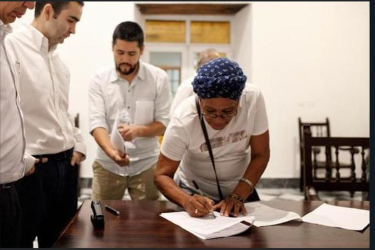
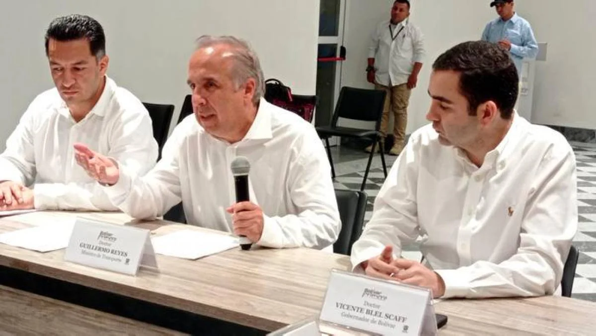

*La firma del "cheque en blanco". Después de su firma, la seño Danit Escorcia Ortiz dejó el pelero y se fue por la puerta de atrás del palacio de la Proclamación. Entre tanto, el ministro Guillermo Reyes y el Secretario de Transparencia, Andrés Idárraga, hacía la parodia con el resto de líderes. Por eso VoxPopuli Corporación no asistió a ese teatro. Sabíamos lo que iba a suceder.*

Un verdadero "cheque en blanco" le firmó la representante legal del consejo comunitario de Hato Viejo al gobierno Nacional y a la empresa Sacyr. Muy a pesar de que la tutelante desistió de la acción de tutela que buscaba proteger el derecho fundamental a la consulta previa y otros derechos, la reclamación a la APP Canal del Dique se mantiene incólume. Esto indica que el alto gobierno llegó el pasado 4 de octubre a Cartagena simplemente a firmar "acuerdos de voluntades" con el objetivo de destrabar el proceso de tutela. **Este hecho jurídico tenía aguantada la adjudicación del megaproyecto a la firma española Sacyr**.

Por tanto, el gobierno nacional del presidente Gustavo Petro, a través de su ministro de Transporte **Guillermo Reyes** y el presidente de la Agencia Nacional de Infraestructura-ANI, **William Camargo**, solo le interesó quitar la talanquera de la acción de tutela de Hato Viejo. La firma de los **"acuerdos de voluntades"** y la llegada del Secretario de Presidencia para la Transparencia, **Andrés Idárraga**, fue simplemente para darle un **barniz democrático y de transparencia** a un **acuerdo oscuro** que ya estaba cocinado. Acuerdo que va en detrimento de los intereses comunitarios y privilegia los intereses económicos de Sacyr. **([Canal del Dique: prueba de fuego para el gobierno de Petro](/articulos/prueba-de-fuego-para-petro-macroproyecto-canal-del-dique/)).**

## El cerebro del "cheque en blanco"

https://youtu.be/AmWsyD4mm9o

Es un verdadero "cheque en blanco. Mira el video hasta el final.

## ¿Por qué es un "cheque en blanco"

Las buenas relaciones de los líderes con el nuevo gobierno deben ser utilizadas para beneficiar a las comunidades, pero no para perjudicarlas. ¿Qué va de Duque a Petro en el proceso de la APP Canal del Dique? No ha habido cambio en absoluto. Ahora es peor, porque la familiaridad con el nuevo gobierno se está utilizando para hacer que las cosas ocurran para favorecer intereses individuales y mezquinos, como sucede con este **"cheque en blanco"**.

De ahora en adelante, todo el poder de decisión lo tiene el Ministro de Transporte y el presidente de la ANI. La comunidad, probablemente mal asesorada, renunció a su poder natural y constitucional. Lo que es peor, le firmó un "cheque en blanco" a Guillermo Reyes y Sacyr para que le pongan las cifras y los beneficiarios que quieran.

Es así que dicho desistimiento se convirtió en una burla y en una puñalada trapera a las comunidades. Cerca de dos años la fundación VoxPopuli Corporación y VoxPopuli Digital viene acompañando a los reclamos justos al proceso de gestación y estructuración de un megaproyecto que les va a cambiar el hábitat a sus habitantes. Un proyecto de infraestructura económica que, lo más seguro, deteriore más las condiciones de vida de 680 mil habitantes que viven en el sistema cenagoso del Canal del Dique.

## La solicitud de revocatoria

Mientras ello sucede, el abogado y veedor ciudadano, Héctor Pérez Fernández, solicitó a la ANI la revocatoria directa del proceso licitatorio. **La revocatoria incluye también los actos administrativos de prefactibilidad y factibilidad**. En ese proceso solo existe la propuesta de Sacyr. Esta es una firma española duramente cuestionada en casos judiciales y de control fiscal de la Contraloría General de la República.

De tal manera que la solicitud de declaratoria de desierta, se sustenta en que la empresa **Sacyr no cumple con el pliego de condiciones**. Es decir, no cumple jurídica, técnica ni financieramente. La misma Contraloría General encontró **graves inconsistencias en sus estados financieros** y en los documentos legales presentados. Esto se suma al hecho de que se le adjudicó la doble calzada de Buenaventura. Los riesgos financieros de la empresa Sacyr son altísimos. En tanto su reputación no es la mejor en Europa. Ejemplo de ello es la **multa por €21 millones que le impuso la Comisión Nacional de los Mercados y la Competencia (CNMC)** por **alterar miles de procesos licitatorios durante 25 años**.

Además, no se cumplió con la ley 70 de 1993. El mismo gobierno reconoció que no cumplieron con las consultas previas y la socialización del proyecto. Para que ellas sean vinculantes, deben hacerse antes de la adjudicación y no después como pretende el **"cheque en blanco"** firmado al ministro de Transporte, Guillermo Reyes, y al presidente de la ANI, William Camargo. También está demostrado, hasta la saciedad, que la falta de licencia ambiental y estudio de impacto ambiental, que deben ser previos, hacen nulo este proceso licitatorio.

## El desistimiento y el "cheque en blanco"

*En la mesa el anfitrión, el gobernador Vicente Blel, el Ministro Guillermo Reyes y el Secretario de Transparencia Andrés Idárraga.*

¿Qué implica desistir de una reclamación? De acuerdo con varios juristas consultados por este medio, desistir indicaría que el proceso judicial debe terminar de inmediato. ¿La razón? La demandante, Danit Escorcia Ortíz, representante legal del consejo comunitario de Hato Viejo **¡renuncia a todas sus pretensiones!**

En ese sentido, tal desistimiento lo resumieron en seis (6) cláusulas. En la primera define la finalidad y el límite máximo del acuerdo. En este sentido, el gobierno nacional, en particular la ANI, y los directivos del consejo comunitario Los Olivos de Hato Viejo, una vez se firme la adjudicación del contrato a Sacyr, harán un "acompañamiento" para constituir mesas técnicas. Estas, a su vez, tienen tres objetivos. (I) Analizar las posibles afectaciones del proyecto. (II) Escuchar a las comunidades negras de Hato Viejo. (III) Definir "senderos técnicos y jurídicos" para validar posibles afectaciones.

Lo anterior significa que los autores de ese acuerdo le entregaron un "cheque en blanco" al gobierno nacional y a Sacyr para que hagan y deshagan dentro del territorio afro según sus necesidades e intereses. De hecho, la renuncia a sus derechos fundamentales es entregar toda la potestad de los derechos fundamentales al Estado. Esto no es constitucional, ya que estamos en un Estado Social de Derecho. Si bien los individuos pueden renunciar a sus derechos fundamentales, el Estado está en el deber de respetar dichos derechos.

## Este es el acuerdo

En exclusiva, presentamos la solicitud de desistimiento y el "acuerdo de voluntades" firmado con algunos representantes de las comunidades. Es un verdadero "Cheque en blanco" para Sacyr y el ministro de Transporte.

El "cheque en blanco" está firmado. En la próxima entrega te hablaré de los procesos penales y disciplinarios que se están preparando para romper ese "cheque en blanco". Un cheque que se convierte en un descalabro para las comunidades del Canal del Dique.