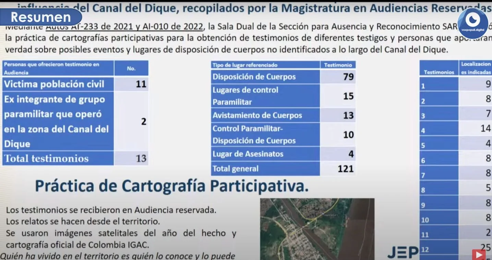

*Aspecto de la audiencia de la JEP Canal del Dique. La Ruta de la Memoria.*

Si bien las medidas centrales de la JEP no suspendieron el proceso licitatorio, **la orden de crear la Ruta de la Memoria de los desaparecidos y muertos del Canal del Dique es una de las medidas a destacar.** A esta conclusión se llega si la interpretación la hacemos desde el punto de vista de los derechos de las víctimas y de los 480 mil humanos que habitan el sistema cenagoso. Muchos de ellos esperan que aparezcan los cuerpos de sus muertos.

Algunas de las víctimas estimaron la Ruta de la Memoria de este crimen pluriofensivo que podría ser un **contentillo** o un **tentempié** para ellos. Esperaban que la audiencia de la JEP hubiere tomado una decisión más trascendental. Las órdenes de este tribunal no tocaron el corazón del macroproyecto, puesto que se diseñó desconociendo derechos fundamentales de las víctimas. ([**La Ruta del Cimarrón es la huella del despojo en el Canal del Dique**](/articulos/la-ruta-del-cimarron-y-el-despojo-en-el-canal-del-dique/))

Además, esas órdenes pudieron tomarse sin atender los testimonios presentados en la audiencia que hacían énfasis en que el macroproyecto no dialogó con la población y no hubo una efectiva participación de las víctimas. Sin falsa neutralidad, **VoxPopuli Digital**, desde que asumió la responsabilidad de informar sobre el macroproyecto, se inclinó hacia las comunidades invisibilizadas. En la audiencia no se tuvo en cuenta el testimonio que podríamos brindar para interpretar el alto riesgos que se puede afrontar con el macroproyecto.

No obstante, podría haber otra interpretación. Se entendería que la JEP no está para resolver problemas contractuales, Por tanto, no es dable que sus órdenes lleguen a afectar un proceso licitatorio, en el entendido de que son aspectos que le incumben en un proceso de justicia restaurativa.

## El primer día de la audiencia

https://youtu.be/RHi4iRtDGHw

La Ruta de la Memoria del Cementerio Fluvial más grande de Colombia.

## La Ruta de la Memoria ¿contentillo?

**Luis Gabriel Salas**, grupo de análisis de la sala de reconocimiento de la JEP, en el primer día de audiencia presentó lo que podría ser la **cartografía de este crimen** pluriofensivo. Para la construcción de esa cartografía recibieron **121 testimonios**. Se identificaron **79 lugares de disposición de cuerpos**, 15 zonas de control paramilitar, 13 avistamientos y 10 lugares de control paramilitar y disposición de cuerpos en el Canal del Dique.

*Los gobernadores Héctor Olimpo Espinosa (Sucre), Elsa Noguera Atlántico) y Vicente Blel, junto con los alcaldes, deberán ejecutar la Ruta de la Memoria de este crimen pluriofensivo cometido en el Canal del Dique.*

Tomando en cuenta las medidas restaurativas precautelativas, la sección de Ausencia de Reconocimiento de la JEP ordenó a los gobernantes de los territorios para que **adopten la Ruta de la Memoria en un lapso de 6 meses**. La orden va para la gobernadora del Atlántico, **Elsa Noguera** de la Espriella. Asimismo para el gobernador de Bolívar **Vicente Blel Scaf** y al gobernador de Sucre **Héctor Olimpo Espinosa Oliver**.

De igual manera tal orden debe ser cumplida por los alcaldes de cada uno de los departamentos donde fue escenario de los hechos de reconocimiento. Ello implica que la decisión alude la responsabilidad de los alcaldes de Campo de la Cruz, Suan, Santa Lucía, Turbaco, San Cristóbal, Manatí, Calamar, Arroyo Hondo, Mahates, Luruaco, Sabanalarga, Repelón, San Estanislao, Cartagena, Arjona, Santa Rosa de Lima, Soplaviento, Turbana, María la Baja y San Onofre.

## La Ruta de la Memoria concertada

*Esta es la cartografía de un crimen de lesa humanidad. El contentillo de la Ruta de la Memoria.*

La Ruta de la Memoria se debe construir en concertación con los peticionarios de este trámite cautelar, siguiendo lo indicado en la parte considerativa de esta decisión. Por tanto, se debe diseñar e implementar una Ruta de la Memoria demarcada con placas conmemorativas y narrativas ubicadas en lugares públicos a lo largo del Canal del Dique .

Para el cumplimiento de esta orden, las gobernaciones y las alcaldía contarán con un plazo máximo e improrrogable de 6 meses. La orden incluye que la ANI debe entregar informes bimensuales a la jurisdicción para constatar el avance de lo ordenado.

Si bien esperábamos más de la JEP, ahora la responsabilidad de los gobernantes de los entes territoriales, que tienen que ver con el Canal del Dique, deben ejecutar esas órdenes. El papel de las organizaciones comunitarias, de víctimas y, especialmente de la Ruta del Cimarronaje, es hacerle seguimiento a las órdenes de la JEP para que se cumplan a satisfacción. Los periodistas estamos siempre para darle voz a los excluidos. Es un papel incómodo, porque no estamos para satisfacer intereses ni ideologías sino para que la verdad salga reluciente.