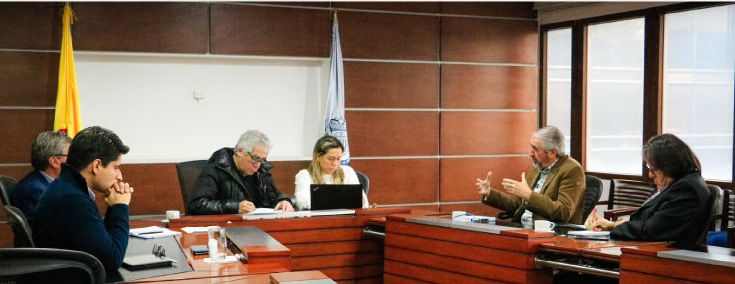

*El director de la UNP, Augusto Rodríguez Ballesteros, en reunión con Misión de Apoyo al Proceso de Paz en Colombia,MAPP. Por asesinato de periodista ¿falla en el servicio de UNP? Cortesía.*

Por el asesinato del periodista **Rafael Moreno Garavito** podríamos estar en presencia de una falla en el servicio de la Unidad Nacional de Protección-UNP. **Una unidad que se gasta $2,6 miles de millones diarios y, sin embargo, tiene múltiples fallas**. Este hecho viene a demostrar que realmente no cumple a cabalidad con su papel misional. **Pareciera que los esquemas de seguridad se asignan por palanca** política.

El 12 de julio de 2022 la Fundación para la Libertad de Prensa-FLIP solicitó en el Comité de Evaluación del Riesgo y Recomendación de Medidas –CERREM reforzar medidas de protección para el comunicador. **Pero la UNP no hizo absolutamente nada**. En este sentido, los medios de comunicación y los gremios del periodismo debemos solicitar que se practique una auditoría forense para establecer si hubo falla en el servicio. ([Condenada Colombia por victimizar a periodista Jineth](/articulos/condenada-colombia-por-victimizar-a-periodista-jineth/))

Le hicimos varias llamadas al director de la UNP, **Augusto Rodríguez Ballestero**s, pero no responde. Esto indica que frente a los requerimientos del periodismo de las regiones los funcionarios públicos poco o nada prestan atención. Es inaudito en un gobierno que nos prometió la lucha por la vida. ([Lucio Torres, «la piedrita en el zapato»](/articulos/lucio-torres-la-piedrita-en-el-zapato/))

## Periodista protegido asesinado

https://twitter.com/FLIP\_org/status/1582071845582692353?s=20&t=W1iT2OYfiCc-lgIS1\_6eCw

Por primera vez asesinan a un periodista con esquema de seguridad. Tenía un agente de protección, un chaleco antibala y un botón de pánico, según explicó la UNP. Pero desde el 2019 viene siendo amenazado seguramente por razón de lo que informaba en su medio digital Voces de Córdoba y sus "Facebook live". En estos últimos trataba temas y hechos relacionados sobre presuntos casos de corrupción.

> "Es preciso y urgente que la UNP realice una investigación que permita conocer **por qué no se reforzó su esquema de seguridad y si existieron irregularidades por parte del esquema** de protección al momento del asesinato".
> 
> [Comunicado de la FLIP](https://www.flip.org.co/index.php/es/informacion/pronunciamientos/item/2966-rafael-moreno-periodista-con-proteccion-de-la-unp-fue-asesinado-en-montelibano-cordoba).

La FLIP tiene documentado esa aparente falla en el servicio por omisión y falta de acción de la UNP, organismo que ha sido duramente cuestionado por esa misma razón.

## ¿Falla en el servicio de la UNP?

https://twitter.com/FLIP\_org/status/1582503651033350144?s=20&t=W1iT2OYfiCc-lgIS1\_6eCw

Si desde 2019 recibía amenazas de muerte ¿por qué razón no le habían reforzado las medidas de protección? ¿Negligencia? ¿Tráfico de influencia? Todo indica que hubo omisión. Es el caso de este periodista de **VoxPopuli Digital**. Desde septiembre 2020 estoy recibiendo nuevas amenazas de muerte por las publicaciones de investigación periodísticas sin que la UNP refuerce mi esquema de seguridad. **La FLIP lo solicitó en el CERREM** y, además, los análisis indican que estoy en un riesgo extremo. Sobre mi caso, la última vez ese comité se pronunció en el mes de agosto de 2022 y todavía la UNP dice que está en el período de análisis. El 18 de septiembre me volvieron amenazar con corona fúnebre por el caso del Canal del Dique, y todavía la UNP brilla por su silencio. ¿Qué está esperando? ([**Sin el traidor de Judas, Jesús no hubiera cumplido su misión**](/articulos/sin-el-traidor-de-judas-jesus-no-hubiera-cumplido-su-mision/)).

Respecto al caso de Rafael Moreno, la UNP publicó un lacónico comunicado que no aborda lo central de esta denuncia que hizo la FLIP.

> "Así mismo, por evidencias de riesgo el grupo de análisis estaba haciendo un nuevo estudio que no había sido conocido por CERREM".
> 
> Comunicado UNP

¿Por qué el periodista estaba solo? Al respecto la UNP dijo:

> "El escolta asignado manifiesta que el protegido le dijo el sábado 15 de octubre, a las 11.20 am, que no requería de su servicio más ese día y que estuviera pendiente hasta nueva orden. El escolta dice que se enteró de la muerte del comunicador al día siguiente mediante  llamada telefónica de otro escolta".

## Condena internacional

La Federación de Asociaciones de Periodistas de España [(FAPE)](https://fape.es/) y la [Federación Internacional de Periodistas (FIP)](https://www.ifj.org/es) rechazaron el asesinato del periodista colombiano **Rafael Emiro Moreno** y exige su esclarecimiento urgente.

> "Es fundamental que no se descarte ninguna línea de investigación y se considere la labor periodística de la víctima como posible motivación para el crimen"
> 
> [La FAPE y la FIP repudian el asesinato del periodista colombiano Rafael Emiro Moreno](/articulos/la-fape-y-la-fip-repudian-el-asesinato-del-periodista-colombiano-rafael-emiro-moreno/#:~:text=Hace%20un%20mes%20y%20medio,vinculado%20a%20su%20trabajo%20period%C3%ADstico.).

## $1,3 billones ¿y falla en el servicio de UNP?

Este año la UNP está ejecutando $1,3 billones. La mayoría se lo gasta en esquemas de seguridad para líderes sociales y servidores públicos mediante multimillonarios contratos con agencias de seguridad. La UNP tiene alrededor de 8 mil agentes de protección. Un poco más de 6 mil son tercerizados.

Es necesario que los medios de comunicación **propongan al presidente Gustavo Petro una auditoría forense a la UNP** con el fin de establecer si incurrieron en falla en el servicio. Los resultados que se obtenga de esta **auditoría forense** puede ser utilizados para una reestructuración de esa entidad.

Ese dinero en seguridad no puede ser dilapidado sin que haya justicia disciplinaria, fiscal y penal. Debe haber consecuencias. **El director actual Augusto Rodríguez Ballesteros debe responder frente a esta inquietud.** En su manos reventó este crimen. Debe haber consecuencias.