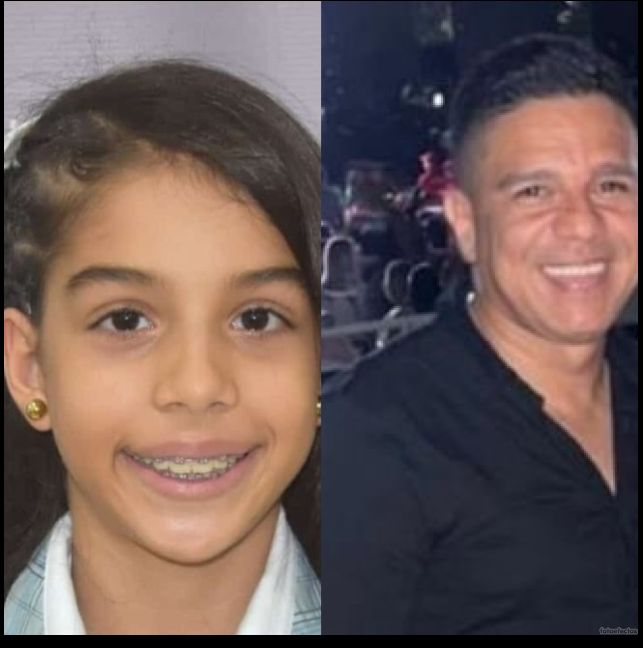
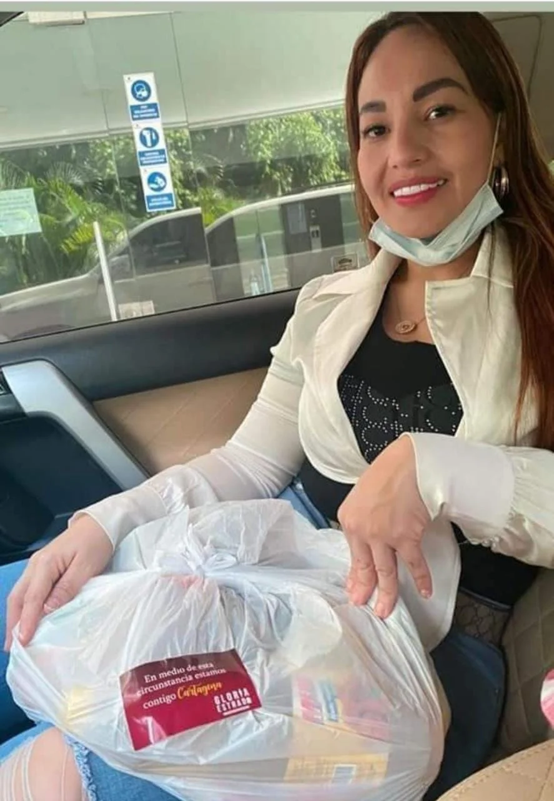

*Padre e hija asesinados en la modalidad de sicariato. ¡Basta!*

¡Basta! Un profundo dolor, consternación y rabia produjo en el día de hoy el homicidio de **Alejandra Llorente Salazar,** 10 años, en la modalidad de sicariato. El hecho se presentó cuando su padre, **Antonio Llorente Arcia**, sufrió un atentado mortal en las afueras del **Colegio Biffi** de Cartagena. Los sicarios dispararon indiscriminadamente cuando las tres hijas del comerciante se encontraban en el interior de la camioneta.

En el acto, Llorente Arcia quedó sin vida al frente de la camioneta que conducía. Los sicarios que se movilizaban en moto dispararon al interior del vehículo. Las balas impactaron el cuerpo del padre, pero también a dos de sus hijas. Una se encuentra, aparentemente, fuera de peligro, pero la otra desafortunadamente murió poco después, hoy jueves 3 de noviembre.

Mientras ocurre esta ola de sicariato, el alcalde de Cartagena de Indias, **William Dau Chamat**, se encuentra perdido en su vida loca en medio del licor y la droga que fluye libremente en la ciudad. En estos tres años de **"Salvemos a Cartagena"** el crecimiento de la adicción a la droga es diciente como también el microtráfico. Las sustancias alucinógenas siguen envenenando a los niños con la conducta complaciente de unas autoridades que solo persiguen al jíbaro. Pero los capos siguen afuera dirigiendo los asesinatos. De igual manera, la extorsión se viene multiplicando en los barrios de La Heroica. Es probable que este sea el móvil de estos dramáticos hechos.

## ¡Basta! No más homicidios

*La segunda infante asesinada. ¡Basta!*

Ya llegamos a los 300 homicidios, la mayoría en la modalidad de sicariato y en medio de la impunidad. ¿Dónde están los responsables? ¿Para qué sirven los consejos de seguridad?

De acuerdo a la información oficial, el doble asesinato se produjo cuando **Antonio Llorente Arcia** fue a buscar a sus tres hijas que estudian en el Colegio Biffi en la jornada de la mañana. **Promediando las 2:30 de la tarde**, luego de que las niñas subieron a la camioneta blanca de **placas JHU 754**, se dirigieron rumbo a la avenida antigua a Ternera, a la altura de la Clínica Madre Bernarda. Mientras esperaban que el semáforo pasara a verde, los sicarios motorizados aprovecharon esas circunstancias para disparar contra los ocupantes de la camioneta.

Fueron momentos de confusión. Particulares socorrieron a las menores, dos de las cuales resultaron heridas. Sin embargo, la niña de 10 años murió en el centro asistencial donde fue internada. Al parecer, la patrulla de policía se demoró en llegar, según algunas personas que se encontraban en el lugar de los acontecimientos.

## No hay cámaras de seguridad

*El alcalde de Cartagena, William Dau, en su vida loca fluida de alcohol y droga, mientras crece el sicariato y el microtráfico. ¡Basta!*

El comandante de la Policía Metropolitana de Cartagena, brigadier general Nicolás Zapata, llegó al lugar del crimen y constató que no había cámara de seguridad del Distrito, muy a pesar de que Distriseguridad cuenta con el presupuesto para ello. Por esta razón, dijo, se está consultando las cámaras privadas que se encuentran en esta zona muy transitada donde funciona el Colegio Biffi y muchas clínicas y EPS.

Desde que llegó **William Dau Chamat** a la alcaldía de Cartagena uno de los problemas que padece el sistema de seguridad distrital es la carencia de cámaras. Las 104 que existen, casi la mitad no están en funcionamiento. El mantenimiento es deficiente. El año pasado se gastaron **$2.451 millones** en este rubro, pero los resultados no se ven.

## Control político

*¡Basta! Si el alcalde y sus secretarios es incompetente, el concejo debe asumir un estricto control político.*

En estos momentos el concejo de Cartagena debe asumir un liderazgo en la alcaldía de Cartagena. Sería importante iniciar un proceso de censura contra la secretaria del Interior y de Convivencia Ciudadana, Ana María González, y del director de Distriseguridad, coronel **Luis Enrique Roa Merchán**, porque fracasaron para diseñar y ejecutar un plan de seguridad ciudadana.

**El concejal César Pión** en marzo de este año, denunció en una de las sesiones, que en la ciudad hay una falta de diagnóstico de la seguridad. Pero también dijo que las cámaras de seguridad son un gran negocio. ¿Para quién? El actual director de Distriseguridad, coronel de la policía (r) Luis Enrique Roa, y la secretaria del Interior, Ana María González, deberán ser llamados a control político por el concejo para que respondan sobre la inversión para el tema de la seguridad en cartagena de Indias.

¿Cuántos niños esperamos que asesinen vilmente? ¿Qué puede hacer una ciudadanía cuando el alcalde de su ciudad está sumido en una vida loca donde corre el alcohol y la droga? ¿Un alcalde que lo único que ha hecho es hablar como verdulera chismosa? William Dau refleja la enfermedad de una sociedad que está enferma por la mafia, el narcotráfico y el microtráfico.