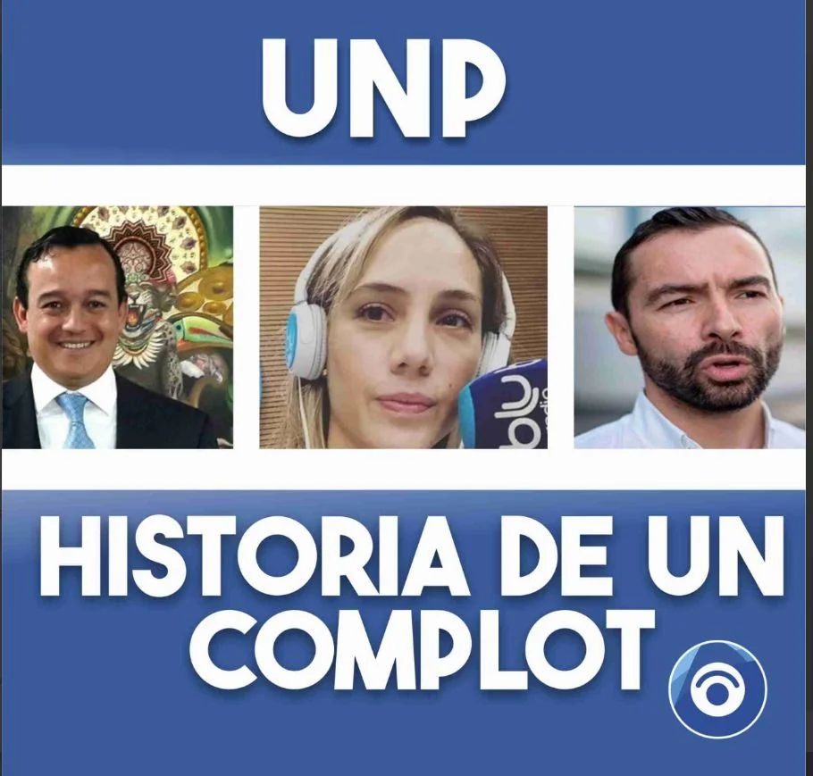
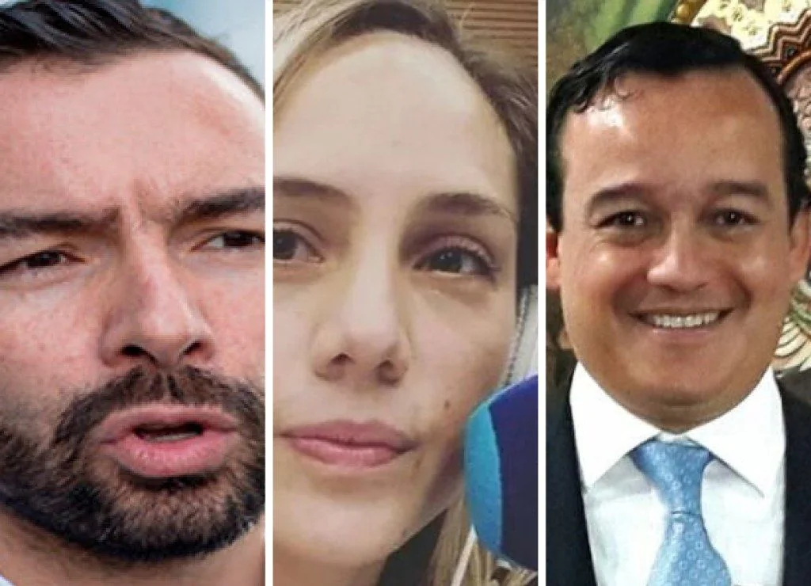
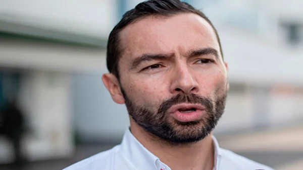
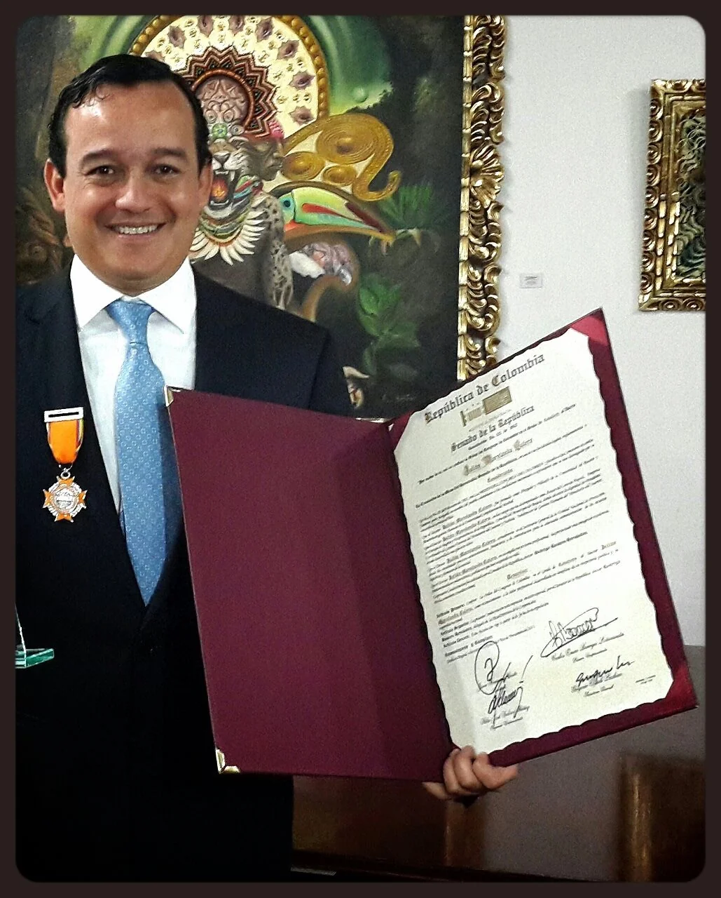

*Corrupción en UNP. La historia de un complot.*

Después de una semana de la audiencia de fallo de absolución del exsecretario general de la Unidad Nacional de Protección—UNP, **Julián Marulanda Calero**, la Gran Prensa Nacional quedó en silencio profundo respecto a este sonado caso de hace 8 años que pasará a la historia como uno de los hechos más infame del periodismo nacional. Tanto es así, que un prestigioso medio radial y su periodista estrella ganaron el también prestigioso **Premio Simón Bolívar** siendo parte de **un complot del poder político y económico dominante.** Hay varios hechos que hacen atractiva esta historia: la muerte misteriosa con cianuro del iniciador de este complot y la desgracia judicial de de los investigadores iniciales del proceso.

El 8 de noviembre de 2022, **la jueza de Conocimiento No 42 del Circuito de Bogotá, Nuri Lozano Cubillos**, sin ninguna duda, absolvió a Marulanda. Fue una decisión unánime de todas las partes del proceso que la jueza tomó una decisión pacífica, muy pacífica. La petición coincidente fue de la Fiscalía, el Ministerio Público, el representante de víctimas y, por supuesto, de la defensa encabezada por el reconocido abogado **Iván Cancino**. ([Negligencia en UNP ¿quién miente?](/articulos/negligencia-de-unp-puso-en-riesgo-a-protegidos/)).

## Vea el intro

https://youtu.be/2kfbl3D05jA

Este es el intro.

## El complot político

En consecuencia, quedó evidenciado un **complot político** para encubrir a los verdaderos responsables del fenómeno de corrupción en UNP que se gestó desde sus orígenes. En cambio, se sacrificó al inocente como **«cabeza de turco»** para exculpar a los verdaderos artífices del saqueo de las arcas de esa entidad en el período 2012, 2013 y 2014. El director General de la Unidad Nacional de Protección—UNP de ese entonces, **Andrés Villamizar Pachón**, sobrino de **Gloria Pachón**, la viuda de Galán, y primo de los hermanos **Galán Pachón**, deberá responder ante la Fiscalía General y la Procuraduría Nacional por los delitos y faltas disciplinarias que se cometieron en su gestión administrativa. Así quedó evidenciado en este proceso.

Es importante saber que la UNP ocupa uno de los primeros lugares en el gasto público destinado a la seguridad que el Estado le debe brindar a servidores públicos, defensores de derechos humanos, líderes sociales y periodistas amenazados de muerte. El presupuesto designado para este año es de [**1,3 billones de pesos**](/articulos/planeacion-gestion-y-control/presupuesto/). La mayor parte de este dinero se destina a tercerizados, según se desprende de la ejecución del presupuesto oficial.

## Santos quería salir de Villamizar

*Corrupción en UNP: Historia de un perverso complot. Andrés Villamizar, Camila Zuluaga y Rafael Merchán (Q.E.P.D), instrumentos de una encarnizada persecución política contra Julián Marulanda Calero.*

El 25 de agosto de 2014 el presidente **Juan Manuel Santos** tenía previsto salir de su director general, **Andrés Villamizar** **Pachón**. Estaba incómodo por los hechos de corrupción del cual tenía conocimiento. Las denuncias indicaban que su administración se torcía cada día más. Pero Villamizar tenía buena prensa y el apoyo político de uno de los clanes políticos con más poder, **los Galán Pachón**. Un poder logrado con la memoria de su padre asesinado **Luis Carlos Galán**, bajo la tutela de la periodista **Gloria Pachón**, a la postre, su viuda.

No obstante, el presidente quería nombrar en su reemplazo a Julián Marulanda Calero, quien se desempeñaba como Secretario General de la entidad. Ese mismo día que estalló el escándalo de una supuesta red de corrupción encabezada por el propio Marulanda, éste recibió una llamada de una persona muy cercana a Santos que le dijo:

> «El presidente tiene listo el decreto de nombramiento tuyo como director de la UNP».
> 
> Entrevista a Julián Marulanda.

Ese 25 de agosto de 2014 quedó tatuado en la memoria con dos agujas que le taladraron, al unísono, su cerebro. ¡La paradoja! Marulanda experimentó una sensación de satisfacción y, al mismo tiempo, de frustración. **Satisfacción**, porque ese decreto, que nunca tuvo vida administrativa, fue un reconocimiento a la excelente labor que realizó en la UNP.

Marulanda era quien mantenía la armonía de la UNP con el congreso, el ministerio de Hacienda y era la correa conductora con la presidencia de Santos. Pero también de **frustración**, porque el sistema está dado para joder al más débil. No importa lo mucho que te hayas sacrificado por tu trabajo, las noches que te desvelaste para sacar adelante las tareas que los de arriba te exigen, al fin y al cabo, eres una simple pieza de un engranaje alienante y sofocante. Por tanto, Marulanda tenía otros planes porque conocía las entrañas de este poder.

## Lo extraño

Lo extraño (¿extraño?) de estos hechos —considerados como una ignominia contra la víctima por las partes— es que **Villamizar** se sumó a los denunciantes a sabiendas que los contratos denunciados los había firmado él como director y no Marulanda. Este no tenía ninguna clase de injerencia, tal como quedó soportado en el proceso judicial que duró 8 años.

En el fallo de absolución de **la juez 42 Penal del Circuito de Bogotá**, cuya audiencia duró dos horas y media, se realizó el 8 de noviembre de 2022, puso en evidencia las grandes irregularidades cometidas en ese período. Lo curioso, este fallo pasó desapercibido para los grandes medios de comunicación nacionales dueños de la verdad nacional. Ocho años después, sin ningún atisbo de dudas, quedó demostrado que **Julián Marulanda Calero no era el capo** ni tampoco hacía parte de la red de corrupción en UNP. Por el contrario, **fue víctima de un complot político urdido desde las entrañas corruptas de esa entidad.**

## La corrupción en UNP y la **«cabeza de turco»**

*Andrés Villamizar Pachón, deberá responder por los hechos de corrupción ocurrida en su gestión ante la UNP. Foto cortesía.*

El mismo día del abortado decreto y del estallido del escándalo, Marulanda compró los tiquetes de ida, sin retorno, a Miami. **Se había enterado de que no solo lo iban a detener sino que lo pretendían matar** en la propia cárcel, diría recientemente.

¿Cuál es la verdad verdadera? Lo cierto es que Marulanda estaba siendo **víctima de un complot político** urdido, probablemente, desde la misma Dirección General de la UNP. Todos los cargos de corrupción por los cuales lo habían denunciado fueron declarados infundados por **la juez 42 Penal del Circuito de Bogotá** atendiendo la solicitud, no solo de la defensa, sino también de la misma **Fiscalía y el Ministerio Público.** Entonces, ¿fue Marulanda **«cabeza de turco»** para exculpar a los verdaderos autores de estos actos de corrupción? En la próxima entrega ampliaremos este hecho.

¿Se pudieron concertar en el complot altos funcionarios de la UNP, el Secretario de Transparencia de la Presidencia, los fiscales e investigadores de la etapa de indagación del proceso penal y algunos periodistas de la Gran Prensa? **La muerte por intoxicación con cianuro del Secretario de Transparencia Rafael Merchán**, en 2019, **le pone un toque de misterio a este hecho** como el escándalo de **Odebrecht**. Iniciamos, entonces, una serie de entregas de este informe periodístico de un proceso que duró 8 años para demostrar la inocencia de esta víctima del complot político. Contaremos con la colaboración de la periodista de investigación **Amalfy Rosales de El Espacio Noticias**, a quien agradecemos este reto.

## Corrupción UNP y honorabilidad de Marulanda

*Julián Marulanda Calero, víctima de un entramado de corrupción en UNP. Aquí luce sonriente con una de sus condecoraciones. Foto cortesía familiar.*

Para que no quedara duda de la honorabilidad de Marulanda Calero, la juez no se conformó con absolver a Marulanda sino también que compulsó copias disciplinarias y penales para establecer las responsabilidades que pudieron tener fiscales, investigadores y demás funcionarios que participaron en la etapa de indagación. **Además deberán responder el director de la UNP de la época, Andrés Villamizar y el Secretario de Transparencia de Presidencia, Rafael Merchán (que Dios le perdono todos sus pecados), como algunos periodistas que se prestaron para esta trama.**

Por tanto, **Julián Marulanda Calero** **fue absuelto** el **8 de noviembre de 2022** de todos los cargos: **concierto para delinquir, prevaricato por apropiación, cohecho**, entre otros. Si bien es cierto que los hechos de corrupción pudieron cometerse, el sindicado fue falsamente denunciado. ¿Por qué? Porque materialmente no estaba en condiciones de cometer esos delitos. No tenía ninguna injerencia en dichos contratos. Además, tampoco era ordenador del gasto. La responsabilidad era del Director General, **Andrés Villamizar Pachón.**

**¿Cómo puede ser Marulanda cabeza de una red criminal en procesos de contratación donde no tiene ninguna injerencia?** Esa fue la pregunta que la Fiscalía se hizo en el último tramo del camino cuando corrigió la torcida que sufrió la entidad en la primera etapa del proceso. Etapa que fue manejada por la hoy **exfiscal Yajaira Cáceres Pacheco**. La exfuncionaria hoy va a juicio por otro proceso donde presuntamente fue sobornada por los corruptos de la Federación Colombiana de Fútbol comprometidos en la venta ilegal de boletas del **Mundial Rusia 2018**. Al corregir la torcida de Cáceres Pacheco, quien siguió probablemente los designios de los inculpadores y del difunto Merchán, el ente acusador se abstuvo de acusar a Marulanda y, en cambio, pidió su absolución.

## Corrupción UNP e instrumentalización del periodismo

Otro hecho que vale la pena destacar de esta audiencia de fallo del **Juzgado 42 Penal del Circuito de Bogotá** se refiere a la evidente perversidad del periodismo al servicio del poder político o económico. Uno de los principios que el periodismo y la justicia deben seguir es que ante la duda, abstenerse. **Es el principal mecanismo de autoprotección de un periodista**. La mayoría de los periodistas es arrogante porque somos inconscientes de la verdad. Son 42 años de ejercicio profesional. Siendo un periodista bisoño, muy bisoño, fui víctima de una instrumentalización por parte de los dueños de la cadena radial donde trabajaba. Ante esa situación, preferí retirarme. Decidí caminar mi propio camino. Un camino sinuoso y peligroso, **pero ¡libre! hasta del mercado libre**. No dependemos de la publicidad.

En este trasegar, este periodista no se ha muerto de hambre. Pero el camino ha sido duro y doloroso. Víctima de cuatro atentados, amenazas de muerte permanente, acoso judicial y económico. Agresores que van desde un **«Jorge 40»**, pasando por un alcalde **_zambiloco_ como William Dau** y una policía que en el último año me detuvo dos veces en forma irregular, hasta un pastor (**Miguel Arrázola**) que se enriquece con la lana de sus ovejas. ¿Por qué expreso esto en primera persona? Los periodistas no pueden convertirse en instrumentos de sus emociones más bajas, mucho menos de las de otros. **El Caso de Marulanda Calero nos permite analizar este hecho** a la luz del Ser.

## La Gran Prensa: «juez de la honorabilidad»

La Gran Prensa le cubrió las espaldas a Villamizar por los hechos de corrupción y por el asesinato (2014) del periodista **Luis Carlos Cervantes** a quien la UNP le quitó el esquema de seguridad dos semanas antes. Una semana después del asesinato estalló el escándalo. Marulanda fue el foco de los medios de comunicación, y se olvidaron de las fallas de Villamizar. Los medios de comunicación nacionales, sin excepción alguna, agrupados en lo que se denomina la Gran Prensa, **apuntaron a que el líder de la banda era Marulanda Calero.** Todo porque, supuestamente, Merchán había hecho una investigación que duró dos meses.

> «La red, que llevaba un año funcionando, fue descubierta por el secretario de Transparencia de la Presidencia, Rafael Merchán, quien tras recibir correos anónimos en los que se denunciaban las irregularidades **emprendió una pesquisa que duró dos meses,** en los cuales recopiló múltiples testimonios, documentos y material audiovisual sobre los integrantes y la manera de operar de la organización. **Según Merchán, todo apunta a que el líder de la red criminal sería Julián Marulanda Calero**, el secretario general de la UNP, quien se habría aliado con otros cuatro funcionarios para lucrarse ilegalmente en dos frentes».
> 
> [El Espectador](/articulos/judicial/red-de-corrupcion-en-la-unidad-de-proteccion-article-513028/). El subrayado es de este periodista.

Si el decano de la honorabilidad periodística, como lo es El Espectador, solo se atuvo a la información de las fuentes alineadas en una parte de la noticia que son los inculpadores ¿qué se podía esperar de los otros medios de comunicación? Si se lee tan solo ese informe, el lector notará que no se le dio el derecho a réplica al acusado. ¿Por qué? Hasta ahora **El Espectador ni la Revista Semana, El Tiempo, la WR, Caracol, Blu Radio**, entre otras, han rectificado el cúmulo de información negativa sobre el buen nombre de **Julián Marulanda Calero**. Razón tenía la víctima al huir a Miami. ¿Qué futuro puede tener un reo político en la justicia de un Estado capturado por la corrupción y un periodismo dominante al servicio de ese poder?

## Ocho años de tortura moral y las **«vacas sagradas»**

*Con un espurio trabajo de investigación sobre Corrupción en UNP y Julián Marulanda, Camila Zuluaga ganó el prestigioso premio nacional de periodismo Simón Bolívar en 2015. Foto tuiter personal de Camila.*

En efecto, fueron 8 años de persecución política que sufrió Marulanda Calero. Ocho 8 años de estar en la picota pública de los medios de comunicación nacionales. Incluso, **Camila Zuluaga**, una exactriz venida a periodista, subalterna de **Julio Sánchez Cristo de la WR** (los une sus orígenes de farándula), obtuvo el **premio nacional de periodismo Simón Bolívar** con esta investigación espuria, falsaria e infame. Un premio no merecido porque no cuadraba con los estándares de lo que debe ser la investigación periodística. Seguramente el jurado carecía de la experticia y el conocimiento de lo que es un periodismo de investigación. Por esa razón se obnubiló más por la figura del periodista que de su investigación. Por lo menos, eso fue lo que hemos aprendido en la experiencia y en la academia con maestros del periodismo de investigación.

¿**Camila Zuluaga Suárez** actúo sola o fue instrumentalizada por los dueños de su medio de comunicación? ¿Qué papel tuvo Julio Sánchez Cristo? No se podría responder esa pregunta en un marco especulativo. Será objeto de la investigación penal que la Fiscalía está adelantando. Necesitamos jueces, fiscales y periodistas valientes que no se dejen capturar por este sistema. Sin embargo, la potestad de publicar o no publicar no debe estar en manos del medio de comunicación sino del periodista. Aquí no se podría aplicar el principio de obediencia debida como en las fuerzas militares. Un periodista no puede ser esclavo del medio al cual le sirve. Tiene libertad de expresión y de prensa. Basta descubrir su libertad en lo más profundo de su interior.

Pero el **Caso Marulanda** mostró que en el periodismo también hay **«vacas sagradas»**. ¿Quien pone en duda lo que dice **Julio Sánchez Cristo** o la WRadio o cualquiera de esas **«vacas sagradas»** del periodismo mundial? Con algunos exponentes del poder político y económico son complacientes y con otros son unos verdugos morales. Todos los días le daban en la cabeza a Marulanda con el mazo de una supuesta moralidad que hacen pasar por un periodismo de investigación. Buena actriz es Camila Zuluaga. Pero como periodista, pocón—pocón. Su actuación fue muy sospechosa al descontextualizar una grabación donde supuestamente se develaba la también supuesta trama de corrupción que tenía como líder a Marulanda Calero.

## Camila Zuluaga y su premio

Ya cuando el mazo estaba manchado, Camila Zuluaga recibió el prestigioso **Premio de Periodismo Simón Bolívar**. Fueron dos meses de una supuesta investigación, los mismos meses utilizados por el Secretario de Transparencia Rafael Merchán para llegar a una conclusión indiscutible: Marulanda se había concertado para apropiarse indebidamente de los dineros públicos. Lo dijo en una rueda de prensa a la que asistió la futura premiada. [Fueron dos meses que la WR golpeaba en la cabeza de Marulanda inmisericordemente.](/articulos/zuluagacamila/el-robo-publico-y-privado-a-la-unp/s-IQo1w) Así resumió el jurado su concepto para otorgarle el **Premio Simón Bolívar a** la reconocida y temida periodista:

> _«**Camila Zuluaga decidió ir más allá de las declaraciones oficiales**: mediante un trabajo laborioso de reportería, que incluyó la audición de **muchas horas de grabaciones** q**ue habían servido de soporte a la investigación de la fiscalía**, conoció el **modus operandi de la red corrupta**, y consiguió testimonios que dieron una nueva dimensión al escándalo. **Se demostró así el enorme poder de la noticia** como instrumento de control del poder, entendido en todas sus manifestaciones_».
> 
> [Premio Simón Bolívar.](https://www.premiosimonbolivar.com/ganadores.php?cod=1$$-1$$-qm4nNEHfJn5qtpHLMCVDwz0f2yXG3C6fwm&edicion=1$$-1$$-qm4nNEHftnXaJm98wAU5wqK92yXG3C6fwm) (El subrayado es del periodista?

Los periodistas nos podemos equivocar. Es un hecho involuntario. Pero ser instrumento de un tercero para dañar la vida de un inocente no es congruente con el periodismo de investigación. La lucha contra la corrupción no puede mirarse como una acción inquisidora, torturadora y violatoria de los derechos humanos. La Fiscalía, que tiene el papel de investigar y acusar, tampoco puede ser instrumentalizada por estos instintos de baja estofa, como fue en este Caso de Marulanda. La presunción de inocencia se le hizo añicos a él y a su familia. No le dieron la oportunidad para que se descargara en las mismas condiciones como lo venían acusando. ¿Por qué los grandes medios no le dieron esa oportunidad?

## La prensa y el complot

No es el único caso del papel jugado por la prensa con estas infames historias. Por ejemplo, este año descubrimos, en tiempo real, otro infame caso. La presidenta del concejo de Cartagena, **Gloria Estrada Benavides**, el 14 de enero de 2022. Los medios de comunicación nacionales y regionales la crucificaron. Dieron por hecho que era una narcotraficante sin investigar más allá de lo que la apariencia indicaba. Afortunadamente, Gloria Estrada y sus compañeros de desgracia, contaron que hubo un solo periodista que se apartó de las supuestas evidencias de la policía para detenerlos. Y se puso a hacer lo que debía hacer, investigar. Se demostró que eran víctimas de un complot político. El resultado hoy quedó demostrado por la misma Fiscalía y los jueces. Es una gran satisfacción espiritual la que siente el periodista cuando su actividad redunda en la defensa de los derechos humanos de los inocentes.

Es más, cuando algún proceso de investigación periodística que este periodista haya iniciado y desarrollado y termine con condena y responsabilidades, no se ufana de ello. No me alegro.

## La evidencia

La evidencia de un complot quedó al descubierto en el proceso del juicio oral al que fue sometido luego de 8 años de tortura y persecución política que lo incriminó sobre tres delitos

Con el fallo de la Juez 42 penal del Circuito, quedó evidenciado que para encubrir a las **«vacas sagradas»** lo hacen con el honor y la vida de personas inocentes. Como ya se dijo, no se encontraron evidencias que los hechos de corrupción conectaran con Marulanda. Si bien hubo hechos irregulares en 2012, 2013 y 2014 con la contratación, no se halló conexión con el Secretario general.

Con este fallo se abre un gran capítulo de corrupción en UNP. Las compulsas de copia disciplinarias y penales serán los puntos de partida de este nuevo capítulo del cual estaremos dando cuenta en la próxima entrega