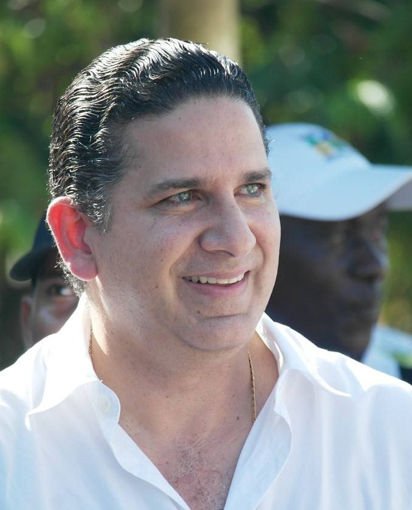

*Esta es la Crónica de Gossaín que resume, según él, una infamia. Las compañeras de infortunio: Ana María del Carmen Álvarez Castillo y Nacha Newball Jiménez.*

**La crónica de Gossaín**, el exgobernador de Bolívar (2012-2015), se anticipó a la publicación del fallo de la Procuraduría General de la Nación (PGN) que lo inhabilitó por 10 año para ocupar cargos públicos. El caso se refiere a lo que se conoció como el Cartel de la Hemofilia de Bolívar, el cual es muy diferente al Cartel de **la Hemofilia de Córdoba**. **VoxPopuli Digital** estuvo indagando sobre el fallo. **Pero no está publicado en la web de la entidad.**

Recordemos que en el mes de agosto de 2019, **Juan Carlos Gossaín Rognini**, las **exsecretarias de Salud, Ana María del Carmen Álvarez Castillo y Berta María Pérez López** –en calidad de encargada, fueron cobijados con pliegos de cargos por los mismos hechos. Igualmente el pliego incluyó a la **exdirectora de la Unidad de Aseguramiento y Prestación de Servicios de Salud, Nacha Newball Jiménez, y el exfuncionario de esa misma dependencia, Luis Eduardo Ortiz Herrera**.

Lea: [**¿Peor el remedio que la enfermedad? Dau lo demostrará**](/articulos/dau-peor-que-la-enfermedad/)

## La crónica de Gossaín califica de "infamia"

**VoxPopuli Digital** conversó con Juan Carlos Gossaín, quien se encuentra en España haciendo un posgrado. La crónica de Gossaín lamentó lo que sucedió con su caso que terminó con **responsabilidad disciplinaria por falta gravísima a título de dolo**. Así se calificó por los disciplinadores.

Lo curioso de este hecho es que se desconoce el paradero de los que aparecen como dueños de las IPS a las cuales se les hizo el millonario pago, andan como "Pedro por su casa", libres.

Asimismo se recuerda que, según la PGN, los funcionarios públicos **reconocieron en 2013 pagos por $16.019.388.888 a las IPS Asistengral y Fundación Ciénaga de la Virgen** para suministrar medicamentos y brindar atención médica a pacientes con hemofilia, sin existir una **relación contractual con esas dos entidades**. Eran medicamentos no POS que debían estar autorizados.

## Auditoría de la Contraloría

La Procuraduría constató el pliego de cargos con base en una investigación realizada por la Contraloría General de la República (CGR). La entidad hizo la **auditoría No 136 de 2019** del Sistema General de Participación transferido al departamento de Bolívar en 2013. En ella se sustentó:

> "Pagos de procedimientos a cargo de las EPS para el manejo de la Hemofilia efectuados con recursos SGP y otras fuentes, de pacientes que fueron atendidos en las IPS Fundación Ciénaga de la Virgen, Asistencia Integral de Servicios IPS- ASISTEGRAL y Hospital Divina Misericordia de Magangué, en atención a fallos de tutelas proferidos entre las vigencias 2009-2013; y vi) el consecuente daño al patrimonio del Estado estimado en $25.450 millones".
> 
> [Resolución 4079 de 2019 Ministerio de Hacienda y Crédito Público](/articulos/webcenter/ShowProperty?nodeId=%2FConexionContent%2FWCC_CLUSTER-118117%2F%2FidcPrimaryFile&revision=latestreleased). (Déle clic para leer la resolución).

Se debe recordar también que la Unidad de Investigaciones Especiales de la Contraloría General de la República contra la corrupción a cargo del cartagenero **José Miguel Char Chicre**, declaró como presuntos responsables fiscales a seis de los nueve implicados por el denominado Cartel de la Hemofilia. Se comprobó un detrimento patrimonial por **$26.274’941.695**.

## La crónica de Gossaín

*La crónica de una infamia, la respuesta de Gossaín al fallo de la Procuraduría que aún no ha sido publicado.*

A continuación reproducimos íntegramente la crónica de **Gossaín Rognini** por considerarla de buena factura y, además, expresa el sentimiento y el punto de vista de uno de los afectados de este sonado caso. En lo posible, hablaremos con el resto de encartados.

## La crónica de Gossaín: "Vuelven los titulares y los perros a ladrar"

> En el año 2017, la Contraloría General me vincula a un proceso de responsabilidad por irregularidades en el caso de pacientes hemofílicos y filtran mediáticamente un posible detrimento de más de veintisiete mil millones de pesos.

> Al final, en el 2019 me impuso una sanción por haber pagado una factura( resolución)de $1.205 millones sin el cumplimiento de requisitos legales, aunque quedò demostrado que la IPS prestò los servicios que le fueron pagados.
> 
> La factura por la que me sancionan fue pagada en noviembre de 2012, tres meses después que a la Secretaría de salud de Bolívar le levantaran la intervención que sobre ella tenía la Superintendencia de salud.
> 
> La misma entidad que dejó revisada y auditada la factura que yo terminé firmando para ser pagada. La misma entidad que durante cuatro años anteriores pagó facturas o resoluciones similares sin que hasta fecha de hoy se le hubiese señalado por irregularidades.
> 
> ## Fiscalía archivó proceso
> 
> En el 2020 la Fiscalía General (delegada ante la Corte Suprema de Justicia) archivó toda actuación contra mi referida al caso de pacientes hemofílicos señalando que no me es atribuible ninguna acción **“ni por apropiación de recursos del estado, ni por prevaricato por omisión en la defensa de la entidad”**.
> 
> Basándose en el fallo de la Contraloría, la Procuraduría General inició un proceso disciplinario para dictaminar si no hice el debido control a los pagos por servicios de salud a pacientes hemofílicos.
> 
> > Pese a demostrar que actuamos en la misma forma que lo hicieron los cuatro interventores de la superintendencia de salud, la Procuraduría, con fecha octubre 12 de 2022, acaba de inhabilitarme por diez años para ejercer cargos públicos.
> 
> Los dos fallos entonces, quedan en una multa por pagar una factura (de un servicio que fue prestado) sin cumplir todos los requisitos legales y la inhabilidad por no haber realizado el control de seguimiento a los pagos efectuados en la secretaría de salud.
> 
> > Contrario al caso del departamento de Córdoba, donde no existían pacientes y crearon artificiosamente una red de pagos, en Bolívar se atendió a la población vinculada a esta enfermedad. Los medios de comunicación convirtieron dos casos distintos en un solo Cartel de la hemofilia.
> 
> En conclusión: No hubo robo ni corrupción pero sí lo necesario para crear un escándalo cuyo propósito, dirigido tras bambalinas, consistió en señalarme y desplazarme de la vida pública,
> 
> Fue mi intención al culminar el mandato de gobernador alejarme de la política, ahora ya es oficial, lo lograron quienes así lo necesitaban. Lo que si no podrán nunca es limpiarse de semejante infamia.  
> Vuelven los titulares y los perros a ladrar. Sigo mirando con la frente muy en alto.