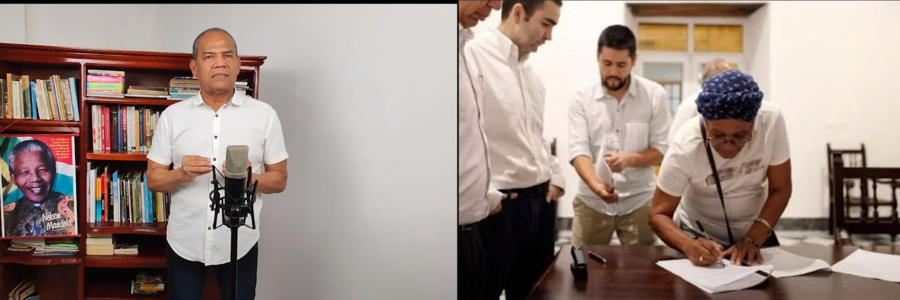

*Vida jurídica al «cheque en blanco» del Canal del Dique.*

La jueza Sexta Administrativa del Circuito de Cartagena, **Laura Arnedo Jiménez**, le dio vida jurídica al **«cheque en blanco»** sin tener en cuenta los derechos fundamentales a la prevención ambiental y a la participación ambiental. Son derechos inalienables e indivisibles de las comunidades asentadas en la ecorregión **Canal del Dique**.

Pese a esa evidente verdad jurisprudencial y a que había negado el desistimiento, finalmente, el mismo día, avaló el mismo el **«acuerdo de voluntades»** suscrito por la representante legal del consejo comunitario **«Los Olivos»** de Hato Viejo **Danit Escorcia Ortiz** con la Agencia Nacional de Infraestructura-ANI y el Ministerio del Transporte. **Un acuerdo que solo despierta expectativas por la buena voluntad de las partes, pero no es vinculante en el proceso contractual** y carece de efectividad de la participación. por tanto, no fue ser considerado como un hecho superado. (Lea: [Comunidades Canal del Dique firmaron “cheque en blanco” (I)](/articulos/comunidades-canal-del-dique-firmaron-cheque-en-blanco-i/))

## Si no vio este video, puedes hacerlo ahora. Petro no puede quedar mudo

https://youtu.be/uk7S90yui18

## **Nota de aclaración.**

_Este artículo periodístico combina tres elementos. Primero, parte de una investigación periodística. Segundo, se hace una interpretación de los documentos allegados: auto de la Corte Constitucional que define la competencia del Juzgado Sexto Administrativo del Circuito de Cartagena, auto que declara improcedente el desistimiento y fallo de tutela por hecho superado. Tercero, se tiene en cuenta la declaración de la máxima autoridad ambiental que es el ministerio del ramo. Le recuerdo a los lectores, bajo el principio de transparencia periodística, la fundación VoxPopuli Corporación, que es la madre VoxPopuli Digital, está unida a las comunidades del Canal del Dique defendiendo sus derechos colectivos y derechos fundamentales. Impulsa la Ruta del Cimarronaje realizando, con nuestros propios recursos, documentales sobre ese hecho. Quien escribe, además de periodista, es docente y defensor de los derechos humanos. No se trata de oponerse al proyecto, sino que se corrijan los errores estructurales que traerá más pobreza a la Ecorregión._ (Vea el documental: https://youtu.be/rzhgp029alU).

## Se levanta medida cautelar

En consecuencia, la medida judicial levantó la suspensión cautelar que pesaba sobre el proceso licitatorio del macroproyecto denominado **«Restauración de los ecosistemas degradados del Canal del Dique»**. La juez sustentó su decisión como **hecho superado** en la siguiente argumentación:

> _«(...) en gracia de discusión que se hubiere materializado la vulneración de los derechos fundamentales invocados por la parte demandante, las pretensiones que dieron origen a esta acción de tutela se **encuentran satisfechas con el acuerdo suscrito el 04 de octubre de 2022**»_.

## No existe hecho superado

Sin embargo, **la pretensión de la acción de tutela no podría quedar superada por hecho cumplido en la medida que la participación ambiental debe ser efectiva**. Para que sea efectiva debe eliminar los riesgos del daño que se busca prevenir. El **«acuerdo de voluntades»** —como así le llamó el ministerio del Transporte— no supera la pretensión porque la participación debe ser efectiva. Esto es, con resultados concretos, materiales. No se debe reducir a una simple expectativa de un enunciado.

Veamos, por ejemplo, la relación directa de la pretensión con la resolución del fallo de tutela. El objetivo de la acción de tutela del consejo comunitario Los Olivos lo definió así:

> «Se ordene a la ANI dar cumplimiento al **principio de participación ambiental**, garantizando la **participación efectiva** de la comunidad de Hato Viejo».

En ese sentido no existe una relación directa entre causa y efecto del fallo de tutela. La jueza no se basó en la coherencia argumentativa de causalidad entre la pretensión esperada por las comunidades y el fenómeno del hecho superado. El fallo sustenta su decisión sobre el siguiente postulado:

> _«Nótese que el acuerdo al que han llegado las partes interesadas, satisface las pretensiones de la parte actora, debido a que garantiza que la comunidad de Hato Viejo, **será escuchada por el Gobierno y que se celebrarán las consultas previas a que hubiere lugar de ser necesario**_ (...)».
> 
> La juez Laura Arnedo en su fallo de tutela

## No satisface

Como se puede observar en el magro poder argumentativo del fallo de tutela, no existe una relación directa entre el «acuerdo de voluntades» y las pretensiones de la acción de tutela. Es una argumentación falaz porque el hecho concreto no se produjo. Ni siquiera se propuso una modificación del pliego de condiciones del proceso licitatorio que debería contener el plan de manejo ambiental. ¿Dónde está la participación ambiental y la participación efectiva de las comunidades?

El fallo dice:

> «(...) _Si bien es cierto que existen pretensiones que giraban en torno a **dejar sin efecto diversos actos administrativos**, las mismas tenían como fin último que se paralizara el proceso licitatorio **hasta tanto pudieran ejercer su derecho a ser escuchados** y sus opiniones tener incidencia en la decisión que adopten las autoridades, derecho que está siendo garantizado con el acuerdo suscrito»_.

## Participación efectiva

Fijense lo que anota la juez Laura Arnedo. Dice que el derecho reclamado por los accionantes y los terceros se reducía al «**derecho a ser escuchados** (...) que está siendo **garantizado con el acuerdo suscrito**». Pero si vamos a las pretensiones de la acción de tutela se habla de **participación ambiental**, garantizando la **participación efectiva**. No es cierto lo que dice la togada.

Una simple escucha no implica **participación efectiva**. Para que haya derecho a la participación, necesariamente se debe garantizar el **derecho a la información ambiental**, (sentencia [**T-361-17**](/articulos/sentencias/2017/T-361-17.rtf)), sin lo cual no podría haber una gestión ambiental sustentable. Así lo señala el artículo 74 de nuestra constitución y lo desarrolla la ley 99 de 1993. La ANI no concibió un plan de comunicación para que la comunidad entera del Canal del Dique tuviera satisfecho el derecho a la información.

Ahora bien. Una participación efectiva se materializa cuando la ANI acoja las peticiones de las comunidades que exigen un Plan de Manejo Ambiental del Proyecto. Sin este plan no es posible garantizar los demás derechos que están en juego con la ejecución de este proyecto. Y es improbable que cumplan materialmente las órdenes de la JEP con el protocolo de exhumación, ya que no habría un plan previo. Lo que la acción de tutela ataca, en consecuencia, es la resolución mediante la cual la ANI permitió el desarrollo de un proceso de licitación (ADENDA No. 2 LICITACIÓN PÚBLICA Ni VJ-VE-APP-IPB-006-2021) que vulnera _el derecho fundamental de la participación ambiental._ Y esto es lo fundamental que la juez no vio. Podría ser un fallo prevaricador.

## Las expectativas

**En primer lugar.** De acuerdo con la jurisprudencia del sistema interamericano y nacional, los derechos fundamentale son inalienables, indivisibles, integrales, imprescriptibles y no sujeto a transacciones sobre expectativas que dependen de la buena voluntad del gobernante. O peor, del privado, en este caso de la empresa a la que se le adjudicaría el multimillonario contrato ($3.2 billones) que es al único oferente, SACYR Concesiones Colombia S.A.S.

**En segundo lugar**. No se puede renunciar (desistir) a los derechos fundamentales, como el derecho a la **participación efectiva**, **la autonomía, a la participación ambiental y al desarrollo sostenible** que debe regir toda actividad humana en Colombia. El acuerdo de voluntades es una renuncia a esos derechos porque no hay nada efectivo para las comunidades. Solo promesas.

**En tercer lugar**. Se vulnera e**l derecho a la prevención ambiental**. Al respecto, la Corte Constitucional señaló:

> «_El principio de prevención se materializa en mecanismos jurídicos tales como la **evaluación del impacto ambiental o el trámite y expedición de autorizaciones previas**, cuyo presupuesto es la posibilidad de conocer con antelación el daño ambiental y de obrar, de conformidad con ese conocimiento anticipado, a favor del medio ambiente»._
> 
> Sentencia  [T-204-14](/articulos/sentencias/2014/T-204-14.rtf) Corte Constitucional.

Además, la Corte Constitucional argumentó que el principio de precaución o tutela se aplica en los casos en que ese previo conocimiento no está presente. Y el diseño del macroproyecto no lo contempla.

## Sin Plan de Manejo Ambiental

La ministra del Medio Ambiente, **Susana Muhamad**, en diferentes eventos y medios de comunicación, en especial en **VoxPopuli Digital**, reiteró que el macroproyecto no tiene licencia ambiental y, por tanto, carece de un **Plan de Manejo Ambiental que permita precisar el impacto negativo al medio ambiente**, definir los términos de su protección y restauración.

Además, este es un proyecto esencialmente de infraestructura vial (hidrovía) que se presenta como si fuera un proyecto ambiental. Si lo fuera, indudablemente el ministerio de Medio Ambiente y las Corporaciones Regionales lo lideraran. Pero no es así. Las entidades que lo lideran son el Ministerio del Transporte y la Agencia Nacional de Infraestructura-ANI, a la postre, la responsable jurídica del megaproyecto.

Es lo que sucede con el proyecto, cuyos daños e impactos las comunidades desconocen, ya que no hay manera de saberlo a mediano o largo plazo. Los estudios elaborados no permiten adquirir la certeza acerca de las precisas consecuencias del manejo masivo de las aguas dulces y saladas. ¿Por qué razón? Porque no hay Plan de Manejo Ambiental. Sin esta herramienta fundamental sería imposible evaluar el daño, incluso, imposibilitaría cumplir con las órdenes de restauración de la JEP en el protocolo de hallazgo de cadáveres.

En consonancia con la ley 99 de 1993, con ese instrumento se previene el daño esperado o corregir el daño ambiental:

> «Un **Plan de Manejo Ambiental** (PMA) es el conjunto detallado de actividades que, producto de una evaluación **ambiental**, están orientadas a prevenir, mitigar, corregir o compensar los impactos y efectos **ambientales** que se causen por el desarrollo de un proyecto, obra o actividad».

## La curiosidad que dio vida jurídica al «cheque en blanco»

El desenlace de la acción de la tutela fue sospechoso o atípico, por decir lo menos. Por la mañana el despacho desató el nudo negando el desistimiento. No tenía otra salida. Pero sorprendió por la tarde, negando las pretensiones de la acción de tutela por hecho supuesto hecho superado. No tuvo en cuenta los argumentos de los terceros que entraron a coadyuvar en el sentido de que se les estaba vulnerando el derecho a la participación efectiva y a la participación ambiental.

> «Primero. DECLARAR que dentro de la acción de tutela presentada por el Consejo Comunitario de Comunidades Negras los Olivos de Hato Viejo a través de su representante legal en contra Ministerio del Interior y Agencia Nacional de infraestructura, **operó el fenómeno del HECHO SUPERADO por carencia de objeto**, no siendo, por tanto, necesario librar medidas de protección conforme a lo expuesto en la parte motiva».

La curiosidad nos llevará a explorar otras razones que determinó esa decisión un tanto sesgada de la juez, a todas luces contraria a los hechos y a la jurisprudencia vigente. El «cheque en blanco» sigue siendo una gran amenaza para la calidad de vida de 480 mil habitantes de la ecorregión Canal del Dique.

## Lea la Tutela que dio vida jurídica al «cheque en blanco»

[Hato-Viejo\_tutela\_-2022-00289-M](/wp-content/uploads/2022/11/Hato-Viejo_tutela_-2022-00289-M.pdf)[Descarga](/wp-content/uploads/2022/11/Hato-Viejo_tutela_-2022-00289-M.pdf)