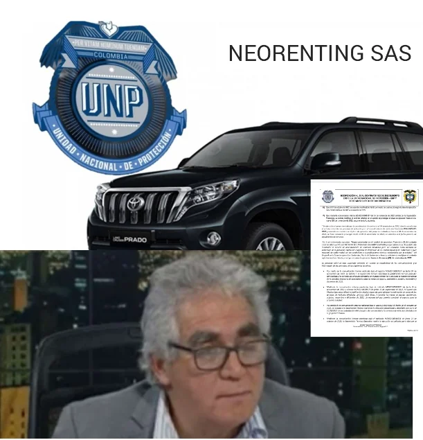
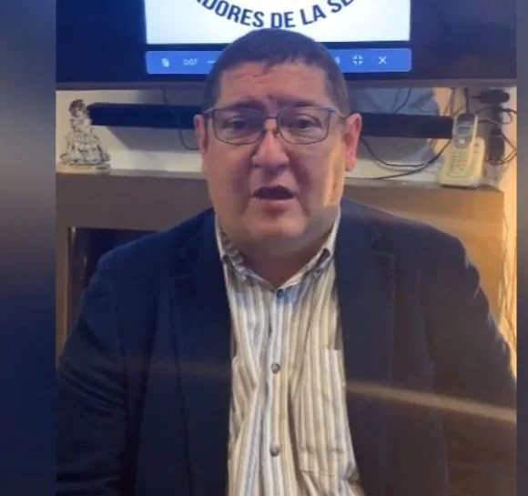
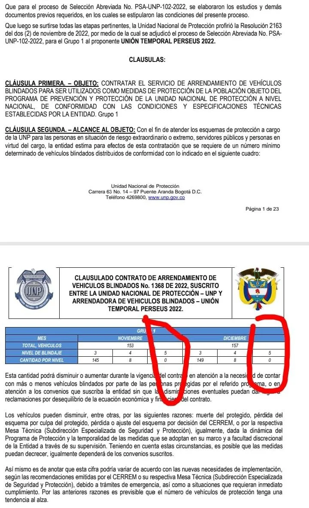

*¿Quién miente? ¿El director o el contratista? Negligencia de UNP puso en riesgo a protegidos.*

¿Otra negligencia de UNP? Con ocasión del incidente donde supuestamente un contratista había **"apagado vía satélite"** varios vehículos blindados tipo 5 de uso de varios expresidentes y de una élite de defensores de derecho humanos, se pudo comprobar que se debió a una evidente omisión y negligencia del **director de la UNP**\-**Unidad Nacional de Protección**, **Augusto Rodriguez Ballesteros**.

Resulta que en el proceso de contratación, el director **Rodriguez Ballesteros no se percató que en la solicitud de la convocatoria para la contratación de vehículos ¡no estaban los blindados tipo 5!** Estos carros son para ministros, expresidentes y algunos defensores de derechos humanos.

No obstante, hubo algo grave. Para **esconder esa omisión y negligencia**, la dirección de la UNP le atribuyó públicamente la responsabilidad al contratista sin presentar ninguna evidencia de su aseveración. Esto lo replicó El Tiempo y otros medios nacionales sin rigor periodístico. No fueron a la fuente. Tampoco consultaron con la contraparte. Las denuncias carecieron de evidencias. (Lea: [**¿Falla en el servicio de la UNP**?](/articulos/por-asesinato-de-periodista-falla-en-el-servicio-de-unp/))

## ¿Negligencia de UNP?

*¿Negligencia de la UNP? Giovanni Gallo acusa al director de negligencia.*

En ese sentido el presidente del sindicato de **Analtraseg, Giovanni Gallo**, denunció que el nuevo director de la UNP y sus asesores **no tienen experiencia en seguridad**. Esto ocasiona que problemas sencillos se conviertan en grandes problemas que no pueden resolver, como es el caso de los vehículos que supuestamente le apagaron. Además, Gallo dijo:

> "Son problemas básicos, gracias a la arrogancia, prepotencia y narcisismo del director de la UNP, Augusto Rodríguez, no se han podido resolver (...). Tuvieron que bajar el perfil (del cargo) tanto de él como de sus asesores para ser nombrados.

Los cuestionamientos del presidente de Analtraseg fueron muy duros contra el nuevo director de la UNP al que califican de falta de experiencia.

> "(...) Desconocen y no tienen experiencia suficiente para manejar un programa de protección, porque nunca han estado en temas de seguridad nacional. Fue un mal acierto del presidente al haberlo nombrado en ese cargo de la UNP".

Por tanto, para Gallo es claro que el contratista le manifestó a la dirección de la UNP con anticipación que los vehículos se iban a desconectar porque no estaban en la oferta. Pero la dirección no respondió muy a pesar de haber transcurrido el tiempo necesario dado por el contratista. Entonces, la acusación de una supuesta conducta temeraria del contratista **Alan Perlman Katz** tampoco se tipifica.

## Conducta hipócrita de la UNP

De igual manera, el presidente de Analtraseg acusó de hipócrita la conducta de la UNP. Porque una vez que el contratista apagó los vehículos, en forma atropellada firmaron un otro sí para que el contrato se extendiera hasta el próximo miércoles.

> "Lo bueno es que estos vehículos se los desconectaron a unos expresidentes que tienen seguridad vitalicia y a algunos defensores de derechos humanos. Ahí sí corrió el señor director de la UNP a llamar a los operadores a firmar un **_otro sí_** para que se los activaran. Allí es donde uno mira la hipocresía que maneja esta administración. Le hizo conectar los vehículos a los expresidentes, porque sabían que estos sí le podían hacer un hueco en su administración. Pero los otros vehículos de los defensores de derechos humanos y demás que no tienen una voz profunda dentro del gobierno, este otro sí no los firmó y esos vehículos siguen apagados".

**ESCUCHE A GIOVANNI GALLO**

## ¿Qué pasó con los blindados inmovilizados?

Como se dijo, la [UNP publicó un comunicado](http://Luis Eduardo Saavedra R.) -difundido por El Tiempo y otros medios nacionales- donde denunciaba que el contratista **Alan Perlman Katz "puso en riesgo la vida de personas protegidas"**. Esta aseveración no estaba soportada por prueba alguna. Acto seguido, **el presidente Gustavo Petro tuiteo** tomando la información de este medio e hizo la siguiente advertencia cayendo en el mismo error:

> "Ningún contratista puede abrogarse (Sic) el derecho unilateral de parar desde un satélite 9 carros al servicio de la seguridad de líderes sociales rompiendo las cláusulas contractuales".

https://twitter.com/UNPColombia/status/1588712874905833473?s=20&t=IemR5WSiXeXVbdhGeMz1Dg

## La verdad: Negligencia del director de la UNP

Sin embargo, el sindicato tiene razón en controvertir el comunicado donde el director de la UNP hace la denuncia contra el contratista. Esto es tanta verdad que las cláusulas del contrato vigente para **noviembre y diciembre** no cobijan los carros, **cuyo blindaje son tipo 5**. En esta casilla aparece CERO requerimiento. **¿De quién es la responsabilidad?** ¿Del empresario o del director de la UNP? Por supuesto, es pura OMISIÓN del director de la UNP, Augusto Rodriguez Ballesteros. **Esta omisión es una clara falta disciplinaria a título de dolo**, ya que puso en peligro a los protegidos.

**VoxPopuli Digita**l tuvo acceso al contrato vigente en el cual la cláusula segunda, que determina el alcance del objeto del contrato, brilla el número cero en la casilla de necesidades de vehículos tipo 5. Veamos los apartes del mentado contrato:

## Protegidos Denuncian improvisación de UNP

De acuerdo a fuentes oficiales de la UNP, una de las supuestas afectadas por la **"decisión irresponsable del contratista" fue Giomar Patricia Riveros Gaitán**, de la Mesa Nacional de Víctimas. Pero, como ya se demostró con la evidencia presentada en este artículo, la responsabilidad fue de la misma UNP. Así lo señala esta defensora de derechos humanos humanos que es beneficiaria de una medida de protección de la Comisión Interamericana de Derechos Humanos.  

/articulos/paprika19682000/status/1589191402071941121?s=20&t=DRn9drZ6BdS6jOEBTNwuTg

¿Por qué la dirección de la UNP le firmó a las volandas otro sí para reactivar los vehículos desconectados de los expresidentes? ¿Por qué los vehículos destinados a defensores de derechos humanos siguen apagados? ¿Discriminación? ¿Quién es el asesor que está detrás de Augusto Rodríguez Ballesteros? ¿Quién le habla al oído? ¿Qué dice la Procuraduría de este incidente? **¿El presidente Gustavo Petro fue inducido al error?** ¿Debería renunciar Augusto Rodríguez por mentirle al presidente? Espere la segunda entrega.