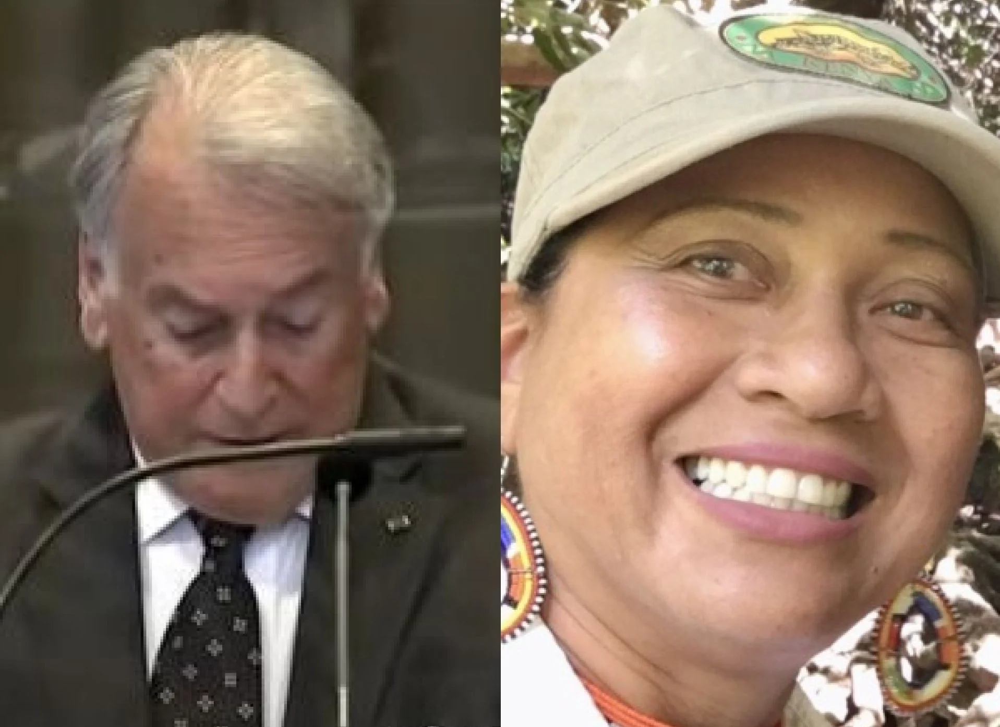
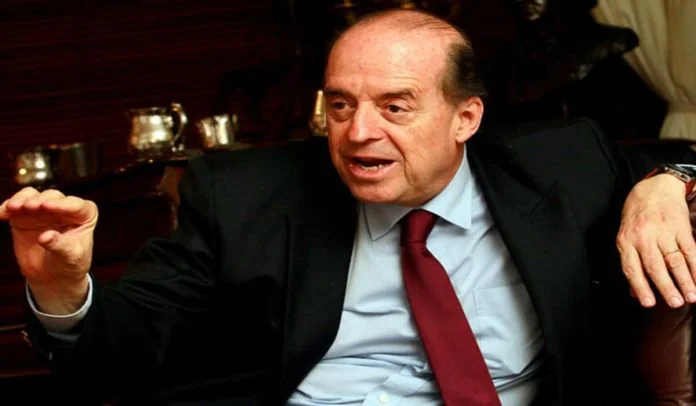

*Nueva esperanza para Colombia frente a Nicaragua. El prestigioso jurista Eduardo Valencia-Ospina es el nuevo agente de Colombia ante el diferendo limítrofe con Nicaragua. Le acompañará la exembajadora en Kenia y raizal Elizabeth Taylor Jay.*

Una nueva esperanza surgió para que Colombia frente a Nicaragua proponga argumentos y soportes sólidos y detener la arremetida jurídica nica, la cual tiene importantes triunfos en este litigio. Un litigio que tuvo nuevas dimensiones con las reclamaciones cuando llegó al poder la **Junta Sandista** en 1979. Pero los 20 años de **régimen neobonapartista lo redujo a un problema de política global descuidando el aspecto jurídico.** El 19 de noviembre de 2022, al parecer, se vencieron los términos para la revisión del controvertido y dudoso fallo de la Corte Internacional de La Haya que en 2012 favoreció a Nicaragua.

Las nuevas **pruebas históricas** clarificarían el legítimo título de soberanía colombiana sobre el complejo insular **de San Andrés, Providencia y Santa Catalina.** Asimismo, con el nuevo gobierno renace una nueva perspectiva jurídica del litigio.

## Colombia frente a Nicaragua

**La batalla jurídica internacional de Colombia frente a Nicaragua se puede ganar.** Lo último que se pierde es la esperanza, decía mi abuela Ana Luisa. Las derrotas sufridas se pueden convertir en una oportunidad con el fin de fortalecer nuestra defensa ante esa arremetida que nos mantiene arrinconados. El gobierno de Petro debe, en primer lugar, mirar lo nuestro y despertar de ese letargo que nos llevó una pésima dirección del conflicto por parte de **los gobiernos del régimen neobonapartista**.

Empero, la Cancillería colombiana no le puso atención a la solicitud del perito internacional e historiador cartagenero, **Juan Roberto Serrano Ochoa**. Este es hijo del almirante (r) Roberto Serrano, conocedor de ese mundo del mar caribe y de la armada desde la perspectiva del historiador. El perito presentó sus inquietudes y esas pruebas históricas, antes de que se vencieran los términos, con el fin de revertir el fallo adverso de la Corte Internacional de Justicia (CIJ) con sede en La Haya. Pero no _le pararon bola_ (no prestaron atención), como decimos en la costa Caribe.

Por esa razón, **VoxPopuli Digital** hace un avance de los resultados de su investigación historiográfica en exclusiva para nuestros lectores. De esta investigación se coligen pruebas históricas que clarificarían los títulos legítimos de la soberanía colombiana que los juristas no entendieron y no presentaron como pruebas y que la CIJ desconoció. Ahora pretenden llevar nuestro **presidente Gustavo Petro** a hablar con su homólogo de Nicaragua **Daniel Ortega** sin tener claro el horizonte de la solución del diferendo.

## ¿Por qué Leyva no escucha a Serrano?

*Álvaro Leyva Durán, canciller colombiano. Nueva esperanza para Colombia frente a Nicaragua*

Por tanto, si el canciller **Álvaro Leyva Durán**, tan siquiera escuchara al perito Serrano Ochoa, quien realizó una investigación profunda sobre esas no tan nuevas pruebas, **el país podría tener una mejor defensa de su soberanía**. Surgiría una nueva esperanza para los colombianos menoscabadas por la pésima gestión jurídica de los últimos gobiernos.

Pero el equipo de juristas encabezados por **Carlos Gustavo Arrieta y Manuel José Cepeda** no entendieron la prueba histórica y se dedicaron a una defensa muy tradicional, sin nuevos elementos. ¡No investigaron! Si Colombia hace un giro en su estrategia defensiva y pasa a la ofensiva, le permitiría avivar una mejor defensa en la primera audiencia del 5 de diciembre de 2020 que corresponde a otra queja tramitada por Nicaragua. Podría tener mejores argumentos frente a esa queja presentada en 2013. El país centroamericano quiere hacer valer con ello el derecho que le concedió el fallo del 2012 -presuntamente prevaricador- ­de la Corte Internacional de Justicia de La Haya de ampliar sus fronteras marítimas.

Con este hecho, una vez más se demuestra el desdén cómo la cosmovisión cachaca demerita los aportes que se pueden hacer desde esta región. La nula atención a las investigaciones de este perito costeño no fue tenida en cuenta, incluso, por el nuevo canciller Leyva Durán.

## Colombia frente a Nicaragua y la soberanía Caribe

https://twitter.com/CancilleriaCol/status/1440627998156148736?ref\_src=twsrc%5Etfw%7Ctwcamp%5Etweetembed%7Ctwterm%5E1440627998156148736%7Ctwgr%5E07e247fd468ccc6e3fa2aac9f7275f4dbb399ea7%7Ctwcon%5Es1\_c10&ref\_url=https%3A%2F%2Fwww.rtvcnoticias.com%2Fkent-francis-james-raizal-colombia-corte-justicia-la-haya

Del mismo modo, se observa con mucha preocupación la desmembración de la soberanía colombiana. Soberanía que fue pisoteada por la negligencia de 20 años del **régimen neobonapartista** para hacer respetar nuestros derechos legítimos en San Andrés, Providencia y Santa Catalina. Pero también es preocupante que la nueva cancillería de Leyva no haya involucrado en la defensa a juristas y expertos de la Costa Caribe que conocen nuestro mar Caribe. Así como el presidente Iván Duque llevó al abogado sanandresano **Kent Francis James** uno de los cofundadores del **Movimiento Amplio de Reivindicación** y exembajador en Belice y Jamaica.

Ahora bien. No se trata de una visión regionalista, sino de un acto de reconocimiento de los valores científicos y culturales que podemos aportar a la defensa de la soberanía. Para nosotros los del Caribe el mar es parte vital de nuestra existencia. Pero hemos perdido participación en la Armada y en la defensa de ese recurso natural que nos da la vida. Es parte del diálogo intercultural que debe promover el gobierno nacional con las regiones. Este diálogo es creativo y mucho más productivo cuando se trata de reafirmar la soberanía nacional.

Si bien el equipo de juristas llevó por primera vez a un raizal ante el tribunal de La Haya, su participación fue instrumentalizada, ya que no se profundizó en la prueba histórica. Esta prueba, a la postre, hubiese provocado un giro en el fallo de la CIJ.

## El nuevo equipo de Leyva

Por su parte, Leyva llamó a integrar como coagente a **[Elizabeth Taylor Jay](/articulos/etaylorjay/status/1590878555340427265/photo/1)**, bióloga y física, con maestría en protección del medio marino de la Universidad de Bangor, Gales, en el Reino Unido. Ella es raizal, nacida en Providencia, exembajadora de Colombia en Kenia. [De acuerdo a la Cancillería](/articulos/newsroom/publiques/nuevos-agentes-caso-litigio-iniciado-nicaragua-colombia-2013-corte-internacional), será embajadora de nuestro país en misión especial para El Caribe.

Nombró como agente a **Eduardo Valencia Ospina**, doctor en Ciencias Jurídicas y Económicas de la Universidad Javeriana y maestría en derecho de la Universidad de Harvard. Recordemos que Valencia Ospina fue secretario adjunto y luego secretario de la Corte Internacional de Justicia, durante 16 años. Miembro y presidente de la Comisión de Derecho Internacional de las Naciones Unidas. Así mismo, ha sido asesor y abogado de Colombia en los litigios ante la Corte Internacional de Justicia, desde 2001.

## Falta de continuidad de Colombia frente a Nicaragua

En ese sentido, la derrota de Colombia no se le puede atribuir a ninguna conspiración o estrategia política de dominio global de algunas de las potencias internacionales. Mucho menos el causante sea el viejo conflicto de la guerra fría. No. Asistimos a una negligencia y a una falta de experticias de los defensores colombianos. Pero, sobre todo, a la **falta de una sistemática política de defensa de los gobiernos de Uribe, Santos y Duque**. Además, no existe una continuidad en el seguimiento de este diferendo limítrofe.

Mientras Colombia ha tenido cerca de 10 representantes diplomáticos en los últimos 20 años en La Haya, el embajador de Nicaragua tiene 40 años. Los defensores de Nicaragua, encabezado por **Carlos José Argüello Gómez**, tienen su oficina cerca de la sede de la CIJ, según manifestó a **VoxPopuli Digital** una fuente que conoce al abogado Arguello. Ellos vienen trabajando en forma sostenida desde el 2001. Pero, a estas alturas, apenas el gobierno colombiano está conformando el nuevo equipo de juristas que librarán una nueva batalla en el estrado internacional desde el 5 de diciembre.

Algunos expertos consideran que ello es una desventaja respecto a la inestabilidad del equipo de Colombia y a la falta de entereza de los gobiernos anteriores para la defensa de nuestra soberanía. Esos gobiernos no conocen y están a espalda del Caribe.

> Por esa razón, el gobierno del presidente Gustavo Petro debe transformar esta debilidad en una oportunidad. Para esto se necesita fortalecer el equipo defensor con expertos juristas y peritos de talla internacional de la región Caribe. Esto permitirá un mejor sentido de pertenencia y una mejor defensa material de la soberanía nacional.

## **Pruebas históricas**

**VoxPopuli Digital** tuvo acceso a la documentación que sirve de soporte a las investigaciones del perito internacional. La investigación **de Juan Roberto Serrano** reside sobre las **reales órdenes** de España que la defensa colombiana no presentó. Pero tampoco la Corte Internacional de Justicia no tuvo en cuenta para tomar un fallo a la luz del derecho internacional. Estas órdenes reales se convierten en **prueba reina** para mostrar la legítima soberanía de los colombianos sobre ese sistema insular del Caribe.

En la segunda entrega se presentarán las pruebas históricas resultantes de esta investigación realizada por el historiador Juan Roberto Serrano.