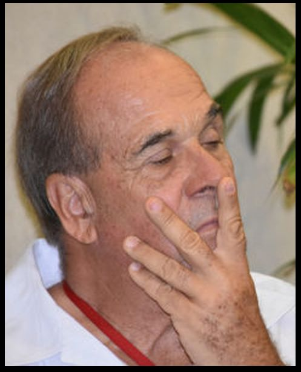

*Gonzalo Botero Maya, quien estuvo como víctima de las FARC en la JEP. Su hermano Álvaro Botero Maya fue uno de los cofundadores del paramilitarismo en la depresión momposina.*

Víctimas del desplazamiento y el despojo forzados de la finca **"Las Delicias"** adelantarán acciones penales ante la justicia internacional y alternativa con el fin de conseguir la restitución de su predio. Este está en poder de la **familia Botero Maya, de Magangué**. Al mismo tiempo, propiciarán que los congresistas del Pacto Histórico adelanten un debate político sobre el despojo de esta región.

De acuerdo con la denuncia, le dieron poder al abogado **Héctor Pérez Fernández** para que adelante las acciones pertinentes y necesarias. Se trata de recuperar el predio pertenecientes a la familia **Cárcamo Nemes**. Presuntamente, ellos fueron despojados por la familia **Botero Maya** valiéndose de la fuerza, el miedo y la artimaña jurídica.

El 22 de mayo de 2013, **Rafael Cárcamo Nemes**, en nombre propio y en representación de su señora madre **María Badía Nemez de Cárcamo**, y de sus hermanos **Jorge Rafael Cárcamo Nemez y Badía del Carmen Cárcamo Nemes**, hicieron la solicitud del predio ubicado en el municipio de Mompóx Bolívar. Pero la Unidad de Restitución de Tierras le negó ese estudio.

## Contexto histórico del hecho

En el período comprendido entre 1963 y 1983, los **Cárcamo Nemes** vivían pacíficamente en **"Las Delicias"**, como sucedía con los pequeños ganaderos y finqueros de la región. Según Rafael Eduardo Cárcamo Neme, el solicitante de este proceso, no tuvieron ningún contratiempo, salvo los quehaceres de la productividad agrícola. Pero en este período se había iniciado un proceso de conflicto social y de luchas por una reforma agraria. Después de los años 70, el conflicto agrario de la región fue tornándose más complicado cuando entraron en acción grupos armados de la guerrilla y de grandes terratenientes.

Al final de los 70 y comienzo de los 80, algunos grandes propietarios y ganaderos crearon grupos armados para combatir el abigeato y perseguir a los cuatreros que se habían multiplicado. A la familia Botero Maya se le atribuye ser uno de los primeros impulsores de la lucha contra el abigeato con el apoyo de la Armada. Una de las primeras Convivir creadas en la depresión momposina y de la ecorregión de la Mojana fue **Esperanza Futura** a nombre de **Álvaro Botero Maya**, conocido por algunos como el **"Visco Alvarito"**.

En 1991 la guerrilla secuestró a **Gonzalo Botero Maya**, hermano de Álvaro, cuando era alcalde de Magangué. Por su rescate, la guerrilla exigió **4 millones de dólares.** Los pagó y fue liberado. El exalcalde y exparlamentario presentó su caso en el tribunal de Justicia Especial de Paz-JEP.

## El despojo asociado a los Botero Maya

**Rafael Eduardo Cárcamo Maza**, ya fallecido, padre del peticionario, recibió en vida el predio por donación de su padre **Rafael Cárcamo Atencio en 1963**. “Las Delicias” tenía 1.550 hectáreas. Cárcamo Atencio la adquirió en 1935 mediante escritura pública de compraventa **No. 174 del 01 de diciembre de 1935** de la Notaría Única de Magangué. La registró con matricula inmobiliaria No. 065-1208 de la Oficina de Registro de Instrumentos Públicos de Mompox bajo la anotación No. 001 de fecha 30 de  
diciembre de 1935.

La víctima manifestó que a partir del año 1983 comenzaron hostigamiento de los Botero Maya que mandó a invadir el predio. Se apoderaron de parte de la finca. Ante esta situación, agrega:

> "Mi papá decidió vender la finca en 1986 a los Botero Maya por temor a que le asesinaran a su familia. Vendió una parte de la finca (550 hectáreas) a los señores **Ricardo Botero Restrepo** y **Lucila Maya de** Botero (1/4 para cada uno) y a sus hijas **María Elena, Gloria Cecilia y María Lucila Botero Maya** (1/6 para cada una). Y maría Elena Botero de Arango. Ellos lograron sacar a los invasores de la finca. En el año 1994 cuando fui a la finca a visitar, me percaté que a mi papá le habían quitado toda la tierra, el resto de la finca que no había vendido. Aproximado de 1000 Has. Habían sido invadidas y explotadas por lo hijos varones del señor Ricardo Botero".

Se tiene que el proceso de despojo de las mil hectáreas se produjo posterior a la venta de las 550 hectáreas. El peticionario dijo que en 2000, ya esas tierras había pasado ilegalmente a los Botero Maya.

## Los documentos

Se observa, entonces, que en 1986 se produjo la venta bajo presión de las 550 hectáreas a través de la escritura pública **No. 620 del 20 de noviembre de 1986** de la Notaria Única de Magangué. Por ese predio los Botero pagaron la sorprendente cifra de $250.000, un precio despojador para la época. Esto se encuentra en la matrícula inmobiliaria **No. 065-1208**. Empero en la escritura pública de compraventa se dice que el precio fue 1.000.000 de pesos. Aún así, sigue siendo despojador debido a la extensión de la tierra.

En la escritura pública **No. 620 del 20** de noviembre de 1986, aparecen como compradores **Ricardo Botero Restrepo, Lucila Maya de Botero, Maria Elena Botero de Arango, Gloria Cecilia Botero Maya y Martha Lucila Botero Maya**. Todas estas distinguidas personas son familiares en línea directa (hermanos, sobrinos, ) del reconocido paramilitar **Álvaro Botero Maya**, también hermano y socio de Gonzalo Botero Maya.

Los supuestos compradores le abrieron irregularmente una nueva matrícula a las 550 hectáreas. **La No 065-6869**, lo cual demuestra la mala fe y la intención de apoderarse de toda la finca "Las Delicias", según el denunciante. Es así que en 1994 se vio obligado a abandonar las 1000 hectáreas que aun tenía en propiedad y se desplazó forzosamente fuera del departamento de Bolívar junto con toda su familia.

## El conflicto armado y el despojo de los Botero Maya

**Álvaro Botero Maya**, uno de los representante fundadores de la **Convivir Esperanza Futura** de Magangué jugó un papel preponderante para la constitución del paramilitarismo en Magangué. Familias de pequeños y grandes ganaderos se organizaron con el apoyo de la Armada Nacional para combatir el abigeato y a la guerrilla. Entre 1998 y 2005 se produjo la segunda ola de asesinatos en su zona de influencia, la cual fue el semillero del paramilitarismo en los departamentos de Sucre y Bolívar.

Si bien las Convivir eran legales, según el decreto **No 356 de 1994** fueron utilizadas para aplicar justicia privada, campañas de limpieza social y violación masiva de los derechos humanos. Así lo registró [VerdadAbierta](/articulos/las-convivir-y-la-omision-que-fortalecio-a-los-paramilitares/).

> "Entre las primeras Convivir aparece la conformada por **Javier Piedrahita**, que contrató al desaparecido jefe paramilitar **Rodrigo Mercado Peluffo, alias Cadena**, en su cooperativa de vigilancia **Nuevo Amanecer**. Al mismo tiempo fue creada **Esperanza Futura a nombre de Álvaro Botero May**a, un hacendado de Magangué.
> 
> [VerdadAbierta](/articulos/las-convivir-y-la-omision-que-fortalecio-a-los-paramilitares/).

## Conclusión

Varias son las conclusiones de esta primera entrega. **Primero.** Los predios de la finca "Las Delicias" fueron adquiridos mediante transacciones irregulares. **Segundo**. El precio lo dice todo. Ya sea que las 550 hectáreas, parte del predio, haya sido adquirido en $250.000 o $1.000.000. Es un precio despojador. **Tercero.** Está demostrada en la petición que la compra no fue pacífica. Fue un proceso de "compra" (1986) basada en el miedo y la coacción. **Cuarto**. Que existe una relación directa entre los compradores y los actores armados. **Álvaro Botero Maya** desde la década de los 80 se caracterizó por ser uno de los primeros en reclutar hombres armados para combatir el cuatrerismo y el abigeato en la depresión momposina.

**Espere la segunda entrega:** ¿Cómo los Botero Maya pasaron de víctima de la guerrilla a victimarios?